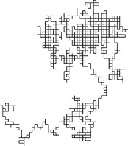
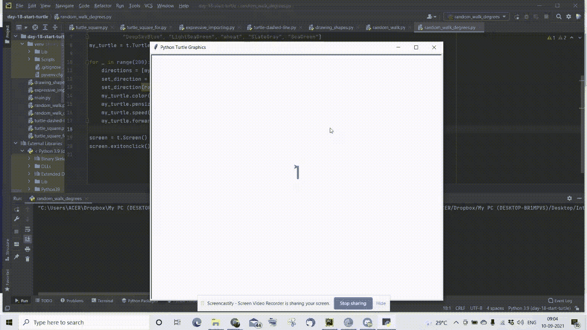

# 在 Python 中模拟随机行走

> 原文：<https://medium.com/nerd-for-tech/simulating-a-random-walk-in-python-617d1e6de7d7?source=collection_archive---------2----------------------->

# 什么是随机漫步？

随机漫步基本上是一个随机或随机过程，它描述了一条由一些数学空间上的一系列随机步骤组成的路径，例如[整数。](https://en.wikipedia.org/wiki/Random_walk)

随机游走在从股票市场到神经网络的各种领域都有广泛的应用。由于未来的步骤与过去的步骤完全不相关，或者未来的参数无法预测，因此随机行走也有助于模拟白噪声。因此，股票价格也可以通过随机游走来建模。



随机游动

## 海龟模块

出于我们的目的，我们将通过使用 python 中的“Turtle”模块来图形化地模拟随机行走。该模块的文档可在[此处](https://docs.python.org/3/library/turtle.html#module-turtle)获得。

**第一步:导入模块**

```
import turtle as t
import random
```

我们将导入两个模块 turtle 和 random 进行模拟。

**第二步:定义列表变量**

```
degrees = [90, 180, 0, 270]
colours = ["CornflowerBlue", "DarkOrchid", "IndianRed",
           "DeepSkyBlue", "LightSeaGreen", "wheat", "SlateGray", "SeaGreen"]
my_turtle = t.Turtle() # Setting the turtle object
```

这里的“角度列表”考虑了我们希望海龟转的角度。因为，我们希望海龟在转弯时只做正交偏离，我们输入 90 的倍数。

仅仅为了美观，我们希望海龟在前进或改变方向时改变线条的颜色。可以在 turtle 模块中实现的调色板的完整索引可以在这里找到[。](https://cs111.wellesley.edu/labs/lab01/colors)

然后我们创建一个 Turtle 类的对象。

```
my_turtle = t.Turtle()
```

**步骤 3:构建随机漫步逻辑**

```
for _ in range(200):
    directions = [my_turtle.right, my_turtle.left]
    set_direction = random.choice(directions)
    set_direction(random.choice(degrees))
    my_turtle.color(random.choice(colours))
    my_turtle.pensize(5)
    my_turtle.speed(10)
    my_turtle.forward(30)
```

我们首先定义一个方向列表，它接受“my_turtle”对象的两个方法，即“[my_turtle.right，my_turtle.left]”。这两者都是用来让乌龟向右转或向左转的。

我们使用 python 的“ [random.choice](https://www.w3schools.com/python/ref_random_choice.asp) ”方法从列表中选择随机值。

```
set_direction = random.choice(directions)
```

“set_direction”从“direction”列表中接受一个随机列表对象。因此，现在海龟可以选择的方向是随机的。

然而，我们仍然需要输入海龟左转或右转的角度。

```
set_direction(random.choice(degrees))
```

海龟向左转或向右转的角度(度)现在被随机化为“random.choice(degrees)”从“degrees”列表中随机选取任何度数元素。

```
my_turtle.color(random.choice(colours))
```

同样，从颜色列表中选择随机颜色。

```
my_turtle.pensize(5)
my_turtle.speed(10)
my_turtle.forward(30)
```

“pensize”是 turtle 类的一个方法，它修改钢笔的大小。因为我想让它看起来更厚一点，所以我把它增加到了 5。因为 for 循环迭代了 200 次。因为我们打算创建一个 200 步的随机漫步。我通过调用 speed 方法来提高速度。

“forward”方法是不言自明的，因为它通过参数化的参数将海龟向前移动。

**第四步:退出屏幕**

```
screen = t.Screen()
screen.exitonclick()
```

模拟完成后，我们还需要退出屏幕。我调用了 turtle 模块的 screen 方法，使 GUI 点击退出。

## 工作模拟看起来像这样:



Gif 来源:我的桌面

通过改变度数列表中的度数，可以进一步增强这一功能，以模拟斐波那契数列形状多边形。

你喜欢我的努力吗？如果是的话，请跟我来获取我的最新帖子和更新，或者更好的是，请我喝杯咖啡！☕

[](https://www.buymeacoffee.com/ayushdixit)[](https://www.buymeacoffee.com/ayushdixit) [## ayushdixit 正在编码、部署项目和写博客

### 嘿👋我刚刚在这里创建了一个页面。你现在可以给我买杯咖啡了！

www.buymeacoffee.com](https://www.buymeacoffee.com/ayushdixit)