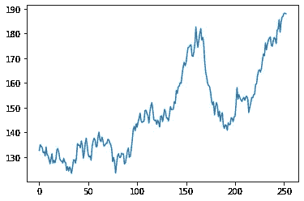
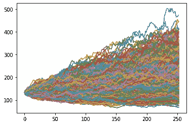
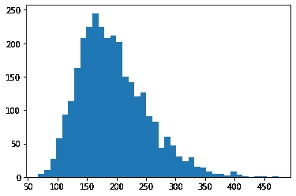

# 用 Python 中的蒙特卡罗方法模拟未来股票价格

> 原文：<https://medium.com/nerd-for-tech/simulating-future-stock-prices-using-monte-carlo-methods-in-python-4adb187792c3?source=collection_archive---------13----------------------->


尼克·崇在 [Unsplash](https://unsplash.com?utm_source=medium&utm_medium=referral) 上的照片

使用蒙特卡罗方法，我们将使用 Python 编写一个快速模拟程序来预测苹果公司(AAPL)未来的股价结果。你可以在这里阅读更多关于蒙特卡洛模拟(在金融背景下)[。](https://www.investopedia.com/terms/m/montecarlosimulation.asp)

**1)拉取数据**

首先，我们可以导入库，并提取 Apple 的历史股票数据。对于这个例子，我选择了最近 10 年，尽管测试不同范围的敏感度是有价值的，因为这本身就是主观的。

```
# Import required librariesimport mathimport matplotlib.pyplot as pltimport numpy as npfrom pandas_datareader import dataapple = data.DataReader('AAPL', 'yahoo',start='1/1/2009')apple.head()#Next, we calculate the number of days that have elapsed in our chosen time windowtime_elapsed = (apple.index[-1] - apple.index[0]).days
```

**2)计算整个数据集的复合年增长率+标准偏差(用于模拟)**

cagr(平均回报率):0.3746
std_dev(回报率的标准差:)0.2878

**3)生成随机值，运行蒙特卡罗模拟**



**4)分析结果**

```
#from here, we can check the mean of all ending prices#allowing us to arrive at the most probable ending pointmean_end_price = round(np.mean(closing_prices),2)print("Expected price: ", str(mean_end_price))
```

预期价格:193.85 英镑


在这里，我们可以看到(当然，仅基于使用蒙特卡洛模拟)，明年的上涨空间大于下跌空间，预期价格约为 193 美元，价格跌至 128 美元以下的可能性仅为 10%。

当然，有很多很多因素会推动股价超过历史百分比变化(这意味着我不会仅仅依靠蒙特卡洛模拟来做出投资决策！)，但这提供了一个使用蒙特卡罗模拟来更好地理解可能结果的分布的完整示例。

## 赢得下一次数据科学面试

通过每周解决几个问题，提高数据科学面试的水平

*原载于*[*https://www.interviewqs.com*](https://www.interviewqs.com/blog/intro-monte-carlo)*。*