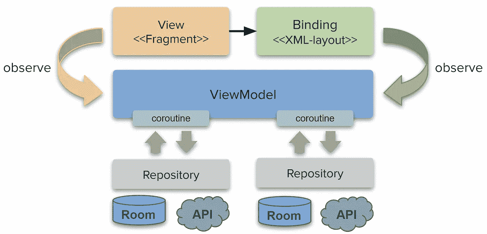

# 单活动？

> 原文：<https://medium.com/nerd-for-tech/single-activity-2659f6ac09e8?source=collection_archive---------4----------------------->

这是系列文章的一部分。目标、基础、项目结构、文章摘要见 [*Android::简体*](https://sites.google.com/view/migueltt/home_en)

确保先阅读[解耦绑定](https://miguelt.medium.com/decoupling-binding-57566dc7b17d)文章！

存储库:[https://gitlab.com/migueltt/simpleandroid](https://gitlab.com/migueltt/simpleandroid)

关于是否使用单活动架构，一直有很多争论。这有多种好处，但都取决于应用程序的组织方式:

*   它不是关于一个“单一”的活动，而是关于“屏幕”是如何组织的——也就是说，一个完整的工作流程
*   “屏幕”是向用户显示信息的任何组件——对于 Android 来说，这些可以是`Fragments`，为什么不可以是`Activities`
*   这不仅仅是把你所有的`Fragments`(或`Activities`)加到一个`navigation-graph`中，然后用一个`NavHostFragment`引用它。您必须清楚地理解用例及其数据需求

[Jetpack 导航 API](https://developer.android.com/guide/navigation) 使得整个应用程序的组织更加简单，简化了你在应用程序不同部分之间的转换。

首先，您必须考虑“*模块*”:

*   一个*模块*包含一个特性或工作流，并且可以包含几个“屏幕”——在我们的例子中是`Fragments`
*   你应该为每个*模块*定义一个`navigation-graph`
*   几个`navigation-graphs`可以从一个主`nested-graphs`引用，或者，它可以直接连接到一个`NavHostFragment`

在我们的`[Simple::Android](https://gitlab.com/migueltt/simpleandroid)`应用中，*模块* `[**testui**](https://gitlab.com/migueltt/simpleandroid/-/tree/develop/app/src/debug/java/com/simpleandroid/modules/testui)`(变体`debug`)包含了 10 个不同的`Fragments`，它们实现了几乎每一个 *UI 小部件*——这样做只是为了验证我们未来所有的*模块*不会受到 UI 库更新的影响(例如材料设计组件。)

实现了两种不同的方法，提供相同的功能:

1.  `[ActivityTestMain](https://gitlab.com/migueltt/simpleandroid/-/blob/develop/app/src/debug/java/com/simpleandroid/modules/testui/ActivityTestMain.kt)`包含自己的`NavHostFragment`——这有效地使*模块* `testui`自包含并在自己的“窗口”内
2.  `[FragmentTestMain](https://gitlab.com/migueltt/simpleandroid/-/blob/develop/app/src/debug/java/com/simpleandroid/modules/testui/FragmentTestMain.kt)`包含它自己的`NavHostFragment` —这有效地使*模块* `testui`自包含，但在`ActivityMain`“窗口”内

实现的不同之处在于如何处理*反压*事件。

根据您想要管理每个*模块*的方式，在您的模块中分离和管理*流*是非常简单的，另外还有在不同级别管理视图模型的好处:

*   如果整个应用程序需要一些共享数据(例如登录状态)，只需在`Activity`级别定义一个视图模型—使用`activityViewModels(..)`
*   如果一个*模块*内的所有*屏幕*都应该使用相同的数据，只需在`navigation-graph`级别定义一个视图模型——使用`navGraphViewModels(..)`
*   如果*屏幕*只需要自己的数据，只需在`Fragment`级别定义一个视图模型——使用`viewModels(..)`

请记住，我们的目标是建立这样的架构:

