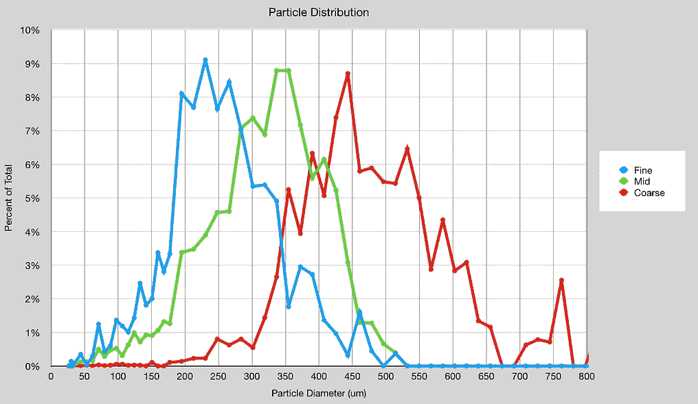
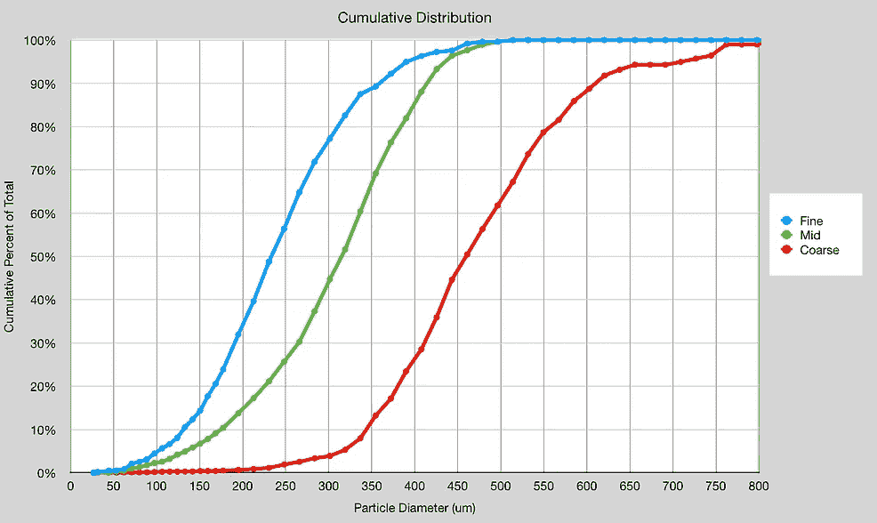
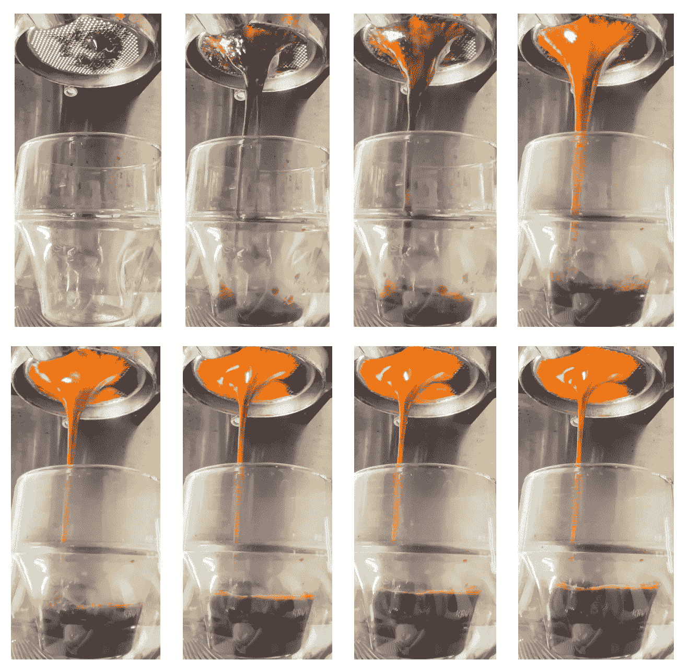

# 单筛断续浓缩咖啡

> 原文：<https://medium.com/nerd-for-tech/single-sifter-staccato-espresso-f97d440979e5?source=collection_archive---------0----------------------->

## 咖啡数据科学

## 简单的黑客攻击

自从开发出断奏浓缩咖啡的镜头后，我尝试了不同的方法来给咖啡分层，以获得类似断奏的效果。断奏镜头是层层筛选咖啡，但一个挑战是筛选需要时间。所以我想寻找一种方法来加速它。

当我试图通过做一个[意大利香肠筛选](https://towardsdatascience.com/salami-sifting-coffee-17024b484e34)来理解筛选时，我发现较小的颗粒首先被筛选掉。因此，当使用 500 微米的筛子筛选时，小于 200 微米的颗粒首先出来。这意味着你可以使用一个单独的筛子来进行断奏。你甚至可以用一个屏幕来粗略地将所有的咖啡从最小到最大重新定位。

我从 500 微米的筛子开始，根据研磨情况，我知道我应该筛出 10 克咖啡。这将是精细层。我一直在筛选，直到没有什么可以筛选的了，大概是 3 克。剩下 10 克粗粒，所以那是粗粒。

我看了粒子分布，它们非常单一。当然有一些重叠，但它们比使用三个研磨设置分离得更好。

我拉了一下镜头，颜色是典型的断奏。它跑得有点快，但仍然是一个有趣的镜头。

这个小实验在制作好的断奏浓缩咖啡所需的设备方面打开了一扇门。我现在很想知道，我能否用一个粗筛，比如 800 微米的筛子，重新定位整个冰球。

如果你愿意，可以在[推特](https://mobile.twitter.com/espressofun?source=post_page---------------------------)、 [YouTube](https://m.youtube.com/channel/UClgcmAtBMTmVVGANjtntXTw?source=post_page---------------------------) 和 [Instagram](https://www.instagram.com/espressofun/) 上关注我，我会在那里发布不同机器上的浓缩咖啡照片和浓缩咖啡相关的视频。你也可以在 [LinkedIn](https://www.linkedin.com/in/dr-robert-mckeon-aloe-01581595) 上找到我。也可以在[中](https://towardsdatascience.com/@rmckeon/follow)关注我，在[订阅](https://rmckeon.medium.com/subscribe)。

# [我的进一步阅读](https://rmckeon.medium.com/story-collection-splash-page-e15025710347):

[我的书](https://www.kickstarter.com/projects/espressofun/engineering-better-espresso-data-driven-coffee)

[我的链接](https://rmckeon.medium.com/my-links-5de9eb69c26b?source=your_stories_page----------------------------------------)

[浓缩咖啡系列文章](https://rmckeon.medium.com/a-collection-of-espresso-articles-de8a3abf9917?postPublishedType=repub)

[工作和学校故事集](https://rmckeon.medium.com/a-collection-of-work-and-school-stories-6b7ca5a58318?source=your_stories_page-------------------------------------)