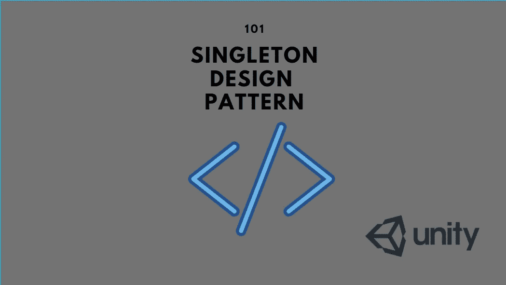
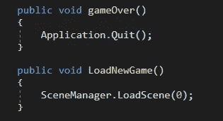
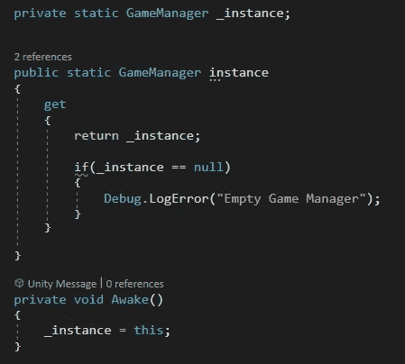
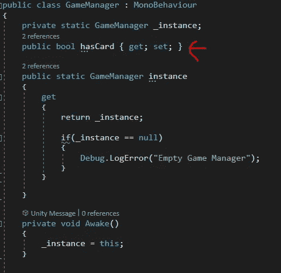
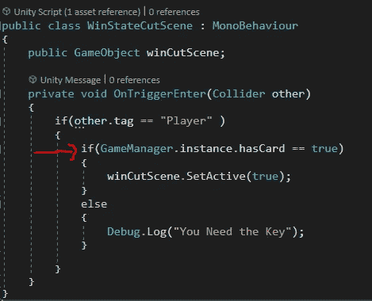
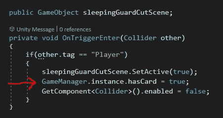

# 游戏开发中创建经理的单例设计模式—第 1 部分

> 原文：<https://medium.com/nerd-for-tech/singleton-design-pattern-in-game-development-for-creating-managers-part-1-cf7a84b4217d?source=collection_archive---------2----------------------->

本文解释了在多个管理器组件之间进行通信的困难方式，以及使用单体设计模式可以做些什么来使它变得更好。

游戏经理是一个非常基础的角色，在任何给定的游戏项目中都必须是对象。

游戏管理器包含两个非常基本的方法。

*   重新开始
*   放弃

下面是这两种方法在游戏管理器中的简单实现。

C#

如果另一个游戏对象希望调用这两个方法中的任何一个，那么这个对象必须首先获得对这个游戏管理器的引用，创建一个本地实例，然后调用它们。

那么，问题是什么？

**想象多个对象出于某种原因希望使用这两种方法。这需要在它们各自的脚本组件中创建游戏管理器对象的多个实例。**

在更大的环境中，这种方法会导致内存滥用，以及在涉及到要更改的数据的情况下没有同步的操作流。

那么，单例设计模式在这里有什么帮助呢？

> 单例模式通过在脚本本身中创建一个实例，并且不允许任何其他对象创建任何进一步的实例，从而消除了多个实例。
> 
> 相反，它强制所有对象访问 singleton 类的唯一实例。

下面是一个简单的单人游戏管理器的实现。

C#

*   有一个名为“_instance”的私有静态变量，它是一个游戏管理器类本身的对象。无论哪个对象要保存这个脚本，它都会有这个对象。
*   有一个公共属性来获取这个实例(也可以有一个集合)。这里的 get 方法是检查游戏管理器是否连接到某个对象。如果没有对象持有这个实例，任何其他对象试图访问游戏管理器将导致空引用异常。因此，空检查将确保异常不会发生。
*   有一个唤醒方法调用，它总是由引擎在启动和更新方法之前调用。在唤醒调用中，管理器获得对 _ 实例的引用。

**是时候看看差别了:)**

例如，游戏管理器有一个名为 playerHasCard 的变量。

C#

如果另一个脚本打算使用这个变量属性来触发某个事件，它可以直接使用该变量，而无需创建本地实例。

C#

## 但是旗帜在哪里树立呢？

## 在另一个脚本中使用相同的方法。

C#

在这两个脚本中，没有游戏管理器对象的本地实例。相反，它们都使用相同的属性。

那就是单体设计:)

非常感谢