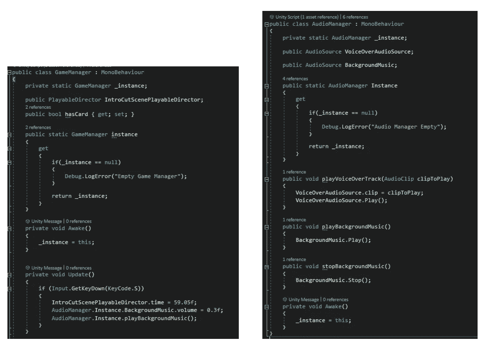
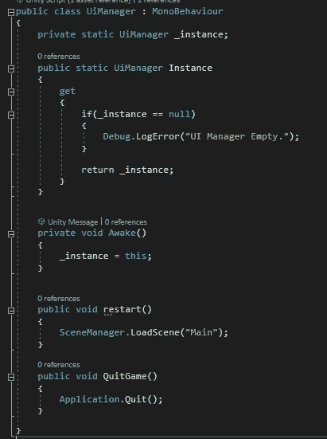
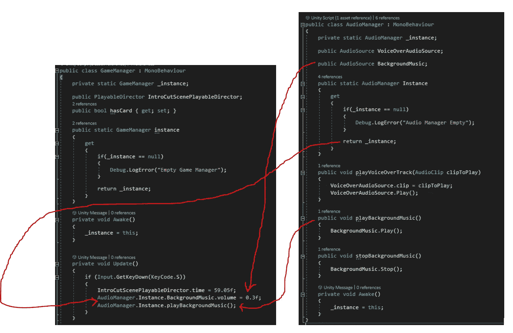
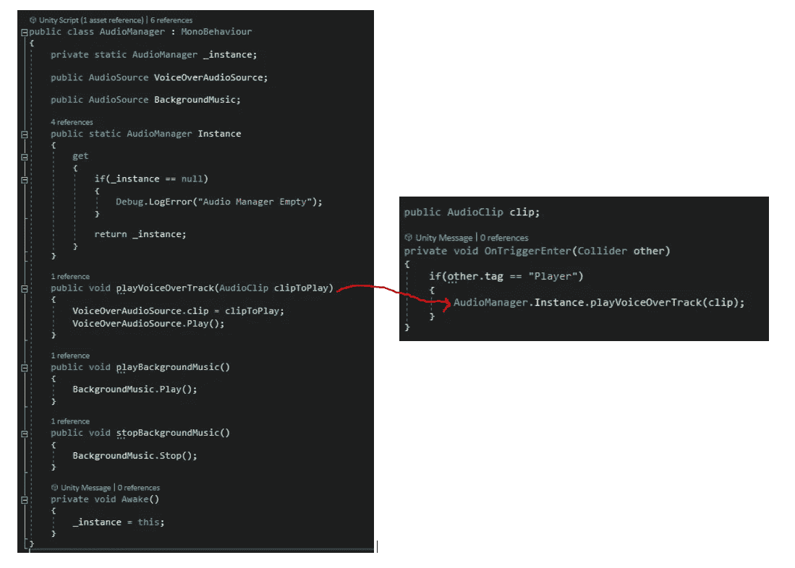
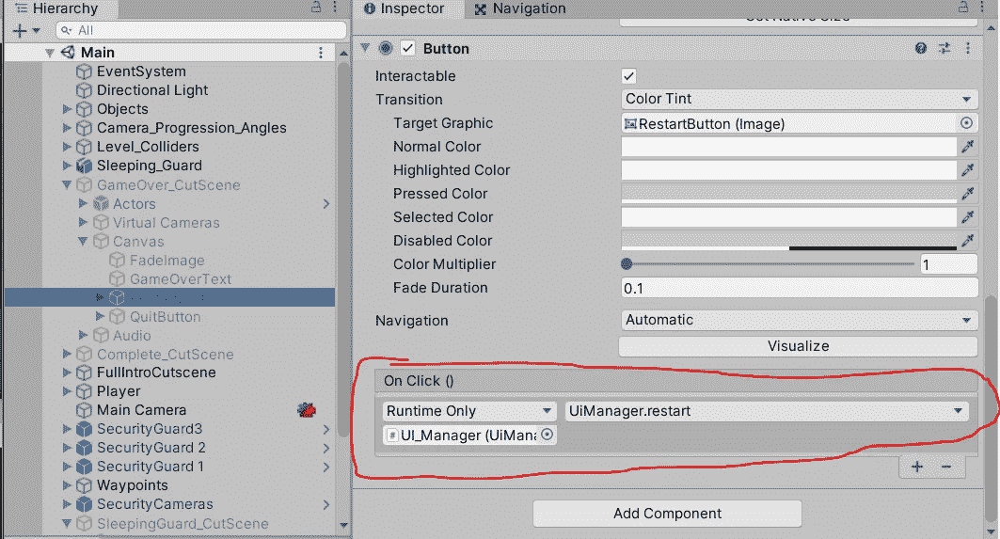

# 游戏开发中创造经理的单例设计模式——第二部分

> 原文：<https://medium.com/nerd-for-tech/singleton-design-pattern-in-game-development-for-creating-managers-part-2-f12ec598e379?source=collection_archive---------5----------------------->

这里的练习演示了使用游戏编程的单例设计模式实现三个基本的管理器对象。

1.  游戏经理
2.  音频管理器
3.  UI 管理器

如果使用上一篇文章中解释的单例模式实现，所有这些都可以非常有效地使用。

C#

C#

编写单例类的方式非常简单。

*   创建一个私有的静态实例变量来保存这个类的唯一对象。
*   根据需要创建 get、set 属性。
*   使用唤醒调用初始化它。

除了这三个基本需求，这个类还可以有任意多的其他属性和方法。

让我们看看这个项目中实例的交换情况。

1.  游戏管理器正在使用音频管理器。

C#

2.另一个脚本使用音频管理器来触发音轨上的声音。

C#

3.UI 管理器有两个方法，从过场动画的 UI 按钮调用。

一致

一致

> 这里要理解的最重要的事情是，上面的访问都不会生成任何 manager 类的新实例，因为它们都是由 singleton 模式构成的。

# 这减少了首先在打算访问任何方法或属性的对象中获取它们的引用，然后创建一个本地实例来使用它们的麻烦。

非常感谢