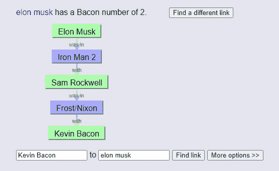

# 六度分离的新形式:维基百科 Speedrun

> 原文：<https://medium.com/nerd-for-tech/six-degrees-of-separations-new-form-the-wikipedia-speedrun-cdceeac3ada6?source=collection_archive---------2----------------------->

[维基百科](https://en.wikipedia.org/wiki/Wikipedia)

**六度分隔**的概念是，所有人平均相互之间只有六个或更少的社会联系。这意味着任何两个人都应该能够通过最多六个步骤建立“朋友链”来建立联系。所以如果我个人不认识克劳斯，但我认识比阿特丽斯，她是克劳斯的朋友，那么就有两条联系把我和克劳斯联系起来(还有一条联系把我和比阿特丽斯联系起来)。当然，六度分离只在总体平均水平上成立，在个体水平上不一定成立。

这一概念也是培根数字背后的基础，它源于凯文·贝肯的六度，你可以在[培根圣谕](https://oracleofbacon.org/)了解更多。一个演员的培根数是他们和凯文·贝肯之间的联系数，联系被定义为同一部电影中的两个演员。这意味着曾出演《x 战警头等舱》的迈克尔·法斯宾德的培根指数为 1，因为凯文·贝肯在同一部电影中饰演塞巴斯蒂安·肖。用同样的连接方法，埃隆马斯克的培根数是 2，因为埃隆在*钢铁侠 2* ，山姆·洛克威尔在里面，谁在*弗罗斯特/尼克森*，凯文·贝肯在里面。

[培根的神谕上的界面](https://oracleofbacon.org/movielinks.php)

分离度有很多应用，令人惊讶的是，有多少类型的连接的平均分离度为 6。分离度可以在计算机科学数据结构、社交媒体/网络，以及最有趣的(在我看来)，在线百科全书中找到。

# 快速奔向法西斯主义

[**维基百科**](https://en.wikipedia.org/wiki/Wikipedia) 是一个免费、多语言、开放协作的在线百科全书，完全由志愿者贡献者使用基于维基的平台维护。如果有一个你感兴趣的话题，维基百科一定会有一篇关于它的文章(或者至少是一些与之相关的)。我相信你以前也曾浏览过维基百科，无论是为了学校的项目，只是快速的谷歌搜索，还是作为一篇文章的来源链接。这些例子中的后一个已经因为维基百科的可靠性而备受争议，但这不是我今天关心的。

快速跑是一个游戏的玩法，目的是尽可能快地完成它。流行的 speedruns 包括《我的世界》、平台游戏和故事模式游戏。在维基百科历史上的某个未知时刻，有人想出了一个别出心裁的主意，将维基百科的页面变成一个高速运行的平台。使用分离度，目标是通过点击链接(字面意思是连接的链接)尽可能快地从一个页面转到另一个页面。然而，在 2020 年的某个时候，有人提出了一个名为“希特勒极速奔跑”的幽默想法，其中包括点击维基百科内置的“随机文章”功能，只需点击链接，就可以尽快进入阿道夫·希特勒的页面。只要在 YouTube 上搜索“希特勒极速跑”，你就会看到大量视频，展示这种极速跑的流行程度。

受这种喜剧性的分离程度的启发，我和我的朋友们决定想出一个令人惊讶的娱乐游戏来打发这次全球疫情的时间。

# 维基百科速度跑

这个游戏的前提很简单。首先，访问维基百科的[主页。从这里，点击页面左侧的“随机文章”。这是你的目标文章，意味着你需要在这里结束。研究一下(尽管准备不充分更有趣)，准备好你的计时器。打开一个新的维基百科标签(你可以用鼠标中键点击维基百科的图标，或者复制你当前的文章)，然后再次点击“随机文章”。当你这样做的时候，计时器开始计时！尽可能快地点击页面上的链接，不离开维基百科网站，就能找到你的目标文章。听起来很简单，但也出奇的好玩。是否使用搜索功能(CTRL + F)和前后浏览按钮等浏览器工具由您决定，您可以通过消除查看目标文章的任何准备时间来增加挑战性。当你到达你的目的地时，时间正好结束，而且仅仅是目的地。任何非常接近的相关文章(文章标题通常只有一个单词或括号中的短语不同)都不算数。](https://en.wikipedia.org/wiki/Main_Page)

# 精炼路线

作为一名专业的 Wikipedia speedrunner，我遇到过很多从一篇文章到另一篇文章的路线。虽然一开始很令人生畏，但我毫不犹豫地想出了如何从[侏罗音](https://en.wikipedia.org/wiki/Sound_of_Jura)到 [*节奏*](https://en.wikipedia.org/wiki/Euproctidion) 。以下是我在浏览维基百科的几条快速路线中提炼出来的几条路线。

**地理路线:**虽然地理路线可以用来直接到达你的目的地，但它也是开始跑步的通用路线。大多数时候，你得到的两篇文章是完全不相关的，很难在这两篇文章之间建立任何明显的联系。这就是地理路线(通常)开始的地方。例如，如果我们需要从[数字战斗模拟器](https://en.wikipedia.org/wiki/Digital_Combat_Simulator)(一种飞行模拟器游戏)到[瓦希尔森林](https://en.wikipedia.org/wiki/Tile_Hill_Wood)(英国考文垂瓦希尔的一个小森林)，有一条清晰的地理路线将结束行程。这里举一个完整路线的例子:[数字作战模拟器](https://en.wikipedia.org/wiki/Digital_Combat_Simulator) > [P-51D 野马](https://en.wikipedia.org/wiki/P-51D_Mustang) > [二战](https://en.wikipedia.org/wiki/World_War_II) > [英国](https://en.wikipedia.org/wiki/United_Kingdom) > [英国](https://en.wikipedia.org/wiki/England) > [考文垂](https://en.wikipedia.org/wiki/Coventry) > [瓦希尔](https://en.wikipedia.org/wiki/Tile_Hill) > [瓦希尔伍德](https://en.wikipedia.org/wiki/Tile_Hill_Wood)。有了不错的浏览技巧，这个过程可以在 60 秒内轻松完成。当然，这可能不是最有效的路线；应该有一条连接更少的路由。不过，得到一条有 7 个连接点的路线没什么可抱怨的。因为我们只是人类，而不是计算最短路径的计算机，所以时间更有可能取决于输入速度，而不是连接数量。即便如此，能得到这样一条相对较短的路线还是不错的。在下面的路线类型中，你将理解为什么地理路线是有用的，即使结尾的文章与地理没有直接关系。

**生物学路线:**如果你需要在一个物种、属或任何与生物学相关的东西上结束，你很有可能从一个物种的页面上找到。因为像[美洲虎](https://en.wikipedia.org/wiki/Jaguar)这样的动物会有一个带有其分类的页面，这意味着你也可以访问整个分类系统本身。那么，我们如何从任意一篇随机文章中连贯地得出一个物种呢？当然是地理路线！让我们以我之前给出的文章为例。 *Euproctidion* 是飞蛾的一个属，所以走生物学路线绝对是个好主意。但是我们的首发文章是…侏罗山之声？那到底是什么？原来，汝拉海峡是苏格兰阿盖尔郡和布特的一个海峡。通过与地理学的直接联系，我们还可以了解地理位置的生态学。通过生态学，我们可以访问一个随机的物种——这将允许我们访问分类学分类系统并完成运行。下面举一个完整路线的例子:[侏罗山之声](https://en.wikipedia.org/wiki/Sound_of_Jura) > [苏格兰](https://en.wikipedia.org/wiki/Scotland) > [欧洲](https://en.wikipedia.org/wiki/Europe) > [大陆](https://en.wikipedia.org/wiki/Continent) > [北美](https://en.wikipedia.org/wiki/North_America) > [美洲豹](https://en.wikipedia.org/wiki/Jaguar) > [动物群](https://en.wikipedia.org/wiki/Animal) > [节肢动物](https://en.wikipedia.org/wiki/Arthropod) > [昆虫纲](https://en.wikipedia.org/wiki/Insecta) > [鳞翅目](https://en.wikipedia.org/wiki/Lepidoptera) >14 个连接使这种精确的路线成为可能，虽然比 6 个连接高得多，但仍然可以达到非常快的时间。即使我们一开始没有和地理直接联系，也一定会和地理有联系。得到一个人保证了与地理的紧密联系(无论是他们出生的地方，他们为之效力的运动队的国家，等等。).获得由一个人或一些人创作的东西也保证了与地理的密切联系(一部歌剧是由某个出生在某地的人创作的)。得到一个法庭案例会给你一些人，他们必须出生在某个地方或者与地理有某种联系。这个清单还在继续，但似乎地理有一些最强的联系…

**运动路线:**由于某种原因，超过 50%的时候我点击“随机文章”，得到一个运动员(好吧，可能不超过 50%)。走体育路线总是可以通过地理路线(毫不奇怪)。如果我提供一个优先考虑地理而不是体育的例子，那就清楚多了。下面是一条从[南凤冠企鹅](https://en.wikipedia.org/wiki/Southern_rockhopper_penguin)到[弗朗西斯科鲁埃达(潜水员)](https://en.wikipedia.org/wiki/Francisco_Rueda_(diver)) : [南凤冠企鹅](https://en.wikipedia.org/wiki/Southern_rockhopper_penguin) > [南美](https://en.wikipedia.org/wiki/South_America) > [大陆](https://en.wikipedia.org/wiki/Continent) > [北美](https://en.wikipedia.org/wiki/North_America) > [北美](https://en.wikipedia.org/wiki/Northern_America) *>* [美国](https://en.wikipedia.org/wiki/United_States) > [美式足球](https://en.wikipedia.org/wiki/American_football) > [团队运动](https://en.wikipedia.org/wiki/Team_sport)由于有 13 个连接，这远远不是最佳路线。即便如此，它证明了地理是多么强大。与人类潜水这项运动毫无关系的南凤冠企鹅(企鹅所做的潜水与人类潜水并无直接联系)通过…地理与运动相连！几乎每一页都包含一个地理链接，所有需要做的就是找到地理和体育的联系——这是我已经提炼过的。一般来说，了解体育的最简单的方法之一是访问美国页面，然后转到美式足球，这是一项团队运动，它将你与“体育”联系起来

**工具路线:**如果你仍然认为地理不是一个很强的联系类别，看看这条路线从 [Civita](https://en.wikipedia.org/wiki/Civita) (挪威自由派智库)到 [adze](https://en.wikipedia.org/wiki/Adze) (原始切割工具): [Civita](https://en.wikipedia.org/wiki/Civita) > [挪威](https://en.wikipedia.org/wiki/Norway) > [北欧](https://en.wikipedia.org/wiki/Northern_Europe) > [英国](https://en.wikipedia.org/wiki/England) > [中世纪的英国](https://en.wikipedia.org/wiki/England_in_the_Middle_Ages) >

# 百科全书式的神经网络？也许不是…

在列举了几条路线后，很明显地理比其他路线更“强”。这就是说，在不能建立单向连接的每一次运行中，几乎都会用到地理信息。当然，这是考虑到人类正在进行这样的快速运行，因为计算机程序将能够非常快速地识别哪些页面指向最后一页，并对简单的问题进行逆向工程，以找到对人类来说首先没有逻辑意义的模糊联系。看一看维基百科的六度网页，就可以找到一些可能是由晦涩的知识或偶然事件偶然发现的联系。让我们考虑一条从(符号)到宣誓(一个演奏重金属和 metalcore 的美国摇滚乐队)的路线。这是我想出来的(我觉得逻辑上很健全):>[挪威语](https://en.wikipedia.org/wiki/Danish_and_Norwegian_alphabet)(字母表)> [挪威语](https://en.wikipedia.org/wiki/Norwegian_language)(语言)> [挪威](https://en.wikipedia.org/wiki/Norway) > [北欧](https://en.wikipedia.org/wiki/Northern_Europe) > [欧洲](https://en.wikipedia.org/wiki/Europe) > [英国](https://en.wikipedia.org/wiki/England) > [英国的音乐](https://en.wikipedia.org/wiki/Music_of_the_United_Kingdom) *>* [重金属【T21 有 11 个连接，还不算太差。它当然可以更好，但可能不会好太多。我可以从欧洲去美国，可能最多只会增加几个连接。现在，这是一条任何头脑正常的人都不会想到的路线:](https://en.wikipedia.org/wiki/Heavy_metal_music)>[宣誓](https://en.wikipedia.org/wiki/Underoath)。就是这样。这些看似不相关的页面之间有着直接的联系！当然，只要稍微挖掘一下，你就能发现 Underoath 出版了一张以这个角色为标题的专辑，但你是怎么知道的呢？我甚至不确定我是怎么知道的。

不管我从逻辑上想出的这条路有多低效，我仍然相信维基百科页面和神经网络之间有联系(没有双关语)。下面简单解释一下:

[来源](https://www.google.com/url?sa=i&url=https%3A%2F%2Fwww.pinterest.com%2Fpin%2F540713499009847029%2F&psig=AOvVaw2iciyQ87U-KP3Xqbj9lTCH&ust=1615923809729000&source=images&cd=vfe&ved=0CA0QjhxqFwoTCNic7MCHs-8CFQAAAAAdAAAAABAD)

> 神经网络是从生物计算单元，或者更准确地说，从人脑中获取灵感的计算模型。神经网络由节点组成，节点是独立的处理实体，它们之间都有“权重”。每个权重确定多个节点之间的连接强度。当给定一个输入时，这些权重将最终决定整个网络的激活流(布鲁克纳&加森 2)。
> 
> 神经网络的结构可以用三个部分来描述:输入单元、输出单元和其间的隐藏单元。所有输入单元都有一个激活值，该值将被发送到系统的隐藏单元。无论系统是否“理解”这些激活值，它们都代表网络本身无关的东西。例如，网络的输入单元激活值可以代表处理图像并检测其是否包含特定颜色。然而，这种任务的输出直到输入单元的激活值被发送到许多层隐藏单元时才出现，这些隐藏单元随后将它们的激活值发送到连接节点。给定的初始输入将通过节点传播，将它们的激活值传递给其他节点，最终以输出节点的激活值结束。
> 
> 神经网络被设计成在学习的同时完成一项任务。由于权重的动态属性，神经网络“学习”。基于学习模型和给定的输入，节点之间的连接可以增加或减少。一个合适的神经网络会调整权重，以便在进行越来越多的尝试时，更频繁、更准确地完成任务。

你看到维基百科和神经网络之间的联系了吗？这可能看起来非常明显，但同时又有些模糊。神经网络的物理表示与维基百科的链接连接相匹配，但这是否构成了神经网络的应用？

情况可能不是这样，但它肯定是一种可能性。然而，如果我们考虑计算机将如何解决维基百科的快速运行，很明显，由于所有可能的连接都存储在数据库中，因此不需要“学习”模型。更确切地说，为了尽可能快地从起点文章到终点文章而执行的任何计算将匹配一个更简单的[连接节点](https://www.mathworks.com/help/matlab/math/directed-and-undirected-graphs.html#:~:text=Undirected%20graphs%20have%20edges%20that,be%20traversed%20in%20both%20directions.&text=Directed%20graphs%20have%20edges%20with,traversed%20in%20a%20single%20direction.)的模型。也许优化一个从头到尾解决最有效路线的程序的最重要的部分是实现最有效的数据结构。这也是我将在下一篇博文中探讨的问题。

玩得开心快速运行维基百科！

# 参考

*[*百科*](https://en.wikipedia.org/wiki/Main_Page)*

*[https://en . Wikipedia . org/wiki/Wikipedia:Six _ Degrees _ of _ Wikipedia # Six _ Degrees _ to _ Kevin _ Bacon](https://en.wikipedia.org/wiki/Wikipedia:Six_degrees_of_Wikipedia#Six_Degrees_to_Kevin_Bacon)*