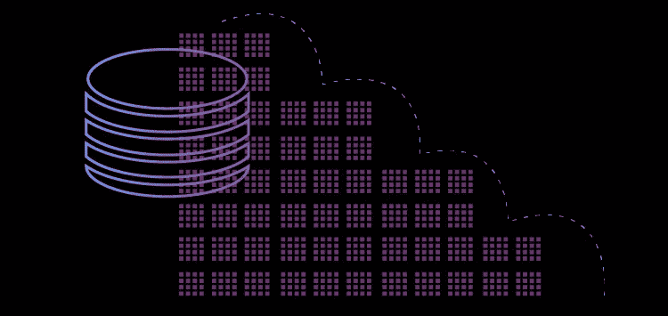
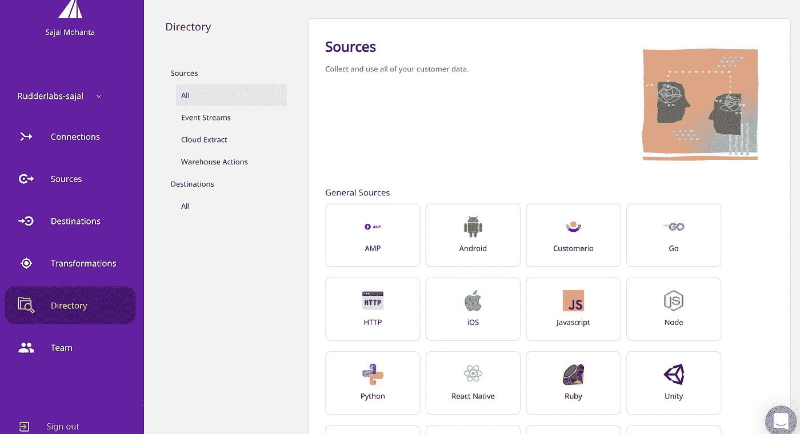
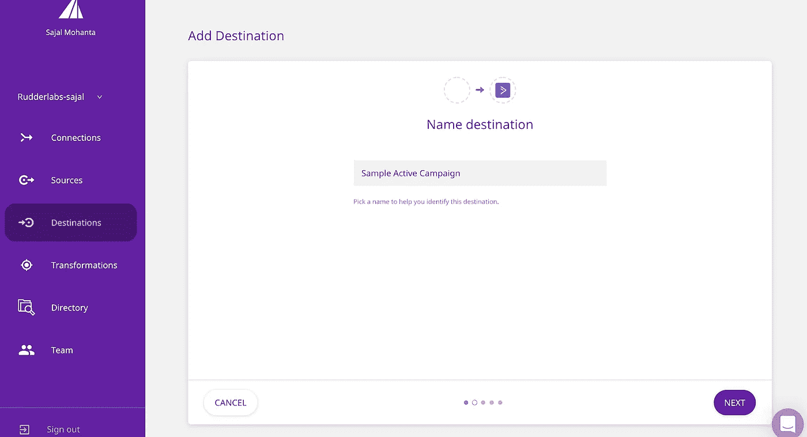
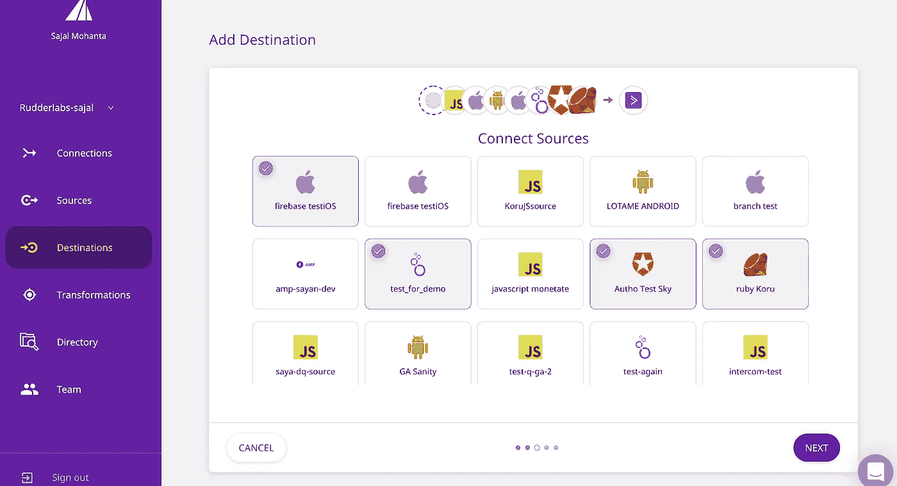
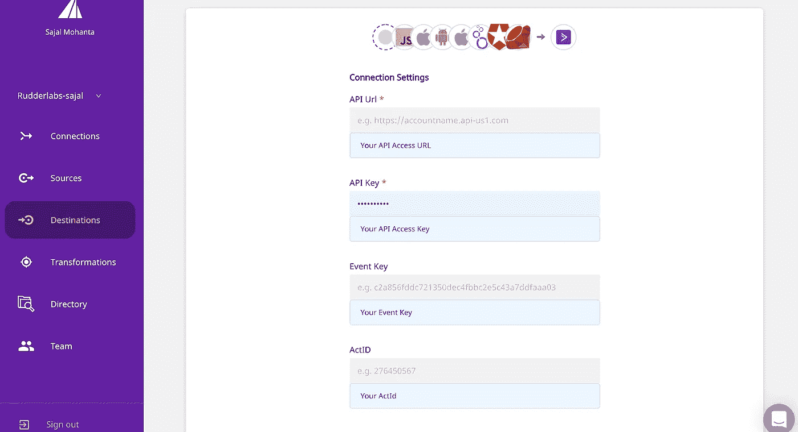
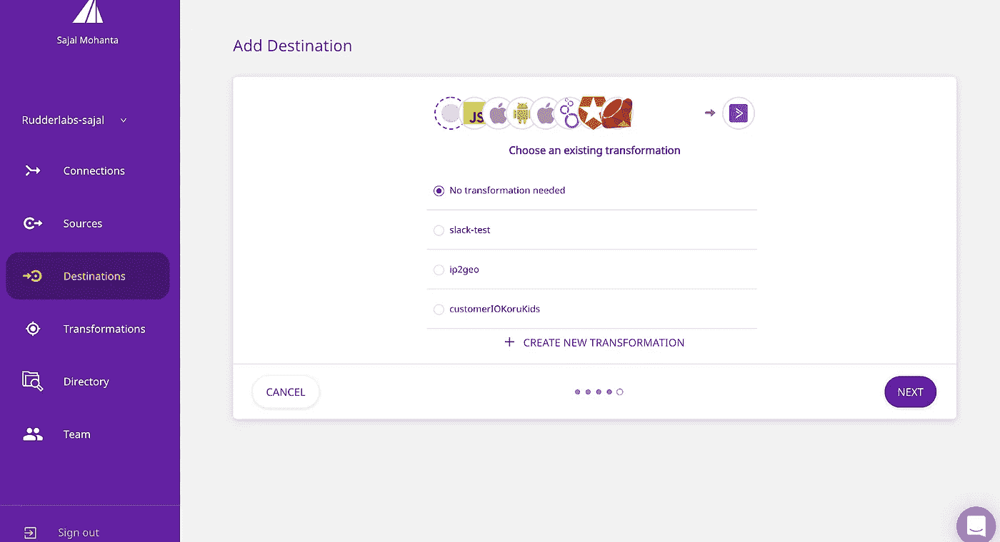
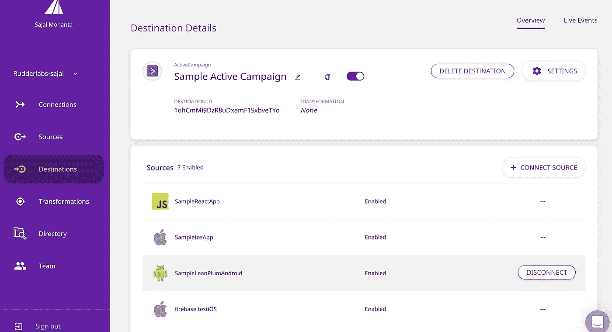
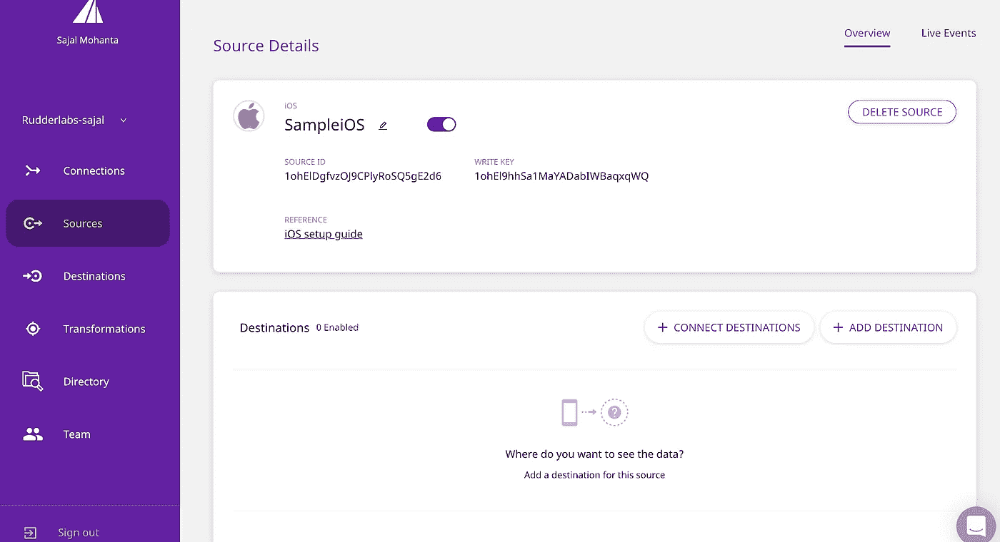
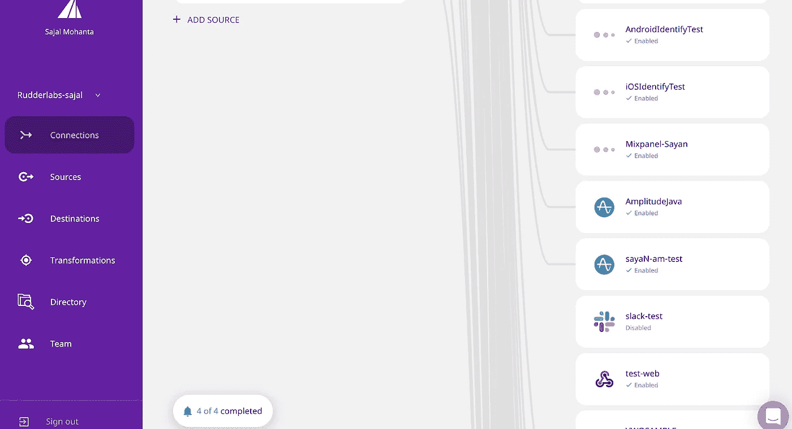

# 使用 RudderStack 向任何目的地发送数据的六个步骤

> 原文：<https://medium.com/nerd-for-tech/six-steps-to-sending-data-to-any-destination-using-rudderstack-a85cca3f3f22?source=collection_archive---------27----------------------->

RudderStack 是一个开源平台，支持收集和路由您的客户事件数据，以关注数据隐私和安全。RudderStack 取代了构建与每个第三方工具的单独集成的需要，并为您的产品和增长团队打开了快速迭代的大门。

RudderStack 提供各种 [**客户端和服务器端 SDK**](https://docs.rudderstack.com/rudderstack-sdk-integration-guides)[**云资源**](https://docs.rudderstack.com/cloud-extract-sources)[**事件流**](https://docs.rudderstack.com/rudderstack-event-streams) ，使您能够收集您的应用程序事件数据并将其发送到 RudderStack 服务器。它进一步将这些数据发送到您想要的目的地(包括仓库),以便进行下游分析。

这篇文章讨论了 RudderStack 如何通过六个简单的步骤帮助您将客户数据发送到任何目的地。

# 将数据路由到任何目的地

[**方向舵堆栈**](https://app.rudderstack.com/) 提供了一个易于配置的仪表板，用于以 *m:n* 方式添加和连接您的目的地与任何源。您还可以使需要加载到用户设备(计算机或移动设备)上的工具正常运行。不同的目的地根据可用性进行设备模式集成。

**注意:**如果您没有在 RudderStack 中配置的源，而您希望从该处将数据发送到目的地，请跳过以下部分，转到**添加新的源。**

# 添加新目的地的六个简单步骤

从 RudderStack 仪表板添加一个目的地并将其连接到一个源是毫不费力的。你需要一个令牌或 API 密匙或者某种方法来确认你在工具中的账户。

*   **第一步:**从您的方向舵堆栈工作区，点击**添加目的地**选项。您可以在**目的地**列表的**连接**主页上找到该选项。
*   **步骤 2:** 在**目的地**目录中搜索想要的目的地，点击目的地的磁贴(如 **ActiveCampaign** )。

*   **第三步:**输入您想要的目的地名称，点击**下一步**。

*   **第四步:**选择哪个(些)源应该发送数据到这个目的地，点击**下一步**。

*   **第五步:**接下来，在**连接设置**部分，输入必填字段，如 **API Key** 、 **ActID** 、**事件 Key** ，点击**下一步**。

*   **第 6 步:**接下来，选择您希望使用的转换。您可以编写您的自定义转换并选择它。否则，您可以选择**不需要转换**并点击**下一个**。

瞧啊。您已成功将目的地添加到您的来源:

# 还有更多…

您也可以通过访问**信号源**目录中的信号源，使用**连接目的地**将之前添加的目的地连接到其他信号源。

这不是很简单吗？现在，您可以轻松安全地连接多个来源，并通过 RudderStack 将您的客户活动数据发送到您喜欢的目的地。

# 添加新源

在 RudderStack 仪表板上添加一个源很简单，只需要几分钟。

*   **第一步:**登录到您的[方向舵堆栈工作区](http://app.rudderstack.com/)，点击**添加源代码**。该选项出现在**连接**主页或**源**列表上。

*   **步骤 2:** 从**源**目录中选择您想要的源，并点击源的图块(例如 **iOS** )

*   **第三步:**输入你想要的信号源名称，点击**下一步**，就完成了！

现在，您可以从 [**添加新目的地**](https://markdowntohtml.com/#six-simple-steps-to-adding-new-destinations) 的六个简单步骤中将您的源连接到您的首选目的地，以路由您的客户数据。

# 使用方向舵堆栈探索更多

我们目前支持超过 20 个源，包括 [**仓库动作**](https://docs.rudderstack.com/warehouse-actions)[**云提取**](https://docs.rudderstack.com/cloud-extract-sources) 和 [**事件流**](https://docs.rudderstack.com/rudderstack-event-streams) 。我们还支持超过 80 个 [**目的地**](https://docs.rudderstack.com/destinations) ，并且每两周添加一个新目的地，所以请务必查看我们支持的其他**集成。**

# **免费注册并开始发送数据**

**测试我们的事件流、ELT 和反向 ETL 管道。使用我们的 HTTP 源在不到 5 分钟的时间内发送数据，或者在您的网站或应用程序中安装我们 12 个 SDK 中的一个。 [**入门**](https://app.rudderlabs.com/signup?type=freetrial) 。**

****本博客原载于**[**https://rudder stack . com/blog/six-steps-to-sending-data-to-any-destination-using-rudder stack**](https://rudderstack.com/blog/six-steps-to-sending-data-to-any-destination-using-rudderstack)**。****