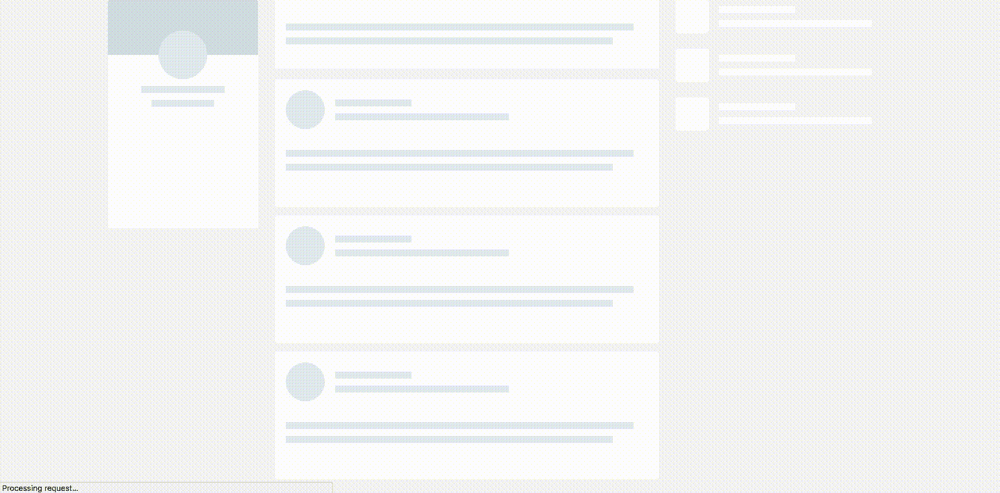
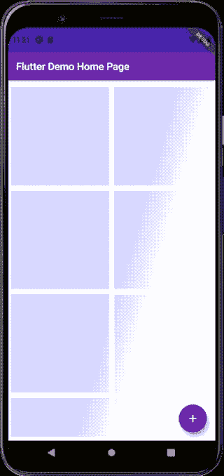
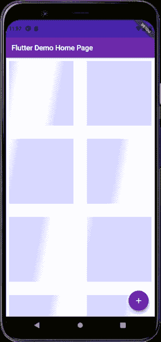

# 颤动中的骨架屏

> 原文：<https://medium.com/nerd-for-tech/skeleton-screen-in-flutter-3570bf23c28e?source=collection_archive---------5----------------------->

*包*——[**微光**](https://pub.dev/packages/shimmer)

你有没有想过网飞、Linkedin 等应用程序是如何做到的？获取数据时显示它们的加载页面？



# Flutter 社区非常感激我们有一个只需几步就能完成的包。

下面是 shimmer 包的基本实现-

*安装步骤-*

1.  使用 Flutter 运行以下命令:

```
$ flutter pub add shimmer
```

或者将其添加到您的包的`pubspec.yaml`文件中:

```
dependencies:
 shimmer: ^2.0.0
```

2.用 Flutter 从命令行安装包:

```
$ flutter pub get
```

3.现在，在您的 Dart 代码中，您可以使用:

```
import ‘package:shimmer/shimmer.dart’;
```

**编码部分-**

只需在`Shimmer.fromColors()`中包装自定义布局

然后，给*底色* & *高光颜色*



基本实现

# 让我们深入研究一下

*看起来很棒，但让我们定制更多…*

我们可以为动画添加持续时间，这样看起来会更真实一些

在`period :`属性中给出持续时间



目前就这些。感谢您阅读这篇文章。

下次见👍。