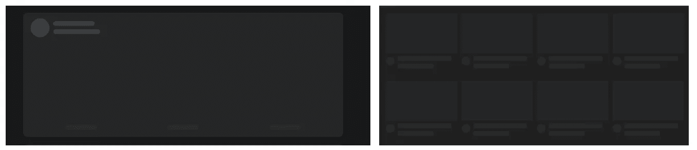
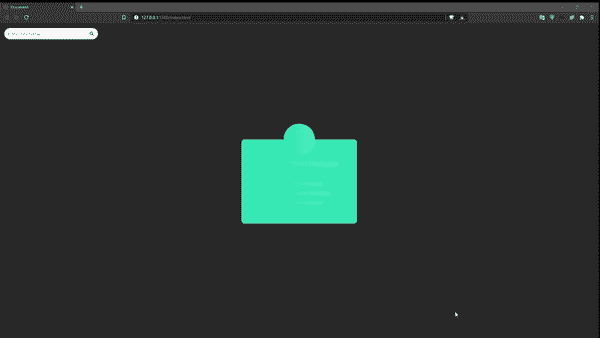
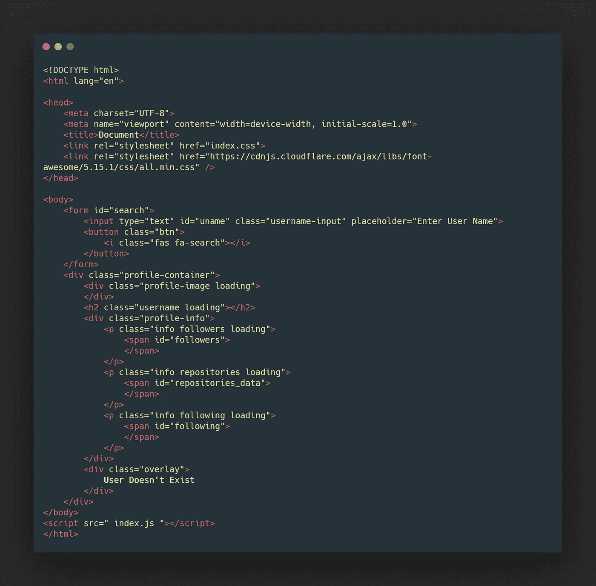

# 普通 JavaScript 的框架屏幕

> 原文：<https://medium.com/nerd-for-tech/skeleton-screens-in-plain-javascript-88bce254b0ab?source=collection_archive---------0----------------------->

即使用户在等待，也能创造更好的用户体验！

现在加载数据是在浏览器或应用程序本身完成的，而不是在服务器上。这减少了等待数据最终返回并加载到用户应用程序中的时间。尽管如此，从浏览器获取数据也需要时间，因为这是一个异步任务，因此我们有一些加载屏幕来保证用户。

骨架屏幕最近已经出现了一段时间，这是有原因的。只有一个简单的斑点或者一个带有文字“加载”的方块看起来很无聊，这使得用户不会在你的程序上停留很长时间。然而，框架屏幕能够在更长的时间内阻止用户，因为它们给出了内容将出现的布局的指示。事实证明，这比使用传统的加载微调器、加载器或动画文本更好。

这里有一些在许多网络应用中使用的骨架屏幕的例子，如脸书，YouTube，Discord 等。

内容加载到应用程序之前，脸书和谷歌的主屏幕

我们还将建立一个 HTML，CSS 和 JavaScript 的应用程序，我们将发送一个 API (GitHub API)到服务器，得到一个响应，并显示我们收到的内容。在此过程中，当我们等待数据加载时，我们将显示一个动画框架屏幕，以指示数据将被放置的最终布局。这有三个目的:

1.  向用户保证屏幕正在加载，数据正在获取
2.  给出数据返回后将如何放置的可视化表示
3.  让无聊的加载文本或动画看起来更酷

在开始之前。让我们看看我们将构建的最终产品

我们将涉及的内容:

a)创建动画骨架屏幕

b .显示用户配置文件，无需重新加载页面

c)未找到用户时的错误处理。

> [看住她](https://suparthghimire.github.io/JS-Skeleton-Loading-Animation/) e

我们开始吧！

首先创建一个空文件夹，并在 VS 代码中打开它。我们需要三个文件，HTML 文件用于创建页面布局，CSS 文件用于设计页面，JavaScript 文件用于发送请求和接收响应，然后在屏幕上加载内容。

我将这些文件命名为 index.html、index.css 和 index.js(你可以随意命名)。

## HTML

HTML 中的代码

HTML 只包含我们的应用程序的布局方面。HTML 的主体由一个带有输入文本和按钮的表单元素组成。body 元素的另一个子元素是一个容器，它包含一个 division 和一个包含多个子元素的 profile 容器类。

1.  第一个孩子是稍后将包装图像标签的分部

2.第二个子标签是 h2 标签，稍后将嵌入用户名

3.一个配置文件信息部门，包含 3 个段落 tad，容纳一个跨度标签，稍后将与追随者，储存库和以下计数嵌入。

4.最后，如果输入的用户名在 GitHub 数据库中不存在，则创建一个叠加分区以供查看。

这个 HTML 中唯一有趣的事情是每个需要更新内容的部分都有一个加载到其中的类。这个加载类在 CSS 中的样式是这样的，它只描述了卡片中内容的基本布局。

## CSS

该应用程序的 CSS 代码很长，因此我建议你提出自己的设计来实现这里。

> 如果你想要我的设计，你可以访问这个项目的 GitHub 库，并在那里查看它。

我们将只看到加载类中应用的样式，因为它是负责骨架效果的。

加载样式

这里的装载类被给定了一个线性梯度的背景以及一定的宽度和高度。此外，线性梯度，然后动画。

此外，如果我们还需要为页面中的某些元素分配一定的宽度。

造型更有特色的骨架加载

这些样式只是为 HTML 中的类提供一定的宽度和高度，以便框架屏幕看起来更有吸引力(更好的 UI)。

> 一个[的收获，更多风格，请访问 GitHub 这个项目的资源库。](https://github.com/suparthghimire/JS-Skeleton-Loading-Animation)

## JAVASCRIPT

这个项目的 JavaScript 非常简单！这是一张显示申请进度的图表

我们看到 app 的初始状态是等待状态，用户需要输入用户名。当输入用户名时，应用程序向服务器请求它需要接收的数据，然后在屏幕上显示出来。向服务器发出请求和获得响应之间的时间由框架屏幕来完成。

因此，我们首先需要选择所有需要设置在框架表单上的内容。它们是用户头像的包装器部分、用户名部分、显示关注者、存储库和某个用户的关注的 span 标签，最后是如果输入的用户不存在时显示的覆盖图。

我们还需要选择表单，因为我们需要向它添加提交事件侦听器，以便我们向服务器提交用户名。

用于全选的 JavaScript 代码

我们需要执行的下一件事是在提交表单时为表单设置一个事件监听器。
我们首先需要从输入字段中获取用户名，将其存储在一个变量中，将输入字段中的值设置为 null，并将光标置于其上。

此外，一旦提交按钮被按下，我们需要从 API 获取数据。因此，调用了一个函数 apiCall，它接受用户的用户名作为参数。

表单元素中的事件侦听器

我们看到没有创建 apiCall 函数。让我们看看在这个函数中我们需要做什么。这个函数的主要目标是从 API 请求数据。因此，我们在 apiCall 函数中使用 fetch()方法。

> GitHub 的 API:[https://api.github.com/users/](https://api.github.com/users/${uname})<你的用户名>

fetch 函数首先必须使用 GitHub 提供的资源。我们知道 fetch 返回一个承诺，因此我们可以利用。然后()和。catch()方法(或者，使用 async 和 await 也可以)。

首先，如果 fetch 方法返回的承诺实现了，那么我们会收到一个响应，在应用程序中使用它之前，需要将它转换成 JavaScript 对象。在这里，您可能会想到使用 JSON.parse()来解析传入的响应，但这是不正确的。

看，JSON.parse()本质上是同步的，因此它与我们的主程序运行在同一个线程上。然而，我们收到的回应是一个承诺，因此它在本质上是异步的。如果我们使用 JSON.parse()将响应转换为 JavaScript 对象，我们将不会获得任何数据，因为数据的获取是在单独的线程中完成的，其中响应是作为回调接收的。因此，不能使用 JSON.parse()。

除了使用 JSON.parse()，还有一种将数据解析成 JavaScript 对象的异步方法，那就是使用。json()方法。这与 JSON.parse()非常相似，但是它返回一个承诺，最终被解析为 JavaScript 对象。因此，作为。json()本质上也是异步的，它返回一个承诺，我们可以利用它将传入的响应解析成 JavaScript 对象，并在以后使用它。

当响应被解析成 JavaScript 对象并且已经返回一个承诺时，我们可以再次链接另一个。then()方法，然后获取已经解析的数据。

从 API 获取和解析数据

如果我们从表单中看到 submit any name，并在浏览器中进行检查，我们可以看到我们收到的信息是以 JavaScript 对象格式输入的用户名。

但是，我们仍然没有看到我们想要的。我们必须能够更新我们的容器，以显示所需的数据，也有一个运行的框架屏幕。

首先，让我们在获取数据后在屏幕上显示数据。我们将需要一个函数来呈现数据，一旦我们收到它。一旦我们收到数据，我们将调用这个函数。

收到数据后调用 renderOutput 函数

呈现输出的函数

正如我们看到的，我们收到的数据然后被发送到 renderOutput 函数，该函数接受一个对象作为参数，询问名称、追随者、追随者和存储库。然后，传入的值被注入 DOM。

如果我们现在看应用程序，我们可以看到屏幕中的数据，但骨架屏幕并没有消失。要删除应用程序的加载状态，我们需要从 HTML 的每个元素中删除加载类。让我们创建一个从 HTML 元素中移除加载类的函数，并从 renderOutput 函数中调用它

调用 removeSkeleton 函数的渲染输出函数

移除框架函数，从 HTML 所有元素中移除“加载”类

现在，如果我们在应用程序中看到，我们可以看到，一旦我们输入用户名，骨架消失，数据显示出来。但是，头像仍然不可见，因为我们需要从 JavaScript 注入图像标签，因为 HTML 只包含图像的包装。让我们创建一个函数 createImage，它接受图像的源，然后创建图像并作为子元素添加到 HTML 中的父元素中

函数来创建图像，并作为子对象附加到 profile image 类

在我们从 apiCall 函数调用 renderOutput 函数之前，需要调用这个函数，因为我们需要在屏幕上呈现任何内容之前准备好图像。

在调用 renderOutput 函数之前，创建要调用图像函数

在这一点上，我们非常接近结束。但是，我们仍然需要看看如果用户发送一个无效的请求(不存在的用户的用户名)该怎么办。

> [点击此链接查看无效用户名的回复](https://api.github.com/users/djskaldjsljaklfjdslkfjsdlkfjskldfjdslkfjsd)

正如我们所看到的，响应仍然是 JSON 格式，有一个“message”键，而不是发送 404 错误。因此，我们可以在应用程序中捕捉到这一点。

在 apiCall 函数中，在我们调用 createImage 函数之前，如果接收到的数据有一个消息键，那么我们可以简单地抛出一个错误，如下图所示。

现在，如果我们发送一个无效的请求，那么在控制台中，我们可以看到“某行出错”的错误

一旦发现错误，我们首先需要一个 X 符号作为图像，并启用显示“用户不存在”的覆盖。我们将创建一个函数，将覆盖中的样式从隐藏的可见性更改为可见的可见性。该功能将起到双重作用，因为它还会创建带有十字符号的图像。

启用覆盖并创建带有十字符号的图像的功能

> 获取带有十字标志的图片链接[此处](https://i.ibb.co/N3cmDhB/Img.png)

这将处理我们的错误。然而，在输入一个无效的用户名之后，如果我们输入一个有效用户的名字，那么这个覆盖图就会消失。在我们调用 apiCall 函数中的 renderOutput 函数后，将编写一行代码。

将覆盖的可见性变为隐藏

现在唯一要做的就是解决堆叠图像的问题。这相当简单，我们首先清除所有的字段，然后添加装载类。提交表单后将调用清除字段函数，添加加载类的函数将在清除字段函数内调用。

提交表单后调用 clearFields 函数

定义 ClearFields 函数并调用 addSkeleton 函数

addSkeleton 函数的定义

如果我们现在检查应用程序，我们会看到一切都正常。

至此，在 API 调用中创建一个简单的框架屏幕就结束了。

非常感谢您阅读文章！如果它的任何部分让你困惑，你可以[发电子邮件](mailto:suparthnarayanghimire2014@gmail.com)给我，甚至在评论中提问！！！！

注销！！再见！✌✌