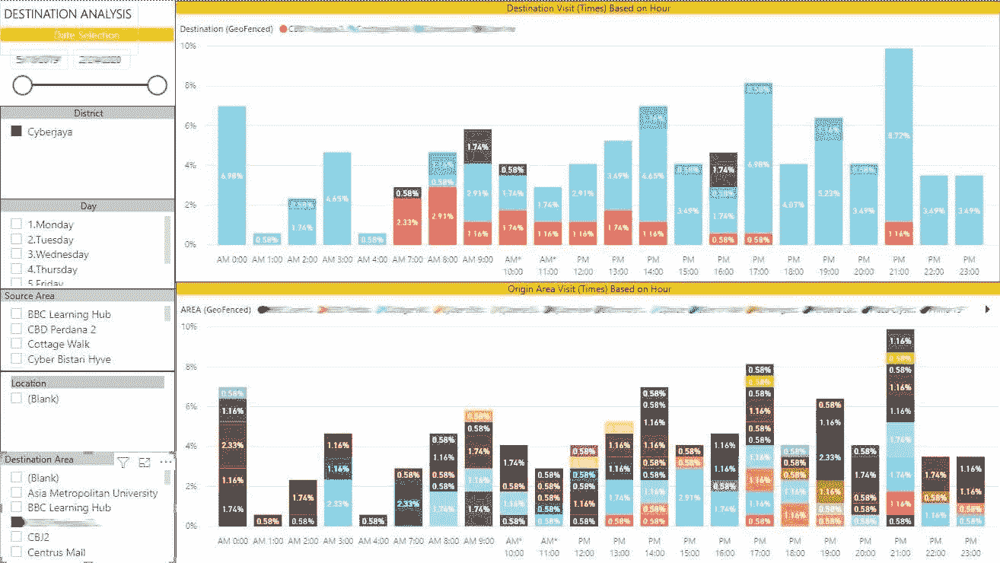
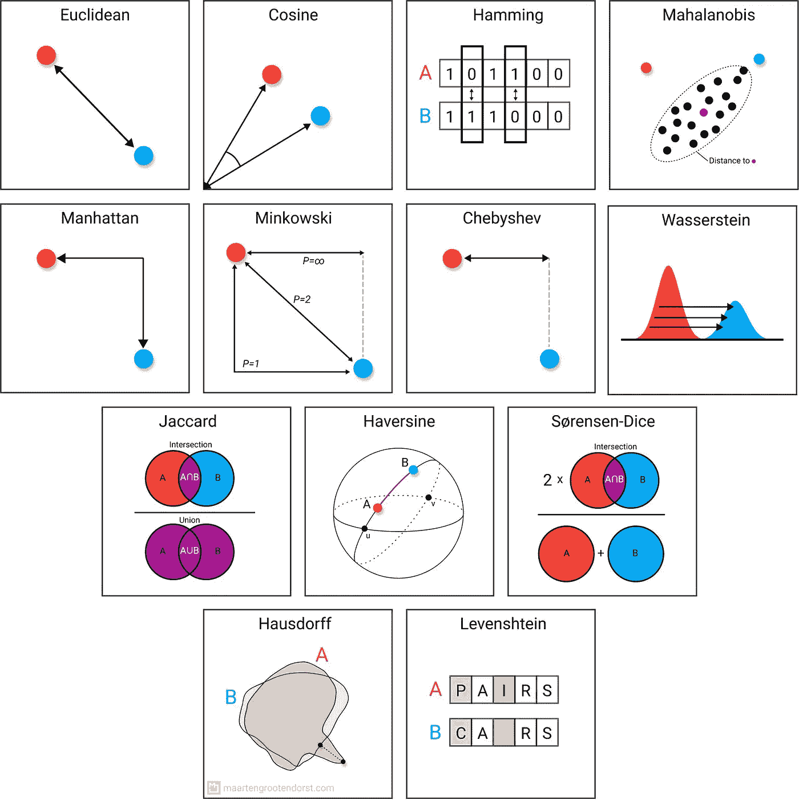

# 新数字时代金融专业人员的技能

> 原文：<https://medium.com/nerd-for-tech/skills-for-finance-professionals-in-a-new-digital-age-4c52bc53f768?source=collection_archive---------3----------------------->

照片由来自 [Pexels](https://www.pexels.com/photo/black-flat-screen-computer-monitor-1714208/?utm_content=attributionCopyText&utm_medium=referral&utm_source=pexels) 的 [Josh Sorenson](https://www.pexels.com/@joshsorenson?utm_content=attributionCopyText&utm_medium=referral&utm_source=pexels) 拍摄

技术的快速发展逐渐改变了我们的日常工作方式。对于金融专业人士来说，这意味着一件大事，因为如果不采取措施提高自己的技能，你可能很快就会发现自己变得无关紧要。

与 10-20 年前相比，利用人工智能和机器学习的各种工具的出现，使金融专业人员的工作变得更加容易。这种进步正逐步将金融专业人士的角色从传统的数字计算角色，转变为更具附加值的角色。在大多数组织中，财务专业人员被期望与高层管理人员更密切地合作，对提交给他们的数字提出见解。

> 这种进步正逐步将金融专业人士的角色从传统的数字计算角色，转变为更具附加值的角色。

为了在这个新时代保持相关性，金融专业人士应该在传统必备技能的基础上，用各种技术技能来武装自己。回顾我作为财务和转型人员的经历，我在此列出一些我认为对财务专业人员有价值的关键技能:

# **数据提取和分析**

**高级 MS Excel** —毫无疑问，基本的 MS Excel 已经不足以应付我们现有的日常任务。随着数据变得越来越丰富和复杂，高级 Excel(如宏、VBA)和使用各种复杂公式的能力不仅对于执行困难的任务，而且对于节省您处理原始数据的宝贵时间都是必要的。

**Python** —在很多大学，Python 是 STEM 相关课程的第一编程语言。一些金融专业人士可能会发现这种编程语言很陌生，因为从一开始我们就更依赖 MS Excel 来处理和操作我们的数据。然而，在数据分析的更高级阶段，财务专业人员可能会发现自己正步入数据科学领域，简单的代数不再足以分析数据。在这个新时代，金融专业人员应该能够利用统计方法，如回归和聚类技术。

轮廓得分和误差距离平方和(SSE)的图表示例，用于确定聚类数

此外，使用 python 可以更轻松地通过 scikit-learn 和 matplotlib 使用经过训练的数据进行高级预测和可视化。

查看我以前的项目，使用 python 来确定在吉隆坡开咖啡馆的地点[这里](/nerd-for-tech/opening-a-café-in-kuala-lumpur-an-exploratory-study-using-foursquare-api-6bfc844429c6)。

*   Python 官方网页[这里](https://www.python.org/)。

**SQL** —在大多数组织中，企业资源计划(ERP)每天收集和处理大量数据。然后，数据存储在本地或云的数据库中。因此，提取数据的技能将节省您的时间，而不是等待您的 IT 人员获得您没有请求的信息。要提取这些数据，需要一种通用语言来确保您得到您所要求的。最常见的数据库语言之一是结构化查询语言或“SQL ”,因为企业资源规划系统(ERP)通常使用关系数据库[和 SQL。SQL 的酷之处在于它引入了用一个命令访问许多记录的概念。此外，它消除了指定如何到达记录的需要，例如，具有或不具有](https://www.ibm.com/cloud/learn/relational-database)[索引](https://en.wikipedia.org/wiki/Database_index)[【1】](https://en.wikipedia.org/wiki/SQL)。大多数现代 ERP 系统如 SAP 和 Oracle 在后端使用关系数据库，并与 SQL 高度兼容。

# **数据呈现、可视化和分析**

**MS PowerBI/Tableau**——作为一名与高层管理人员密切合作的财务专业人士，你会意识到你所有令人眼花缭乱的细节工作都不再有用。您需要找到如何以一种简单但交互的方式呈现这些数据的方法。此外，您可能拥有来自各种来源的数据，这些数据可能有助于您的管理团队做出更好的决策。因此，利用 Power BI 或 Tableau 等商业智能工具的技能将帮助您将所有不相关的数据组合成连贯的、视觉上身临其境的交互式见解。

来自[www . technology . my](http://www.technolancer.my)的用于微生物来源-目的地分析的 PowerBI 仪表板示例

*   MS Power BI 官方网页[此处](https://powerbi.microsoft.com/en-us/)。

# **数据共享和传播**

现在，你已经为你的上级提供了大量的分析，但是你所有的工作都是分散的。把所有的工作都放在你的个人云存储中是很好的。但是如果他们在有协作功能的地方，并且容易被你的团队访问，那就更好了。一种选择是使用 MS Sharepoint 将属于您的部门和团队的所有文档集中起来。只需在 sharepoint 中创建一个团队网站，瞧！，您和您的团队可以开始在内部(或外部)共享文档。有了一个集中的资料室，你和你的团队就能更容易地访问、转发、检索和管理内部文件。当你的团队成员离开组织时，这也会使交接工作变得更加容易。

*   微软 Sharepoint 主网页[这里](https://www.microsoft.com/en-us/microsoft-365/sharepoint/collaboration)。

**MS Power Automate(可选)** — MS Power Automate 是微软 365 捆绑包的一部分。以前，它被称为 MS Workflow，反映了它的预期用途—自动化。假设您在 MS Sharepoint 中有一个受控的 excel 表，其中任何行项目的添加或删除都需要得到您的上级的批准。你知道进展是不稳定的，这意味着来来回回地获得上级的批准是不可避免的，很遗憾地说，这是一个“讨厌鬼”，因为你的上级可能很忙，你可能无法每次都抓住他。那么，让这个过程自动化怎么样——让你的团队在表格中提出任何更改，这些更改将自动提交给你的上级批准。一旦获得批准，提议的更改将自动反映在 excel 表格中，否则不会反映出来。是的，Power Automate 可以做到这一点，这只是冰山一角！

MS Power Automate 主网页[这里](https://powerautomate.microsoft.com/en-us/)。

**应用程序开发工具(可选)**即 MS PowerApps、Flutter 和 Dart——在高级阶段，您可能会发现在整个组织中传播信息，尤其是向您的管理团队传播信息，可能需要一个专用平台，而现有平台可能无法满足您的所有需求——这时您的需求列表开始增长。所以，不如展开你的袖子，点燃你的笔记本电脑，开始自己编写应用程序。我建议 MS PowerApps 适合低代码环境，而 Dart 语言适合更高级的用户。MS PowerApps 与微软 365 订阅捆绑在一起，而颤振是谷歌的一个开源用户界面 SDK 所以这两个选项可能都需要非常少甚至零的资金投资，您需要的只是花在学习如何使用这些神奇工具上的时间。为什么要自己编码？显然，外包给程序员要便宜得多，而且您可以更好地控制应用程序的结果。取决于个人，我发现自己编写代码更令人满意。

*   在这里查看我在谷歌游戏商店[用颤振写的一个简单的应用程序。](https://play.google.com/store/apps/details?id=my.technolancer.my_tazk)
*   微软 PowerApps 官方网页[此处](https://powerapps.microsoft.com/en-us/)
*   旋动官方网页[此处](https://flutter.dev/)。

# **还要考虑的其他事情——除了专业资格外，还要获得数据科学证书。**

根据 2022 年 1 月 20 日分享的 2022 年 EY 东盟金融执行论坛，未来三年金融职能的最高技术投资优先事项是:

-高级财务数据分析

-所有流程的自动化

-数字技能

-数据可视化

> 此外，他们还指出，未来三年**金融领导者**的关键技术投资重点可能是“先进和预测性分析”。

所以你会听到“分析”这个词被一次又一次地重复。准确地说，分析是发现、解释和交流数据中重要模式的过程[【2】](https://www.oracle.com/business-analytics/what-is-analytics/)。每当适当的统计方法被部署到模型中，并且用户能够理解来自所部署的模型的输出时，模式的分析特别有意义。这就是为什么数据科学的技能和知识对于金融专业人士来说变得比以往任何时候都重要。例如，金融模型需要基于历史数据的输入来预测未来的事件/运动。通过将一些统计元素注入到模型中，将提高前视运动的准确性。

[马腾 Grootendors](https://www.linkedin.com/in/mgrootendorst/) t 与 [Linkedin](https://www.linkedin.com/posts/mgrootendorst_artificialintelligence-machinelearning-datascience-activity-6874000348479066112-7pJO) 统计距离图

你可以参加很多数据科学课程/认证。但是有两个顶级认证我会一直推荐我的关系去追求:

*   [IBM 数据科学专业证书](https://www.coursera.org/professional-certificates/ibm-data-science)
*   [谷歌数据分析专业证书](https://www.coursera.org/professional-certificates/google-data-analytics)

两者都是负担得起的在线课程，初学者很容易跟上。然而，这些课程之间的明显区别是在处理数据科学主题时使用的编程语言。例如，IBM 使用基于 Python 的编程语言，而 Google certificate 使用 R 编程语言。就个人而言，我更喜欢 Python，因为如果你想深入机器学习和人工智能领域，它是最好的语言。

然而，两种语言都很强大，这取决于你个人喜好。研究不同之处，找出你想从课程中学到的东西，然后坚持不懈地选择道路。我已经完成了 IBM 的认证，从开始到最后一个顶点项目花了我 100 多个小时。我从该认证中获得的技能补充了我现有的技能和资格。

# 结论

世界在发展，金融专业人士所需的技能也在发展。在整个行业中，对数字和高级金融分析技能的强调变得比以往任何时候都重要。是长期保持相关性，还是在这个数字时代沾沾自喜、变得过时，这取决于我们。