# 订单概况分析

> 原文：<https://medium.com/nerd-for-tech/sku-and-order-profile-analysis-dedc40c9e0ae?source=collection_archive---------0----------------------->

## 购物是有后果的

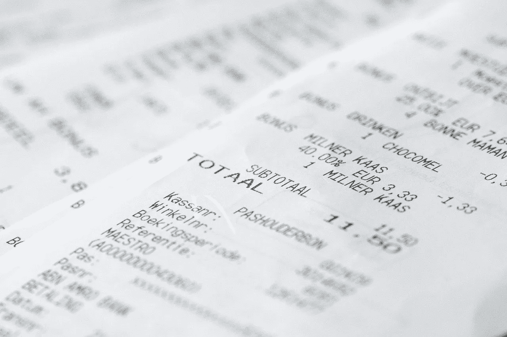

图片:pixabay 上的[sabinevanerps](https://pixabay.com/users/sabinevanerp-2145163/)

O list 是一家巴西百货公司平台，在电子商务领域运营(软件即服务)。这项服务包括管理店主和客户之间的销售过程，还包括一份客户满意度报告。店主的优势是更好的市场地位和透明的声誉指标。业务的驱动力是吸引更多的客户并提高流程的质量。这个项目的动机是支持这一努力。

## 订单和 SKU 配置文件

购物账单代表了订单配置文件的一个小例子。它告诉我们买了什么东西，买了多少。这看似平常，意义不大。但是如果你在同一次旅行中为你的两三个邻居买东西，情况就不同了。将形成捆绑和组合商品的策略，以及如何规划穿过商店的路径。这样可以节省时间和金钱。这是配送中心和整个供应链正在发生的事情的开始。不同之处在于，在更大的层面上，仓库流程、订单执行策略以及技术选择都会受到影响。

## 目标

该分析的目标是提取支持 Olist 业务目标的信息。这些目标是:通过提高服务吸引更多的店主，通过更广泛的产品系列和更高的客户满意度吸引更多的最终客户。该分析也是业务案例分析的一部分，业务案例分析旨在将服务扩展到物流和仓储。

在上一篇文章([一个电子商务数据故事](/swlh/an-e-commerce-data-story-e53eb8e16f90))中，调查了 Olist 的一般业务趋势。订单概况分析现在让我们更深入地了解订单构成，这是开发成功的仓库和物流流程的重要组成部分。由于动态和经常不可预测的每日订单量，电子商务在这方面被证明是一个非常具有挑战性的商业领域。有一系列“传统的”分析输出，为物流专家提供了对运作的洞察:帕累托图、ABC 分类法、XYZ 分类法、每订单单位分布、每订单行数分布、分类细分是最常见的。这些是重要的指标，因为它们直接提供了关于仓库概念和系统规模的见解。除此之外，在许多情况下，在更大的背景下理解数据是有用的，通常包括用户的特征和他们的购物选择。

这部分的问题详细如下:

1.  从有序和 SKU 分布图中我们可以得出什么结论？
2.  **履行流程和库存的结论**
3.  **产品类别关联**

## 方法

这篇文章总结了在 [GitHub](https://github.com/LarsTinnefeld/olist_ecom_analysis) 中可以找到的主要分析结果。应用以下步骤和方法:

*   数据准备和争论
*   探索性数据分析
*   订单概况分析
*   SKU 速度分析(帕累托)
*   ABC-XYZ 分类法
*   结论

## 数据

提供的数据由 2016 年至 2018 年的历史订单数据组成，包含 100，000 个订单。有 8 个文件可用。下面的数据模型显示了这些数据表和查找表之间的高级引用。在这篇文章的分析中，并不是所有的数据表都会用到。这些数据是 Olist 在许可证 CC BY-NC-SA 4.0 下慷慨提供的，可以在 Kaggle 的 [***这里***](https://www.kaggle.com/olistbr/brazilian-ecommerce) 找到。

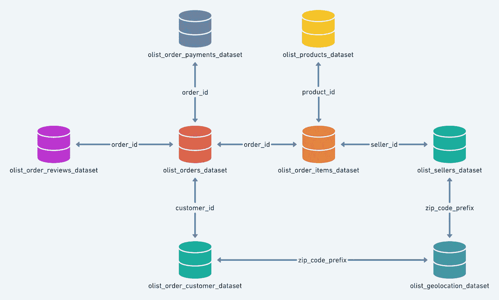

图片由 Kaggle/ Olist 提供

## 数据准备

将导入在最近分析中准备好的一个已订购数据表。一如既往，完整的代码可以在这里 查看并下载 [***。因为使用干净的数据是一项关键要求，所以我总是注意一些基本的东西:***](https://github.com/LarsTinnefeld/olist_ecom_analysis)

*   理解数据的内容
*   检查丢失的数据
*   检查是否有多条记录
*   检查数据格式
*   质疑你看到的结果是否有意义
*   评论你的步骤
*   变量的有意义的命名

阿列克斯·多罗霍维奇在 [Unsplash](https://unsplash.com?utm_source=medium&utm_medium=referral) 拍摄的照片

# 探索性数据分析

传统的仓储订单分析由一组描述订单构成、项目属性和产品订购频率的输出组成。这些指标可以直接转化为仓库流程。让我们通过简短的探索性数据分析来回顾一下产品的一些方面)

**顶级产品类别**

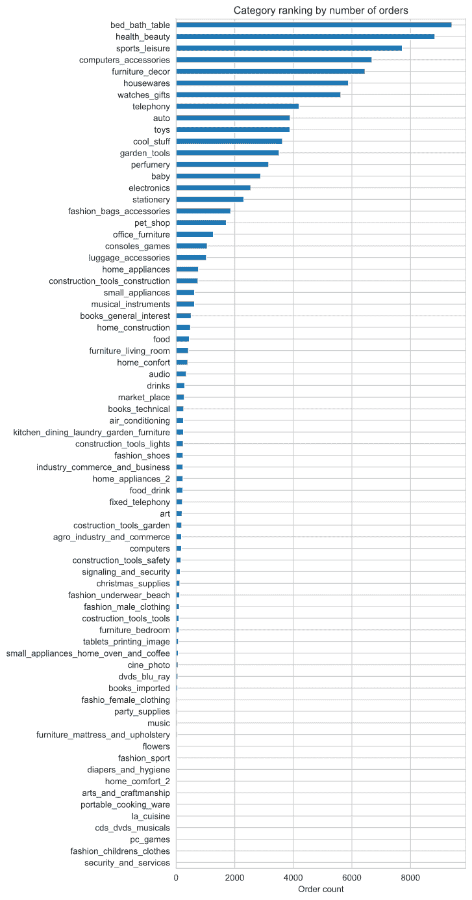

顶级移动产品类别的范围很窄。作为复习，我们之前调查了热门移动产品类别:

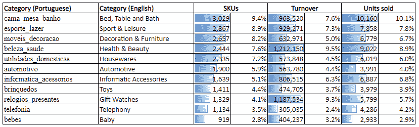

传统零售商通常只专注于一个特定的细分市场。这可以是时装、食品或一般商品。这是维持一个精简有效的流程链的逻辑结果，该流程链是为细分市场的特定特征量身定制的。另一方面，Olist 服务于非常广泛的市场，显然没有目标细分市场。当制定合并仓储服务的战略时，需要澄清是否需要包括特定的类别。

有多少订单来自顶级客户？

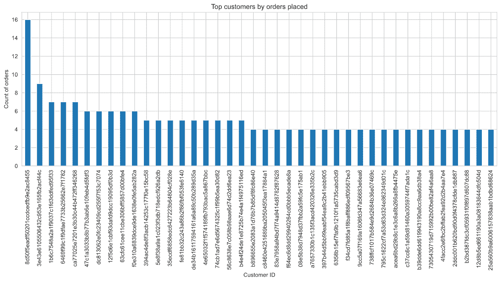

有超过 96，000 名客户。其中绝大多数只下了一次订单，所以平均订单频率刚刚超过 1。但是有一小部分客户下了不止一个订单，最多下了 16 个订单。

**一个潜在推荐算法或购物篮分析的小实验:寻找产品类别的相似性**

矩阵分解用于计算类别之间的距离(相似度)。该方法基于将采购订单中所有订购的产品类别与所有其他订单进行比较。订单之间的重叠越多，相似性就越大。这种方法也用于推荐引擎。如果客户购买一种产品，该算法会识别出与另一种产品的相似性，这种相似性可能也会引起购买兴趣。推荐功能将是一个网络应用程序的一部分，这将在稍后阶段为这个项目开发。

步骤 1:创建一个矩阵，其中包含索引上的类别和作为列的唯一顺序。该过程是生成所谓的“**稀疏矩阵**”。

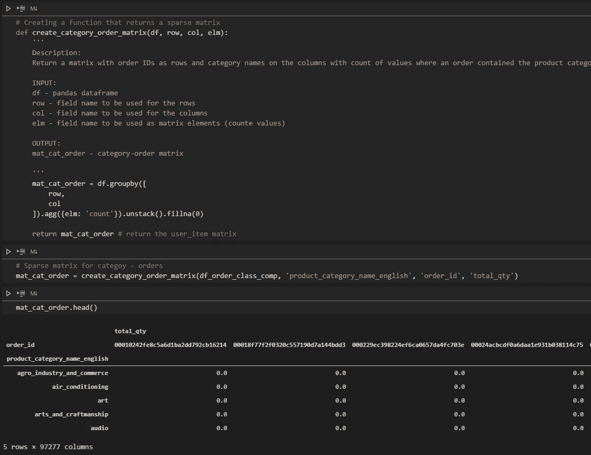

步骤 2:函数接受一个类别行，并计算所有其他类别行的点积。结果是可以根据值排序的点积列表。我们根据订单历史找出哪些产品与其他产品“更接近”。

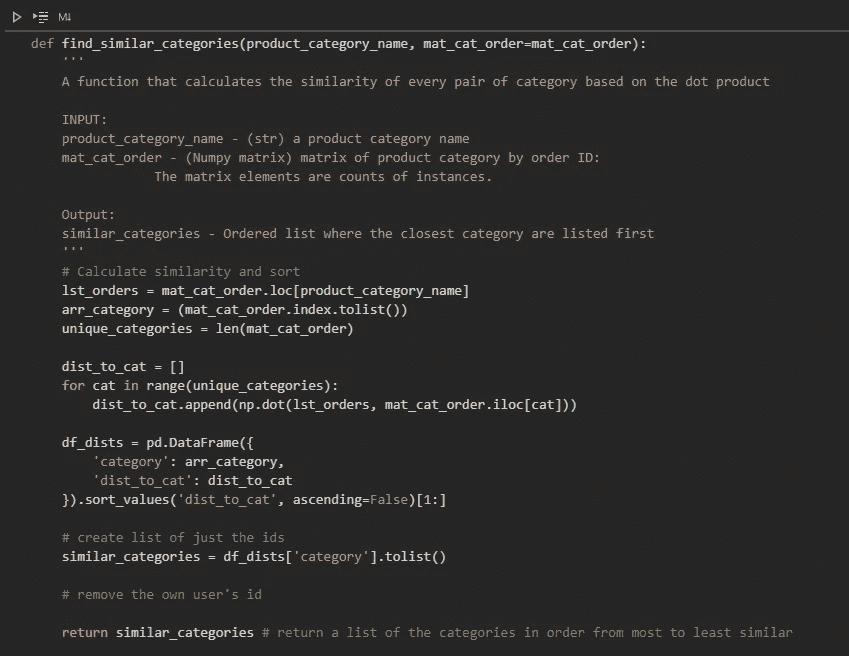

第三步:输入几个类别并查看结果。

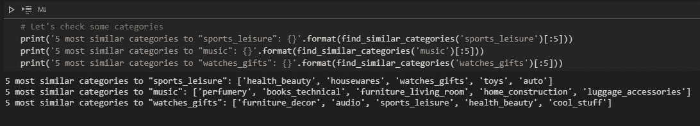

实例表明，“运动 _ 休闲”类似于“健康 _ 美容”、“家庭用品”和“手表 _ 礼品”。有一个完整的分析领域试图利用 ***亲和力分析*** 理论，因为知道特定产品“进展顺利”或甚至引发对方的购买吸引力可以影响营销策略，甚至仓库中的库存管理。

## 结论 EDA

*   有 73 个产品类别的广泛组合
*   在这些类别中，有一个主要产生 Olist 收入的小群体
*   利用矩阵分解，可以计算产品相似度

照片由[顾](https://unsplash.com/@gentle_kay?utm_source=medium&utm_medium=referral)在 [Unsplash](https://unsplash.com?utm_source=medium&utm_medium=referral) 上拍摄

# 订单概况分析

## 从有序和 SKU 剖面中我们能得出什么结论？

订单配置文件描述了订单的组成。订单中包含多少产品？订单数量是多少？这些指标如何分布在整个数据集中？为数据中的所有订单提取此信息会产生三个分布图:

*   每份订单的数量
*   每个订单行的单位
*   每个订单的订单行

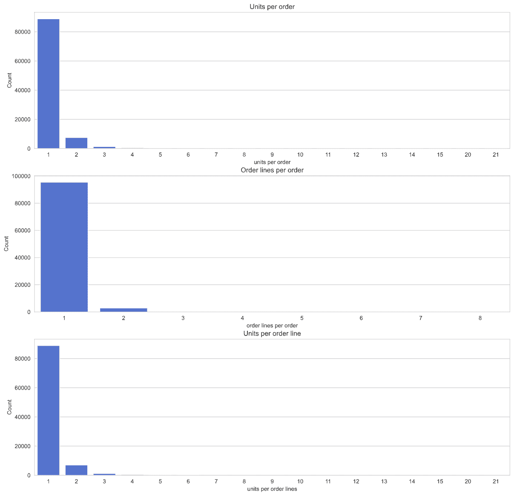

上面的图表显示了电子商务的典型特征:通常只有一两件商品的小订单。同时有将近 33，000 个 SKU(产品)。这有一些含义:

*   市场篮子分析可能不会产生很有代表性的结果。
*   订单执行概念将处理大部分 SIOs(单项订单),其中每件商品本身就是一个订单。这将打开提货策略，将这些订单分组为批次，然后可以一起处理。
*   订单整合流程区域(将订单中的所有商品收集并捆绑在一起运输)将非常小，甚至不存在。
*   79% SIO(单项订单)，93% SLO(单行订单)。

# SKU 轮廓分析

## 帕累托图

帕累托图直观显示了单个 SKU(或产品)对订单量或收入的贡献。这些值显示为百分比，并在每个轴中累积为 100%。当按等级排序时，会出现一条被称为帕累托图的曲线。根据曲线的平坦或陡峭程度，专家可以将这些数据与其他数据结合起来，并将其转化为业务和仓库流程。

收入的帕累托图:

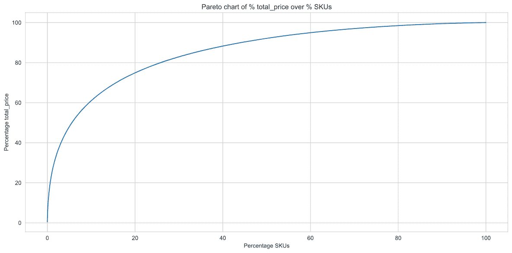

订单量的帕累托图:

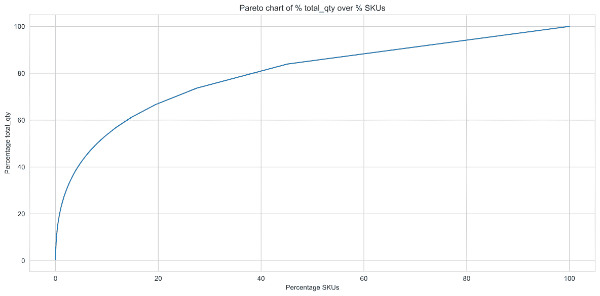

Olist 的帕累托图显示了订单量的 70/20 曲线(收入的 75/20)。这意味着所有 SKU 的 20%产生了总订单量的 70%(和总收入的 75%)。在这种情况下，20%大约是 6，600 个 SKU。

在许多企业中，20/80 的速度曲线是一个典型的现象。在其他情况下，这将是一个很好的产品分配基础，可能会有不同的提货方法。Olist 的订单量不是很高，这从另一个角度来看。

## ABC-XYZ 分类法

通常，在生成帕累托图的过程中，SKU 根据其速度(相对销售量)被分为 **ABC 类别**。SKU 的速度也表现为帕累托曲线的斜率。快速移动的 SKU(下图中的“A”)比其他 SKU 的斜率更陡。

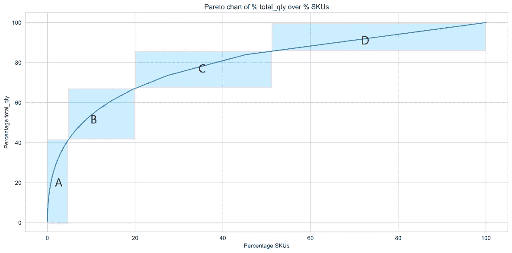

定义了以下 ABC 类别:

*   AA:这个类并不总是被使用
*   答:动作非常快
*   乙:动作很快
*   c:中型搬运工
*   慢性子

人们很容易从这张图表中得出仓库的概念。在传统的仓库规划中，帕累托曲线过去通常是通过移动的立方体度量(有多少立方米离开仓库)来完成的，然后根据各个立方体分类到特定的提货地点类型:对于最快的移动者从货盘提货，对于中等移动者从流动货架提货，对于慢移动者从货架提货等。对于现代仓库规划来说，这是一种远远不够的方法。快速穿梭系统、机器人和人工智能等新技术改变了选项，对最终 KPI 的期望水平也不同。

照片由[西格蒙德](https://unsplash.com/@sigmund?utm_source=medium&utm_medium=referral)在 [Unsplash](https://unsplash.com?utm_source=medium&utm_medium=referral) 上拍摄

ABC 分类只是一个时间快照。仓库里的产品进进出出。今天卖得快的产品下周可能会卖得很慢。我们看到季节性产品的影响，如草坪和花园或冬季服装。随着时尚和快速变化的产品类别，这种效果会变得极端。销售活动也可能导致销售速度的变化。

总之，帕累托曲线可能是**波动**，或者换句话说**误导**。这可能会对依赖稳定的 SKU 数据的仓库概念产生严重后果。为了应对这一挑战，物流专家需要熟悉他正在分析的业务，并可能进行所谓的 XYZ 分类。

在 XYZ 分类过程中，根据产品被拣选的频率来分析 SKU，这不一定与产品被拣选的数量相同。如果一个产品被频繁挑选，比如说每天，它被认为是一个 X-mover，因此在大多数情况下也是一个快速移动的产品(A-mover)。糖和牛奶就是这样的产品。但在极少数情况下，一个产品可以被归类为快速移动者，但结果却是 Z 移动者，这意味着它只在很短的时间内非常活跃。最终销售的烟花产品或物品就属于这一类。通常，在商店里，我们会在过道的货盘上找到这些产品。因此，ABC-XYZ 分类法对于仓储和物流来说是一个非常强大的工具，需要用来发现这种罕见的异常值。

奥利斯特的 ABC-XYZ 简介如下图所示:

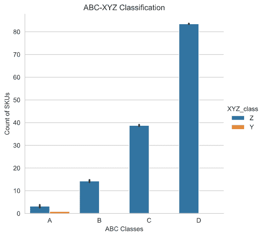

帕累托图中的陡峭分布具有很大的波动性。产品很少出售。考虑到商业模式，这一结果并不令人惊讶。

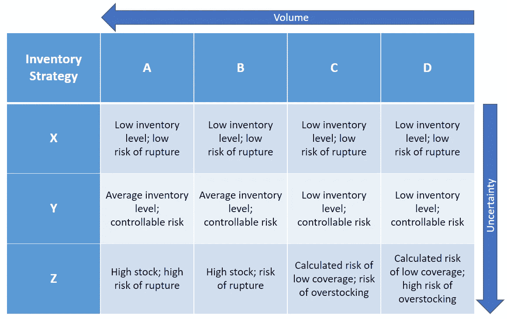

当涉及到库存管理时，当前的订单状况正在处理高度不确定性。大多数 SKU 都属于 DZ 或 CZ 类别。

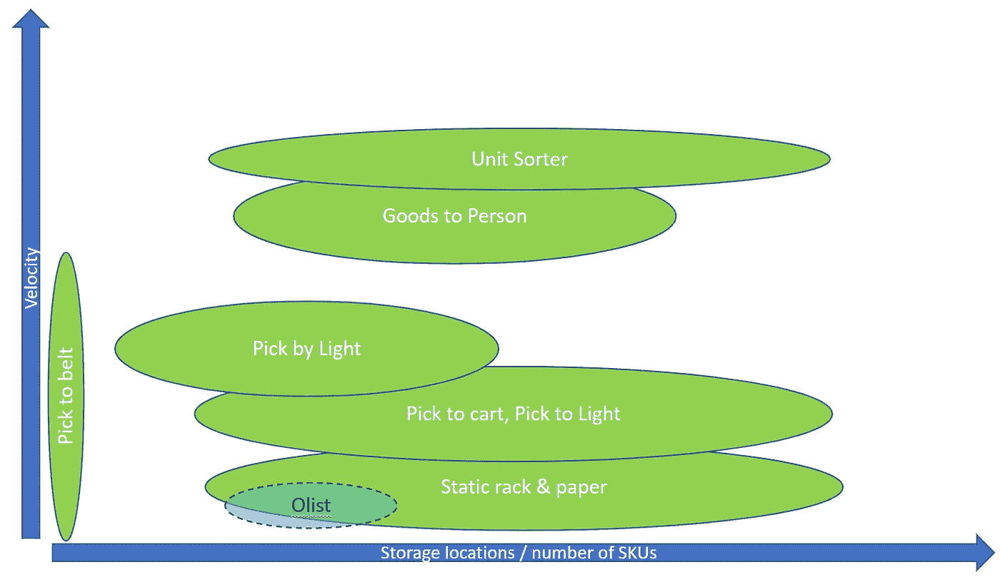

Olist 的仓库概念被认为是入门级解决方案。但是对于这些情况，现在不仅仅是使用固定安装的设备进行规划。有一些新兴技术可以快速适应快速增长的电子商务仓库运营。AGVs 和 AMRs 就是一个例子。人工智能驱动的物体跟踪是另一个例子。

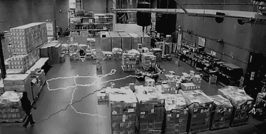

图片:LinkedIn [sSy.ai](https://ssy.ai)

上图显示了仓储中的一个新兴领域:与人工智能相结合的对象跟踪。实现工作很少，而且非常快。该系统将从它所看到的事物中学习，并通过预测结果性能成长为顾问。

# 结论

## 从有序和 SKU 剖面中我们能得出什么结论？

几乎 80%的单品订单和 93%的订单只有一种产品，Olist 是一个典型的电子商务企业。订单少，产品谱广。Olist 不服务于特定的垂直市场。帕累托曲线相对陡峭，但极其不稳定。

## **履行流程和库存的结论**

库存水平具有很高的不确定性，将有库存过多或库存低估的风险。假设的仓库需要改变产品组合和有限的产品种类才能发挥作用。订单过程最初将是手动的，可能会添加尖端的入门级技术，如人工智能支持的对象跟踪。

## **产品类别关联**

EDA 部分的一个小测试实验了产品类别相似度计算。基于订单配置文件，可以假设结果的精确度不高。但这是进一步调查的起点。

## 后续步骤

从层序结构可以看出层序的组成和 SKU 速度剖面。研究结果建议更仔细地观察客户方，以了解优先级、地理人口统计条件和细分，从而进一步增加商业案例分析的细节。

照片由 [Kats Weil](https://unsplash.com/@katweil?utm_source=medium&utm_medium=referral) 在 [Unsplash](https://unsplash.com?utm_source=medium&utm_medium=referral) 上拍摄

## 谢谢你

我希望你觉得这篇文章很有趣。我的背景是工程和仓储，对数据科学相对较新。因此，我对任何建议都持开放的态度，并对此心存感激。