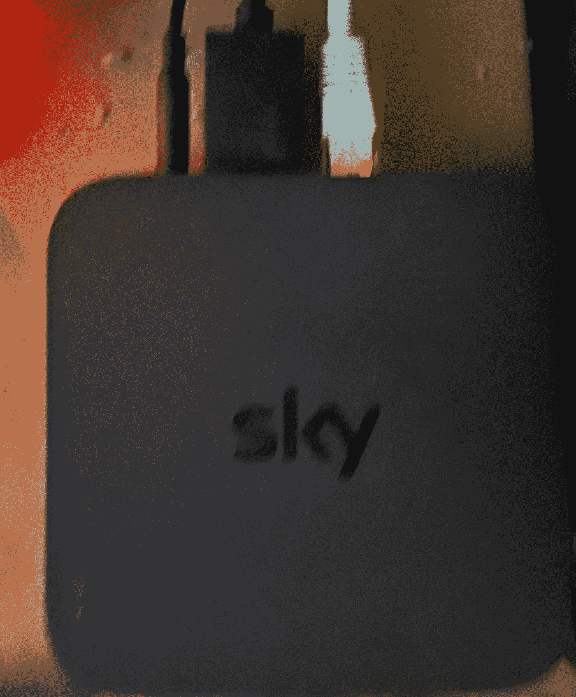
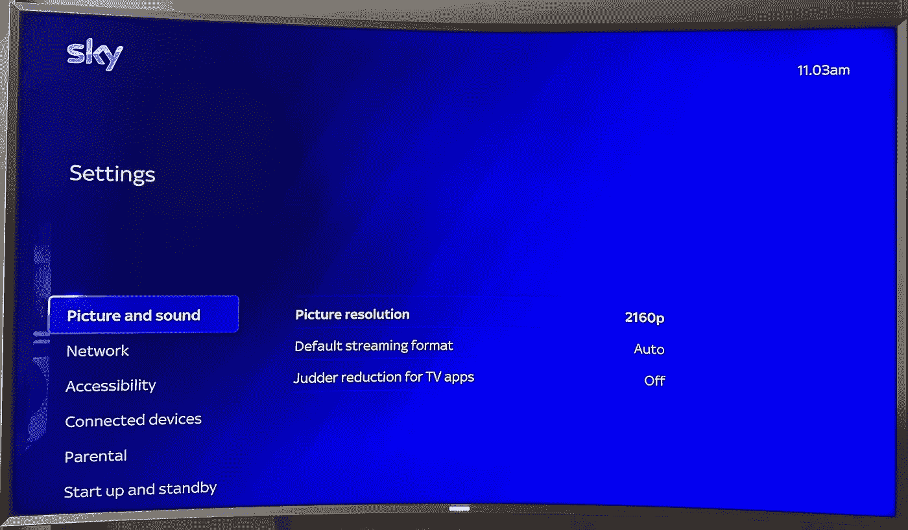
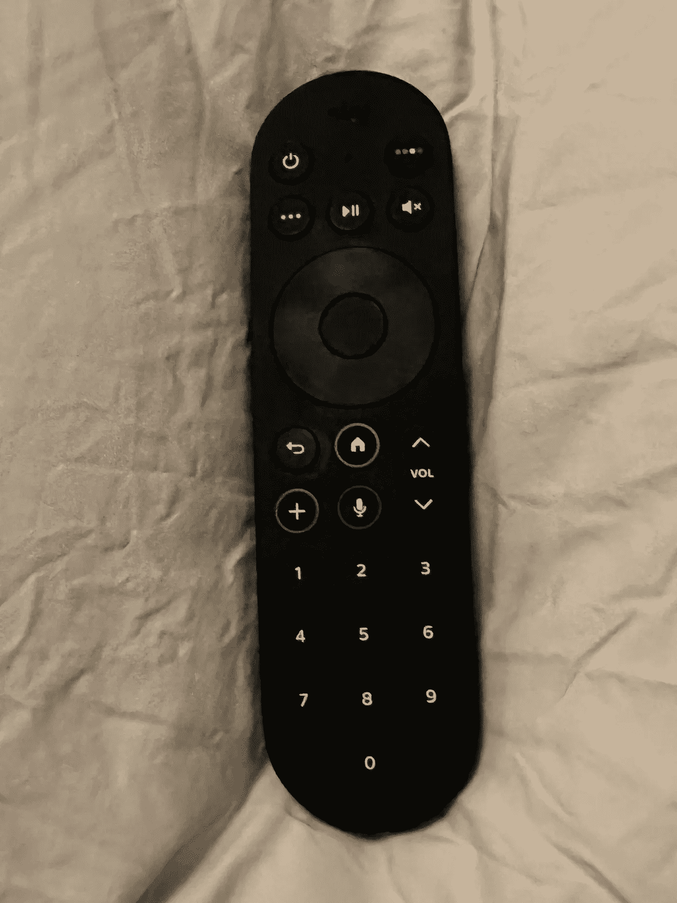

# 天空之流，第一眼

> 原文：<https://medium.com/nerd-for-tech/sky-stream-first-look-b59d767c7d1?source=collection_archive---------3----------------------->

Sky(以卫星广播系统而闻名)不久前推出了 Sky Glass，这是一款集成了 Sky 的电视，使用宽带来传送天空内容，不需要碟形天线/卫星(Sky 还拥有 Now TV，这是 Sky 服务的一个子集，也使用应用程序或 puck/box 通过宽带传送)。

现在 Sky 推出了与 Sky Glass(在服务方面)相同的 Sky Stream，但只是一个 puck/box 和一个遥控器(以及一个电源和 HDMI 电缆)。它通过以太网或 WiFi 连接到家庭网络。冰球实际上运行的是 Linux，所以可能有一些黑客左右。

天空流圆盘/盒子

基本服务是高清(1080)，但服务升级允许 UHD。包括网飞(基本版)(在单个设备上观看)，但有两个网飞标准版(2 个设备)和网飞高级版(4 个设备)的升级选项。

电视升级包是天空影院、天空体育、BT 体育和天空孩子。

这些包可以购买 18 个月的合同或 31 天的滚动(后者更贵)。

包装盒到达时已预先配置了帐户设置，只需通过 HDMI 电缆将其插入电视，如果有以太网，请插入并启动，然后就可以在设置中进行设置。

它需要一段时间来启动，天空标志将是黑色背景上的白色，当启动和运行时，屏幕将变成标准的天蓝色，白色字体的选项。

天空流设置

然后拿起遥控器，同时按下按钮 1 和 3(你必须按住它们一会儿)，盒子将询问你是否希望连接遥控器(通过按遥控器上的中间按钮同意)。

如果正在使用以太网，应自动选取设置(即 IP 地址/等)，否则需要配置 WiFi。

如果已经选择了 UHD 包，那么默认模式可以是移动 UHD 而不是高清。还提供各种音频选项(发送到电视的格式也是如此)。

一旦完成，点击主页按钮，所有频道都可用(包括地面频道)。

然后是网飞、iPlayer、ALL4、My5、Disney+和 Apple TV+等应用程序。

派拉蒙+也是可用的，该应用程序通过天空系统访问，然后帐户设置(再次在天空/派拉蒙应用程序)。然后，当进行订阅时，价格将设置为每月 0 英镑(即免费)。

如果目前正在使用网飞套餐，通过 Sky 登录意味着账单将转移到 Sky(即基本版免费)。网飞将把当前的计费方式“存档”,这样，如果 Sky 订阅终止，它将恢复到原来的方式。

画面非常好，服务非常流畅，尽管使用 UHD 意味着宽带服务至少需要 25Mb/s。

这些包是:-

每月 18 个月的合同成本

*   天空娱乐和网飞(基本)26
*   天空体育 20(报价)
*   天空影院 11
*   BT Sport 30
*   天空小孩 6
*   UHD 和杜比全景声 6
*   网飞基本标清(包括在内，可在一台设备上观看)0
*   网飞标准高清(在两台设备上观看)4
*   网飞高级 UHD(在 4 种设备上观看)8

得到一切将是下午 107

31 天滚动成本

*   天空娱乐和网飞(基本)29
*   天空体育 22(报价)
*   天空影院 13
*   BT Sport 30
*   天空小孩 6
*   UHD 和杜比全景声 6
*   网飞基本标清(包括在内，可在一台设备上观看)0
*   网飞标准高清(在两台设备上观看)4
*   网飞高级 UHD(在 4 种设备上观看)8

得到一切将是 114

然后可以在晚上 12 点添加整个家庭，这允许家庭中有更多的冰球(第一个冰球是免费的，更多的是每个 39)。

以 18 个月的合同购买全套服务每月可节省 7 英镑，在整个合同期内可节省 126 英镑。

网飞已经宣布了他们的新计划(从 11 月开始),对应于天空计划(包括分辨率和设备),即基本、标准和高级。有广告支持的基本计划每月 4.99 英镑，而无广告服务每月分别为 6.99 英镑、10.99 英镑和 15.99 英镑。因此，如果您已经是天空捆绑包的用户，那么选择天空捆绑包是一种节省。

这个系统有一些怪癖(希望在未来的软件更新中可以解决)，主要的 bug 是家长控制。当访问指定节目需要家长控制的频道时(白天 12+小时)，即使家长控制/白天控制已被禁用，也需要 PIN。如果程序随后改变到另一个程序(这也被认为需要父母控制)，那么当程序改变时，需要再次输入 PIN。

默认 PIN 是向该服务注册的手机号码的最后 4 位数字，但可以轻松更改。家长控制可以设置为标准年龄(U，PG，12，15，18 或无)，并且所有应用程序或单个应用程序都可以受 PIN 保护。

还有语音控制，因此可以说“观看 BBC 1”，它会切换到该频道(通过按遥控器上的麦克风符号)。

天空之流遥控器

移动遥控器时，按钮会亮起来，即使在黑暗的环境中也能轻松找到您正在做的事情。

另一个小问题是，即使按下遥控器上的电源按钮，Sky puck 也需要一段时间才能打开，但它往往会在几次后工作。

总而言之，如果你的网络连接可以应付的话，这是一个很好的不需要卫星天线就能接收天空的方法。

*最初发表于*[*【http://eurotechnews.blogspot.com】*](https://eurotechnews.blogspot.com/2022/10/sky-stream-first-look.html)*。*