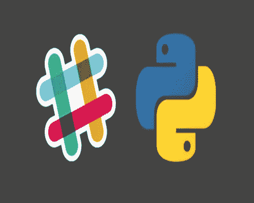
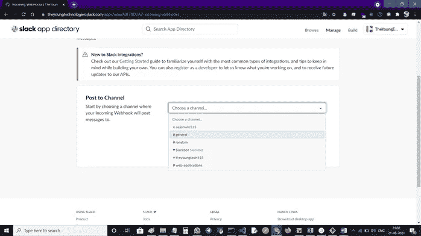
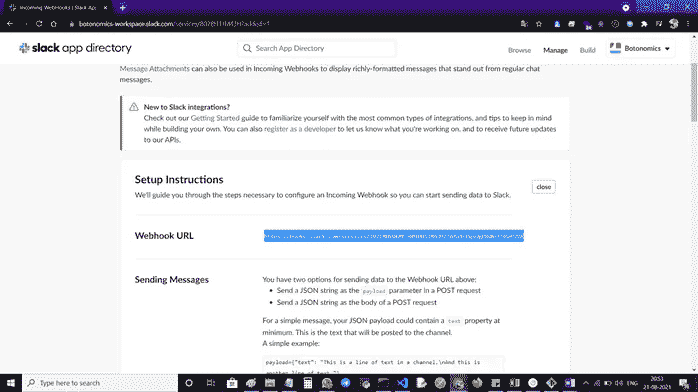
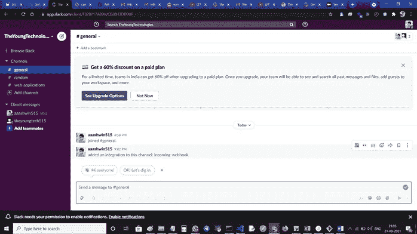
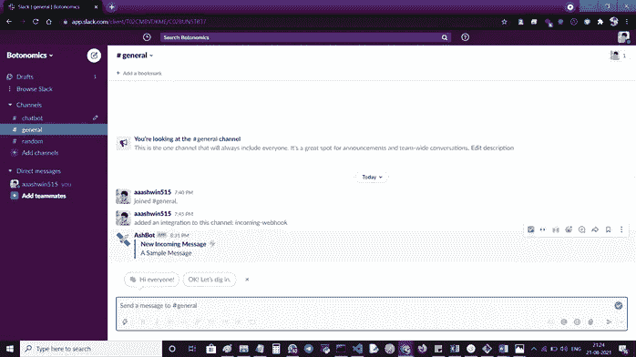

# 使用 Python 通过 Webhooks 进行松散的自动消息传递

> 原文：<https://medium.com/nerd-for-tech/slack-automated-messaging-with-webhooks-using-python-7c7849e9a954?source=collection_archive---------3----------------------->

大家好，我希望一切都很好，今天我们将看到在 Slack 应用程序中使用 web hooks 和 python 编程语言的自动消息传递。我们潜水吧！



## 松弛的网钩

你可能已经在你的空闲设置中看到了一个 webhook 选项，并且不知道这是否是你应该使用的一个选项。牺牲 webhooks one 将从一个应用程序向不同的应用程序发送机器控制的消息(JSON 有效载荷)。这可以在响应特定事件时触发。创建一个传入的 Webhook 为您提供了一个新颖的通用资源定位器，您可以向它发送一个 JSON 有效负载，其中包含消息文本和一些选项。

## webhooks 入门

第一步:通过[点击这里](https://slack.com/get-started#/create)创建一个宽松的工作空间

第二步:进入**浏览 Slack** ，点击 **Apps +图标**，搜索 **incoming webhook，**点击**添加**


传入 webhook

步骤 3:从应用程序目录页面，将传入的 webhooks 添加到 slack


步骤 4:添加 webhooks 后，它将重定向到频道配置页面，在**选择您的频道**然后点击添加频道。



第五步:不要忘记复制的**网页挂钩网址**



步骤 6:之后，我们松弛通道看起来像这样，



第 7 步:然后创建一个名为 app.py 的新 python 文件，你可以用你喜欢的文件名命名它。py 扩展

第八步:

> 先决条件:安装请求模块
> 
> Pip 安装请求

```
import jsonimport sysimport randomimport requestsif __name__ == ‘__main__’: url = “<Webhook URL>”
     message = (“A Sample message by bot”)
     title = (f”New Incoming Message :zap:”)
     slack_data = {
    “username”: “AshBot”,
    “icon_emoji”: “:satellite:”,
    “channel” : “general”,
    “attachments”: [
    {
      “color”: “#9737EE”,
      “fields”: [
      {
       “title”: title,
       “value”: message,
       “short”: “false”,
       }
      ]}
      ]}
    byte_length = str(sys.getsizeof(slack_data))
    headers = {‘Content-Type’: “application/json”, ‘Content-Length’:     byte_length}
    response = requests.post(url, data=json.dumps(slack_data),    headers=headers)
   if response.status_code != 200:
       raise Exception(response.status_code, response.text)
```

第 9 步:最后，我们的通道将从我们的源文件中获得一条消息



谢谢大家！