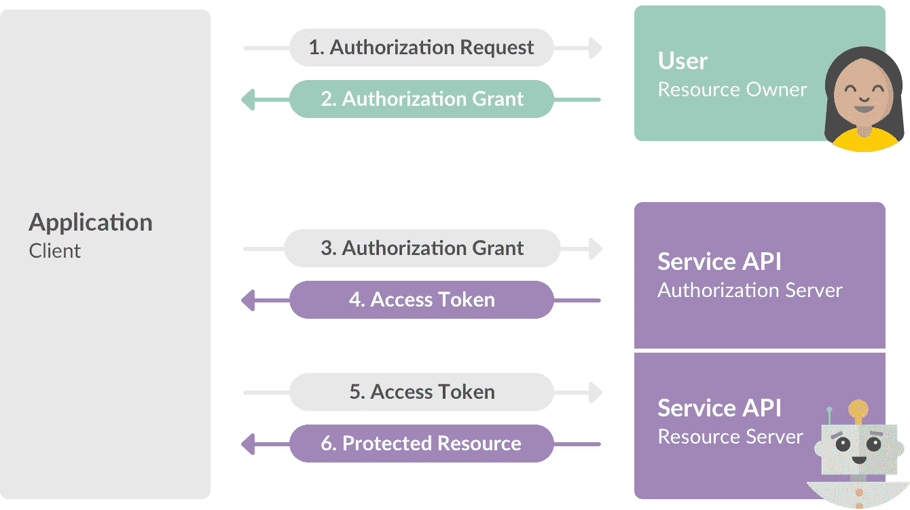
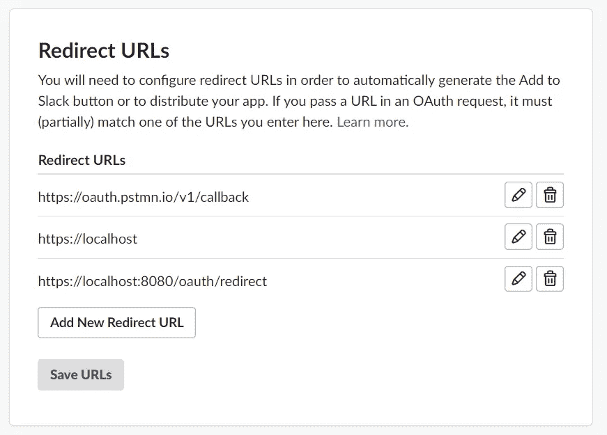
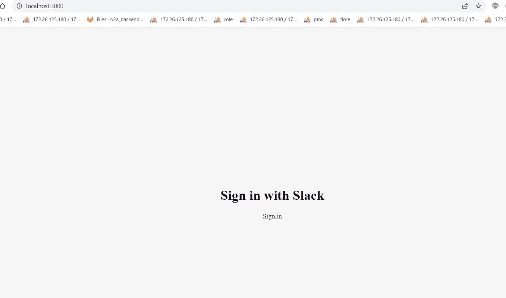
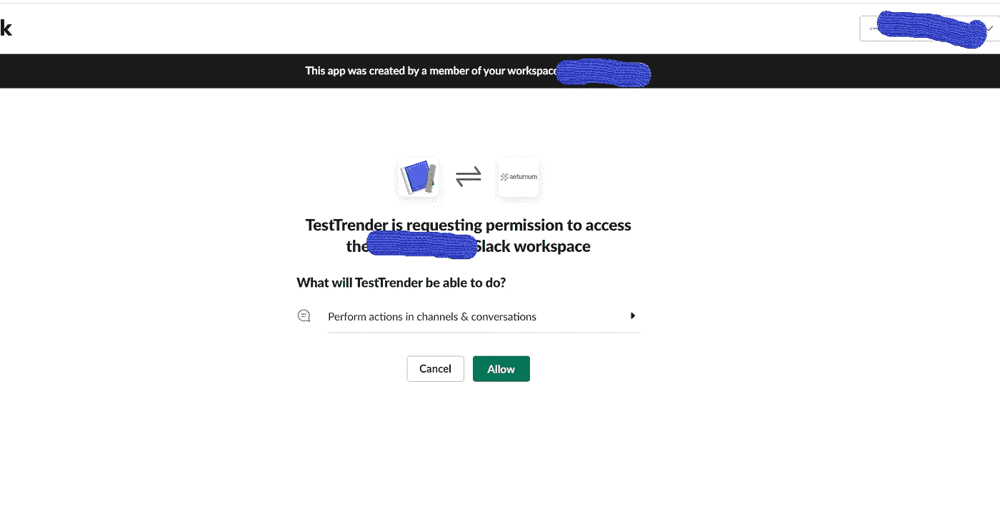

# Slack 集成和在 Node.js 中使用 OAuth2 发布聊天消息

> 原文：<https://medium.com/nerd-for-tech/slack-integration-and-posting-chat-messages-using-oauth2-in-node-js-758af767330f?source=collection_archive---------1----------------------->



OAuth 2.0 是一种协议，允许您的应用程序请求授权来访问用户 Slack 帐户中的私人详细信息，而无需获得他们的密码。

通常，OAuth 2.0 最常用的流程分为三个主要步骤:

1.  应用程序为第三方授权应用程序弹出一个新窗口，要求用户(必须拥有帐户并登录系统)授予您的应用程序权限，然后能够代表他/她采取行动。
2.  经过正确的身份验证和授权后，第三方应用程序会确认权限，并通过预先配置的 URL 将用户重定向到您的应用程序。
3.  您的应用程序为此类回调操作公开一个端点。它访问第三方提供者 API，根据前面重定向过程返回的响应代码请求一个访问令牌。

**环境设置**

对于本文，我将使用 [Node.js](https://nodejs.org/en/) 和 [npm](https://www.npmjs.com/) 作为默认的包管理器。这里我将创建两个不同的应用程序，一个用于客户端(在 React 中),另一个用于服务器功能。

**松弛应用配置**

这里我们使用了 [Slack OAuth2 API](https://api.slack.com/) ，它允许您在自己的帐户下创建一个应用程序，并为您提供一些 OAuth2 客户端凭据，以便在其他应用程序中使用。

这样，您可以轻松地允许应用程序的用户通过他们的 Slack 帐户登录。

所以，让我们通过点击这个[链接](https://api.slack.com/apps?new_app)来创建一个新的应用程序。确保在所有字段中填写应用程序名称和用于开发应用程序的工作空间。

然后进入基本信息部分。您将找到带有客户端 ID 和客户端密码的应用程序凭据。接下来，转到 OAuth & Permissions 并添加重定向 URL。授权回调 URL 是最重要的字段，因为它界定了一旦授权过程完成，Slack 应该将用户重定向到哪里。

您可以在这里输入任何您喜欢的 URL，如下图所示。



然后，您需要添加范围来指示您的应用程序可以访问的内容。

在这里的 bot 令牌作用域中，我添加了如下所示的权限。

[频道:历史](https://api.slack.com/scopes/channels:history)-查看已添加应用的公共频道中的消息和其他内容

[频道:管理](https://api.slack.com/scopes/channels:manage)-管理已添加应用的公共频道，并创建新频道

[聊天:写](https://api.slack.com/scopes/chat:write)-以 TestApp 的身份发送消息

[群组:编写](https://api.slack.com/scopes/groups:write)-管理已添加应用的私人频道并创建新频道

[即时消息:编写](https://api.slack.com/scopes/im:write)-开始与人直接通信

[mpim:编写](https://api.slack.com/scopes/mpim:write)-开始与人群发直接消息

**服务器项目**

让我们回到项目创建。选择一个文件夹并运行以下命令:

```
mkdir oauth2-node-server
cd oauth2-node-server
npm init
```

同样，把所有的选项留到最后。然后，运行以下命令安装所需的 NPM 依赖项:

```
npm install axios express cors
```

*Axios* 将用于向 Slack OAuth2 服务器发出 HTTP 请求调用。 *Express* 将是我们的服务器版本， *cors* 只是为了避免与浏览器的*同源*策略冲突。

服务器的代码非常简单，可以在下面的代码中找到。确保将其添加到名为 *index.js* 的文件中:

这里，从`*/oauth/redirect*` 端点您将获得一个有效的访问令牌，然后我们可以将响应及其所有内容重定向到监听端口 3000 的 React 客户端应用程序。

在进入下一部分之前，通过运行以下命令确保一切正常:

```
node index.js
```

这又会产生如下所示的输出:

```
➜ Listening at port 8080
```

**客户项目**

离开当前服务器文件夹，运行以下命令创建客户端项目:

```
npx create-react-app oauth2-node-app
```

然后，运行以下命令添加所需的节点依赖关系:

```
npm install axios
```

然后用以下内容替换您的 *App.js* 文件内容:

**测试**

要测试客户端实现，您可以在客户端的根文件夹中运行以下命令:

```
npm start
```

在日志中查找错误，并等待 React 在您的 web 浏览器上加载应用程序。

在按钮中，您可能会看到带有*符号的以下屏幕。在点按它之前，请确保 server 应用程序和代理都已启动。*



点击*登录*按钮后，您将被重定向到 Slack 授权页面，如下图所示。



点击 *Authorize* 按钮，Slack 也会在重定向过程完成后处理它，您将获得一个访问 slack APIs 的访问令牌。因此，这个访问令牌称为承载令牌，我们可以使用这个令牌调用 API 方法来创建通道，并使用下面的 API 向通道发布消息，您可以在上面代码的服务器项目中看到这些 API。

1 .conversations.create API 创建通道

2 .chat.postMessageAPI 发布聊天消息。

感谢您的阅读！