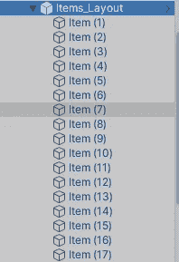
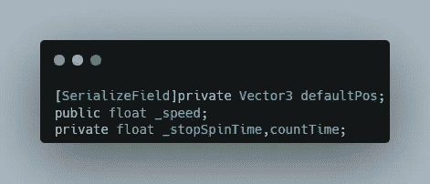
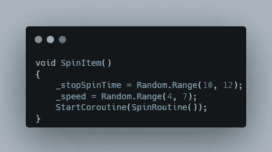
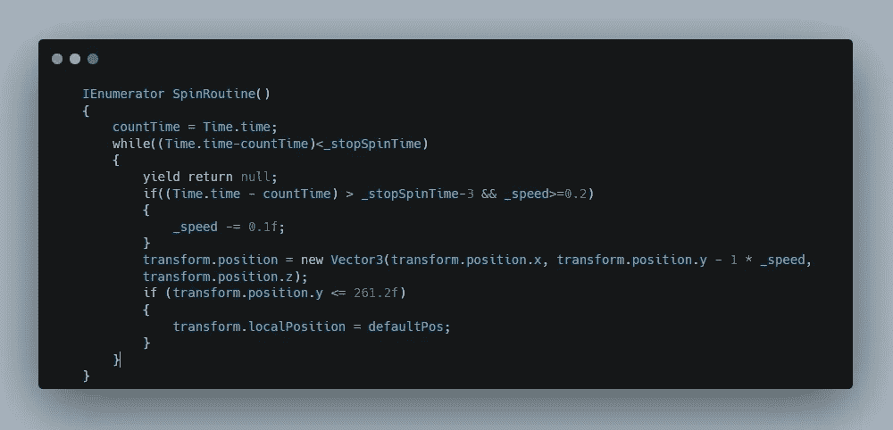
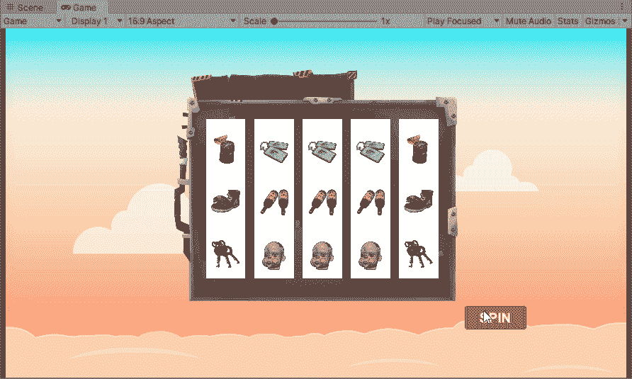

# 插槽轮换解决方案:1

> 原文：<https://medium.com/nerd-for-tech/slot-rotation-solution-1-fb6d70eb595d?source=collection_archive---------6----------------------->

**目的:**旋转老虎机

首先创建一组物品并把它放在一个空的游戏对象下。

然后将垂直布局组添加到空的游戏对象中，并添加一个行为脚本来旋转这些项目。

现在创建一个 Vector3 变量，它将存储项目组的默认位置(起始位置)。然后创建一个速度变量来定义项目的旋转速度。然后创建一个浮点变量，存储当前时间和目标时间，然后停止旋转。

现在在 start 内部，将默认位置定义为布局组的本地位置。

现在定义一个方法，按钮或事件将使用该方法来开始旋转。在这里，我们定义了旋转的速度，也定义了在停止之前旋转的秒数，然后调用 Ienumerator 函数来处理旋转循环。

最后，在 Ienumerator 函数中，我们使用 While 循环来检查时间，并在时间达到目标秒数后停止。达到一定的秒数后，我们减慢旋转的速度。然后，我们向下移动布局组，直到它到达某个位置，布局组跳回到它的默认位置，并继续向下移动。

这是最终的结果。