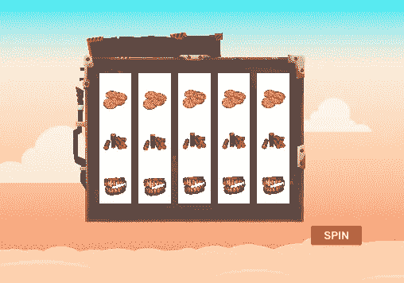
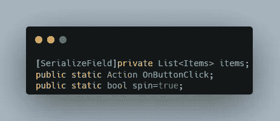
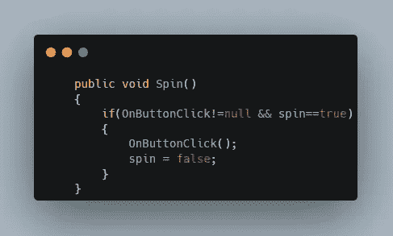
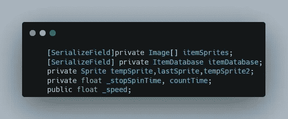
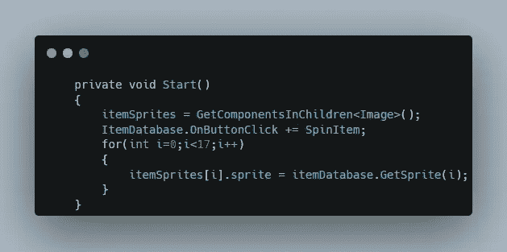
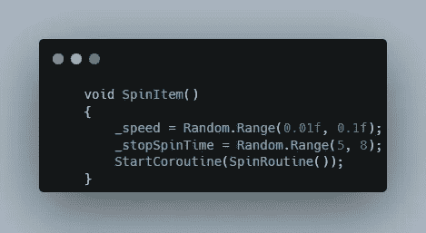
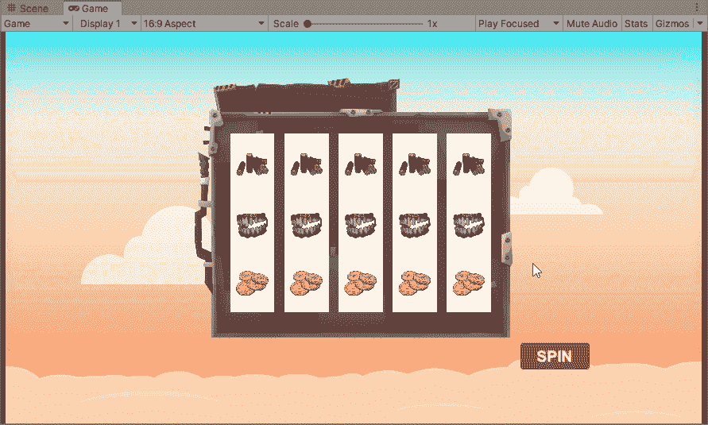

# 插槽轮换解决方案:2

> 原文：<https://medium.com/nerd-for-tech/slot-rotation-solution-2-1dcaf3d5b1bb?source=collection_archive---------8----------------------->

**目的:**旋转老虎机

首先，创建一个 item 类来存储一个项目包含的所有值。这里，它包含一个精灵和一个值。

创建另一个脚本并定义项目列表。然后在 ButtonClick 上创建一个动作事件，该事件将向事件的所有订阅者发送一个信号，最后创建一个 bool 变量，该变量仅在当前旋转停止时允许旋转。

这里，当调用 spin 方法并且 Spin 为 true 时发送一个信号。此方法连接到微调按钮。

然后创建一个公共方法，当 int 值通过参数传递时，该方法从项目列表中返回一个项目 sprite。

现在定义一个变量数组来存储布局组上的所有图像，然后创建一个对存储项目列表的 ItemDatabase 脚本的引用。

创建三个 sprite 变量来存储 sprite 变化期间的 sprite。然后为时间和速度创建浮点变量。

现在在 Start 中，列出 itemSprites 数组中的所有子图像，并将 spinItem 方法作为订阅者添加到 OnButtonClick 事件中。

然后调用 GetSprite 方法，该方法将在 I 位置返回一个 Sprite 并将其存储在 image sprite 中。

现在创建一个订阅事件的方法，并在其中设置旋转速度和旋转时间。然后调用 Ienumerator 函数，该函数将开始旋转。

然后在 Ienumerator 中，检查旋转时间是否剩余，然后创建一个条件将值添加到速度变量中，这将增加下一次循环之前的等待时间。

然后将最后一个 sprite 存储在一个变量中，并将它赋给 temp，后者将把它赋给数组中的第一个图像。在 ItemImage 中循环，同时将当前图像的 sprite 更改为前一个图像，并在继续下一个 while 循环之前等待 speed time。

最后，将 ItemDatabase 中的 Spin bool 设置为 true，并允许按钮开始下一次旋转。

这是最终的结果。