# 插槽轮换解决方案:3

> 原文：<https://medium.com/nerd-for-tech/slot-rotation-solution-3-ee09f8429d73?source=collection_archive---------4----------------------->

**目的:**旋转老虎机

首先，创建一个 item 类来存储一个项目包含的所有值。这里，它包含一个精灵和一个值。

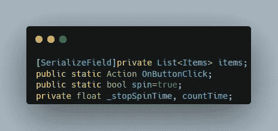

创建另一个脚本并定义项目列表。然后在 ButtonClick 上创建一个动作事件，该事件将向事件的所有订阅者发送一个信号，最后创建一个 bool 变量，该变量仅在当前旋转停止时允许旋转。然后创建两个浮点变量来比较时间。

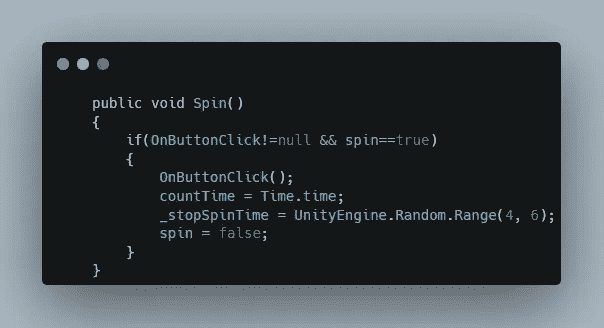

这里，当调用 spin 方法并且 Spin 为 true 时，向订阅者发送一个信号。此方法连接到微调按钮。还存储当前时间并创建停止时间值。

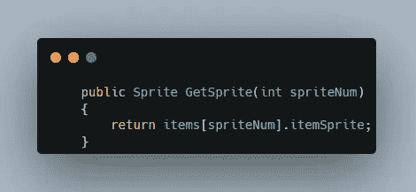

然后创建一个公共方法，当 int 值通过参数传递时，该方法从项目列表中返回一个项目 sprite。

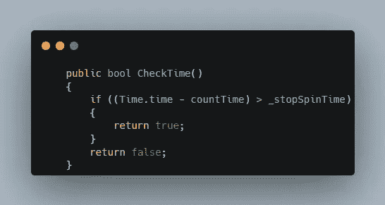

创建一个当当前时间到达停止时间时返回 bool 的方法。

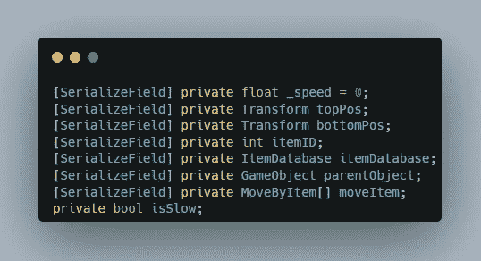

为速度创建一个浮点变量，然后转换位置变量，以便在物品到达底部时存储目的地的位置。给这些项目一个 Id 来定义它们精灵。然后为 ItemDatabase 脚本创建一个引用变量，并为单个卷轴中的项目的子对象创建一个 gameobject 变量。最后是一个布尔变量，允许最后的慢速旋转。

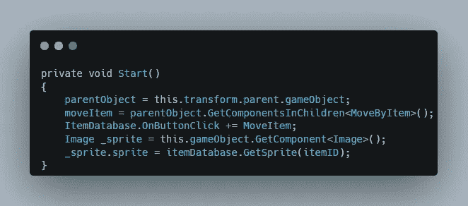

然后在 start 内部，将父对象赋给变量，并将它的子对象的所有脚本组件(items)列给数组。

现在将 MoveItem 方法作为订阅者添加到 OnButtonClick 事件中，最后根据条目 Id 将 sprite 分配给条目。

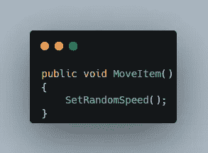

当该方法接收到信号时，将旋转速度设置为随机。

然后将同一父对象中所有项目的速度设置为相同的随机速度。

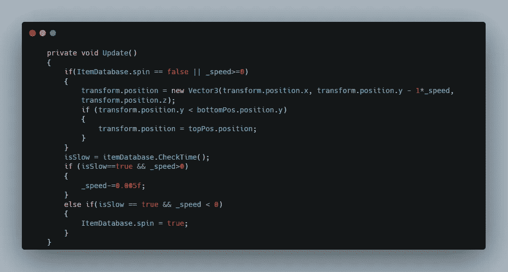

现在创建一个当按钮被按下时卷轴旋转的行为，当项目位置到达底部位置时，将位置更改为顶部。

然后当脱水时间结束时，减慢脱水速度，并在速度低于 0 后停止脱水。

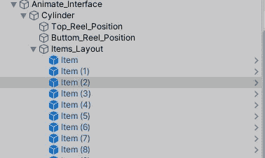

这就是等级制度。

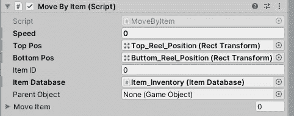

这是与项目相关的脚本。

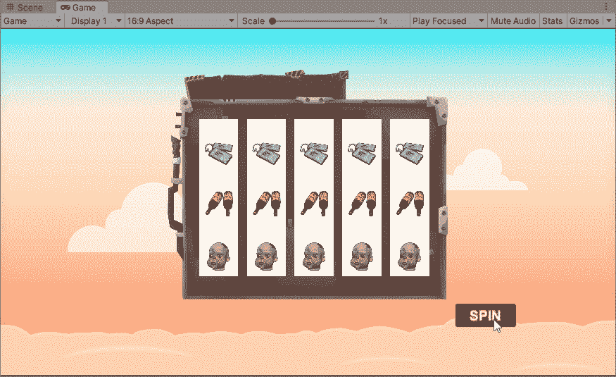

这是最终的结果。