# 智能人工智能与导航网格-游戏开发系列 67

> 原文：<https://medium.com/nerd-for-tech/smart-ai-with-nav-mesh-game-dev-series-67-804a506977ad?source=collection_archive---------22----------------------->

导航网和导航网代理快速指南。

在[之前的文章](https://sj-jason-liu.medium.com/point-and-click-and-move-game-dev-series-66-b1e34f396da6)中我们已经略微介绍了关于导航网格代理来控制播放器。现在我们将进一步了解 Nav Mesh 代理并调整它的值。

为了演示它是如何工作的，我创建了这个简单的场景。

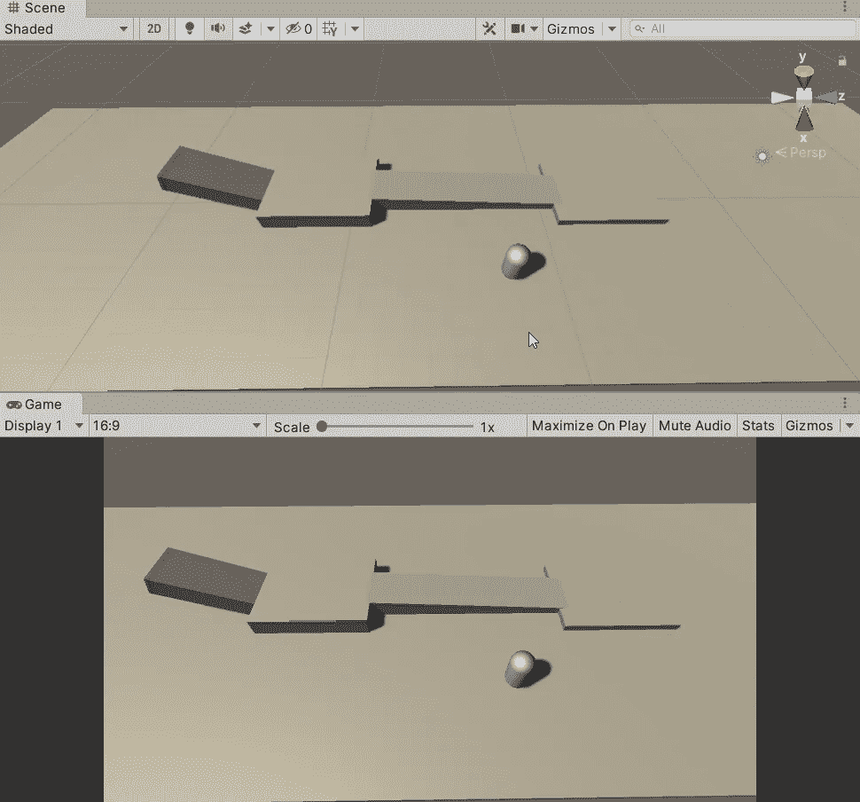

## 烘烤道路

正如我们在上一篇文章中所做的，我们需要在控制播放器之前烘焙导航标签。但是，在这个场景中，单击“烘焙”按钮后，它会显示如下:

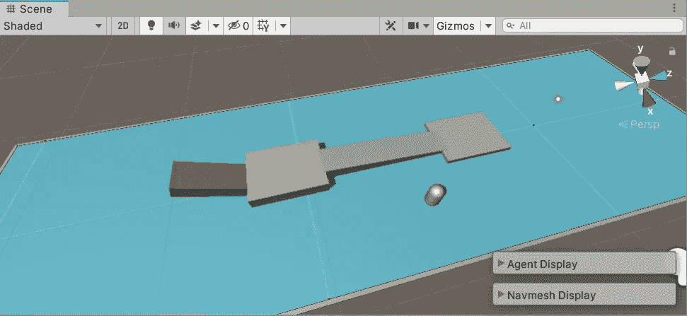

主楼层的蓝色步行区。人工智能无法将这些物体识别为可行走的原因是因为它们不是**静态**物体。

选择所有对象，点击**检查器**中的**静态**。

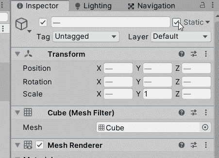

然后我们可以在导航中再烤一次，现在应该可以走了。

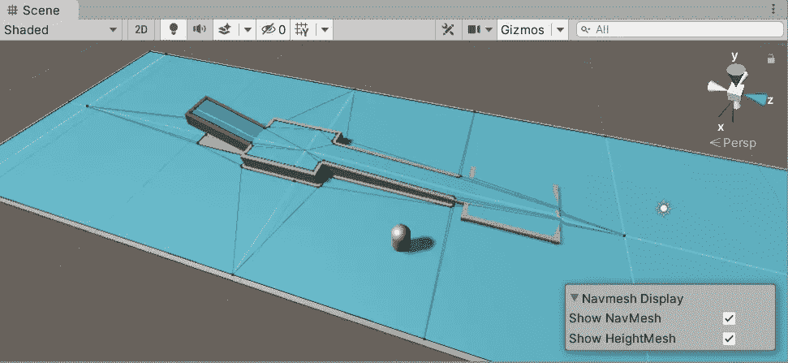

## 烘烤剂尺寸的设定

在导航的烘焙选项卡中，您应该会看到名为烘焙代理大小的区域。这些值可以将可行走区域设置为导航网格代理。让我们来看看:

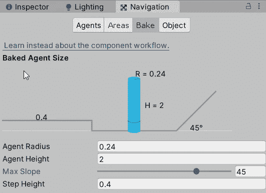

*   **代理半径**:决定代理可行走的大小。你可以把它想象成体型，智能体越瘦，它能走过的空间就越大。

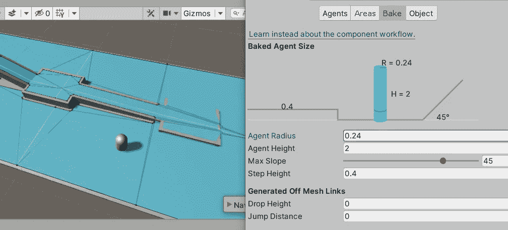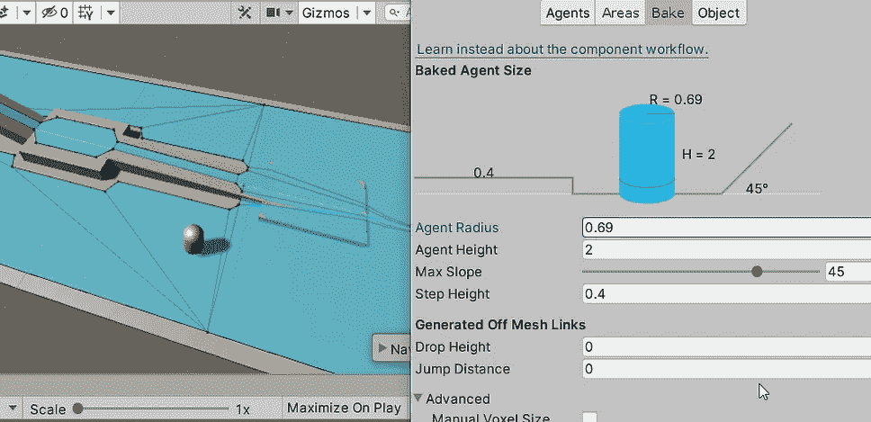

*   **代理高度**:将代理移动限制在某个高度限制区域。
*   **最大坡度**:相对于代理的最大可行走角度。

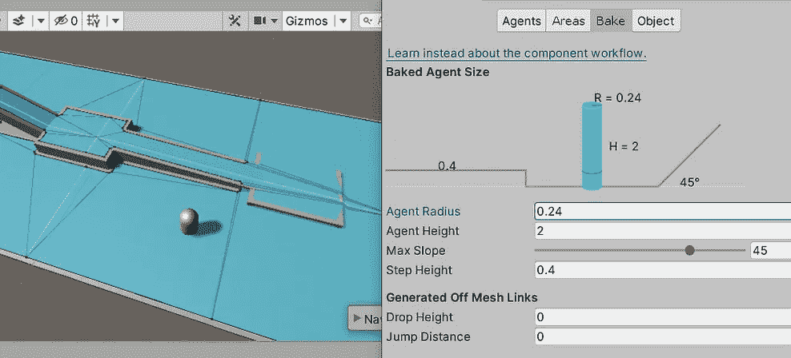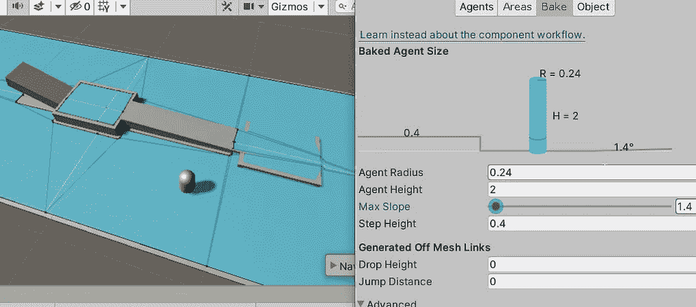

*   **台阶高度**:代理可以走过的高度差。

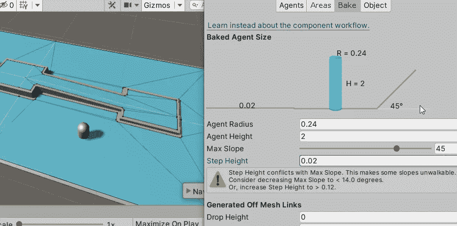

## 代理的设置

现在让我们在检查器中检查导航网格代理设置。

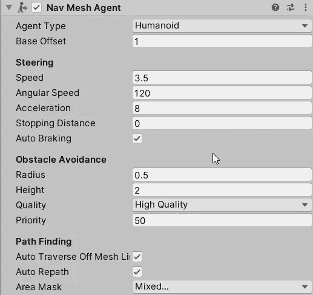

*   **代理类型**:可以在导航页签中设置运动类型，在导航网格代理中选择并分配给它。

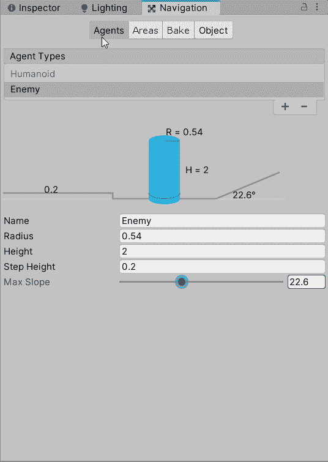

*   **转向**:与代理的运动相关的一切。这里我要提到一些特殊的可调值。
    *角速度* -旋转速度。
    *停止距离* -可以设定代理在到达目的地之前停止。
    *自动制动* -防止越过目的地。

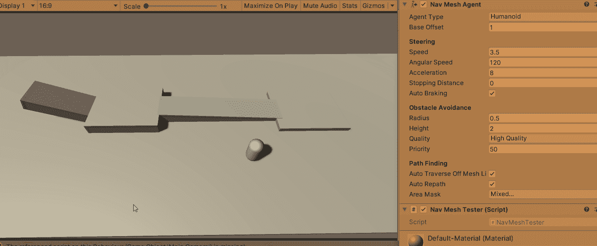

调节转向值的演示

*   **避障**:导航中熟悉的设置。基本上代理的高度和半径限制。

这就是本文的全部内容。我们以后会挖掘更多关于 Unity 的 AI！

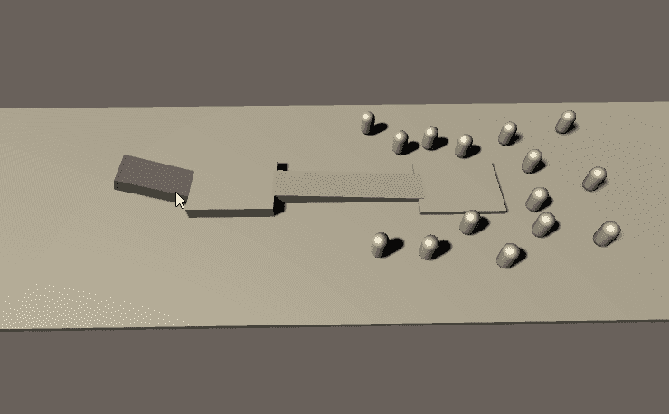