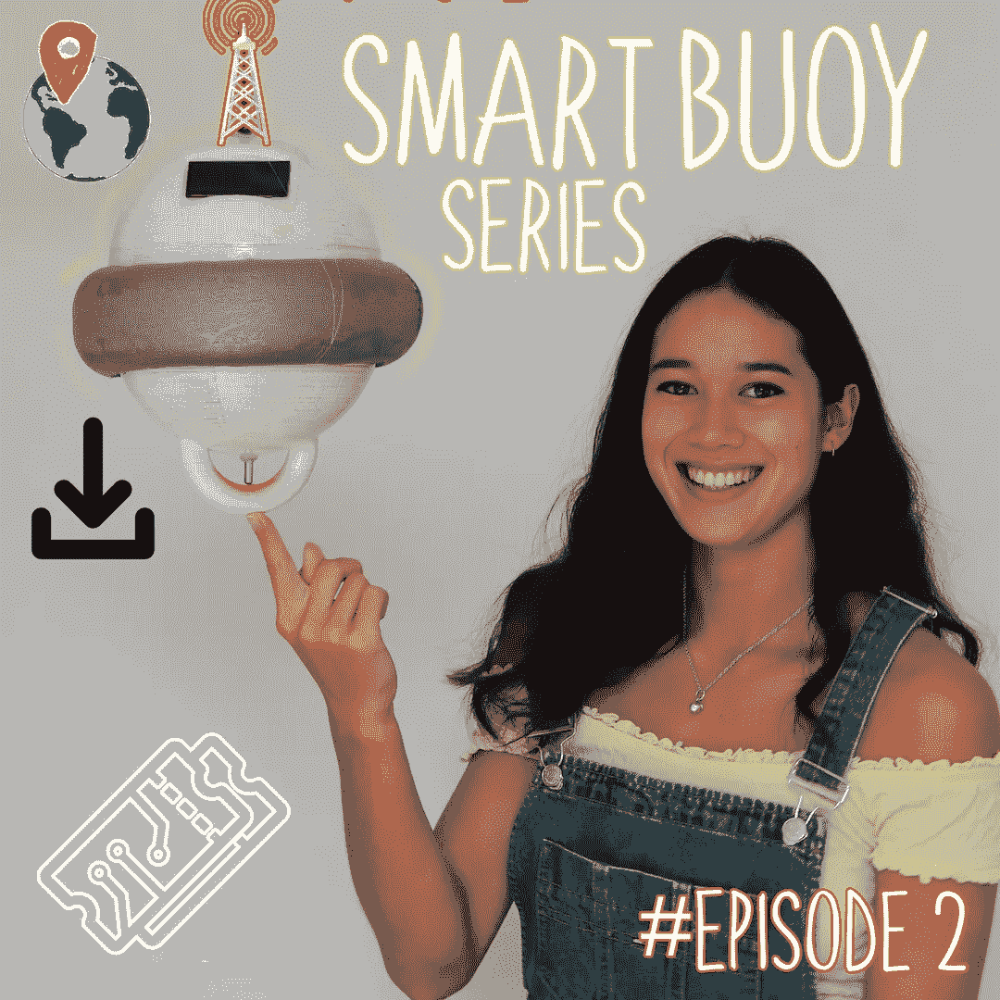
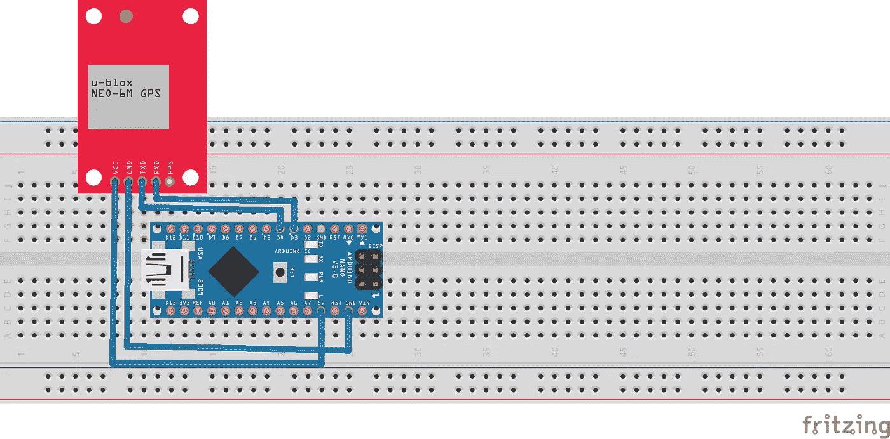
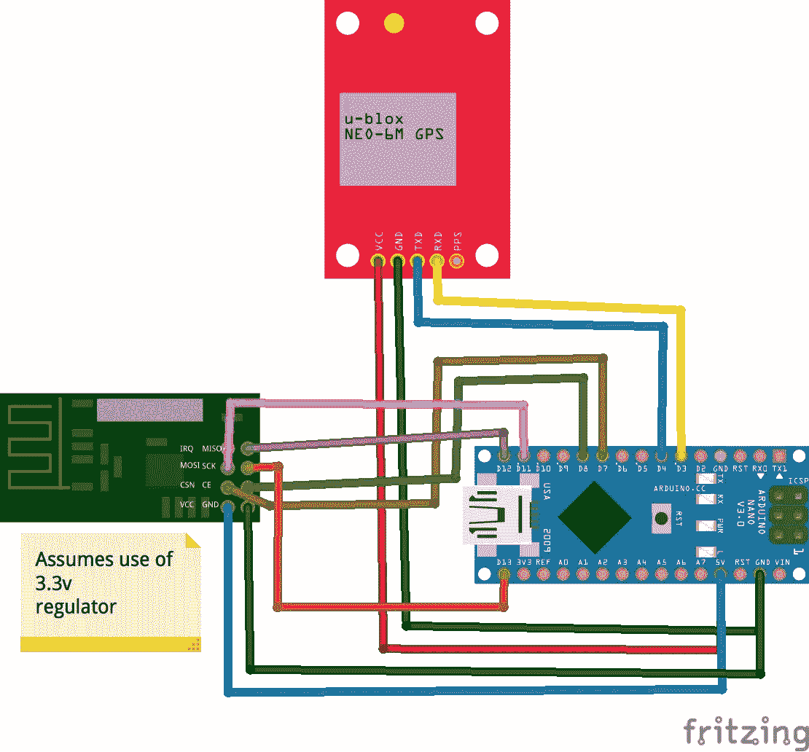
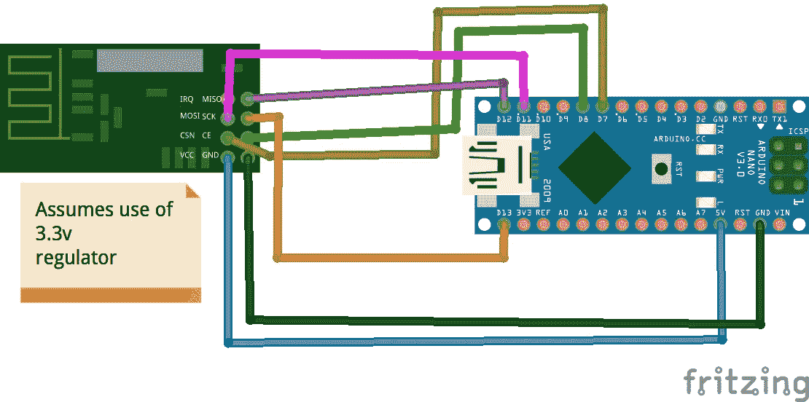
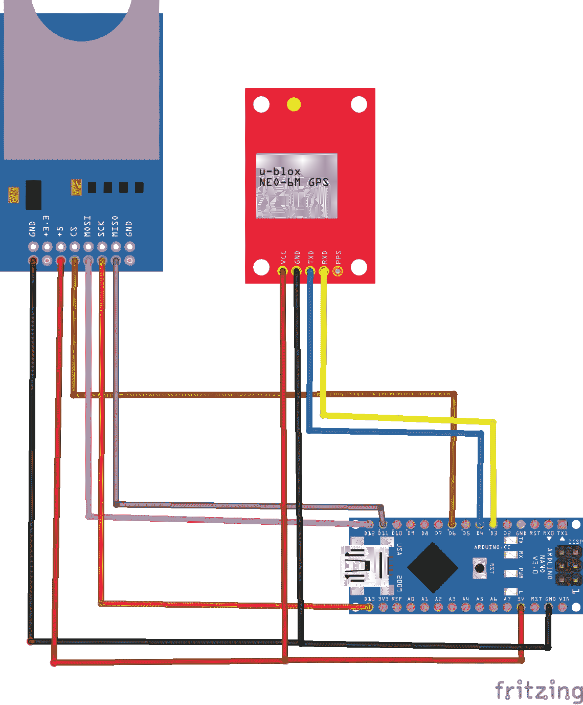
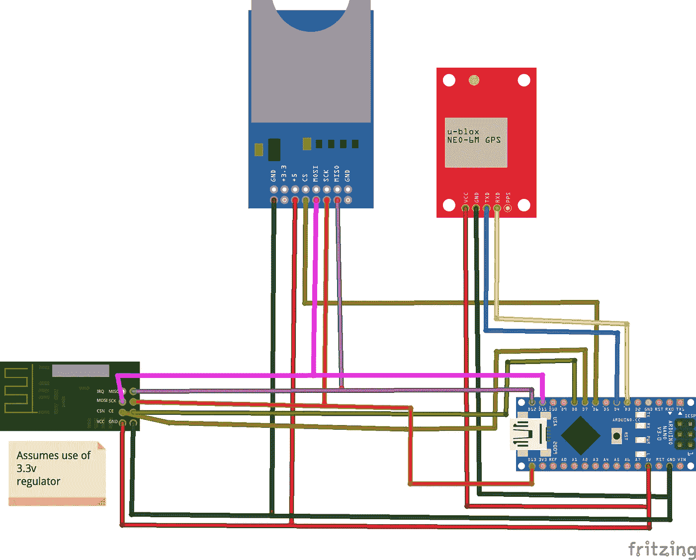

# 智能浮标— GPS、无线电(NRF24)和 SD 卡模块📍📡💾

> 原文：<https://medium.com/nerd-for-tech/smart-buoy-gps-radio-nrf24-and-a-sd-card-module-6029af3a69d?source=collection_archive---------9----------------------->

这个智能浮标系列展示了我们(雄心勃勃的)构建科学浮标的尝试，该浮标可以使用现成的产品对海洋进行有意义的测量。这是四个教程中的第二个——确保你是最新的，如果你需要项目的快速介绍，[查看我们的摘要](https://t3chflicks.medium.com/smart-buoy-summary-602f9db544bb)。
[**第一部分**:造波和温度测量](https://t3chflicks.medium.com/smart-buoy-making-wave-and-temperature-measurements-%EF%B8%8F-cdda14c52196)

在本教程中，我们将向您展示如何获取 GPS 数据，将其存储在 SD 卡上，并使用无线电将其发送到某个地方。

我们这样做是为了跟踪海上浮标的位置。无线电意味着我们可以远程观看它，SD 卡意味着万一有什么东西坏了，它出去游荡，我们可以下载它在计划外旅行期间收集的数据——如果我们能够找回它的话！

# 供应

*   GPS 模块— [亚马逊](https://amzn.to/2jHgwJ2)
*   SD 卡模块— [亚马逊](https://amzn.to/2SPbZBK)
*   SD 卡— [亚马逊](https://amzn.to/2SRhyiX)
*   2 个无线电模块(NRF24L01+) — [亚马逊](https://amzn.to/2l6Fq5t)
*   2 个 Arduino — [亚马逊](https://amzn.to/2jJN7xR)

> [🔗在 Github 上获取智能浮标代码📔](https://github.com/sk-t3ch/smart-buoy)

# 辅导的🤖

## 获取 GPS 数据

智能浮标在海中进行传感器测量，包括 GPS 位置和日期时间。看看下面的原理图，它显示了我们如何设置电路。GPS 模块通过串行连接进行通信，因此我们使用 Arduino 软件串行库以及微型 GPS 库与其进行通信。这些库(我们都会很高兴听到)让一切变得超级简单。

## 通过无线电发送 GPS 数据

如果浮标在海上进行测量，可能会有这样的情况，我们希望在不弄湿我们的脚或把它带到岸上的情况下访问它的数据。为了进行远程测量，我们在通信双方使用了一个连接到 Arduino 的无线电模块。将来，我们希望用一个 raspberry pi 来取代接收端的 Arduino。无线电与这两种接口的工作方式相似，因此交换它们非常简单。

无线电模块使用 SPI 进行通信，这比 I2C 需要更多的连接，但由于 NRF24 库，仍然非常容易使用。使用 GPS 模块进行传感器测量，我们将其数据从一个 Arduino 传输到另一个 Arduino。我们将 GPS 和无线电模块连接到 Arduino，另一端是带无线电模块的 Arduino——请看原理图。

# **发射器**

# **接收器**

## 使用 SD 卡模块存储数据

虽然无线电模块相当可靠，但我们认为最好有一个内置的应急措施，以防接收器端断电或模块移出范围。我们的应急计划是一个 SD 卡模块，允许我们存储收集的数据。收集的数据量不是很大，所以即使是一个小的 SD 卡也可以轻松存储一天的数据。

可悲的是，我们的 SD 卡有很大的问题。它就是行不通，给我们带来了很多痛苦，最后，我们放弃了它。这意味着我们没有应急计划…啊，最好的计划…

## 发送和存储 GPS 数据

为了发送和存储数据，我们有多个 [SPI](https://en.wikipedia.org/wiki/Serial_Peripheral_Interface) 设备试图与 Arduino 通信。SPI 协议允许多个器件共享相同的 MISO、MOSI 和 SCK 连接，并利用每个器件的 ChipSelect (CS)连接选择特定器件。在大多数 Arduino 库中，这通常对用户是隐藏的。

以下代码和电路允许您进行 GPS 测量，并将其保存到 SD 卡，同时通过无线电模块发送到另一个 Arudino。

**发射器**

# 感谢阅读

感谢阅读本教程，这是我们的智能浮标建设的第二步。查看我们的下一个教程，看看我们如何使用太阳能电池板、18650 电池和 RTC 模块定时电路为系统安排电源。

[**第一部分**:进行波浪和温度测量](https://t3chflicks.medium.com/smart-buoy-making-wave-and-temperature-measurements-%EF%B8%8F-cdda14c52196)
[**第二部分** : GPS、无线电(NRF24)和 SD 卡模块](https://t3chflicks.medium.com/smart-buoy-gps-radio-nrf24-and-a-sd-card-module-6029af3a69d)
[**第三部分**:调度浮标电源](https://t3chflicks.medium.com/smart-buoy-scheduling-power-to-the-system-81a2675fdac0)
[**第四部分**:防水、仪表盘和展开！](https://t3chflicks.medium.com/smart-buoy-waterproofing-dashboards-and-deploy-15c730bf9a3a)

我们希望你喜欢这篇文章。如果你喜欢这种风格，可以去看看[T3chFlicks.org](https://t3chflicks.org/)了解更多以科技为重点的教育内容，以及我们在[YouTube](https://www.youtube.com/channel/UC0eSD-tdiJMI5GQTkMmZ-6w)([insta gram](https://www.instagram.com/t3chflicks/)、[脸书](https://www.facebook.com/t3chflicks)、 [Twitter](https://twitter.com/t3chflicks) )上做的所有有趣的事情。