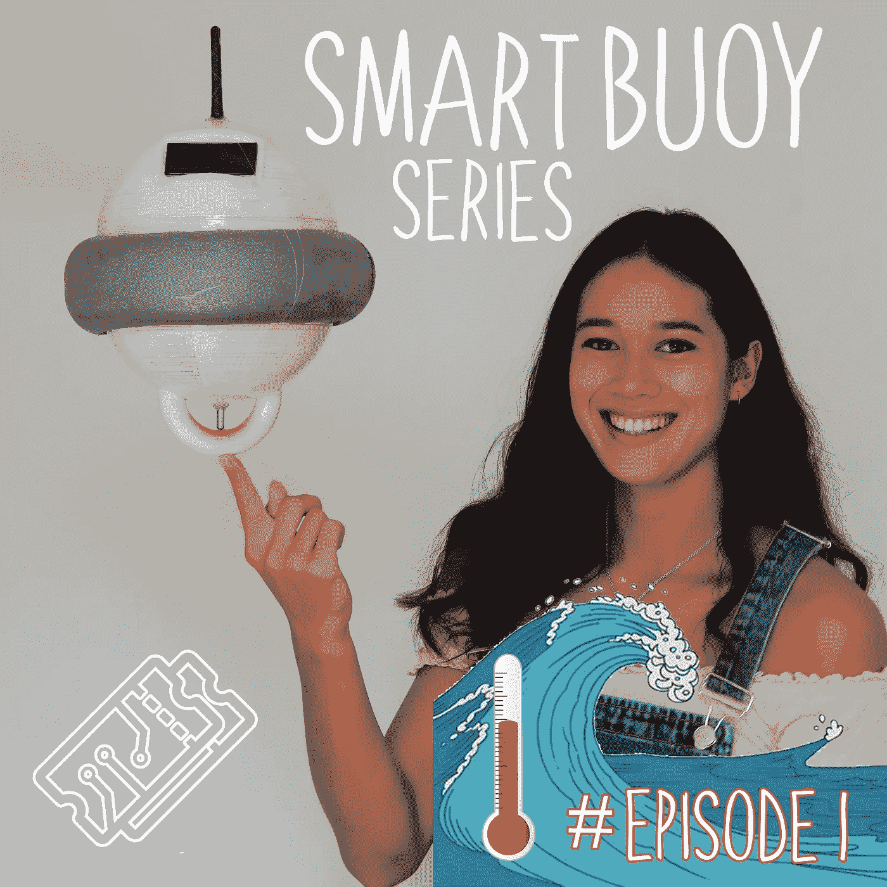
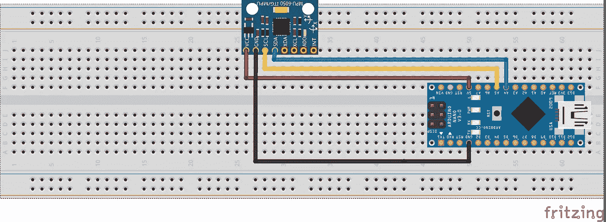
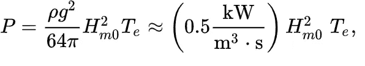
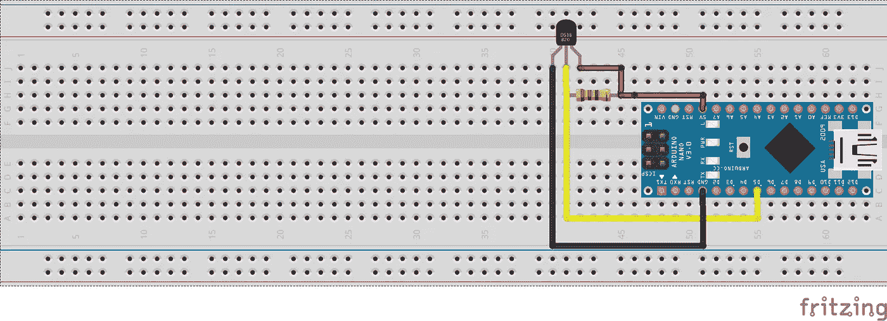

# 智能浮标——进行波浪和温度测量🌊🌡️

> 原文：<https://medium.com/nerd-for-tech/smart-buoy-making-wave-and-temperature-measurements-%EF%B8%8F-cdda14c52196?source=collection_archive---------11----------------------->

这个智能浮标系列展示了我们(雄心勃勃的)构建科学浮标的尝试，该浮标可以使用现成的产品对海洋进行有意义的测量。这是四个教程之一。如果你需要一个项目的快速介绍，[查看我们的摘要](https://t3chflicks.medium.com/smart-buoy-summary-602f9db544bb)。

在本教程中，我们将向您展示我们如何在智能浮标上进行波浪和温度测量。

# 供应

*   Arduino Nano — [亚马逊](https://amzn.to/2jJN7xR)
*   GY-86(加速度计、陀螺仪、气压计、指南针)——[亚马逊](https://amzn.to/2ld5bB3)
*   水温传感器— [亚马逊](https://amzn.to/2lbTASO)

> [🔗在 Github 上获取智能浮标代码📔](https://github.com/sk-t3ch/smart-buoy)

# 辅导的🤖

## 加速度计和陀螺仪

浮标上的主要传感器是 GY-86，其中包含 MPU6050 加速计陀螺仪、HMC5883L 磁力计和 MS5611 气压计。这些传感器使我们能够测量气温、波高、波周期和波能(以及波的方向，如果有人足够聪明来帮助我们计算的话)。

GY-86 通过 i2C 通信—参见原理图。这是我们用来获取加速度计和陀螺仪读数的代码。

## 磁力计(罗盘)

GY-86 包含一个我们用作指南针的磁力计。你不需要改变任何连接——哇！下面是获取罗盘值的代码。

请记住使用特定于您所在位置的偏角值，否则您的结果可能会不准确。

## 气压计和温度

以下是如何从 MS5611 气压计中获取数值。

## [粗略]波高

一旦所有这些传感器都设置好了，你就可以用它们来测量波浪的特性，从波高开始…

浮标的高度可以用气压来计算。我们使用浮标在一段时间内的相对高度来计算波浪高度，如下所示:

## [原油]波浪周期

接下来，浪期。我们使用了艾里波理论——一个可爱的基本波理论，它认为水面波可以被描述为正弦波。它很容易使用，因为它使数学更容易，但它当然是一种简化，并有一定的警告，包括它在浅水中不准确，波浪在那里转换和破碎。

使用我们的最大和最小相对高度之间的中点，并找出浮标穿过该点的频率，我们计算出我们将能够获得波浪周期的值。

## 波方向(救命！)

我们从未真正测量过海浪的方向。

然而，浮标上的传感器应该能够做到这一点。通过减去重力的影响，用 GY-86 加速度计测量动态加速度是可能的。也可以得到这个加速度的方向。使用浮标加速度的方向，以及给定位置的罗盘值，应该允许您确定波浪方向。我们在下面的代码中尝试了一下。

> 如果有人能在这方面帮助我们，那将是令人惊奇的❤

## [原始]波浪能

定义波浪能的一种方法是使用这个友好的等式:

波浪发电— [来源](https://en.wikipedia.org/wiki/Wave_power)

使用我们的波浪周期和高度值，我们能够如下计算波浪能量:

## 水温

最后，我们希望能够测量水温。DS18B20 水温传感器从浮标底部伸入海中，Arduino 使用单线与其通信。

我们所做的唯一修改是在信号线上添加了一个上拉电阻，然后我们就可以像这样对它说话了:

> [🔗在 Github 上获取智能浮标代码📔](https://github.com/sk-t3ch/smart-buoy)

# 感谢阅读

感谢阅读本教程，这是我们建立智能浮标的第一步。准备好下一节教程吧！

[**第一部分**:造波和温度测量](https://t3chflicks.medium.com/smart-buoy-making-wave-and-temperature-measurements-%EF%B8%8F-cdda14c52196)
[**第二部分** : GPS、无线电(NRF24)和 SD 卡模块](https://t3chflicks.medium.com/smart-buoy-gps-radio-nrf24-and-a-sd-card-module-6029af3a69d)
[**第三部分**:调度浮标电源](https://t3chflicks.medium.com/smart-buoy-scheduling-power-to-the-system-81a2675fdac0)
[**第四部分**:防水、仪表盘和展开！](https://t3chflicks.medium.com/smart-buoy-waterproofing-dashboards-and-deploy-15c730bf9a3a)

我们希望你喜欢这篇文章。如果你喜欢这种风格，可以去看看[T3chFlicks.org](https://t3chflicks.org/)了解更多以科技为重点的教育内容，以及我们在[YouTube](https://www.youtube.com/channel/UC0eSD-tdiJMI5GQTkMmZ-6w)([insta gram](https://www.instagram.com/t3chflicks/)、[脸书](https://www.facebook.com/t3chflicks)、 [Twitter](https://twitter.com/t3chflicks) )上做的所有有趣的事情。