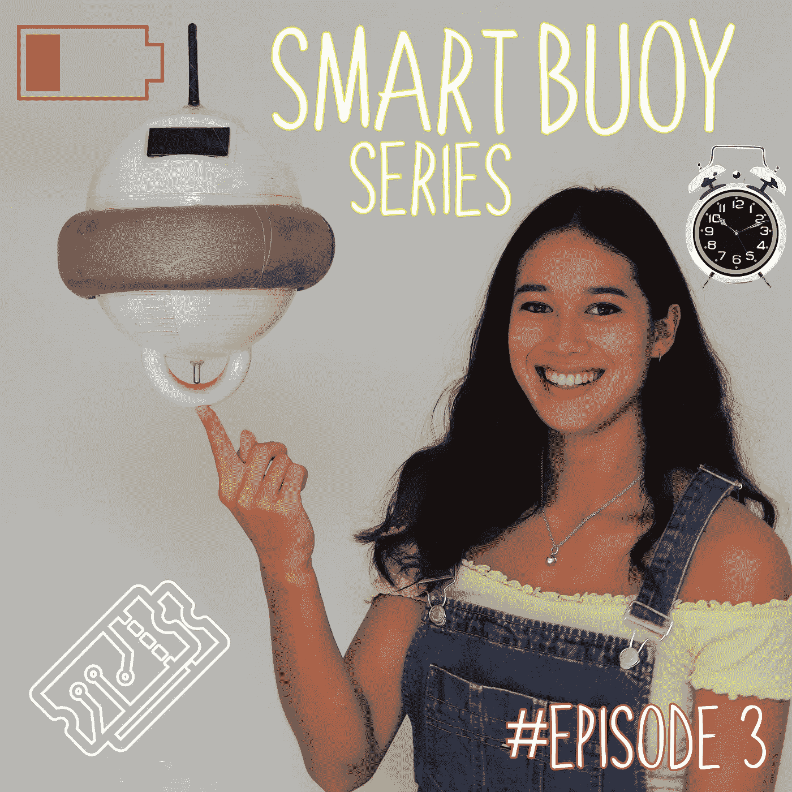
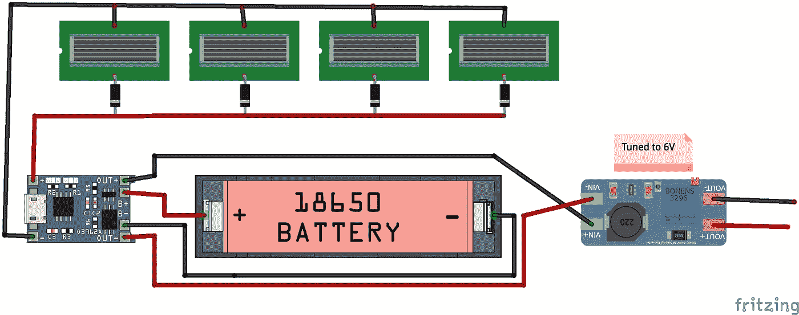
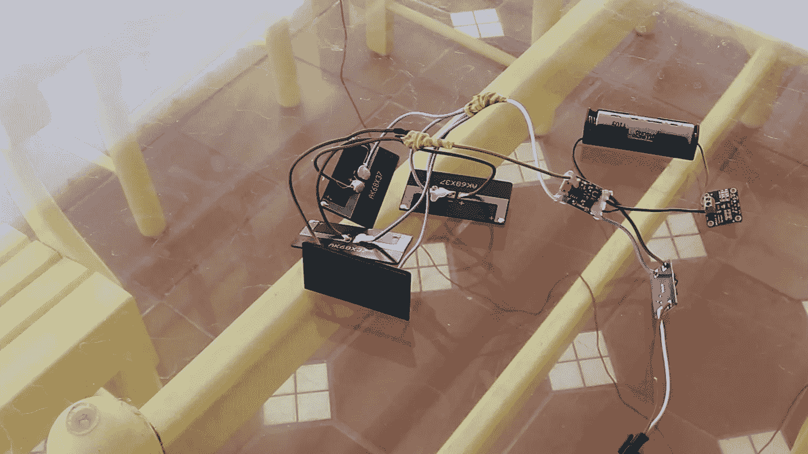
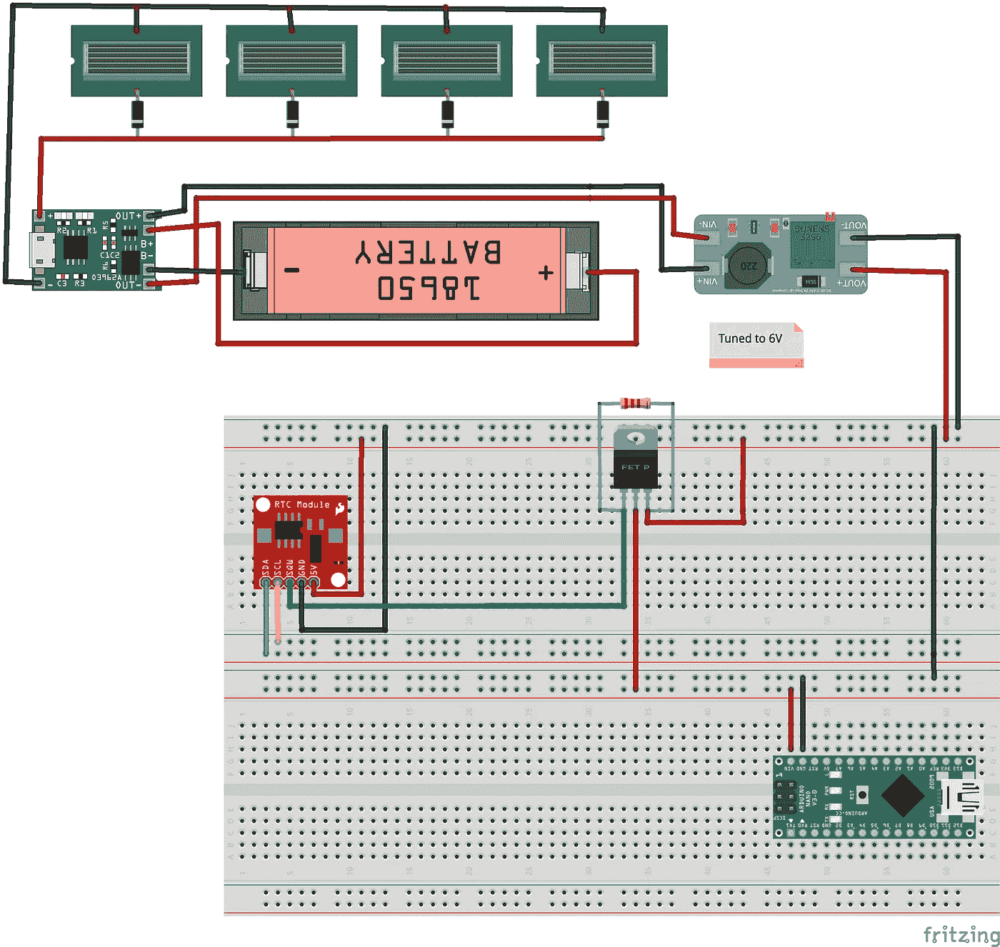
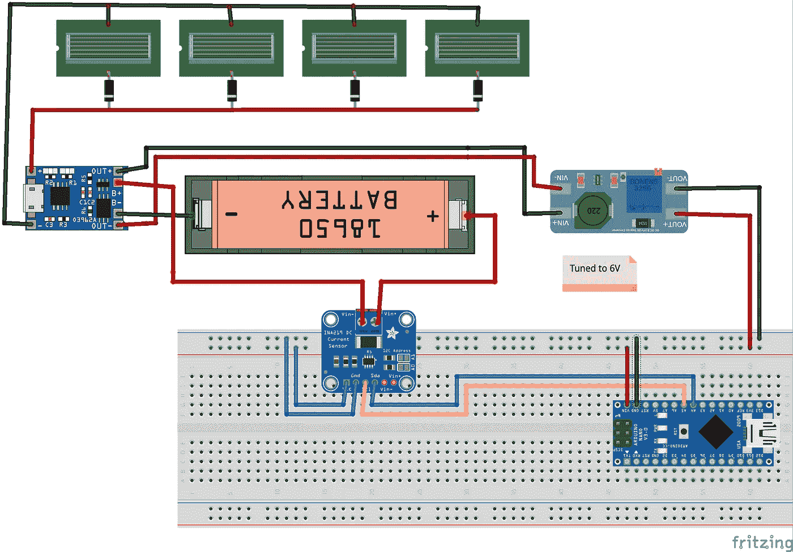
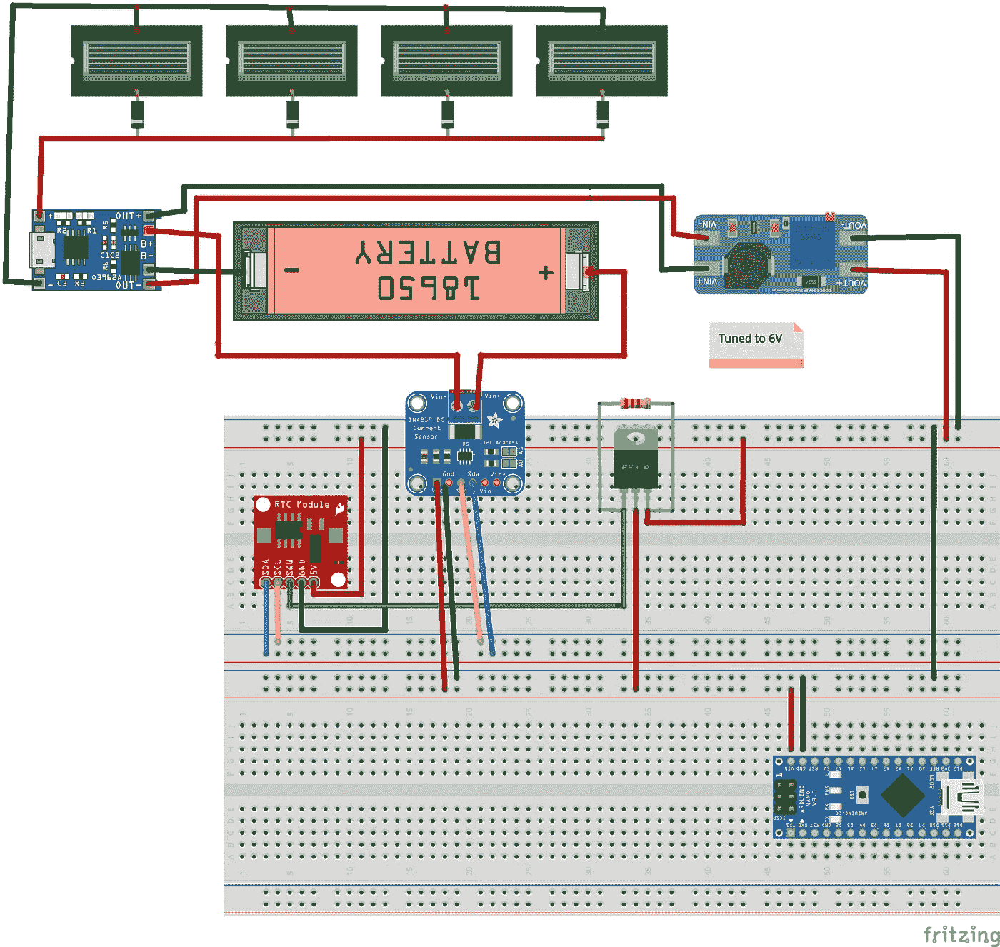
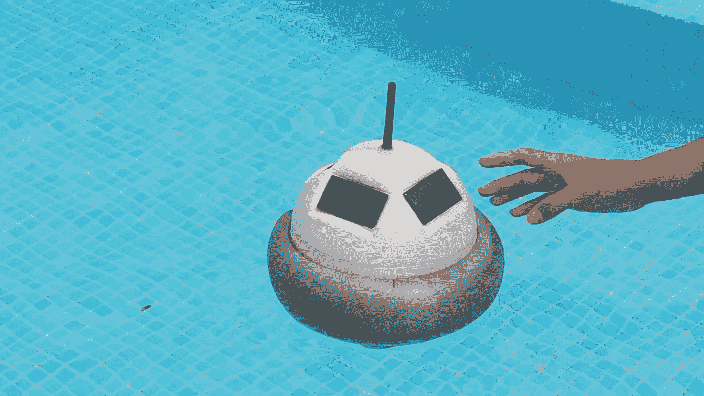

# 智能浮标——为系统安排电源🔋⌛

> 原文：<https://medium.com/nerd-for-tech/smart-buoy-scheduling-power-to-the-system-81a2675fdac0?source=collection_archive---------14----------------------->

这个智能浮标系列展示了我们(雄心勃勃的)构建科学浮标的尝试，该浮标可以使用现成的产品对海洋进行有意义的测量。这是四个教程中的第三个——确保你是最新的，如果你需要项目的快速介绍，[查看我们的摘要](https://t3chflicks.medium.com/smart-buoy-summary-602f9db544bb)。
[**第一部分**:造波和温度测量](https://t3chflicks.medium.com/smart-buoy-making-wave-and-temperature-measurements-%EF%B8%8F-cdda14c52196)
[**第二部分** : GPS、收音机(NRF24)和 SD 卡模块](https://t3chflicks.medium.com/smart-buoy-gps-radio-nrf24-and-a-sd-card-module-6029af3a69d)

在本教程中，我们将进入智能浮标项目的下一个挑战:如何控制它的电力！

我们不需要浮标不断进行测量——定期几次就足够了。间歇操作确实使它的供电稍微容易一些，因为它可以偶尔关闭。

简化供电过程的另一件事是浮标及其传感器的小尺寸，这意味着我们能够使用小的低功率太阳能电池板。然而，这意味着我们需要有效地管理我们仅有的一点电力，以确保浮标可以全天进行定期测量。我们决定，我们希望根据电池中有多少能量来安排浮标的电源。

# 供应

*   18650 电池— [亚马逊](https://amzn.to/2ZOMuCq)
*   降压升压器— [亚马逊](https://amzn.to/2ZS1a3q)
*   充电控制器— [亚马逊](https://amzn.to/2ZS1a3q)
*   太阳能电池板— [亚马逊](https://amzn.to/2ZS1a3q)
*   阻塞二极管— [亚马逊](https://amzn.to/2ZS1a3q)
*   电源监控模块— [亚马逊](https://amzn.to/2ZS1a3q)
*   实时时钟— [亚马逊](https://amzn.to/2ZS1a3q)
*   Arduino — [亚马逊](https://amzn.to/2ZS1a3q)
*   p 沟道晶体管— [亚马逊](https://amzn.to/2ZS1a3q)

> [🔗在 Github 上获取智能浮标代码📔](https://github.com/sk-t3ch/smart-buoy)

# 辅导的🤖

## 给浮标供电

我们使用 18650 电池为智能浮标供电，电池由四块 5V、60mA 的太阳能电池板并联充电。在我们的设计中，四块太阳能电池板位于浮标顶部周围，最大限度地捕捉阳光。

我们安装了一些阻塞二极管来防止反向电流进入面板。我们使用充电控制器来控制电池输出和太阳能电池板的充电。充电控制器的输出不足以稳定地为系统供电，所以我们使用降压升压器将电压提高到大约 6V。

作为一个单独的太阳能设备，浮标不太可能在有足够电力继续进行测量的情况下度过夜晚。为了确保它始终有足够的电力来操作传感器，我们使用了一个实时时钟模块来打开和关闭系统。这个模块是电池供电的，但使用的电流很小，可以运行几年。

我们对实时时钟模块进行了编程，以根据电池电量设置警报。该值是根据使用电源监控模块测量的电池电压推断出来的。当警报被触发时，它将警报引脚从高变为低。我们用这个来打开一个晶体管，这样就可以给 arduino 供电了。然后，系统进行测量，并通过清除警报和将引脚改回高电平来关闭晶体管。

## 使用 RTC 警报控制电源

下面是一个如何设置警报来控制 Arduino 电源的示例。在本例中，我们演示了使用 Arduino 打开 LED 三秒钟，设置 15 秒钟的闹铃，然后自行关闭。一旦 15 秒过去，警报触发，LED 再次打开，循环重复。

## 监控能力

这就是我们如何使用 INA219 DC 电流监控器监控电池电压和电流使用情况。该模块使用集成电路进行通信，请参考连接示意图。已经存在一个很好的用于与模块对话的库，这使得这个过程非常容易。

# 使用电源监控器设置下一个 RTC 警报

最后，这是我们如何使用电压来预测报警之间的最佳持续时间。方法有点粗糙——如果有人有更好的想法，请联系我们！

> [🔗在 Github 上获取智能浮标代码📔](https://github.com/sk-t3ch/smart-buoy)

# 感谢阅读

感谢阅读本教程。这是建立我们的智能浮标的第三步，看看我们的下一个教程，看看我们如何建立浮标和基站，并部署到(鼓声请)海洋…

[**第一部分**:制造波浪和温度测量](https://t3chflicks.medium.com/smart-buoy-making-wave-and-temperature-measurements-%EF%B8%8F-cdda14c52196)
[**第二部分** : GPS、无线电(NRF24)和 SD 卡模块](https://t3chflicks.medium.com/smart-buoy-gps-radio-nrf24-and-a-sd-card-module-6029af3a69d)
[**第三部分**:调度浮标电源](https://t3chflicks.medium.com/smart-buoy-scheduling-power-to-the-system-81a2675fdac0)
[**第四部分**:防水、仪表盘和展开！](https://t3chflicks.medium.com/smart-buoy-waterproofing-dashboards-and-deploy-15c730bf9a3a)

我们希望你喜欢这篇文章。如果你喜欢这种风格，可以去看看[T3chFlicks.org](https://t3chflicks.org/)了解更多以科技为中心的教育内容，以及我们在[YouTube](https://www.youtube.com/channel/UC0eSD-tdiJMI5GQTkMmZ-6w)([insta gram](https://www.instagram.com/t3chflicks/)、[脸书](https://www.facebook.com/t3chflicks)、 [Twitter](https://twitter.com/t3chflicks) )上做的所有有趣的事情。