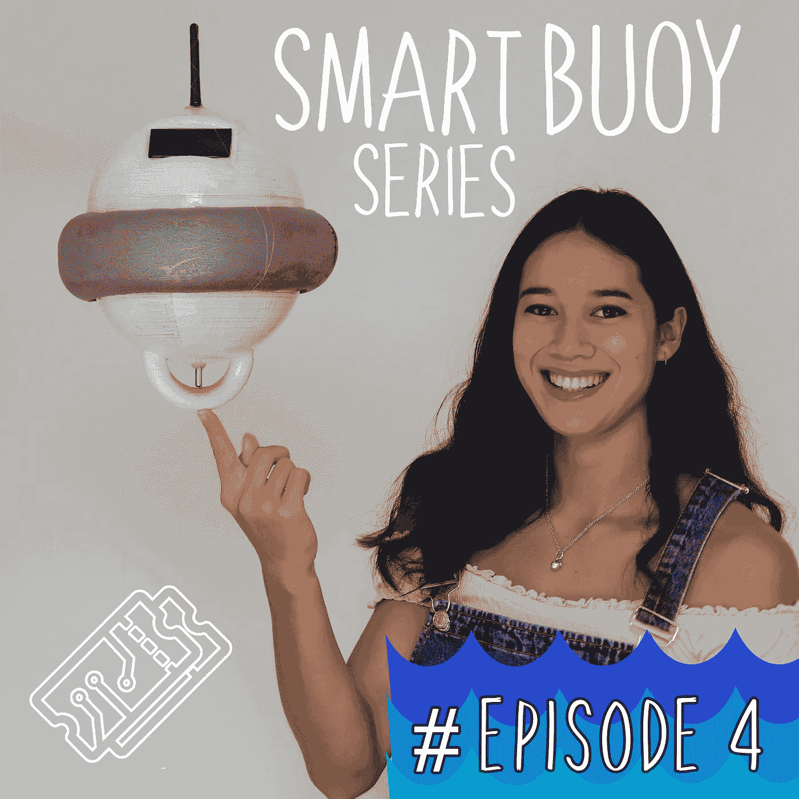
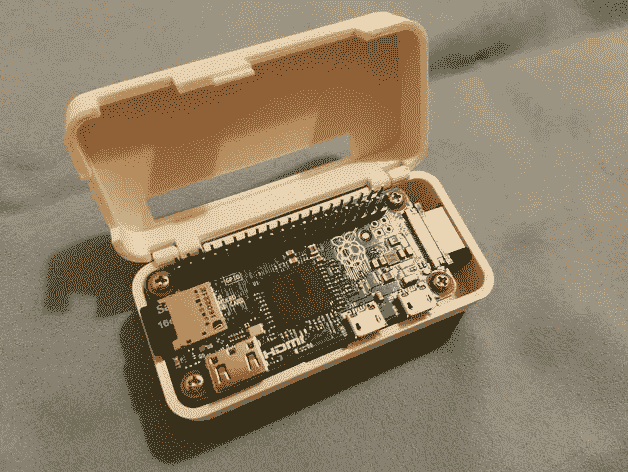
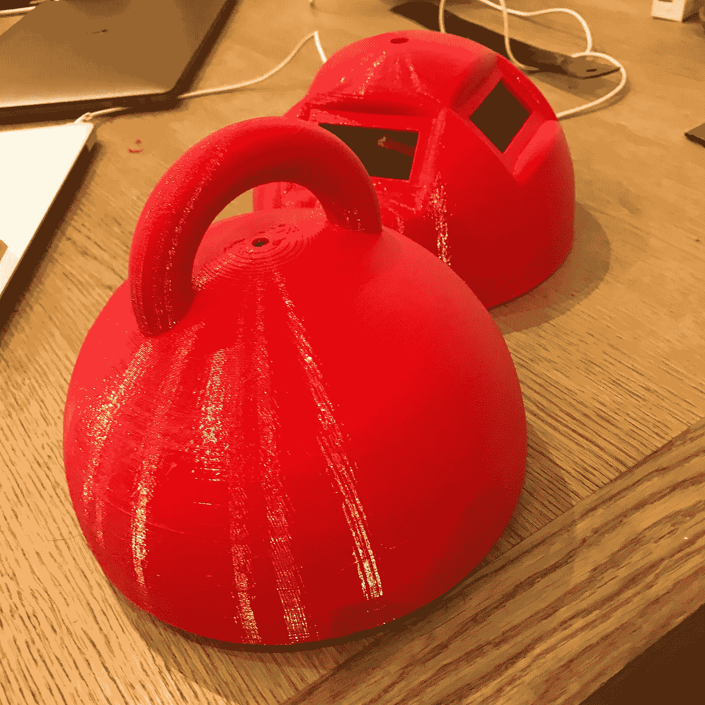
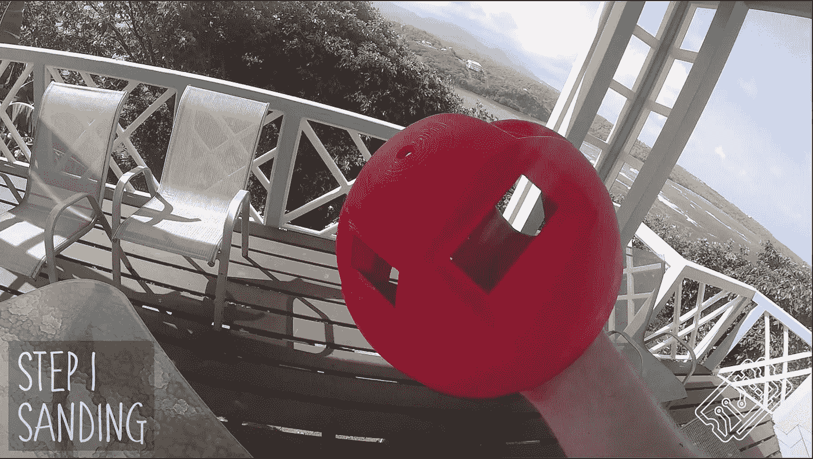
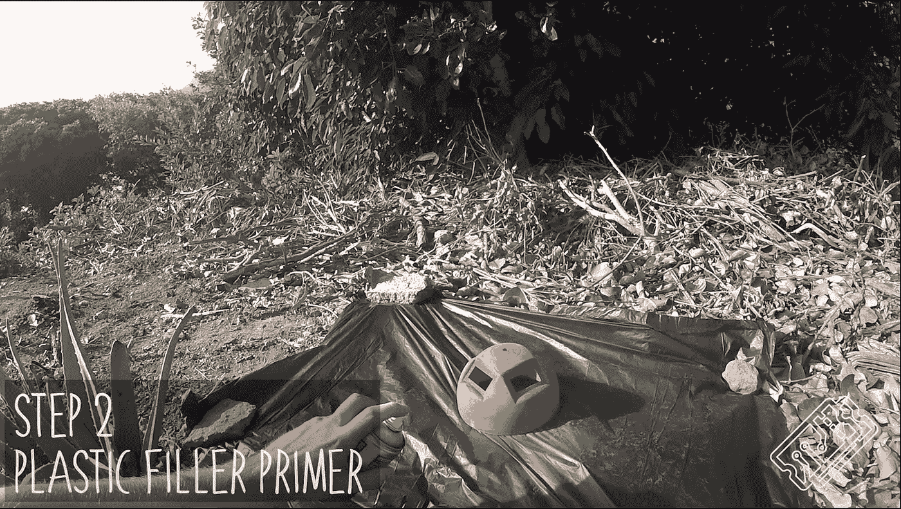
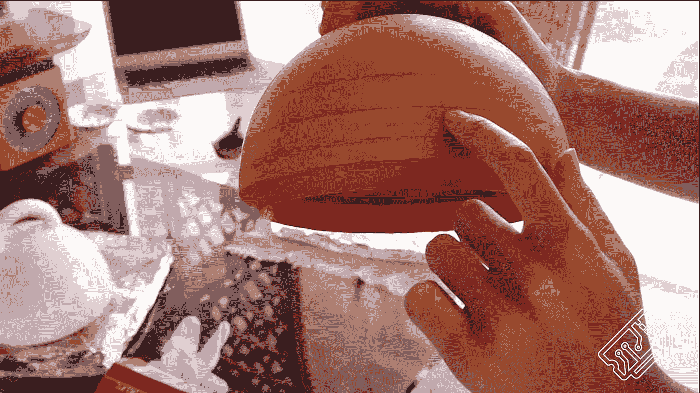
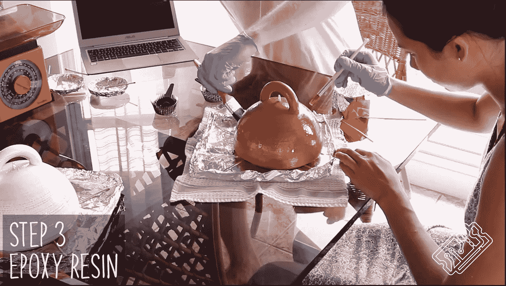
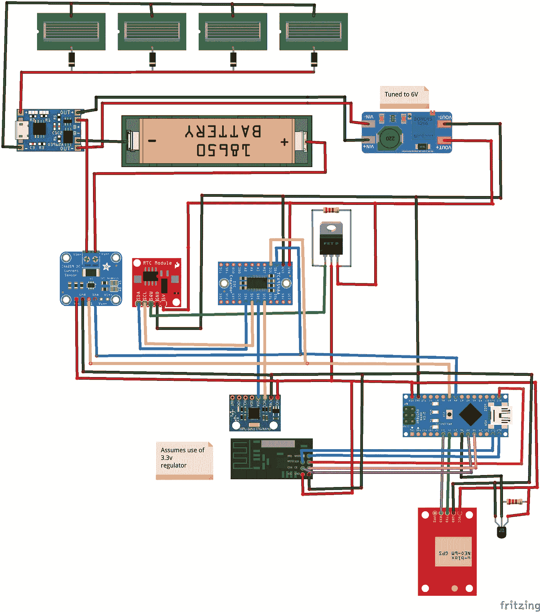
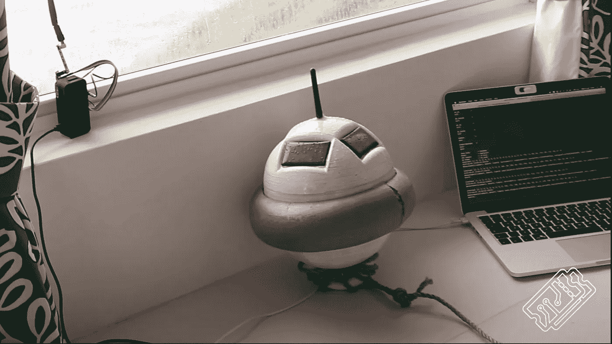
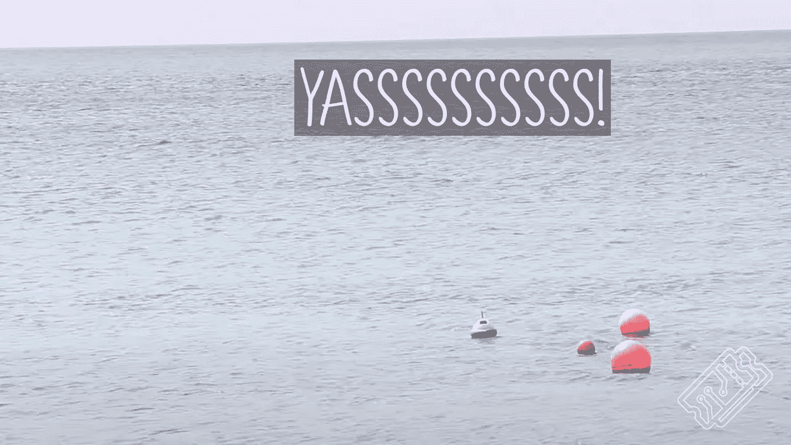

# 智能浮标——防水、仪表盘和部署🚱📊

> 原文：<https://medium.com/nerd-for-tech/smart-buoy-waterproofing-dashboards-and-deploy-15c730bf9a3a?source=collection_archive---------12----------------------->

这个智能浮标系列展示了我们(雄心勃勃的)构建科学浮标的尝试，该浮标可以使用现成的产品对海洋进行有意义的测量。这是我们的最后一个教程——确保你是最新的，如果你需要一个项目的快速介绍，[查看我们的摘要](https://t3chflicks.medium.com/smart-buoy-summary-602f9db544bb)。
[**第一部分**:造波和温度测量](https://t3chflicks.medium.com/smart-buoy-making-wave-and-temperature-measurements-%EF%B8%8F-cdda14c52196)
[**第二部分** : GPS、无线电(NRF24)和 SD 卡模块](https://t3chflicks.medium.com/smart-buoy-gps-radio-nrf24-and-a-sd-card-module-6029af3a69d)
[**第三部分**:调度浮标电源](https://t3chflicks.medium.com/smart-buoy-scheduling-power-to-the-system-81a2675fdac0)

在本文中，我们将向您展示我们如何设计外壳来保护我们的智能浮标免受水、波浪和鲨鱼的攻击。我们还解释了如何将它连接到基站，基站上有一个数据库和交互式仪表盘，可以实时浏览数据。

# 供应

由于这是项目的最后阶段，你将需要所有的供应品:

*   Arduino Nano — [亚马逊](https://amzn.to/2jJN7xR)
*   树莓派零度— [亚马逊](https://amzn.to/2jHpV3D)
*   电池(18650)——[亚马逊](https://amzn.to/2ld11cp)
*   太阳能电池板— [亚马逊](https://amzn.to/2ld2vmZ)
*   阻塞二极管— [亚马逊](https://amzn.to/2ld2X4F)
*   充电控制器— [亚马逊](https://amzn.to/2jJhRz0)
*   降压升压器— [亚马逊](https://amzn.to/2jFnCxX)
*   GPS 模块— [亚马逊](https://amzn.to/2jHgwJ2)
*   GY-86(加速度计、陀螺仪、气压计、指南针)——[亚马逊](https://amzn.to/2ld5bB3)
*   水温传感器— [亚马逊](https://amzn.to/2lbTASO)
*   电源监控模块— [亚马逊](https://amzn.to/2lbU5MG)
*   实时时钟模块— [亚马逊](https://amzn.to/2ld6yjb)
*   无线电模块— [亚马逊](https://amzn.to/2l6Fq5t)
*   i c 多路复用器模块— [亚马逊](https://amzn.to/2jJnP2S)
*   3D 打印机— [亚马逊](https://amzn.to/2ld7xQp)
*   PETG 灯丝— [亚马逊](https://amzn.to/30yw95r)
*   环氧树脂— [亚马逊](https://amzn.to/2lbVRNQ)
*   底漆喷漆— [亚马逊](https://amzn.to/2ld55cE)
*   Rope — [亚马逊](https://amzn.to/2jHkjWM)
*   浮动— [亚马逊](https://amzn.to/2lfTZ6R)
*   胶水— [亚马逊](https://amzn.to/2jFpeaZ)

> [🔗在 Github 上获取智能浮标代码📔](https://github.com/sk-t3ch/smart-buoy)

# 辅导的🤖

## 外壳——浮标

当我们设计浮标时，我们有几个关键的想法:它需要安装所有的电子设备，有太阳能电池板，无线电天线和水温传感器的插槽。它还需要(！！)做到水密漂浮。它还需要一个定位点，这样它就不会漂走了。

我们使用 Autodesk Fusion 360 软件来设计浮标，我们对结果非常满意。然而，我们没有包括一个用于编程 Arduino 的可密封插槽，这稍微搬起石头砸了自己的脚，在我们将它粘在一起之前，我们不得不让一切都完美地工作。

## 外壳—基站

浮标通过无线电通讯，信息由基站接收。在之前的教程中，为了简单起见，我们将无线电模块与 Arduino 一起使用。基站使用 Raspberry Pi，它以同样的方式连接，但允许更多的处理。

在 [Thingiverse](https://www.thingiverse.com/thing:1595429) 上有很多很棒的开源案例，包括这个 [one](https://www.thingiverse.com/thing:1595429) 它是一个整体打印的，并且有接线的切口。

海贼王覆盆子批零案— [来源](https://www.thingiverse.com/thing:1595429)

## 印刷浮标

3D 打印很有趣，但也很耗时，容易让人发怒。然而，幸运的是，有些人比我们更有经验，并且非常乐于助人。多亏了 reddit 用户`@dbcottonhead`，我们研究了 PETG 灯丝，它应该更耐用，外壳更坚固。当制作一个预计会在 40 摄氏度的太阳下漂浮在盐水中，同时可能会撞上一些岩石的东西时，这些都是需要考虑的重要事情…

为了确保防水，我们主要关注层粘合:

*   0.3 毫米的薄层高度有助于减小间隙的尺寸
*   4 个周长，以减少缝隙的可能性，并赋予墙壁强度

一个完全实心的浮标是防水的，但是它也不会浮起来，因为 PETG 的密度比水的密度大。我们选择在印刷品上填充 15%。

每一半花了大约 24 小时打印，并使用了 500 克 PETG。完成的打印相当顺利，但与拉丝和斑点，你会期望当使用 PETG 与 FDM 印刷。

## 后期制作

即使有了仔细的初始规划和我们改善层附着力的尝试，浮标也不是防水的。我们开始后期制作处理，用各种不同的粗砂进行打磨。

然后，我们在这个均匀粗糙的表面上喷涂了几层塑料填充底漆来填补缝隙。

这改善了外壳，但没有完全消除层间隙。

最后的办法是加几层环氧树脂。环氧树脂非常耐用，让浮标微微发亮。

## 太阳能电池板

智能浮标的特点是四个太阳能电池板均匀分布在它的周围。每个电池能够在 60mA 下产生 5V 电压。典型的 Arduino nano 需要约 20mA，因此我们希望这适合我们的系统。我们将电线焊接到太阳能电池板的后部，并连接到充电系统的其余部分。

我们把电线穿过去，然后把太阳能电池板粘到防水的位置。

## 主板—主板

通过大量的努力、焊接和布线，我们将电子元件连接在了 perfboard 上。

我们将无线电天线和水温传感器分别推入各自的孔中，并用胶水将它们固定到位。

穿孔板整齐地插入浮标，我们把它粘在适当的位置。

正如我们在教程二中提到的，我们移除了 SD 卡模块，因为它导致了严重的问题。

## 浮力

逻辑(可能还有科学)表明，如果浮标的密度比水小，它就会浮起来。我们相信浮标会浮起来。但是我们对它的稳定性没有太大的信心。

市场上可买到的许多浮标都是自行扶正的。我们选择切下一块管道绝缘材料，把它粘在浮标中间的圆周上。这有一个额外的效果，使浮标看起来像 UFO 一样，如果任何船只决定要近距离观看，也可能提供一点保护。

## 基站

通过浮标上的所有传感器，我们能够测量:波高、波周期、波能、水温、气温、气压、电压、电流使用和位置。这些值通过无线电模块从浮标发送到基站。

我们很想测量波浪方向，而且我们非常接近成功，但是这是一场巨大的斗争(请看教程一来更详细地了解我们的痛苦和困惑),所以最后我们放弃了它(请帮助❤).

## 仪表盘

智能浮标仪表板前端是使用 [VueJs](https://vuejs.org/) 创建的。我们不会深入解释我们是如何做到这一点的，但我们可以向您展示如何让它继续下去。

> 这个项目的文件可以在这里找到☁️
> 
> [现场演示可在此处找到💽](https://smart-buoy.t3chflicks.org/)

*   SSH 进入 Raspberry Pi 基站
*   安装依赖项并创建数据库
*   下载代码并创建配置文件`.env`
*   添加谷歌地图密钥
*   启动服务器

一旦基站开始与浮标进行无线电通信，消息将存储在数据库中，并传输给实时仪表板的用户。在浏览器中导航到仪表板主页，您应该会看到数据流。

只需切换每个测量卡上的查看控件，即可查看测量的时间序列。如果您想更仔细地查看数据，**趋势**页面提供了一个图形工具，可查询基站上运行的数据库。

## 地点——放在哪里？

格林纳达是南加勒比海的一个美丽的岛屿。面向大西洋的东海岸通常比更隐蔽的西海岸接收更多的波浪能。潮差(高潮和低潮之间的距离)很小，这意味着海平面上升的影响更加明显。加勒比地区日益频繁和强烈的热带风暴也构成了令人担忧的威胁，大风暴会对沿海地区造成重大破坏。

总之，够了。考虑到我们对该岛及其沿海地区的了解，我们寻找了最初放置浮标的地方。一个理想的地点需要小但动态的波浪，很少流氓渔民，并且容易接近…所以我们最初在游泳池测试。

测试地点—游泳池

在格林纳达的时候，我们还有机会和一个朋友聊天，他拥有一家海滨潜水店。他有自己的环保使命——创造一个人工珊瑚礁——你可以在这里阅读更多关于[的内容](https://theecologist.org/2019/aug/19/saving-caribbean-corals-concrete)。当他允许我们把浮标系在这条绳子上时，我们非常高兴。

我们通过在底部钩子周围打结一根绳子将浮标锚定在其他一些东西上(是的，我们相当合法)。它没有沉。成功了！

测试地点——海洋

# V2

智能浮标项目是一个很好的学习资源。我们对自己成功创建的系统非常满意，尤其是考虑到(自我施加的)时间和成本限制。

然而，浮标的目的是进行有意义的海洋测量。在我们不得不离开阳光明媚的格林纳达的前几天，我们才设法让浮标工作起来。回到英国，海边就没那么吸引人了…并不是说这个项目不会继续。我们学到了很多，现在我们可以应用这些改进，并有希望踏上另一段美好的旅程。

## 顶级改进

*   打开和重新密封浮标的能力
*   LoRa ESP32 取代浮标中的 Arduino
*   浮标波浪测量的数据处理

# 感谢阅读

[**第一部分**:造波和测温](https://t3chflicks.medium.com/smart-buoy-making-wave-and-temperature-measurements-%EF%B8%8F-cdda14c52196)
[**第二部分** : GPS、无线电(NRF24)和 SD 卡模块](https://t3chflicks.medium.com/smart-buoy-gps-radio-nrf24-and-a-sd-card-module-6029af3a69d)
[**第三部分**:调度浮标电源](https://t3chflicks.medium.com/smart-buoy-scheduling-power-to-the-system-81a2675fdac0)
[**第四部分**:防水、仪表盘和展开！](https://t3chflicks.medium.com/smart-buoy-waterproofing-dashboards-and-deploy-15c730bf9a3a)

我们希望你喜欢这篇文章。如果你喜欢这种风格，可以去 T3chFlicks.org 的[网站](https://t3chflicks.org/)看看更多的科技教育内容，以及我们在[YouTube](https://www.youtube.com/channel/UC0eSD-tdiJMI5GQTkMmZ-6w)([insta gram](https://www.instagram.com/t3chflicks/)、[脸书](https://www.facebook.com/t3chflicks)、 [Twitter](https://twitter.com/t3chflicks) )上做的所有有趣的事情。