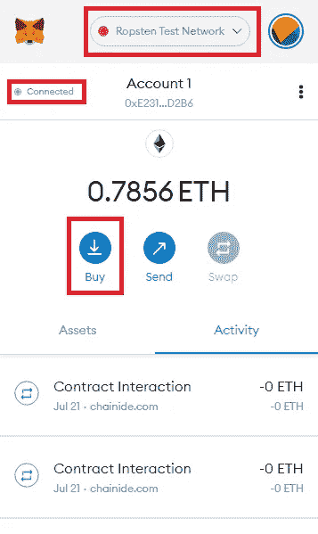
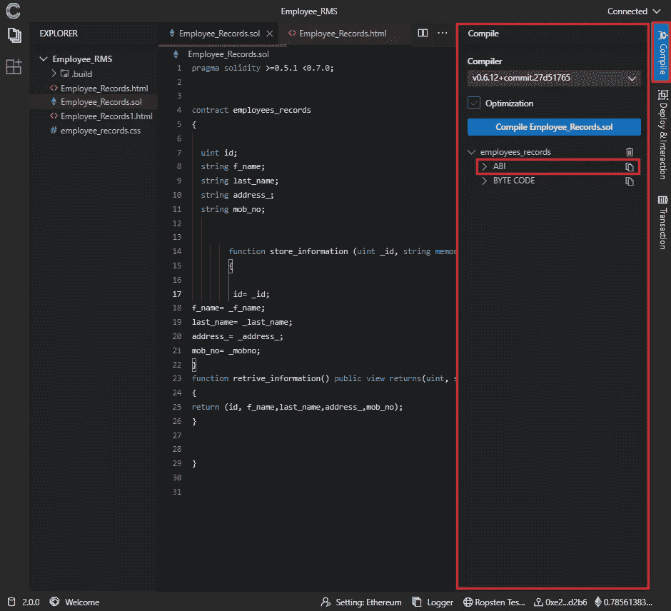
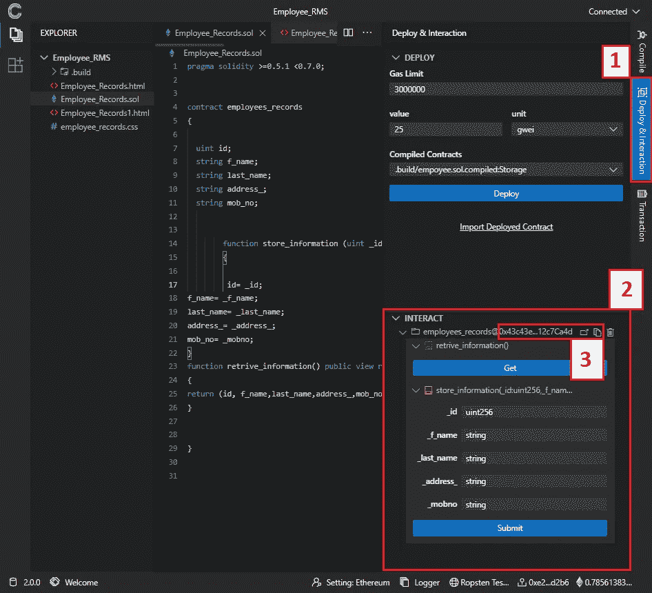
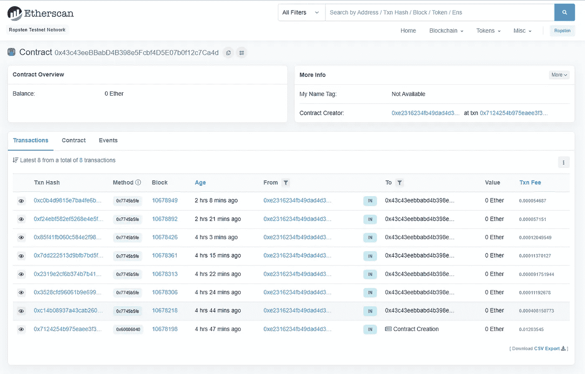
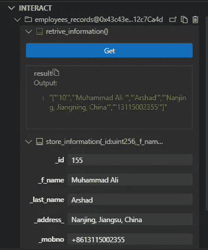
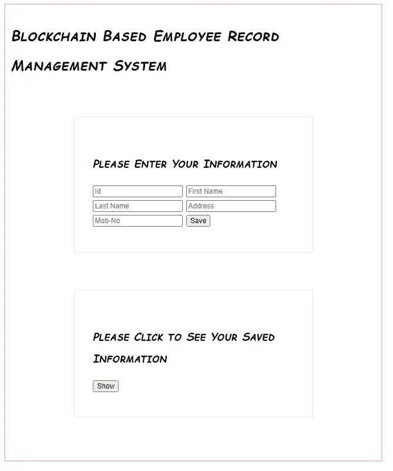

# 智能合约和 Web3！你需要知道的一切。

> 原文：<https://medium.com/nerd-for-tech/smart-contract-and-web3-all-that-you-need-to-know-f33fbe2aae0?source=collection_archive---------12----------------------->

关于创建您的智能合同并使用 web3 与智能合同交互的精彩指南

1.在区块链存储数据并从区块链检索存储数据的系统

**先决条件:**

要学习本教程，您需要具备以下编程语言的基础知识:

1.  HTML: HTML 用于设计网站的结构
2.  JavaScript: Javascript 用于与部署的智能合约进行交互，以存储、检索和操作信息
3.  稳健:稳健用于写下明智的合同

**工具需求:**

1.  chain IDE[一个在线的基于云的多链 IDE]可在:【https://chainide.com/[获得](https://chainide.com/)

 [## 链状化合物

### ChainIDE 是世界上最好的支持多链的 IDE。

chainide.com](https://chainide.com/en/) 

1.  meta mask[web 3 的钱包]，可在:[https://metamask.io/](https://metamask.io/)购买

 [## 元掩码传统 Web3

### 将 MetaMask 的传统 window.web3 API 添加到浏览器中

chrome.google.com](https://chrome.google.com/webstore/detail/metamask-legacy-web3/dgoegggfhkapjphahmgihfgemkgecdgl) 

！注意:对于本教程，除了 MetaMask 和 web3.js 之外，不需要下载任何工具或库。

**库:**

1.  web3.js [web3.js 是一个库集合，允许您使用 HTTP、IPC 或 WebSocket 与本地或远程以太坊节点进行交互]，可从以下位置获得:[https://cdn . jsdelivr . net/GH/ether eum/web 3 . js/dist/web 3 . min . js](https://cdn.jsdelivr.net/gh/ethereum/web3.js/dist/web3.min.js)

**实验设置:**

访问 ChainIDE 和 MetaMask 后，将 MetaMask 连接到 ChainIDE，并从水龙头购买一些乙醚，用于以下任何测试网络:

1.  Ropsten 测试网络(建议)
2.  科万测试网络
3.  林克比测试网络
4.  戈雷利测试网络

要从水龙头获取测试乙醚，只需点击选择上述任何网络，然后点击购买→测试水龙头→获取乙醚，您将被重定向到选定的水龙头网络。这种方法因网络而异，但都很简单。

2.元掩码

将 MetaMask 扩展添加到浏览器后，请确保您选择了水龙头网络。

**方法**

首先，我们将写下一个智能合同，它可以存储员工的信息，如 id、名字、姓氏、地址、手机号码等。,

！注意:我们将在整个教程中使用 ChainIDE，ChainIDE 支持完成本教程所需的所有编程语言。

下面的代码是用 solidity 编写的智能合同，用于在区块链上存储雇员的信息。为了利用这个智能契约，我们需要在区块链上部署它，在部署它之前，我们需要编译它。

**pragma** 关键字定义了我们将用来编译 solidity 代码的编译器版本。一旦你完成写下你的智能合同，简单地从编译面板编译它，你将得到下面的可靠性代码的 ABI 代码。

3.合同汇编

当您想要使用 web3 与智能合约交互时，需要称为应用程序二进制接口的 ABI。

现在，下一步是部署已编译的智能契约。

4.合同部署

要部署智能合同，您的钱包中必须有一些水龙头醚，以支付部署智能合同的汽油费。在图 4 中，我们可以看到我们支付了 25 gwei 来部署我们的“Employee_Records.sol”智能合同。

部署智能合同后，它将被分配一个合同地址，如图 4 中突出显示的第 3 点所示，从交互面板中，我们可以复制我们的智能合同地址，也可以在水龙头网络上检查我们部署的智能合同。

5.Ropsten 测试网络的以太网扫描

我们可以看到关于合同的所有信息，如智能合同的所有交易信息、每次交易使用的燃气费等。，来自以太网扫描。

在此之前，我们已经在区块链上成功部署了智能合约，我们可以使用 ChainIDE 的“interact”面板与部署的智能合约进行交互。

6.ChainIDE 交互面板

但是我们希望创建一个自定义界面来与部署的智能合约进行交互，因此，我们将首先使用简单的 HTML 标签和一点 CSS 来创建网页结构，使其看起来更好。

网页的 CSS 如下:

在此之前，我们的网页会是这样的，

7.使用 HTML 和 CSS 的网页

这只是网页的一个结构，但仍然没有与我们部署的智能合同集成，它不能用于在区块链上存储值和从区块链检索存储的值，因为我们需要 Web3.js 和 JavaScript 语言。下面的代码需要粘贴在