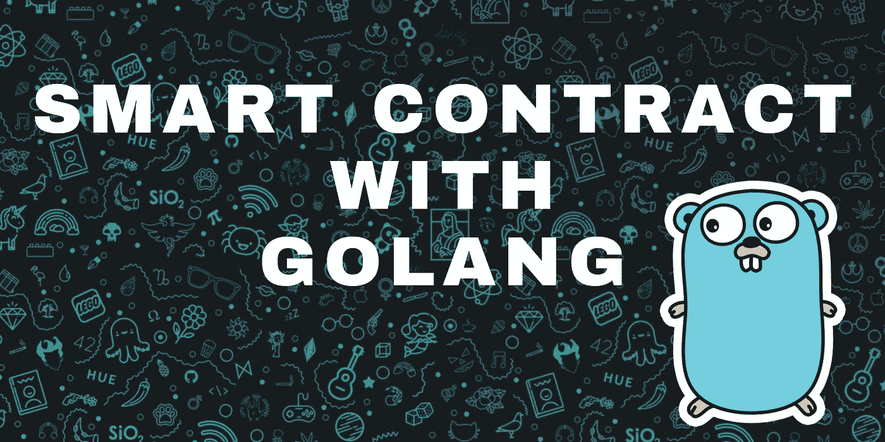
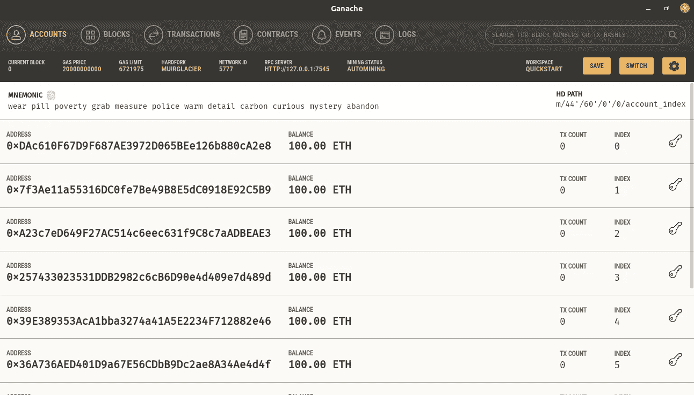

# 与 Golang 的智能合同

> 原文：<https://medium.com/nerd-for-tech/smart-contract-with-golang-d208c92848a9?source=collection_archive---------0----------------------->

通过 golang 与智能合约交互

# 目标

我们的重点是部署智能合约的功能并与之交互，使其可以通过 golang API 访问。所以我们可以轻松使用，坚定地和他们对话。

还记得我们在 [*上一篇文章*](https://enlear.academy/creating-simple-smart-contracts-e0e1ce4eff03) 中创建的智能合同吗，所以我们将使用相同的合同来完成我们应该做的工作。所以让我们再看看我们的合同…

让我们快速回顾一下这份合同

*   **BalanceCheck** 是合同的名称。
*   ***balance*** 是一个全局变量，将保存总余额。
*   ***admin*** 是另一个全球变量，它将保存将部署此合同的管理员的地址。
*   **构造函数**在最前一级执行并初始化所有值。
*   **平衡**功能将当前值返回到*平衡。*
*   **存款**函数通过随函数调用一起发送的值更新余额。
*   **withdraw**函数执行按金额提取和减少余额的基本工作，但在我们的合同场景中，这一权力只属于管理员。

# 先决条件

这一次我们将通过 **Golang** 而不是 remix 来编辑合同，并且我们将使用 **Ganache** 来创建以太坊虚拟环境和账户。

Ganache 为我们提供了 10 个帐户，每个帐户都有 100 个以太余额。我们还将通过 Ganache 看到一个完整的区块链交易。

1.  **安装加纳切:**[https://trufflesuite.com/ganache](https://trufflesuite.com/ganache/)
2.  **安装 Solidity:**[https://docs . soliditylang . org/en/v 0 . 8 . 2/Installing-Solidity . html # Linux-packages](https://docs.soliditylang.org/en/v0.8.2/installing-solidity.html#linux-packages)
3.  **安装 Geth:**[https://Geth . ether eum . org/docs/install-and-build/Installing-Geth](https://geth.ethereum.org/docs/install-and-build/installing-geth)

# 体系结构

我们将使用六边形建筑，就像我们在 golang 项目中使用的一样。

智能合同在合同目录中，我们的`main.go`将在 *cmd* 目录中找到。

要通过我们的 go 程序访问它，我们需要经历一些步骤，并创建一个嵌入在 outsmart contract 中的 go 文件。

# 收集

*   通过我们上面安装的 solidity 编译器编译合同并创建我们合同的一个`ABI`文件，`ABI`是通过下面的命令在构建目录中创建的。

*   现在通过 solidity 编译器在构建目录下通过这个命令为同一个契约创建`BIN`文件。

> 到目前为止，我们在 **build** 目录中有合同的`.abi`和`.bin`文件。

*   需要创建一个 go 文件，我们可以通过 golang 程序与他进行一些对话，因此我们将使用`.abi`和`.bin`文件通过 ***abigen*** 创建一个 go 文件，并通过下面的命令*在我们的`api`目录中创建它。*

在`api`文件夹中创建的文件是通过绑定生成的，我们不能对其进行编辑，但在该文件中，我们会发现 golang 结构和交互模式中契约的所有函数和成员变量。

# 如何连接智能合同

1.  与 EVM(加纳切)联系。
2.  连接任何帐户进行交易。
3.  使用管理员帐户部署智能合同。
4.  创建端点。
5.  连接智能合同功能。
6.  使用多个账户进行交易。

## 1.连接 EVM(加纳切)

Ganache 为我们提供了测试以太坊的环境，它有一个用户友好的界面以及一个命令行界面，我们将使用基于 GUI 的界面，看起来像这样。

加纳切

它为我们提供了 10 个帐户，每个帐户有 100 个以太网要测试，一些被充分使用的东西是` **RPC 服务器**`它为我们提供了地址，通过它我们可以连接到 Ganache `[http://127.0.0.1:7545](http://127.0.0.1:7545.)`。

这里我们连接了 ganache 并创建了一个对象。现在，有了这个目标，我们将开始与 EVM 的对话。

## **2。连接任意账户进行交易**

我们将连接上述 ganache 的帐户，并使用它们进行任何交易。为此，我们将创建一个函数，该函数将接受*客户端*和*帐户地址*，并作为回报，给我们一个**事务对象**，用于所有事务。

在上面的函数中，我们从帐户地址中取出`private key`,然后取地址将其与 Ganache 的`chain id`绑定，使其继续事务对象。

我们还获取账户的 last `nonce`,然后用其他必要的参数更新 nonce 值。

## 3.使用管理员帐户部署智能合同

得到`auth`之后，我们将使用契约的 go 文件`Deploy api`函数部署我们的契约，将`client`的 chelp 和`auth`对象作为参数。它给我们`deployed address`的合同，我们将发送我们所有的请求。

## 4.创建端点

我们将使用 echo 框架来创建 restful API 端点。

这个端点将成为我们与合同的对话伙伴，就像我们使用它们与`database`交互一样。

## 5.与智能合同功能连接

为了与我们的契约函数进行交互，我们将使用`deployed contract address`并一如既往地使用我们的 ganache EVM 客户端来创建 API 指针，该指针将被用作连接对象来连接函数。

使用`conn`对象，我们调用了已部署契约的 **Balance** 函数。

## 6.使用多个账户进行交易

为了使我们的交易独立于账户，我们将在我们的参数中取`account address`，然后用更新的 nonce 创建`auth`，以使交易成功。

> 你可以在这里找到完整的源代码[。](https://github.com/02amanag/SmartContractWithGolang)

# 让我们测试一下我们的作品

你可以在 repo 中找到一个完整的 **postman 集合**进行测试，或者你甚至可以使用下面提供的 **curl** 命令进行测试。

*   **检查余额:-**

`curl --location --request GET 'http://localhost:1323/balance'`

*   **检查管理员地址:-**

`curl --location --request GET 'http://localhost:1323/admin'`

*   **从账户公共地址存入 50 金额的值:-**

`curl --location --request POST 'http://localhost:1323/deposite/50' \`

`--header 'Content-Type: application/json' \`

`--data-raw '{ "accountPrivateKey":"fd4eef6dec5575cc78f3f14d4b749094f8b88ad7883caaa8d1d24e9a01e3732d" }'`

*   **到撤 10:-**

`curl --location --request POST 'http://localhost:1323/withdrawl/50' \`

`--header 'Content-Type: application/json' \`

`--data-raw '{ "accountPrivateKey":"fd4eef6dec5575cc78f3f14d4b749094f8b88ad7883caaa8d1d24e9a01e3732d" }'`

# 履行

我们可以使用这个概念来创建一个 **DAPP** ，它有一个适当的前端和一些数据库来记录一些限制和扩展范围。

# 结论

我们见证了与 golang 的智能合同。我们通过 golang API 与我们的智能合约进行交互，涵盖了从创建到编译到部署的所有内容，然后一步一步地与我们的智能合约**进行交互**。最后，我们还测试了不同的功能。可以在我的 [***repo***](https://github.com/02amanag/SmartContractWithGolang) 中找到完整的源代码。

> *你可以在这里* *买一杯咖啡支持我和我的内容☕* [***。***](https://www.buymeacoffee.com/amanagarwal)
> 
> *关注我上*[***Twitter***](https://twitter.com/02amanag)*和*[***LinkedIn***](https://www.linkedin.com/in/02amanag/)*。*

# 了解更多信息

 [## 什么是 ERC-20 代币？

### 在以太坊的世界里，ERC-XXX 或者 EIP-XXXX 的短语经常出现，但是对于以太坊世界的新手来说，这看起来…

enlear .学院](https://enlear.academy/what-is-erc-20-token-853aa8bc3611)  [## 区块链上的智能合约有哪些？

### 区块链智能合约简介

enlear .学院](https://enlear.academy/what-are-smart-contracts-on-blockchain-545db75dcd25)  [## 使用 Golang 的区块链

### 用 Golang 做区块链好吗？

enlear .学院](https://enlear.academy/blockchain-with-golang-bc1b76bb7cbe)