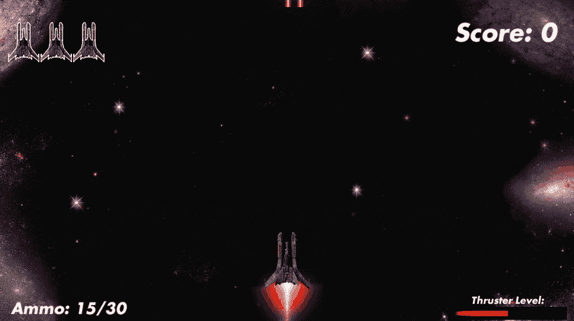
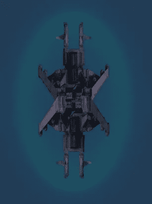
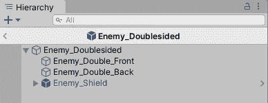
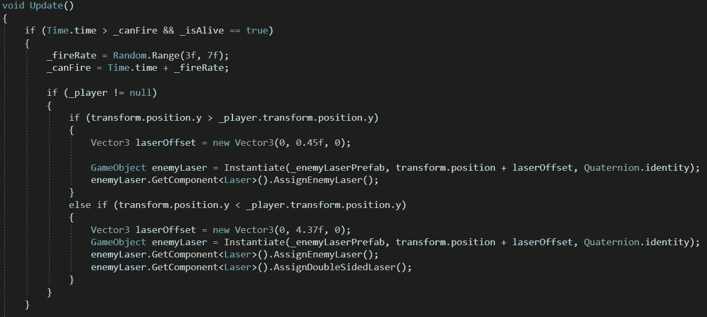
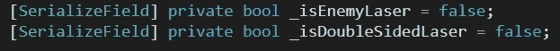
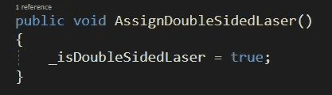
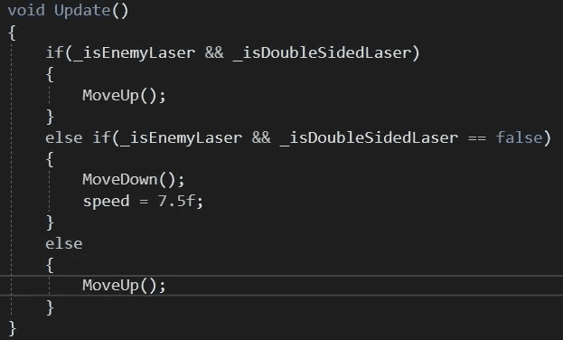
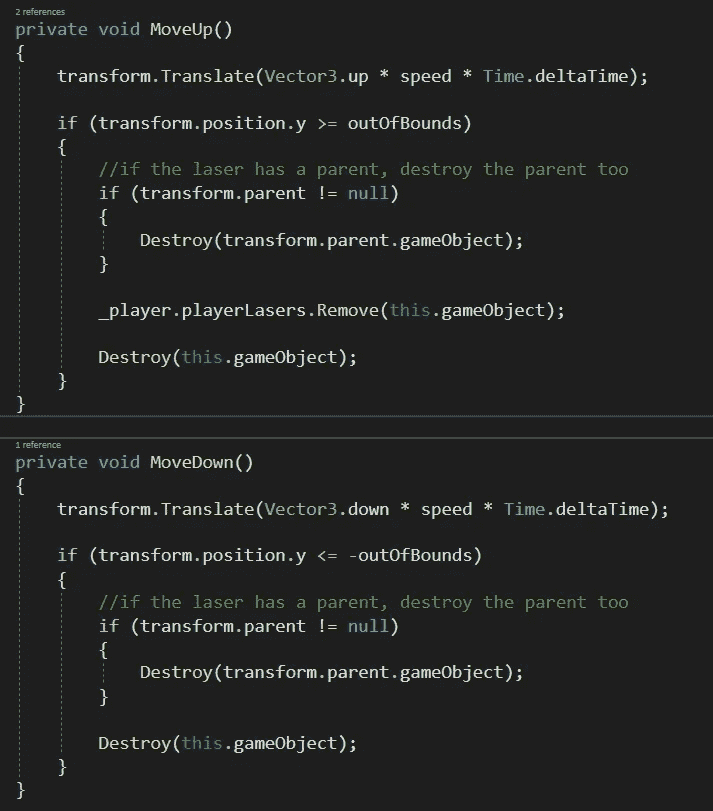

# 从背后开枪的“聪明”敌人

> 原文：<https://medium.com/nerd-for-tech/smart-enemy-that-shoots-behind-itself-7a874317322d?source=collection_archive---------33----------------------->

我们正处于让我们的游戏变得更困难的阶段，所以为什么不是另一个**敌人**类型来摆脱**玩家**！这个**敌人**将被赋予**从**背后射击的能力，一旦他们躲开了敌人的正面攻击，玩家就要小心他们的背后！

这实际上是一个简单的过程，只需要对我们现有的代码进行一些调整(如果您一直在阅读这些文章的话)。

小心你的六点钟方向！

# 创造敌人

我给这个敌人起了个绰号叫**双面敌人**，因为这就是双面敌人——两个敌人精灵**，一个面向前方，另一个面向后方！**

双面敌人预览

在创造这个敌人的时候，我还必须调整敌人盾牌的比例来适应它的长方形。

我将这两个精灵添加到一个父对象中，将它们分层并着色。给了母体一个**刚体 2D** (重力比例设置为 0)，一个**箱式碰撞器 2D** (被触发器选中)，并创建了一个 **DoubleSidedEnemy 脚本**，它几乎是我们**常规敌方脚本**的副本，只有少数例外。

代码的变化在**触发逻辑**内:

基本上如果**玩家的 Y 位置**在下面**双面敌人的 Y 位置**上，它射出一个**普通敌人激光**。但是如果**玩家**在**敌人的 Y 位置**上方，那么它会射出一束**敌人激光**并且**将**指定为**双面激光**，使其向上**！**

# **激光逻辑**

**在**激光脚本**中创建逻辑变化只需要另一个变量和一个**更新的运动逻辑**。**

**我们需要创建的变量是一个**bool _ isDoubleSidedLaser**:**

****

**为了分配激光，我们将创建一个函数**AssignDoubleSidedLaser()**:**

****

**然后更新**动作逻辑**:**

****

**现在需要这**两个功能**:**

****

**现在我们有了一个可以在玩家最意想不到的时候向他们射击的敌人！这将使游戏更具挑战性，并迫使玩家更加注意每一种敌人类型及其周围环境！**

**对于玩家来说，有了这些新的敌人和挑战，让我们在下一篇文章中给他们扔一块骨头吧！我们将创建一个简单的磁化键，它将使电源被玩家吸引！**