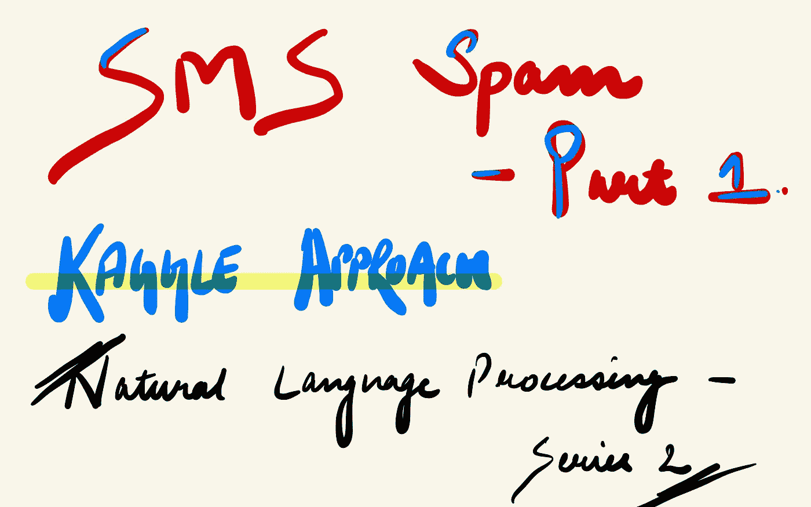
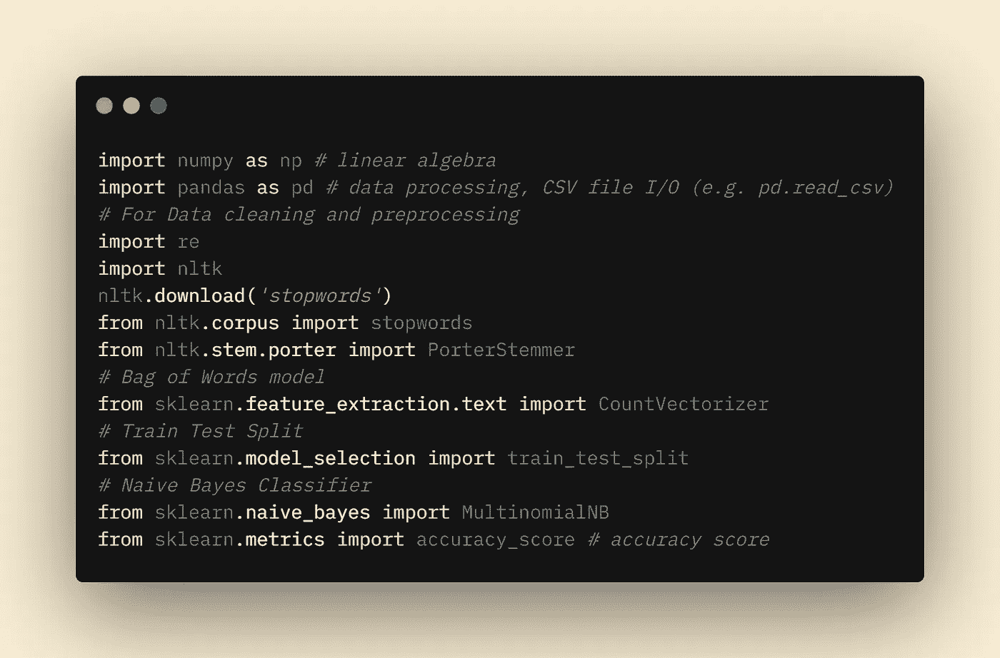
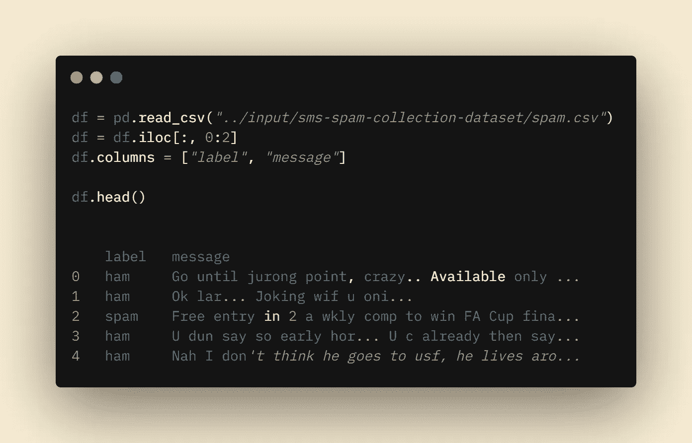
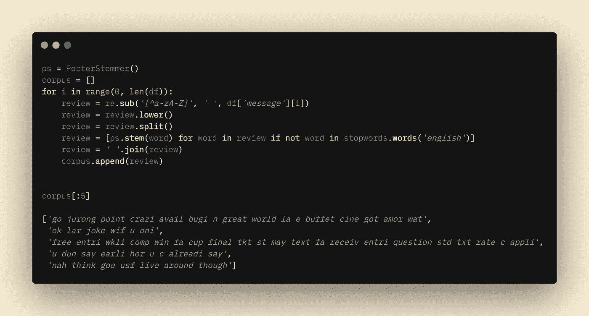
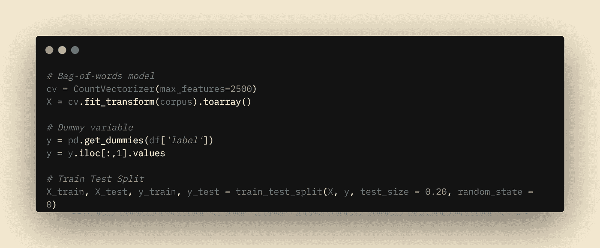
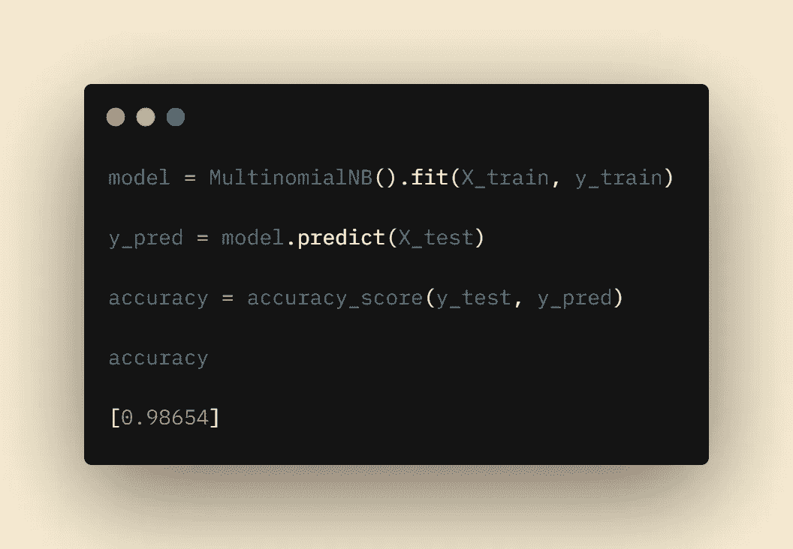

# 垃圾短信第一部分| NLP 系列 2

> 原文：<https://medium.com/nerd-for-tech/sms-spam-part-i-nlp-series-2-29391c23f43c?source=collection_archive---------10----------------------->

垃圾短信第 1 部分

我们都知道，互联网和社交媒体已经成为获取信息最快捷、最直接的方式。因此，消息已经成为重要的信息来源。在这个时代，短消息服务或 SMS 是最有效的通信手段之一。随着对移动设备的依赖在这段时间内急剧增加，这导致了通过短信抢劫的增加。由于技术进步，我们现在可以使用各种人工智能技术从这些数据中提取有意义的信息。

这篇文章的主要目的是了解如何建立一个垃圾短信检测模型。

# 履行

现在让我们使用 UCI 机器学习社区提供的数据集来实现垃圾短信分类。垃圾短信收集是为垃圾短信研究而收集的一组带 SMS 标记的消息。它包含一组 5，574 条英文 SMS 消息，根据 ham(合法)或 spam 进行标记。你可以在这里阅读更多关于数据集的信息:[https://www.kaggle.com/uciml/sms-spam-collection-dataset.](https://www.kaggle.com/uciml/sms-spam-collection-dataset.)

这里有一个数据集的链接:【https://www.kaggle.com/uciml/sms-spam-collection-dataset 

首先，我们将加载所需的库。以下是我们需要的库的列表:

1.  Numpy。
2.  熊猫。
3.  正则表达式(re)。
4.  自然语言工具包(nltk)。
5.  nltk 库中的停用字词。
6.  对于词干，我们需要 nltk 库中的 PorterStemmer。
7.  一大堆话。
8.  列车测试分离。
9.  朴素贝叶斯。
10.  混乱矩阵。
11.  准确度分数。

图书馆

我们现在将加载数据集，让我们来看看它。有两列；一个是“标签”，另一个是将要进行处理的主消息(主消息)。我们将建立一个二元分类模型来检测一个文本消息是否是垃圾邮件。

资料组

在这篇博客中，我将只讨论词干，在第二部分，我们将讨论词汇化并比较我们的结果。现在，我们将应用正则表达式概念来清理我们的数据。应用后，我们的数据会是这样的。

堵塞物

词干提取之后，我们将使用单词袋模型将数据转换成向量。然后，最后，我们必须将我们的分类变量(“标签”)转换成数字，以将其输入到我们的模型中。

词袋，虚拟变量，训练测试分离

现在我们的数据集已经准备好提供给模型了。首先，我们将使用 train_test_split 函数分割数据集。然后，在这篇博客中，我们将只使用朴素贝叶斯算法来拟合我们的数据。

拟合我们的数据后，让我们检查我们的模型提供的准确性。

模型拟合和精度

我们的模型给出了 98%的准确率。所以这是一个杰出的准确性。

在下一篇博客中，我们将比较不同分类算法的准确性，尝试词汇化和不同的算法。所以请继续关注这篇博客的第二部分。