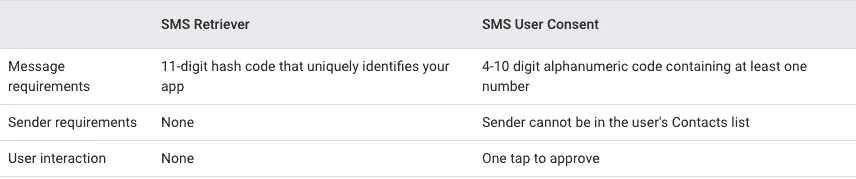
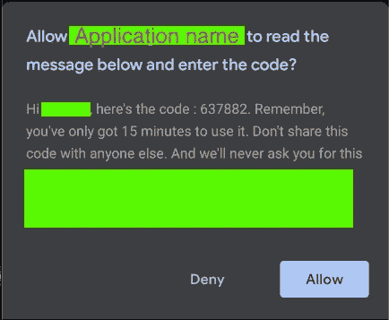

# 短信验证 API Android

> 原文：<https://medium.com/nerd-for-tech/sms-verification-api-android-f351a3e81112?source=collection_archive---------0----------------------->


故事标题

在本文中，我们将了解使用短信验证 API 的**短信验证。**

*   API 为我们提供了两种在 android 应用程序中处理一次性密码验证的方法。


图片来源:[https://4 . BP . blogspot . com/-H3wBrYcICPI/weejpy 6 psi/aaaaaaaaaeqc/db1ff-ksnkeyfaaitba 2 qexnspootnnwclcbgas/s 1600/image3 . png](https://4.bp.blogspot.com/-H3wBrYcICPI/WeEjPy6tPsI/AAAAAAAAEqc/db1ff-kSnkEYCfaaiTbA2qeXnSPoOtnNwCLcBGAs/s1600/image3.png)

如果您在当前的应用程序中有用例，或者将来要实现电话号码的一次性密码验证，那么您应该考虑**短信验证 API。**

以这样一种方式处理验证，您的**用户不应该来回使用消息应用程序来获取代码并将其输入到您的应用程序**。

**短信验证 API，提供 2 种处理短信验证的方式**

*   SMS 检索器 API
*   SMS 用户同意 API

# SMS 检索器 API

它提供了完全自动化的用户体验，应该尽可能使用。

然而，**确实要求您在消息体中放置一个定制的哈希代码，如果您不是该消息的发送者，这可能很难做到。**

# **短信用户同意 API**

> 如果在服务器端没有任何自定义消息内容的控件。

它不需要自定义哈希代码。然而，它需要用户批准你的应用程序访问包含验证码的消息的请求。

为了最大限度地减少向用户显示错误消息的可能性，SMS 用户许可将检查消息是否包含至少包含一个数字的 4-10 个字符的字母数字代码。

它还会过滤掉来自用户联系人列表中发件人的消息，这意味着如果发件人的号码保存在联系人列表中，它将不会被 API 处理。

# **下表总结了这些差异:**



区别-短信检索器和短信用户同意 API。图片来自 android 开发者文档

# SMS 用户同意 API 的实现

要使用 **SMS 用户同意 API** 实现 SMS 验证流程，您需要与后端服务器交互以发送 SMS，并与 SMS 用户同意 API 交互以提示用户访问包含一次性代码的单个消息。

*   **API 不需要任何权限，**和**显示**手机或 Google 账户上可用的**号码，供用户**选择**。**
*   当用户**选择一个电话号码时，它将以** [**E164 格式**](https://en.wikipedia.org/wiki/E.164) 返回给应用程序

您的应用程序和服务器必须逐步执行以下操作，以使用 SMS 用户同意 API 实现 SMS 验证流程:

1.  您的应用程序调用 SMS 用户同意 API 开始侦听来自服务器的 SMS 响应。**在开始 SMS 用户许可之前收到的 SMS 消息不会转发到您的应用程序**。
2.  在您**启动 SMS 用户同意 API** 后，您的应用程序向服务器发出请求，使用 SMS 验证来验证用户的电话号码。
3.  当用户的设备收到包含一次性代码的短信时，Google Play 服务会向用户显示该短信的内容，并请求用户同意将该文本提供给你的应用程序。
4.  如果用户同意，您的应用程序可以使用整个短信。
5.  您的**应用程序从消息文本**中解析出一次性代码，然后**将其发送到服务器**。

# **安装依赖关系**

*   在您的应用程序的`build.gradle`文件中包含 Play Services auth 组件:

```
 implementation 'com.google.android.gms:play-services-auth:19.0.0'
    implementation 'com.google.android.gms:play-services-auth-api-phone:17.5.0'
```

# 获取用户的电话号码

> 如果您已经有了用户的电话号码，您可以跳过这一步:

**在开始短信验证流程之前，请求电话号码。**

您可以通过适合您的应用程序的方式获取用户的电话号码。

考虑使用**智能密码锁提示选择器**帮助用户填写他们的电话号码，

**使用提示选择器:**


电话号码的 HintRequestDialog

# 开始监听传入的消息

在接下来的**五分钟内**，当设备收到包含一次性代码的短信时， **Play services 将向您的应用程序广播，提示用户允许阅读该短信**。

只有满足以下条件的消息才会触发广播:

*   消息包含一个 4-10 个字符的字母数字字符串，其中至少有一个数字。
*   信息是由用户联系人中的*而非*电话号码发送的。
*   如果您指定了发件人的电话号码，邮件将通过该号码发送。

# **用广播接收器处理这些广播**

*   具有`SEND_PERMISSION`权限的**和**
*   回应`SMS_RETRIEVED_ACTION`的意图。

**创建并注册广播接收机:**

# 注册接收器

# 从邮件中获取验证码



一次性密码的消息示例

# 今天就到这里，希望你能学到新的东西。

# 👨‍💻👨‍💻👏👏快乐编码👨‍💻👨‍💻👏👏

# **保持联系**

https://twitter.com/navczydev

 [## 纳夫·辛格-作家-媒体| LinkedIn

### 在世界上最大的职业社区 LinkedIn 上查看 Nav Singh 的个人资料。Nav 列出了 7 个职位…

www.linkedin.com](https://www.linkedin.com/in/navczydev/) [](https://github.com/navczydev) [## navczydev -概述

### GDG-蒙特娄的 Android 开发者组织者 motionlayout 实现了 android Kotlin 2 非常基本的小部件实现了…

github.com](https://github.com/navczydev) 

# **参考文献**

[](https://developers.google.com/identity/sms-retriever) [## 短信验证 APIs |谷歌开发者

### 通过短信验证您的用户，无需让他们处理验证码。通过使用 SMS 检索器 API，您的应用程序可以…

developers.google.com](https://developers.google.com/identity/sms-retriever) [](https://developers.google.com/identity/sms-retriever/overview) [## 使用短信检索器 API 进行自动短信验证

### 使用短信检索器 API，您可以在 Android 应用程序中自动执行基于短信的用户验证，而无需…

developers.google.com](https://developers.google.com/identity/sms-retriever/overview) [](https://developers.google.com/identity/sms-retriever/user-consent/overview) [## 使用短信用户许可 API 进行一键式短信验证

### " type": "thumb-down "，" id ":" missingtheinformationneed "，" label ":"缺少我需要的信息" }，{ "type"…

developers.google.com](https://developers.google.com/identity/sms-retriever/user-consent/overview) [](https://en.wikipedia.org/wiki/E.164) [## E.164

### E.164 是一个国际标准(ITU-T 推荐标准)，名为国际公共电信编号…

en.wikipedia.org](https://en.wikipedia.org/wiki/E.164) [](https://android-developers.googleblog.com/2017/10/effective-phone-number-verification.html) [## 有效的电话号码验证

### 由身份产品经理 Steven Soneff 发布，构建利用电话号码的应用程序，通常至关重要的是…

android-developers.googleblog.com](https://android-developers.googleblog.com/2017/10/effective-phone-number-verification.html)