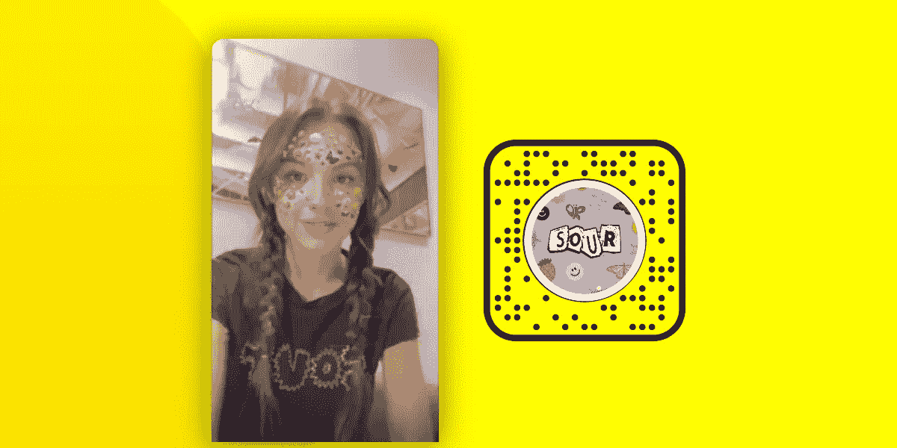
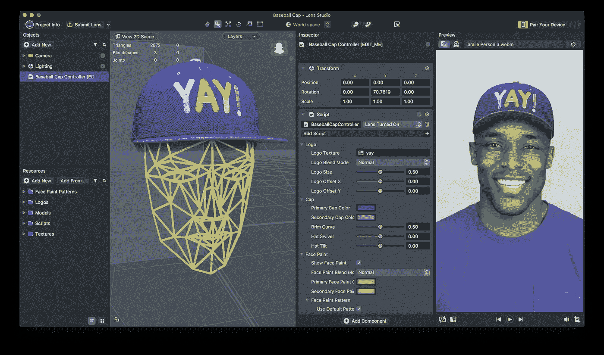
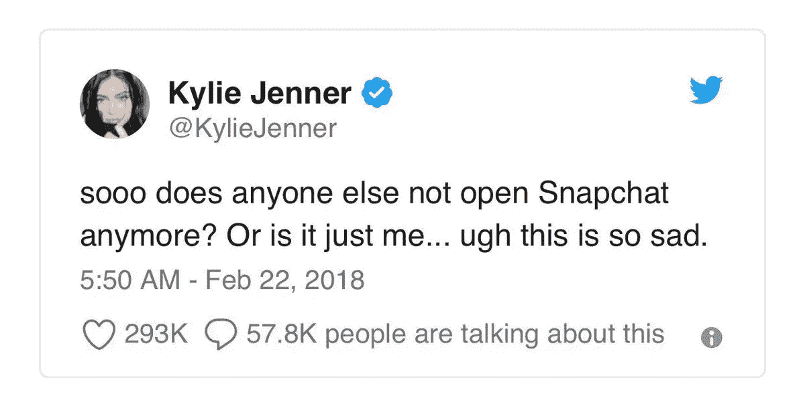
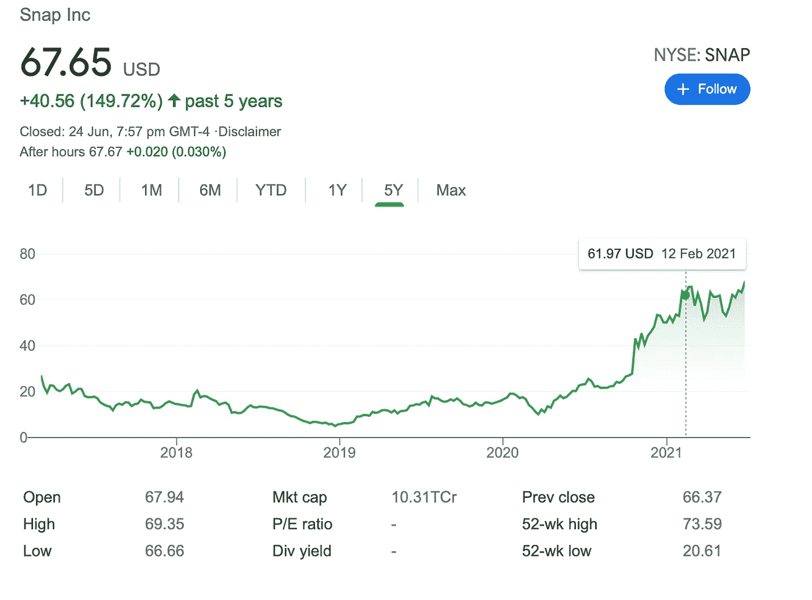

# Snapchat📱宣布与环球音乐公司合作

> 原文：<https://medium.com/nerd-for-tech/snapchat-announces-partnership-with-universal-music-401d5e2298cd?source=collection_archive---------27----------------------->

我们写了一份关于音乐及其背后的商业和技术的每日时事通讯。如果您想直接在您的收件箱中获得它，请立即订阅 [***！***](https://incentify.substack.com)

周五快乐！

昨天， **Snap Inc .和环球音乐集团宣布了一项为期多年的合作伙伴关系，**这是两家公司称之为“扩展的”和“多方面的”全球协议🤝

但它到底是什么呢？

该协议将允许 Snapchat 的用户将 UMG 的录制音乐和内容目录整合到创意工具中，包括**声音**和**增强现实功能镜头。**

根据多年协议的条款， **UMG 的全部录制音乐目录在全球范围内都可以通过 Snapchat 的**声音**功能获得，包括搜索和精选播放列表。**

但是“声音”的特征是什么呢？🤔

Snapchat 的 Sounds 于 2020 年 10 月推出，允许用户访问授权的歌曲库，以增强他们的相机体验，并作为病毒性社交媒体应用- **抖音的竞争对手。**

它在 Spotify、Apple Music 和 YouTube Music 等平台上发布流行歌星贾斯汀比伯的单曲《孤独》的前一天，在该平台上独家下架。

**UMG 还在开发增强现实音乐镜头**内容，该内容以该公司的艺术家为特色，将定期在 Snap 的**镜头转盘和镜头工作室**中提供，并有机会展示商品发布和电子商务体验

那么对艺术家来说，这里的附加值是什么？

流行歌星**奥利维亚·罗德里戈**已经使用该平台发布了多个视频，包括*驾照*，自发布以来，在 Snapchat 的镜头功能上创建的视频超过了**1000 万个，观看次数超过了**3.25 亿次**📈**

Rodrigo 是第一位在 Lens Studio 中使用 Snapchat 新的增强现实 VFX 技术的录音艺术家，为用户提供身临其境的体验，其中用户被她新发布的专辑*中的图形所覆盖。*

**

*事实上，一位艺术家可以使用 Snapchat 过滤器这样简单的东西来测试 waters，以帮助在稍后的流媒体数据中围绕他们的实际歌曲吸引量创造一个嗡嗡声。*

*如果用户在 Snapchat 上迷上了一个特定的过滤器，他们会与朋友分享，这就产生了一种飞轮效应,这种效应会级联到 Spotify 和 Apple Music 等其他流媒体平台。*

*让我们来看看这些数据量到底有多大——**Snapchat 估计，在其平台上平均每天有 40 亿张快照被交换**🤯*

*谈到新宣布的与 UMG 的合作，**本·施韦林，** Snap 的内容和合作伙伴 SVP 说:*

> ***“看到 Snapchatters 如此迅速地接受了我们的声音创作工具，以及它对音乐行业的巨大影响，令人兴奋不已**，因为他们发现了音乐，并与朋友和社区分享音乐。*

****

**Snap Inc 表示，它现在与一些主要的独立出版商和唱片公司有多年的协议，包括华纳音乐集团、索尼音乐、环球音乐出版集团、Kobalt 和 BMG 音乐出版公司。**

**这意味着可以访问数以千计的艺术家的内容，如**艾德·希兰、酷玩乐队、马多纳、大卫·盖塔、杰森·德鲁罗、金属乐队和 Led Zepellin。****

**我可以继续说下去，但你明白了。**

# **我们对此的看法？**

**Snapchat 早就被认为已经死亡。**

****自从凯莉·詹娜在 2018 年发推文痛斥该应用**以来，这一行为**导致其股价下跌 7%，市值缩水 18 亿美元**，似乎从未恢复。**

****

****Snapchat 做了一个重大的设计改变，**包括詹纳在内的许多用户注意到了这一点，**随着投资者开始注意到这一点，用户开始减少，最终证明这对该平台是致命的**。**

**Instagram 同时克隆 Snapchat 的“故事”功能，实际上意味着这是 Snap 棺材上的最后一颗钉子。**

**然而，在过去的一年里，Snap Inc .已经卷土重来，又是如何卷土重来的呢👇🏻**

****

**在 2020 年 3 月疫情引发的低点中，**股价上涨了近 7 倍**，其日活跃用户在 2021 年升至历史新高**2.8 亿**，2020 年最后一个季度**收入突破 9 亿美元**。([来源](https://www.businessofapps.com/data/snapchat-statistics/))**

**查看 Snap 推出的**最新合作伙伴关系和功能，以及支持它的收入、用户保留率和增长**；显而易见，与世界上最大的唱片公司之一的又一次合作只会促进 **Snap** 的复苏🚀**

****Snap 的联合创始人兼首席执行官埃文·斯皮格尔**一直坚持认为**他将 Snap 定位为“相机”公司，而不是社交媒体**，声音和镜头等功能使他们更接近他们的愿景:**

*****“重新发明相机，改善人们的生活和交流方式。”*****

****

**雄心勃勃对吗？**

****今天就到这里，祝你周末愉快**🍻(只是为了一年后在 Snapchat 上重温这些记忆🤪)**

***如果你喜欢这篇来自* [Incentify](https://incentify.substack.com) *的时事通讯，为什么不与你喜欢的人分享呢？***

***P.S-关注我们的*[***insta gram***](https://www.instagram.com/clubincentify/)*和*[***Twitter***](https://twitter.com/rohanagrwl)*了解更多关于音乐和文化的内容，现在！***

***原载于*[*https://incentify.substack.com*](https://incentify.substack.com/p/snap-announces-partnership-with-universal)*。***