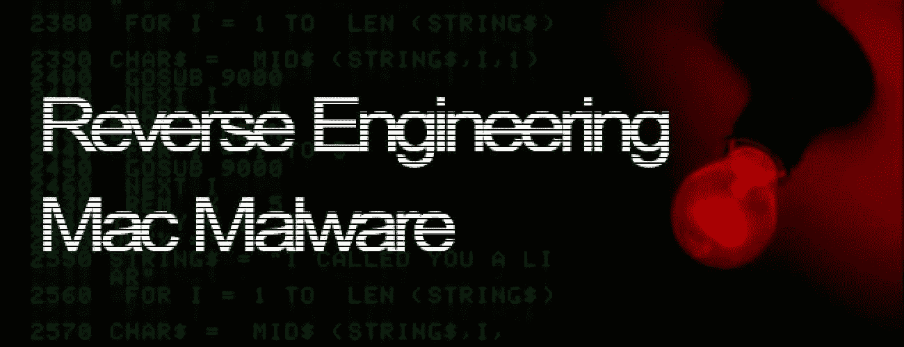

# 所以你想学反向恶意软件工程？

> 原文：<https://medium.com/nerd-for-tech/so-you-want-to-learn-reverse-malware-engineering-445a5a982068?source=collection_archive---------0----------------------->

图像[来源](https://167974-484938-raikfcquaxqncofqfm.stackpathdns.com/storage/131/responsive-images/reverse-engineering-mac-malware-big___medialibrary_original_1300_500.jpg)

随着我对攻击性安全的探索，我已经接触到了各种各样的职业道路。反向恶意软件工程是我觉得非常有趣和极具挑战性的事情。我绝不是这方面的专家；我认为自己是初学者。反向恶意软件工程正在与不同的组件合作，以了解对手如何能够入侵价值数十亿美元的公司，并且像网络安全管理软件产品黑客那样在 7 个月内未被检测到。

除了我在本文中提到的材料之外，我还在卡内基梅隆大学修了一门叫做恶意代码分析的恶意软件课程，这是我在那里读研究生时学的。我认为这是一个你每天都能学到新东西的领域，需要终生学习。如果你想在 InfoSec 工作，这是一个必要的技能和愿望。

这篇文章的重点是提供一个新颖的反向恶意软件工程师的见解，以及帮助我学习和获得新技能的东西。有几个有用的在线资源，但这是我决定开始的地方。先从书说起吧。

# 实用恶意软件分析:剖析恶意软件的实践指南

有各种各样的伟大的书籍在那里学习反向恶意软件工程。这方面的几位专家向我推荐了这本书。这本书提供了基础知识，对初学者来说是一个很好的资源。有实验室和伟大的内容通过一个 [**GitHub**](https://github.com/mikesiko/PracticalMalwareAnalysis-Labs) 储存库包含的工作旁边的书。我很喜欢使用这本书，当我有其他问题时，可以用谷歌来补充。

 [## 实用恶意软件分析:剖析恶意软件的实践指南

### 实用恶意软件分析:剖析恶意软件的实践指南

amzn.to](https://amzn.to/3Vqk2EX) 

我推荐的下一个资源是视频教程。前 5 个小时可以在 YouTube 上找到，但其余内容可以购买[**【30 美元】**](https://academy.tcm-sec.com/p/practical-malware-analysis-triage) 。我没有问题购买这个，因为我认为这是一个伟大的课程。我推荐在 这里查看 [**的课程概述。**](https://academy.tcm-sec.com/p/practical-malware-analysis-triage)

**课程**:哈士奇 [YouTube 频道](https://www.youtube.com/channel/UCtJgZIyoZ0wIKEzctj_8pZQ)——**PMAT**

我对这门课程的评价再高也不为过！马特基利是教练，他做了惊人的工作，至少可以说。Matt 有着丰富的经验，能够让话题变得平易近人、切实可行。恶意软件分析是一个技术性很强的工作领域，需要很强的基础知识。如果您不熟悉虚拟机、linux 命令行和网络，那么可能需要您寻找额外的资源。本课程利用虚拟机来创建一个使用 Windows 和 Linux 进行分析的安全环境。主工具集是一个 Windows box，安装了 [**Flare 工具**](https://github.com/mandiant/flare-vm) 和 Linux [**ReMnux**](https://docs.remnux.org) 用于模拟网络，进行网络流量捕获和分析。课程内容上传到 husky hacks[**GitHub**](https://github.com/HuskyHacks/PMAT-labs)页面。

整个课程都是关于购买 TCM 安全性的。如果你有兴趣学习反向恶意软件工程，给马特一些支持购买课程！以下是本课程中我最喜欢的一些话题:

*   编写恶意软件脚本— Python 和 PowerShell
*   使用 Flare 工具包进行高级静态和动态分析
*   通过 Python 和 Jupyter Notebook 自动进行恶意软件分类
*   移动恶意软件— Android
*   逆转 WannaCry 勒索病毒
*   反转反转壳和持久性

前面说过，我不是专家，但希望上面的资源能在你的学习之旅中帮到你。对恶意软件工作原理的理解将会让你在 InfoSec 的任何工作都受益匪浅。我的下一步计划是利用我在本课程中学到的技能，并通过在像**t**[**heZoo**](https://github.com/ytisf/theZoo)**这样的网站上找到的更多恶意软件样本来继续学习。如果您有任何进一步的建议或您使用过的资源，请在下面留下您的评论。**

这篇文章包含附属链接。如果你觉得我的内容有帮助，我会感谢你的支持！

干杯，

制革工人