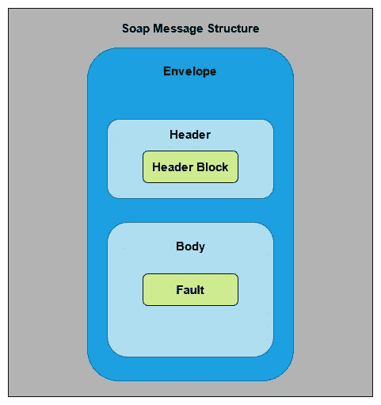
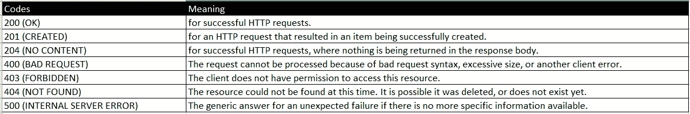
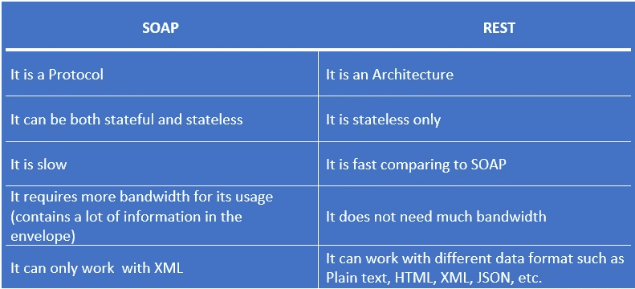
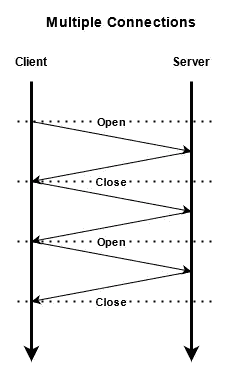
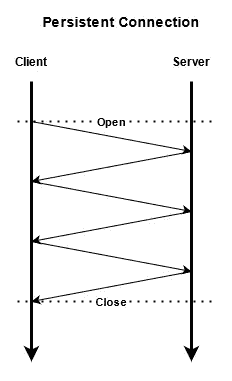
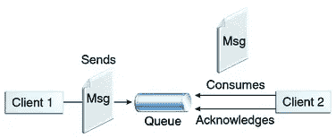
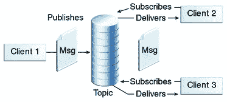

# SOAP、REST 和消息代理的重要性

> 原文：<https://medium.com/nerd-for-tech/soap-rest-and-the-importance-of-message-brokers-77e2fb2e6b17?source=collection_archive---------6----------------------->


在本文中，我将讨论 **SOAP** 和 **REST** 。让我们从一个简单的例子开始:人类交流。语言(书面语和口语)、手势和面部表情都可以用来描述我们的思想、需求和想法。与计算机、应用程序和网站进行交互需要用户界面组件，如带有菜单和图形元素的屏幕、键盘和鼠标。为了相互交互，软件或其组件不需要 GUI，这就是 **API** 的用武之地。 **API** 是一个软件中介，允许两个应用程序相互对话，它代表**应用程序编程接口。这就像餐馆里的服务员一样。所以我们通过服务员下订单，他或她会传递订单，一旦食物准备好，服务员会把食物送到我们这里。现在我想你已经理解 API 背后的思想了。**

如果你想了解更多关于 API 的信息，

因此，对于在线数据传输，有两种常见的方法，如 SOAP 和 REST。我们来讨论一下，

# 肥皂

SOAP 代表**简单对象访问协议**，它是一个标准的 web 通信**协议。** SOAP 编程基于 XML 语言，它本身就是一种轻量级数据传输语言。它主要用于公开 web 服务和通过 HTTP(超文本传输协议)/HTTPS、SMTP(简单邮件传输协议)等传输数据。当创建基于 SOAP 的 Web 服务时，您将需要一种可用于与客户端应用程序通信的语言。SOAP 是实现这一目标的优秀工具。负责所有 web 标准的 W3C 组织也推荐这个协议。SOAP 可以管理通信并提供独立于语言和平台的响应，因为它内置了创建基于 web 的服务的能力。

> XML 代表语言。它是一种基于文本的标记语言，源自标准通用标记语言(SGML)。

标准的 SOAP API 请求和响应显示为一个包含四个组件的包装消息，每个组件都有自己的一组功能。



Soap 消息结构

信封是每封邮件的主要部分，它以标签开始和结束邮件。

**报头**是一个可选部分，用于确定消息的额外组成部分，如认证。

**正文**包括请求或响应。

**Fault** 是一个可选组件，显示 API 请求和响应期间可能发生的任何问题的完整信息。

```
<?xml version="1.0" encoding="UTF-8"?>
<soapenv:Envelope
        xmlns:soapenv="http://schemas.xmlsoap.org/soap/envelope/"
        xmlns:xsd="http://www.w3.org/2001/XMLSchema"
        xmlns:xsi="http://www.w3.org/2001/XMLSchema-instance">
  <soapenv:Header>
    <ns1:RequestHeader
         soapenv:actor="http://schemas.xmlsoap.org/soap/actor/next"
         soapenv:mustUnderstand="0"
         xmlns:ns1="https://www.google.com/apis/ads/publisher/v202105">
      <ns1:networkCode>123456</ns1:networkCode>
      <ns1:applicationName>DfpApi-Java-2.1.0-dfp_test</ns1:applicationName>
    </ns1:RequestHeader>
  </soapenv:Header>
  <soapenv:Body>
    <getAdUnitsByStatement >
      <filterStatement>
        <query>WHERE parentId IS NULL LIMIT 500</query>
      </filterStatement>
    </getAdUnitsByStatement>
  </soapenv:Body>
</soapenv:Envelope>
```

这个*是*Google Ad Manager 中 SOAP XML 请求调用的一个例子。来源:[谷歌广告经理](https://developers.google.com/ad-manager/api/soap_xml)。

SOAP 通常与基于 web 的商业软件一起使用，以维护数据安全。支付网关、身份管理和 CRM 系统，以及银行和通信服务都青睐 SOAP APIs。

# 休息

在 2000 年之前，没有关于如何开发或利用 API 的标准。它的集成需要使用 SOAP 之类的协议，这些协议很难开发、操作和调试。当 Web APIs 的实际潜力在 2000 年被发现时，由 Roy Fielding 领导的一组专家设计了 REST，永远地改变了 API 环境。REST 代表**具象状态转移**，这是一个**架构**。声明的目标是建立一个简单的标准，允许两台服务器在地球上的任何位置进行交互和共享数据。因此，他们制定了一些原则。这支持不同格式的消息传递，比如 HTML、csv、XML、xls/xlsx 和 JSON，而 SOAP 只允许 XML。其中 JSON 是最受欢迎的，因为它对人和机器都可读。通常在 API 中它的**请求**或**响应**。**头**和**参数**在 HTTP 请求中也很重要。一个 API 要被认为是 RESTful 的，有一组标准必须得到确认。比如，

*   应该有一个客户机-服务器架构(包括客户机、服务器和通过 HTTP 管理请求的资源)。
*   它必须是无状态的通信。
*   可缓存的数据，简化了客户端与服务器的交互，缩短了请求的响应时间。
*   应该维护组件的统一接口。(在传递信息时保持标准格式)。
*   每种类型的服务器都使用分层体系结构来组织。

> 无状态意味着服务在获取请求时不应该在服务器上保存客户端信息，并且每个请求之间没有连接。

在 REST 中，客户端向服务器发送(获取或更改数据)请求，服务器将响应这些请求。在发出请求时，有 4 个基本的 HTTP 动词与 REST 中的数据交互，

*   获取—检索数据(也可以通过指定 id 来获取数据)
*   发布-创建新的数据记录
*   PUT —根据我们传递的 id 更新特定的数据
*   删除—根据我们传递的 id 删除特定数据

> 在处理 REST 架构时，我们还需要研究**头、参数、**和**路径**。

以上 4 种方法也称为 **CRUD** 操作。要了解更多关于 CRUD 的信息，请点击下面的链接，

[](https://www.codecademy.com/articles/what-is-crud) [## 什么是 CRUD？代码学院

### 当我们构建 API 时，我们希望我们的模型提供四种基本类型的功能。该模型必须能够…

www.codecademy.com](https://www.codecademy.com/articles/what-is-crud) 

因此，作为响应，服务器将发送客户端所需的相应数据，它还将发送 **HTTP 响应代码**，这有助于识别来自服务器的响应类型。让我们看看一些最常见的代码，



响应代码及其含义

让我们看看请求和响应是什么样子的，

> 有网站做虚拟 API 请求，我正在做的一个来自 https://dummy.restapiexample.com/的

假设我们要创建一个新记录，例如，我们应该在某个端点下使用 POST 请求，

终点—[http://dummy.restapiexample.com/api/v1/create](http://dummy.restapiexample.com/api/v1/create)

```
{
"name":"test",
"salary":"123",
"age":"23"
}
```

在上面的代码中，我使用了 POST 方法，它是 JSON 格式的。

假设我们需要获取特定的数据，那么我们必须指定要获取的记录的 id，例如，让我们从“http://dummy . restapi example . com/API/v1/employee/1”获取它。如你所见，我在端点中提到了 id 1。

这是回应的样子。实际上，关于剩下的内容还有很多要说的，将在以后的文章中讨论。

那么 SOAP 和 REST 有什么区别。让我们看一看，



REST 和 SOAP 的比较

你知道 HTTP 有很多版本，如果你考虑一下 **HTTP 1.0，**它只允许每个连接一个请求或响应。这很费时间。如果有 3 个请求来自客户端，服务器将按照它们的顺序响应，如下图所示，



HTTP 1.0

当 **HTTP 1.1** 到来时，它允许在一个连接中有多个请求和响应(持久连接)。为每个请求建立连接可以节省很多时间。在这里，对于每个请求，连接头值将被设置为“`Keep-Alive`”，以提醒服务器不要终止连接。

```
HTTP/1.1 200 OK
**Connection: Keep-Alive**
Content-Encoding: gzip
Content-Type: text/html; charset=utf-8
Date: Thu, 11 Aug 2016 15:23:13 GMT
**Keep-Alive: timeout=5, max=1000**
Last-Modified: Mon, 25 Jul 2016 04:32:39 GMT
Server: Apache

(body)
```

上一节是如何在连接头中设置 Keep-alive 值的示例。(摘自:[https://developer . Mozilla . org/en-US/docs/Web/HTTP/Headers/Keep-Alive](https://developer.mozilla.org/en-US/docs/Web/HTTP/Headers/Keep-Alive))

所以 HTTP 1.1 的流程将如下图所示，



那么你可以问连接将如何终止？这就是 **TCP** ( **传输控制协议** l)报头标志出现的原因。在 **TCP** 报头中，有 6 个标志(URG，ACK，PSH，RST，SYN，FIN)。所以客户端会将 **FIN** 的值设置为 1 来关闭连接。这有助于发送请求而无需等待确认。但是服务器仍然按照它到达的顺序来响应它们。尽管 RESTful 是异步的，但它仍然像同步一样工作，因为 REST 工作在 HTTP 之上。所以为了克服这个**消息，应该实现消息代理**。那么什么是**消息代理呢？。**

# 消息代理

互联网上一般的定义是“**消息代理(message broker)是一种使应用程序、系统和服务能够相互通信并交换信息的软件”。**实际情况是，假设有一个客户端和一个服务器(没有消息代理)，客户端发送 A、B、C、d 四个请求，这些请求的处理时间分别为 100ms、5ms、10ms、10ms。让我们假设这些请求是同时到来的。C 的响应时间会是多少？是 115ms。因为即使 C 在 A 之前完成它的执行，响应也将按照它接收的顺序发送。因此，当我们在这个场景中使用 Message Broker 时，它作为一个中间部分工作。因此，只要执行完成，服务器就会将响应发送到消息代理的消息队列。客户机将监听消息代理，一旦消息代理从服务器获得响应，它将立即将其发送给客户机。因此客户端不需要等到其他先前的请求完成。所以根据这个场景，使用消息代理时，C 的响应时间将是 10ms。正如你所看到的，最终消息代理使 REST 异步。

有两种消息代理模型，

*   **点对点消息传递** —这基本上是生产者和消费者之间一对一的关系，它使用一个**队列**来存储消息。生产者将消息发送到队列，消费者从队列中获取消息并确认收到。几个生产者可以将消息发送到同一个队列，几个消费者可以从同一个队列中检索消息。但这仅适用于消息必须只使用一次的情况。



(来源:[https://docs . Oracle . com/CD/e 19798-01/821-1841/6 nmq 2 CPP 7/index . html](https://docs.oracle.com/cd/E19798-01/821-1841/6nmq2cpp7/index.html))

*   **发布/订阅消息**—这是一种广播式的分发方法，生产者和消费者之间是一对多的关系。在这种模式下，生产者被称为发布者，而客户被称为订阅者。同一个主题，一个或多个发布者可以发布，一个或多个发布者的消息可以到达大量订阅者。主题由订阅者订阅，提交给主题的所有通信都由所有主题订阅者接收。



(来源:[https://docs . Oracle . com/CD/e 19798-01/821-1841/bnced/index . html](https://docs.oracle.com/cd/E19798-01/821-1841/bnced/index.html))

当谈到使用消息代理的优势时，

*   它提供了服务之间的无缝连接。
*   它通过提供异步处理来提高系统的性能。
*   它通过保证消息的传输来增加可靠性。

**RabbitMQ、Apache Kafka、Redis、亚马逊 SQS、**和**亚马逊 SNS** 是消息代理的一些例子。在 Java 中，有一种叫做 **JMS** 的东西，它代表 Java 消息服务。它是一种规范，也是消息服务之一。为此，我们需要使用 **JMS API** (由 Sun 和几个合作伙伴公司设计)，它允许应用程序创建、发送、接收和读取消息。

我希望您对 SOAP、REST 和消息代理有一定的了解。

# 参考

[](https://www.altexsoft.com/blog/engineering/what-is-api-definition-types-specifications-documentation/) [## 什么是 API:定义、类型、规范、文档

### 如果你读过科技杂志或博客，你可能会看到缩写 API。这听起来很可靠，但是它…

www.altexsoft.com](https://www.altexsoft.com/blog/engineering/what-is-api-definition-types-specifications-documentation/) [](https://www.codecademy.com/articles/what-is-rest) [## 什么是休息？代码学院

### REST 或表述性状态转移是一种架构风格，用于在计算机系统之间提供标准…

www.codecademy.com](https://www.codecademy.com/articles/what-is-rest) [](https://altexsoft.medium.com/what-is-soap-formats-protocols-message-structure-and-how-soap-is-different-from-rest-826ce9de6b48) [## 什么是 SOAP:格式、协议、消息结构，以及 SOAP 与 REST 有何不同

### 每次你用你的脸书帐户登录网站或者在谷歌地图上拖动一个下拉大头针…

altexsoft.medium.com](https://altexsoft.medium.com/what-is-soap-formats-protocols-message-structure-and-how-soap-is-different-from-rest-826ce9de6b48) [](https://www.mobapi.com/history-of-rest-apis/) [## REST APIs 的历史

### 如今，只需点击一下鼠标，整合图片，发微博，或者在云中存储 5tb 的数据，这些都是很容易的操作…

www.mobapi.com](https://www.mobapi.com/history-of-rest-apis/) [](https://help.theatremanager.com/theatre-manager-online-help/rest-api-output-formats) [## REST API 输出格式

### REST API 的默认输出格式是人类可读且可导航的 html 格式。这并不总是…

help.theatremanager.com](https://help.theatremanager.com/theatre-manager-online-help/rest-api-output-formats) [](https://www.redhat.com/en/topics/api/what-is-a-rest-api) [## 什么是 REST API？

### REST 是一组架构约束，而不是协议或标准。API 开发者可以在一个…

www.redhat.com](https://www.redhat.com/en/topics/api/what-is-a-rest-api) [](https://www.ibm.com/cloud/learn/message-brokers) [## 什么是消息代理？

### 消息代理使应用程序、系统和服务能够通信和交换信息，通过翻译…

www.ibm.com](https://www.ibm.com/cloud/learn/message-brokers) [](https://www.tibco.com/reference-center/what-is-a-message-broker) [## 什么是消息代理？

### 消息代理是一个独立的服务，可以提供数据编组、路由、消息翻译、持久性和…

www.tibco.com](https://www.tibco.com/reference-center/what-is-a-message-broker) [](https://tsh.io/blog/message-broker/) [## Message broker -完整的专业知识、使用案例和分步指南| TSH.io

### 现代应用程序变得越来越复杂。耗费时间和资源的操作，通信之间…

tsh.io](https://tsh.io/blog/message-broker/) [](https://dzone.com/articles/java-message-service-1) [## 什么是 Java 消息服务？- DZone Java

### 在本文中，我们试图了解更多关于 Java 消息服务(JMS)的信息。JMS 代表 Java 消息服务。作为…

dzone.com](https://dzone.com/articles/java-message-service-1) [](https://docs.oracle.com/javaee/6/tutorial/doc/bncdr.html) [## JMS API 概述 Java EE 6 教程

### 该概述定义了消息传递的概念，描述了 JMS API 以及何时可以使用它，并解释了 JMS 如何…

docs.oracle.com](https://docs.oracle.com/javaee/6/tutorial/doc/bncdr.html)