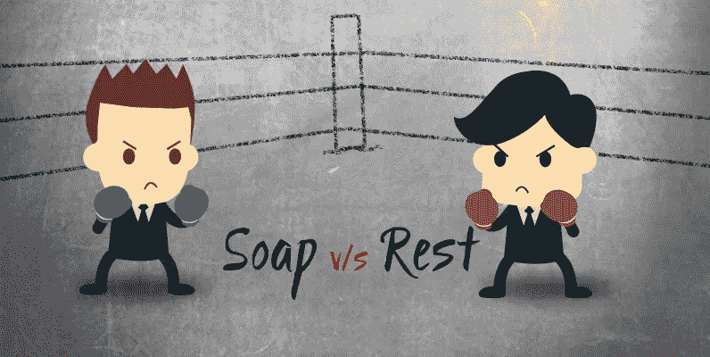
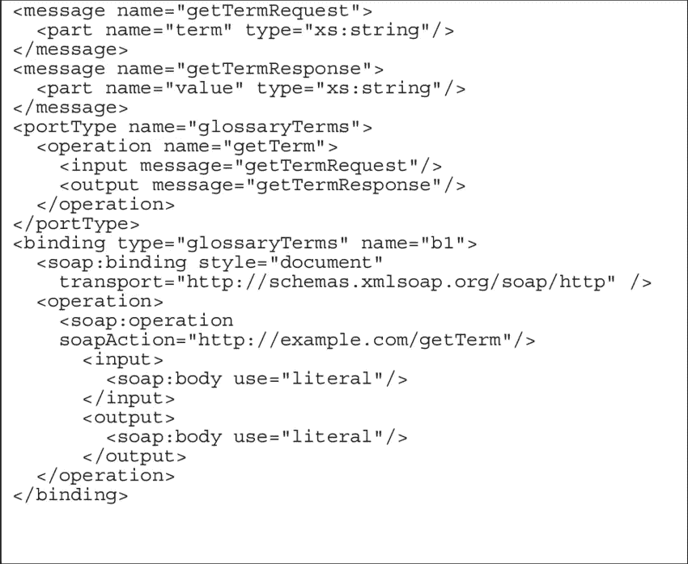
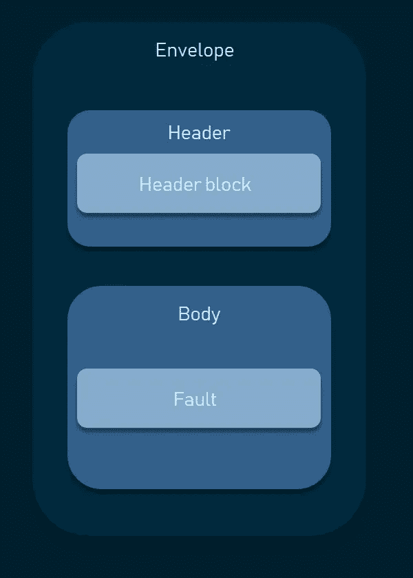
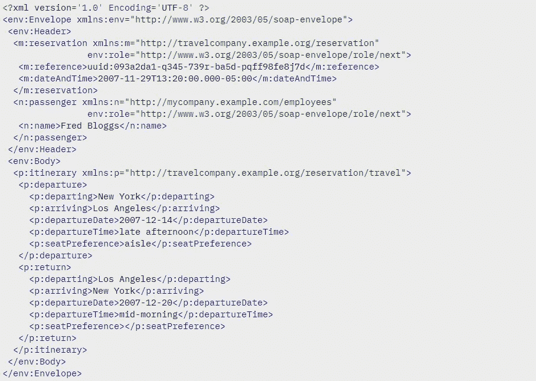
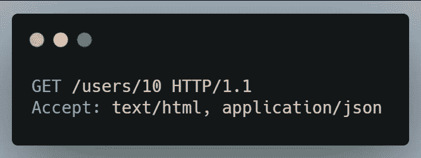
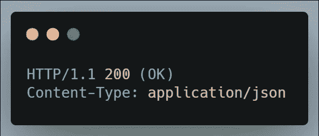
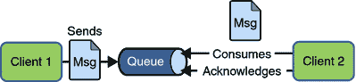

# SOAP、REST 和消息代理的需求？？

> 原文：<https://medium.com/nerd-for-tech/soap-rest-and-the-need-of-message-brokers-8d0eb1327215?source=collection_archive---------3----------------------->

来源([https://dzone . com/articles/soap-vs-rest-API-a-comparative-analysis](https://dzone.com/articles/soap-vs-rest-api-a-comparative-analysis))

当你谈论 SOAP 和 REST 时，首先，你需要理解是什么导致了这两个术语。企业应用程序是由大型企业或企业网络使用的软件系统。他们通常涉及到，

*   数据的持久性。
*   拥有大量数据。
*   由许多并发用户访问。
*   有许多用户界面。
*   与分散在企业或业务网络中的其他企业应用程序集成。
*   与其他企业应用程序互操作。

当我们谈到企业应用程序架构的发展时，首先，我们有独立的大型机遗留系统，然后我们有 2 层和 3 层客户机-服务器架构。然后，我们进入所谓的面向服务的架构(SOA)。

# 什么是面向服务的架构(SOA)

面向服务的架构(SOA)是一种架构风格，其中现有的或新的功能被分组到原子服务中。换句话说，面向服务的架构定义了一种通过服务接口使软件组件可重用和可互操作的方法。服务使用通用的接口标准和架构模式，因此它们可以快速地集成到新的应用程序中。这消除了应用程序开发人员以前重新开发或复制现有功能或必须知道如何连接或提供与现有功能的互操作性的任务。发明 SOA 的一些主要原因是:

*   **本地和远程系统之间的紧密耦合**需要大量的带宽需求(例如:- CORBA，EJB，DCOM 引入了高度耦合的 RPC)。
*   **互操作性问题**主要是由于不同语言的数据类型不兼容(EJB 和 DCOM 被绑定到特定的平台上，根本不能互操作)。

那么 SOAP 和 REST 是如何连接这个 SOA 的呢？ **SOAP** 和 **REST** 是 **Web 服务**方法，被用作**通信技术来构建 SOA** 。SOAP 是**面向服务的 Web 服务**，REST 是**面向资源的 Web 服务**。

# 简单对象访问协议(SOAP)

SOAP 是一种消息协议，用于在计算机网络中以 web 服务的形式交换结构化信息。使用 **XML** 作为其消息格式，并依赖于应用层协议，如超文本传输协议(HTTP)和简单邮件传输协议(SMTP)进行传输。SOAP 允许开发人员调用运行在不同操作系统(如 Windows、macOS 和 Linux)上的进程，使用 XML 进行身份验证、授权和通信。由于像 HTTP 这样的 web 协议安装并运行在所有操作系统上，SOAP 允许客户端调用 Web 服务并接收响应，而与语言和平台无关。SOAP 必须与 **UDDI** 和 **WSDL** 一起工作，用于**服务注册中心**、**服务提供者**和**服务消费者**功能的操作。

*   **WSDL:** XML 格式，描述什么是输入和输出消息，以及如何将这些消息打包(绑定)到 SOAP 信封中的不同协议。
*   **UDDI:** UDDI 是一个基于 XML 的标准，用于描述、发布和查找 web 服务。

XML 中的 WSDL 表示

图 1:服务注册中心、服务提供者和服务消费者功能

通常，SOAP 消息是由以下元素组成的 XML 文档:

*   **信封:**定义消息的开始和结束。这是一个强制性的要素。
*   **Header:** 包含与 SOAP 请求或响应消息相关联的特定于应用程序的信息(例如，安全或加密信息)。它是一个可选元素。
*   正文:包含正在传输的消息的 XML 数据。这是一个强制性的要素。
*   **Fault:** 可选的 Fault 元素，提供处理消息时出现的错误信息。

默认情况下，SOAP 本质上是同步的，但是根据不同的企业集成模式，可以实现同步和异步服务调用。

图 2: SOAP 消息概述

XML 格式的 SOAP 消息

# 表征状态转移(REST)

REST 是一种**架构风格**，其中客户端和服务器实现可以相互独立；这被称为**关注点分离**。此外，这种分离允许每个组件独立发展。当不同的客户端访问相同的 REST 端点时，执行相同的操作，并接收相同的响应。RESTful 服务也是**无状态的**，这意味着服务器不需要知道客户端处于哪个状态，反之亦然。通过使用资源，这是可能的。**资源**是您需要存储或发送给其他服务的对象、文档或实体。因此，它们不依赖于接口的实现。其余的是架构规范，它不像在 SOAP 中那样强制执行我们必须遵循的严格规则或官方标准。

在 REST 架构中，客户端将向服务器发送请求，服务器将修改请求中提到的资源。通常，请求包括:

*   **HTTP 请求方法**，定义要执行哪种操作。
*   **头，**允许客户端传递关于请求的信息。
*   资源的**路径**。
*   包含数据的可选**消息体**。

## HTTP 请求方法

*   **GET:** 这些请求用于从服务器检索数据。
*   **POST:** 该方法用于将实体发送到指定的资源，通常会导致服务器上的状态发生变化。
*   **PUT:** 这个方法用请求负载替换目标资源的所有当前表示。通常，用于更新数据。
*   **删除:**该方法用于删除指定的资源。
*   **补丁:**该方法用于对资源进行部分修改。在更新服务器中现有资源的属性时使用。

这些是在 RESTful 服务中构建 CRUD 操作时使用的主要方法。还有一些其他的方法如**头**、**连接**、**选项**、**跟踪**。你可以在[https://developer.mozilla.org/en-US/docs/Web/HTTP/Methods](https://developer.mozilla.org/en-US/docs/Web/HTTP/Methods)找到更多细节。

## 头球

在请求的报头中，**接受**字段代表；服务器可以在响应中发送的内容类型。这将确保服务器不会发送客户端不理解的数据。

当向客户端发送数据有效负载时，服务器必须在响应的报头中包含一个**内容类型**。这个 content-type 头通知客户机在响应中接收什么类型的数据。服务器在响应中发回的内容类型应该与客户机在请求中指定的 accept 字段相匹配。

客户端在请求头中设置接受字段

服务器在响应头中设置内容类型字段

## 小路

在 RESTful API 操作中，请求应该包含资源的路径，这些路径应该被设计成帮助客户端理解正在发生的事情。如果您发出一个 get 请求来检索一个 ID 为 10 的用户，那么 Path 应该是 fashionbug.com/user/:id.的**GET**Where】:ID”是我们在调用 GET 请求时传递的路由参数。

## 响应代码

HTTP 响应状态代码帮助客户端识别 HTTP 请求是否成功。响应分为以下五类:

1.  信息回复(100–199)
2.  成功回答(200–299)
3.  重定向(300–399)
4.  客户端错误(400–499)
5.  服务器错误(500–599)

图 SOAP 与 REST 的比较

## 要点

🔸在 **HTTP 1.0** 中，它为每个请求使用一个短暂的连接。对于每个请求，都会创建一个新的连接，然后在收到响应后关闭。主要问题是它消耗了打开和关闭连接的时间。除此之外，HTTP 1.0 按照接收请求的顺序响应请求。

🔸作为对此的解决方案， **HTTP 1.1** 引入了**持久连接**和**流水线**。持久连接在连续请求之间保持连接打开，减少了打开新连接所需的时间。流水线有助于发送几个请求，甚至不需要等待应答，减少了网络中的延迟。但是 HTTP 1.1 在 HTTP 1.0 的基础上做了这些修改，因为没有重大的变化。因此，即使向服务器发送了几个连续的请求，服务器也会按照收到请求的顺序进行回复。

🔸因此，尽管 RESTful 架构指定它提供异步通信，因为它使用 HTTP 1.1 作为协议，但我们设计的 REST APIs 仍然同步工作。为了实现异步特性，我们必须使用中间服务调用**消息代理**。

# 消息代理

消息代理使应用程序和服务能够相互通信并交换信息。Message Broker 通过在正式的消息传递协议之间转换消息来实现这一点。这允许相互依赖，即使它们用不同的语言编写或在不同的平台上实现。最重要的是，它有助于实现；

*   松散耦合通信
*   异步消息传递
*   可靠传递(一条消息保证传递一次，且仅传递一次)。

消息代理可以使用消息中间件或面向消息的中间件(MOM)解决方案来验证、存储、路由和交付消息到适当的目的地。它充当其他应用程序之间的中介。因此，发送方可以在不知道接收方位置的情况下发送消息，也不用担心接收方的活动状态。这有助于系统内流程和服务的分离。消息代理提供两种不同风格的消息传递，称为**点对点**和**发布者/订阅者**消息传递。

## 点对点消息传递

在点对点模型中，一条消息**只传递给一个接收者**。作为面向消息的中间件(MOM)，使用了一个**队列**。队列负责保存消息，直到接收者准备好。发送方和接收方没有**时序相关性**。当客户端发送消息时，无论消息是否正在运行，接收者都可以获取消息。

图 4:点对点消息传递

## 发布者/订阅者(发布/订阅)消息传递

在发布/订阅模式中，一条消息**被传递给所有的订阅者**。就像广播一样。作为面向消息的中间件，使用了一个**主题**。主题负责保存和传递消息。发布者和订阅者有**时间依赖性。**客户端只能使用其订阅后发布的消息，并且必须保持活动状态才能使用这些消息。

图 5:发布者/订阅者(发布/订阅)消息传递

市场上有不同种类的消息经纪人，如 **Kafka** 、 **RabbitMQ** 、**亚马逊 SQS** 、 **Google Pub/Sub** 等。下面列出了每个消息代理的概述。

## 阿帕奇卡夫卡

它最初被设计为一个消息队列。该软件作为一个事件流平台迅速流行起来。无论哪里需要消息队列或消息代理系统，Kafka 都是一个不错的选择。下面列出了一些主要功能:

*   允许发布和订阅记录流。
*   使用容错方法存储记录流。
*   允许应用程序解耦。
*   它很容易得到。
*   在管理实时数据传输时，它提供了高吞吐量。
*   仅支持异步通信。

## 兔子 q

它是用 Erlang 编写的，最初是为高级消息队列协议(AMQP)设计的，但已经更新为支持其他协议，包括 STOMP 和 MQTT。下面列出了一些主要功能:

*   支持消息传递技术，如**发布-订阅**、**点对点**和**请求-回复消息传递**。
*   可以实现同步和异步通信模式。
*   确保可靠性交付确认。
*   通过在群集的多个节点上复制队列，可以确保高可用性。因此，即使在硬件故障的情况下，消息也不会丢失。

## 亚马逊 SQS

亚马逊 SQS 是由亚马逊提供的完全托管的分布式消息队列服务。它具有成本效益，并提供简单的技术来管理运行在云中的系统的软件组件之间的通信。下面列出了一些主要功能:

*   自动扩展到工作负载的大小。
*   随着需求的增长，只为您阅读和撰写的邮件付费。
*   您可以在标准队列和 FIFO 队列之间选择。
*   FIFO 队列确保消息按照发送的顺序准确地传递和处理一次。
*   “死信”队列有助于维护未处理消息。
*   支持同步和异步通信。

## 谷歌发布/订阅

Google Cloud Pub/Sub 是一种异步消息服务，用于在独立的应用程序之间发送和接收消息。由于可靠的消息存储和实时消息传递的低延迟，它是分发事件通知、从不同设备传输数据的完美应用程序。下面列出了一些主要功能:

*   它提供低延迟和高吞吐量。
*   支持推和拉消息传递。
*   高度可靠，因为每封邮件都存储在多个服务器上。
*   高度可伸缩，每秒支持 10，000 条消息
*   传递和存储的消息都是加密的。
*   仅支持异步通信。

# 参考

要进一步了解详情，请查看这些资源；

*   [https://medium . com/double-pointer/Kafka-vs-ActiveMQ-vs-rabbit MQ-vs-Amazon-SNS-vs-Amazon-SQS-vs-Google-pub-sub-4b 57976438 db](/double-pointer/kafka-vs-activemq-vs-rabbitmq-vs-amazon-sns-vs-amazon-sqs-vs-google-pub-sub-4b57976438db)
*   [https://www.ibm.com/cloud/learn/message-brokers](https://www.ibm.com/cloud/learn/message-brokers)
*   [https://www . altex soft . com/blog/engineering/what-is-soap-formats-protocols-message-structure-and-how-soap-is-different-from-rest/](https://www.altexsoft.com/blog/engineering/what-is-soap-formats-protocols-message-structure-and-how-soap-is-different-from-rest/)
*   [https://www.codecademy.com/articles/what-is-rest](https://www.codecademy.com/articles/what-is-rest)