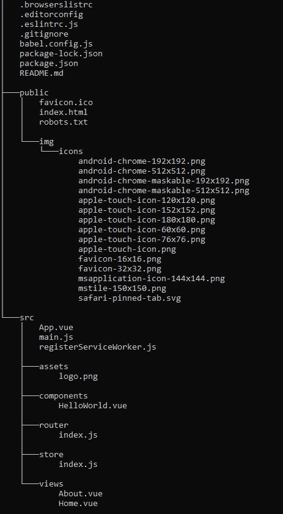

# 带有 Vue.js 和 GO 的社交应用

> 原文：<https://medium.com/nerd-for-tech/social-application-with-vue-js-and-go-64b3adee8dac?source=collection_archive---------1----------------------->


标志归功于 vuejs.org 和 golang.org

## 用 vue.js 和 golang 创建和服务一个类似 twitter 的应用程序第 2 部分:vue 入门

这是本系列的第二部分。在这里检查所有零件:

*   [第一部分:设置](https://ivano-dalmasso.medium.com/social-application-with-vue-js-and-go-4e4db0cdde64)
*   第二部分:VUE 入门(本)
*   [第三部分:组件&插槽](https://ivano-dalmasso.medium.com/social-application-with-vue-js-and-go-24a1d1e7137d)
*   [第四部分:Vuex 首次设置](https://ivano-dalmasso.medium.com/social-application-with-vue-js-and-go-3a11d506fc38)
*   [第 5 部分:VUEX 终结](https://ivano-dalmasso.medium.com/social-application-with-vue-js-and-go-ef364b572422)
*   [第 6 部分:Vuex 中的表格和数据](https://ivano-dalmasso.medium.com/social-application-with-vue-js-and-go-a22a1afb76eb)
*   [第七部分:与 golang 服务器的连接](https://ivano-dalmasso.medium.com/social-application-with-vue-js-and-go-d9e563466b66)
*   [第 8 部分:基于令牌的认证](https://ivano-dalmasso.medium.com/social-application-with-vue-js-and-go-64978f7c381f)
*   [第 9 部分:存储索引为 DB 的认证令牌](https://ivano-dalmasso.medium.com/social-application-with-vue-js-and-go-4d0caa37ddac)

在本课中，我们将删除由 vue CLI 自动创建的大部分代码，并添加一些我们自己的代码。

这里的主要目标是更新前端项目，你可以在这里找到代码。

## 项目结构

在继续编码和其他东西之前，让我们回顾一下我们正在处理的前端项目结构。如果您遵循了最后一个故事，或者只是下载了其中的代码，您应该会发现自己处于以下情况



文件夹的结构

您还应该找到一个 node_modules 文件夹，它实际上包含随 npm 一起安装的实际节点模块，并且为我们“在幕后”工作。如果你从我的回购协议里得到了代码，就跑吧

```
npm run install
```

添加文件夹和依赖项。

我想在这里指出更重要的事情，所以一步一步来:

*   package.json 文件包含整个前端项目的配置。在它里面有我们正在构建的应用程序的名称，一系列要使用的脚本，以及项目运行需要安装的依赖项。此外，还有一个与开发时创建应用程序所使用的依赖项相关的部分。
*   “public”文件夹:它的所有内容都将被复制到构建中。在这里，我们可以找到一些图标(vue 的一些默认图标，你可以改变它们)，一个 favicon，robot.txt 文件和 index.html。这实际上将是我们应用程序的真正入口点，打开它你可以找到一个 html 文件，它有一些头，只有一个 div，有一个特定的 id，“app”。在构建时，这个文件中的脚本将被注入到我们将通过一个名为 htmlWebpackPlugin 的组件编写的其他部分中，该组件实际上在幕后为我们做这件事。
*   “src”文件夹:包含所有的 javascript 代码，按照我们喜欢的方式进行管理，但是我们要遵循一些“最佳实践”。

## vue 项目的应用程序代码

“main.js”文件是“启动”vue 应用程序的文件，它通过下面的代码创建了一个 Vue 实例(我删除了一些现在还不是 rilevant 的部分)

> 注意:如果你使用的是 Vue 3，这个文件可能会有点不同

这段代码导入 vue，然后从文件”。/App.vue "它导入“App”组件。然后，它创建一个新的 Vue 实例，并传递给它一个只有“render”参数的配置对象:这是一个命令浏览器加载并呈现实际“App”组件的函数。创建实例后，它将实例挂载到 html 中 id 为“app”的节点中(也就是我们之前看到的 index.html 文件中)。

这样,“app”节点的所有内容实际上都由 vue 实例“控制”,它的内容来源于我们将在“App”组件中编写的内容，也就是说，实际上是在 App.vue 文件中。

但是什么是组件呢？

组件是 vue 应用程序的基本构建块。它包括三个主要部分:html 结构、一些 javascript 代码和使用的 css 样式(实际上，在 vue 主页上可以找到组件的更好定义，去看看吧！).

组件的一个重要特性是，它们可以使用内部的其他组件。事实上，Vue 实例实际上是一个大组件，构建在 app 节点上，在其他组件内部使用。

在项目文件夹中，我们在带有扩展名的文件中构建应用程序。vue，它们将在构建时被编译、构建并放在一起，它们将被放在应用程序的 javascript 代码中。注意，在完成的构建中，像这样，不会有*的痕迹。vue 文件，但只有捆绑的*。js 的。

. vue 文件的“标准”结构如下:

我们可以在这里看到三个不同的部分，由标签分开:

1.  包含页面 html 的模板
2.  脚本，包含组件应该使用的脚本(这应该包括 Vue 配置对象的导出)
3.  用 css 编写的样式。请注意，这将在所有应用程序之间共享，通常这是不希望的，所以通常样式标签有一个参数“scoped ”,这实际上让样式只针对实际的组件

vue 文件实际上是在 src 文件夹中的任何地方创建的，但通常“最佳实践”是有一个“视图”文件夹，其中包含实际上是“整个页面”的组件，还有一个“组件”文件夹，其中包含页面中使用的更多小部分。

## 开始开发我们的应用程序

在这个简短的介绍之后，让我们从编写一些代码和操纵项目开始。

第一步，我们将从 vue cli 中删除大部分已有的应用程序，然后用我们的代码更新它。我想开始有一个页面，用户可以看到一个帖子列表，顶部的应用程序栏中有一些菜单项，将在页面之间做一些导航。

删除“components”文件夹中的所有文件，以及 view 文件夹中的“Home.vue”文件。我们要做的实际上是用一个显示所有帖子的帖子组件来替换它。

下一步，在视图文件夹中创建文件“Posts.vue ”(这将是一个页面，所以我们把它放在这里),并在这里插入我们之前说过的 vue 文件的结构。提前考虑一下，在其他页面中，我们也想放一些可能不同的、经过过滤的帖子的列表…所以我们将在其中使用一个名为“PostList”的组件，它也可以在其他页面中重复使用。

然后在 components 文件夹中创建一个文件“PostList.vue ”(使用与前面相同的逻辑),为了充分利用组件的分离性和可重用性，在该文件夹中创建一个 SinglePost.vue 组件，它将包含引用一篇文章的代码和视图。

让我们开始用以下代码填充 Posts.vue 组件中的代码:

style 标签现在是空的，我们可以忽略它。

在这段代码中，我们可以看到第一个重要的配置选项:数据。数据是一个配置函数，它必须返回一个由组件中将要使用的实际数据填充的对象。在这个例子中，我只是在这个对象中放了一个类似 post 的伪对象的数组。将来，这将从服务器中填充，但现在这完全没问题。

在数据选项之前，有一个“组件”选项。这是一个包含所有子组件的对象，这些子组件在这个实际的对象中使用。例如，在这种情况下，我们将使用“PostList”组件。当然，这个不知道去哪里搜索这个组件，所以我们必须通过

```
import PostList from "../components/PostList.vue";
```

这就是关于代码配置选项的全部内容。

我们正在向 vue 传授一些数据方面的知识，并且我们还将在某个地方使用另一个组件。

在 html 模板中，我们可以找到与这两个参数的链接:在这个模板中，我们设置了一个根 div，其类等于“posts”，只是为了有一个根(实际上，在 vue 2 中，模板必须是单根的，这在 vue 3 中不再是真的，所以在那里您也可以省略它)，然后设置一个标题“Posts”和一个带有奇怪参数的标签<post-list>:post = " Posts "。</post-list>

这实际上是该页面更重要的部分:post-list 实际上是 PostList 组件(vue 实际上可以为您完成这种翻译，以便与非 camelcase 的 html 标准保持一致)，但接下来是参数。参数名称前的:实际上是“v-bind:”的快捷方式(因此您也可以编写<post-list v-bind:posts="”posts”">),这是一个 vue 指令，它将参数的实际值与脚本数据选项中描述的值相链接，在本例中是与 posts 值相链接。这会创建一个与值的动态绑定，这意味着如果由于某种原因数组中的值发生了变化，呈现的值也会发生变化。</post-list>

接下来，我们将实现 PostList 组件，它将接收这些帖子并显示它们:

脚本部分实际上与之前非常相似:它导入 SinglePost 组件并在配置对象中声明它。

我们在这个文件中看到的新选项是“props”:在这里，我们将所有可以从其他“父”组件传递给这个实际组件的值定义为参数。所以在这种情况下，我们说，如果任何一个组件使用了“PostList”，它就可以设置一个名为“posts”的参数。

在模板部分有标签“single-post”，它是显示一篇文章的组件。在这个标记中，有一个新的 vue 结构，它实际上在数据组之间循环，即“v-for”结构。v-for 的语法实际上非常简单:v-for = " listOfElements 中的元素":vue 将为 list of elements 中的每个元素，或者，在我们的例子中，为 posts 数组中的每个 post，动态自动地乘以这个标记。

我们可以看到的第二个参数是:key(同样,:表示 v-bind)。这实际上是 v-for 的一个参数，它让 vue 识别在周期的每个实例中实际上可以改变的数据。

:post ending 参数用于实际的 SinglePost，它将把它作为一个道具。注意，最后一个参数采用 v-for 循环的输出值，其名称实际上是在那里创建的。

最后，请注意，我们可以在 prop 上使用 v-bind 指令，就像我们之前在 data 选项中使用它一样。

最后，我们可以像这样编写 SinglePost 代码:

现在不会用到任何其他组件，所以这里没有 import 语句。

只有“post”属性的定义，然后我们有了另一个新的配置选项:methods 实际上是一个包含一系列可以调用的 javascripts 方法的对象，这里我们设置了一个方法“postTitle ”,它接收一篇文章并返回关于它的代表性标题。

在模板中，我们可以看到如何在 html 中呈现组件中数据的值:我们可以使用{{ value }}语法，其中“value”实际上是要呈现的 javascript 字符串对象。我们还可以在这里传递方法，作为 postitle(post)，在渲染时会被调用(也将被调用，因此可以在组件值发生任何变化时进行更改)。

实际上，如果你已经使用过 vue，你会奇怪为什么我没有在这里使用计算属性，那是因为在我将这个方法也用于评论标题之后，并不想创建一个“评论”组件，所以这是可以的。

解决了所有这些问题后，我们必须稍微修改一下 router.js 文件，以确保应用程序指向我们的页面。到目前为止，我们还没有讨论路由器，我们将在下节课中讨论，所以现在只需复制以下代码(我们实际上只是用我们的新帖子 1 替换了 Home vue CLI 创建的组件):

最后，我们为将进行导航的应用程序栏创建 vue 组件。在。/components '创建一个新文件夹“UI”，并在其中添加一个文件“TheApplicationBar.vue”:

在这里，我只是添加了一点 css 样式，所以应用程序栏可以留在顶部，并保留在一切。请注意，scoped 参数允许该样式仅用于该组件。

关于代码:数据选项返回一个“链接”对象的列表，这些对象可以被访问并且必须留在应用程序栏中。这些对象包含一个名称(由应用程序栏显示)和一个“to”参数，该参数实际上包含我们要路由到的路由器页面的名称(在接下来的课程中会详细介绍)。

在模板中，只有这个“router-link”新标签，它实际上是一个链接，使用路由器将导航路由到由“to”参数命名的页面。

我们希望这个“to”由脚本中的数据选项动态选择，所以我们在这里也使用了 v-bind。

我们还添加了一个“登录”按钮，但现在这不会做任何事情。

对这个应用程序要做的最后一件事是将所有东西粘在一起，将这个应用程序栏放在 App.vue 文件中，并删除其中的其他内容:

现在应该很清楚了，这里的样式实际上没有限定范围，所以它将用于所有的应用程序，并使所有的东西都居中一点。

此页面仅使用应用程序栏组件，唯一的新内容是“路由器-视图”标签:这实际上只是显示实际的路由器选择的视图，因此，如果在应用程序栏中单击 posts 链接，路由器选择该视图，它将在这里显示。

在此之后，您可以通过运行以下命令来测试应用程序

```
npm run serve
```

并在[打开浏览器 http://localhost:8080](http://localhost:8080) 。

在接下来的课程中，我们将在仅前端应用程序中添加一些其他功能，并了解更多关于 vue 的信息。在我们有了一个小功能前端之后，我们将进入后端，从后端存储和检索所有数据。