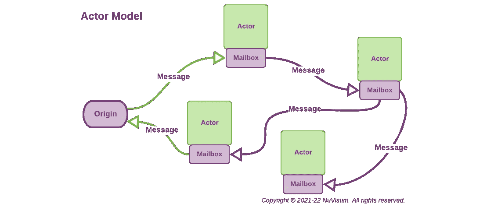
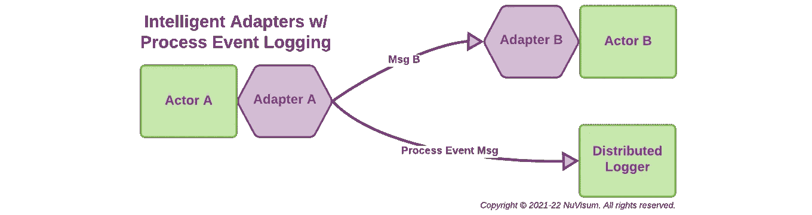
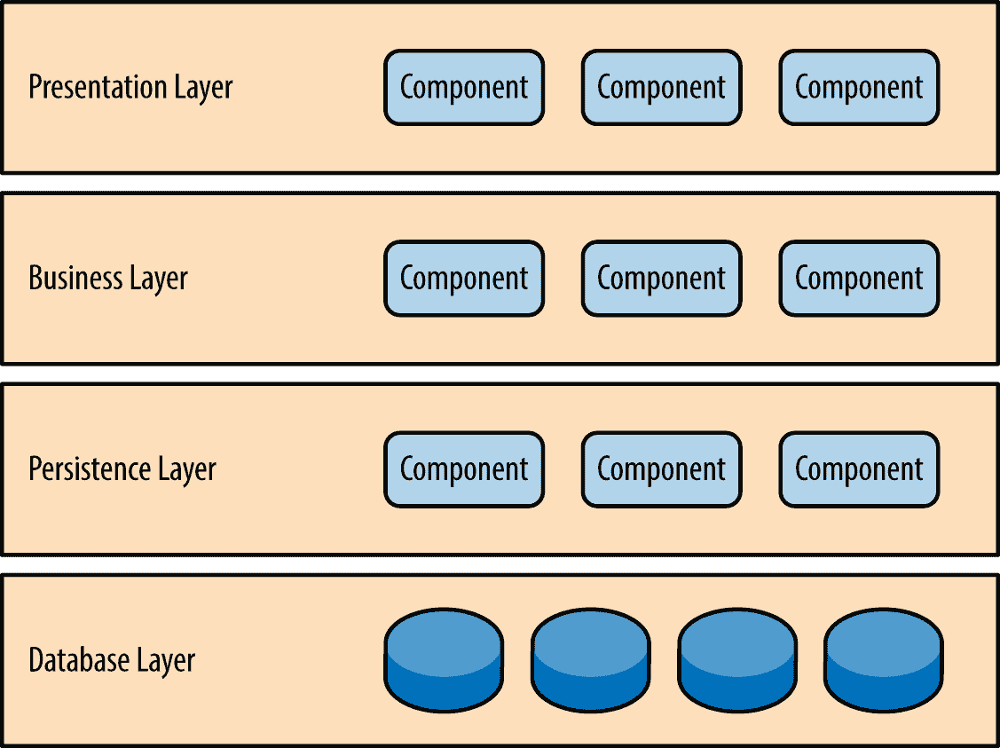
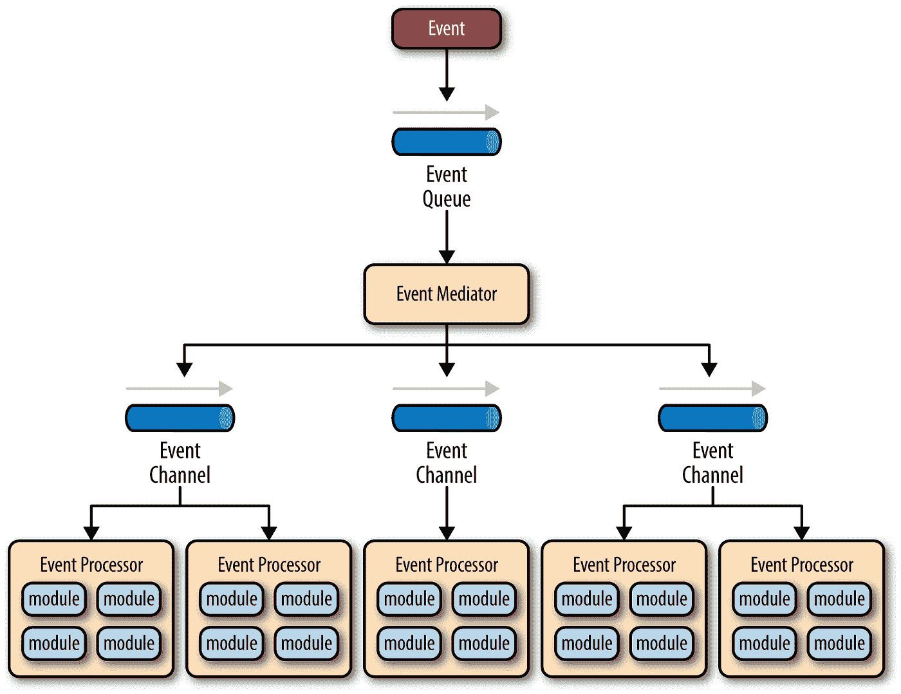
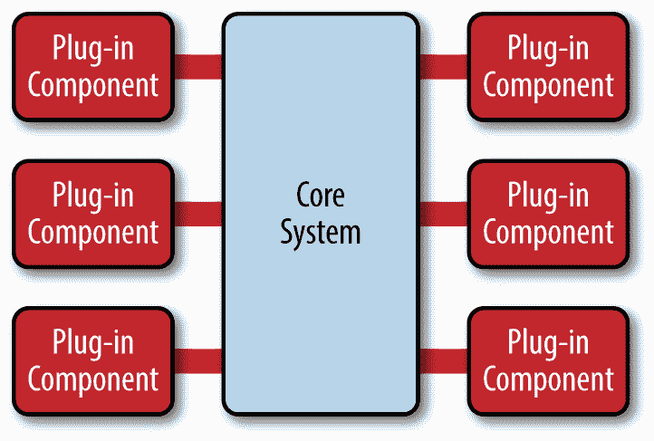
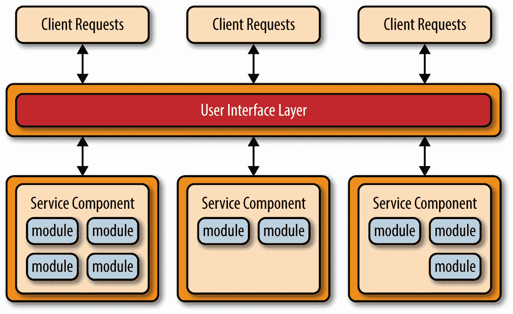
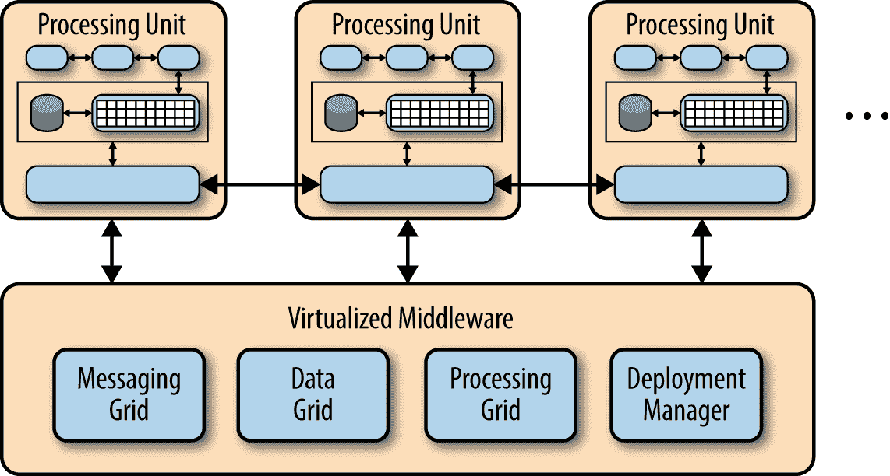

# 面向云的软件架构

> 原文：<https://medium.com/nerd-for-tech/software-architecture-for-the-cloud-c9226150c1f3?source=collection_archive---------1----------------------->

## 如何简化云原生应用的实施

从最早的编程语言，到高级编程范式，再到虚拟化和云基础设施的发展，计算机科学的历史就是抽象概念的进化历史，这些抽象概念隐藏了复杂性，并使越来越复杂的应用程序得以创建。

为云开发可靠的、可扩展的应用程序似乎比想象中要困难得多。

近年来，像 Kubernetes 这样的容器和容器编排器已经被证明是一种重要的抽象，它极大地简化了可靠的、可伸缩的分布式系统的开发。虽然容器和容器编排刚刚进入主流，但它们已经使开发人员能够以几年前无法想象的速度、敏捷性和可靠性来构建和部署应用程序— *但这些技术仍然是新的，软件架构师和工程师仍在努力理解如何最好地应用它们。*

对于希望成功实现数字化转型的公司来说，我们如何让云计算的真正力量变得可用、可管理且经济实惠？我们如何在管理和降低风险的同时促进这种转变？云原生应用可以利用云提供的自动部署、扩展、可靠性和故障转移功能。但是，旧的应用程序架构、开发和部署模式以及旧的数据组织和访问方法并不能提供我们真正想要的可靠性、性能、可扩展性和容错能力。

> 伟大的冰球运动员韦恩·格雷兹基曾经说过，“我滑向冰球要去的地方，而不是它已经去过的地方。”开发云的真正潜力需要我们滑向冰球要去的地方。

本文关注的是云部署的应用程序的分布式数据管理挑战，而不是 UI/UX 方面——因为向浏览器和移动设备交付 UI/UX 功能的技术和技巧已经被很好地理解，拥有经验丰富的开发人员基础，并且在传统的客户端-服务器和云部署的应用程序之间几乎没有区别。

首先，让我们清楚地定义云原生应用的含义以及我们期望它们满足的需求。在这种情况下，云原生应用程序是小型、独立和松散耦合的服务和资源的集合，实现这些服务和资源是为了执行或实现某些业务功能，并可在云环境中部署。*对于本文，服务是应用程序的可执行组件，资源是驻留在非易失性存储中的东西，如文件、键值存储和数据库。*

## **云原生软件**

如果一个应用程序是“云原生的”，那么它是专门实现的，以便在私有、公共和混合云中提供一致的开发、部署、自动化管理和通信模型。它旨在利用通过容器和容器编排提供的自动化部署、伸缩、可靠性和故障转移功能。为了实现最大的部署灵活性，它避免依赖特定商业云服务供应商专有的技术，除非这些技术对于满足应用程序的功能目标至关重要。下面的 A 部分详细介绍了最成功的云原生应用程序实施和部署需要满足的主要要求。

B 部分描述了当今设计软件应用程序时最常用的五种架构模式。它们都包含了软件实现中的实际经验——而且，和所有的软件架构一样，它们都代表了折衷的组合。当应用于云原生系统的设计和实现时，每种方法都有自己的优点和缺点。我们面临的挑战是选择每种模式的最佳属性，以合成有效的云原生架构模式来使用和管理分布式数据资源，并与完整应用程序所需的现代 UI/UX 技术进行交互。

## 我们在哪里可以找到新的建筑模式？

本文中介绍的元素和模式是经过试验和验证的，是从 20 世纪 80 年代开始一直延续到现在的商业软件系统(用于跨网络分发数据和处理)的设计和实现经验的结果。这些解决方案的技术灵感很大程度上要归功于[艾伦·凯](https://en.wikipedia.org/wiki/Alan_Kay)、[迈克尔·斯通布雷克](https://en.wikipedia.org/wiki/Michael_Stonebraker)和[沃纳·威格尔](https://en.wikipedia.org/wiki/Werner_Vogels)，他们的贡献确实改变了我们今天实现和使用软件的方式——艾伦·凯理解了*消息传递*在软件组织中的力量，迈克尔·斯通布雷克理解了*数据管理*的全面愿景，沃纳·威格尔确定并描述了实用*云计算的基本原理。*在为云原生应用创建架构模式时，有许多概念非常有用。

## **演员模特**

计算机科学中的 [*actor*](/nerd-for-tech/building-cloud-native-apps-part-1-393d250cf107) 是一种将 actor 视为并发计算通用原语的并发计算模型。演员通过传递信息来交流。作为对消息的响应，参与者完成了它的工作。参与者可以修改自己的私有状态，但只能通过消息传递间接影响其他参与者。参与者是可重入的和线程安全的。Actors 是微服务设计的合适模型。

演员的工作很简单:

*   使用持久性服务执行逻辑和读/写持久性数据。
*   接收来自其他参与者的消息。
*   向其他参与者发送消息。

参与者可以是许多东西，包括微服务、微服务客户端、事件发布者、事件处理者、消息代理、消息记录器、事件记录器和错误处理者。

使用 actors，通过消息传递进行通信，作为云原生应用程序的基本构建模块，简化了网络并发处理的执行，并且:

*   在不使用锁的情况下实施封装。
*   使用协作参与者的模型对消息做出反应、改变状态，并相互发送消息来实现应用程序功能。
*   可以支持同步(请求-响应)和异步(事件)消息传递(在通常的实践中，参与者通常是异步的，但是他们可以很容易地发送作为响应的消息，从而实现同步行为)。

## **消息传递**

像 Actor 模型这样的模式通过消息传递进行通信。消息传递是一种由另一个参与者调用行为的技术。调用程序向流程发送消息，并依赖该流程及其支持基础设施来选择和执行适当的逻辑。异步(事件)消息传递和同步(请求-响应)消息传递都可以实现，这使应用程序开发人员能够在一个通用的统一框架内优化针对特定用例和性能目标的通信。作为一个基本规则，更有效的异步消息传递应该是默认的消息传递选择，只有当发送方必须等待响应才能继续时才使用同步消息传递。消息传递也使得利用现代流处理技术变得更加容易。

消息传递实现了*松耦合*，但也可以实现*动态耦合*。使用*代理*的动态耦合为实现负载平衡、故障转移和动态伸缩提供了一个非常强大的机制。代理也可以是实现*自组织*系统的重要机制。

## **自我组织**

复杂性是成功实现大型分布式系统的主要限制因素。这是大型微服务和 API 管理实现的致命弱点。随着事物(API、服务、资源)的**数量**以及它们之间连接的增长，**复杂度**呈指数增长，即 **c = n(n-1)/2** 。大多数系统中实施的自顶向下的分级控制不适合处理这种复杂性。需要更好的解决方案。

云让我们有能力创建越来越大、越来越复杂的应用程序，对分布在不同国家甚至不同大洲的数据进行集成和操作——如果我们能够管理它们的话。今天，大多数如此复杂的工作机器都存在于自然界。我们需要看看自组织系统，这是自然处理复杂性的方式。自组织系统从自下而上的相互作用中产生，不像自上而下的层级系统，后者不是自组织的。蚁群是 [*涌现*](https://en.wikipedia.org/wiki/Emergence) 的一个有用例子，在这里整体大于其部分之和。

蚂蚁受非常简单的规则和局部交互的支配，可以通过自己的活动实现表现出复杂结构和行为的群体，这些复杂结构和行为远远超过单个蚂蚁的智力或能力。蚁群也说明了自组织系统的分散性。蚁后不会告诉每只蚂蚁该做什么——相反，每只蚂蚁会对与其他蚂蚁交换的化学信息([信息素](https://en.wikipedia.org/wiki/Pheromone))刺激做出反应。

通过这种方式，控制分布在整个系统中，所有部分都对最终的功能做出贡献，这与通常依赖于单个协调实体的集中式结构相反，这种自组织系统固有的分散式结构赋予了它们弹性和健壮性。当任何一个元件失效时，可以很容易地用一个类似的元件来代替。成功的云原生架构模仿有机生命系统的分散结构，复杂的功能可以从相对简单的部分的交互中产生，同时最大限度地降低配置和部署的复杂性。

## 智能适配器

数据管理的大部分工作是清理、验证、过滤、组合和转换数据。消息或消息流的传递提供了一个绝佳的机会来执行声明性规则，以便通过使用智能适配器来验证和操作这些消息的数据有效负载。智能适配器可以链接在一起以实施规则，甚至实现到一个或多个附加流的分支。在单个参与者中实现这种重复的基于规则的处理是很浪费的，并且很难修改和管理——特别是当它可以通过将智能适配器处理附加到连接参与者的输入和输出消息流来轻松处理时。

## **分布式数据存储管理**

复制服务管理分布在多个云集群中的多组相同的物理数据存储，以促进水平可扩展性和故障转移。这些服务应该对应用程序参与者透明，包括:

*   **多领导数据存储镜像**跨一组物理数据存储维护相同的状态。更新可以由集合中的任何成员处理，然后传播到集合的其余部分。这支持完全的水平可伸缩性，主要用于关系数据库和文档数据库。
*   **单主数据存储镜像**跨一组物理数据存储维护相同的状态。更新只能由集合的领导者处理。定向到非领导者数据存储的更新被路由到领导者并传播到所有非领导者。这通过选举新的领导者来支持领导者故障转移，主要用于关系数据库和文档数据库。
*   **分布式键值存储**提供了一种可靠的方式来存储非 DBMS 数据，这些数据需要由多云团的分布式系统来访问。这很好地处理了网络分区期间的领导者选举，并容忍了机器故障，甚至是领导者节点的故障。
*   **接近实时的事务一致性**确保分布式更新成功完成，并将尝试解决出现的任何不一致。当不一致不能被自动解决时，它保证这些不一致被记录和报告以便采取补救措施。这不是传统的分布式事务管理。出于性能原因，它不使用两阶段 DBMS 提交。它在消息级运行，而不是在 DBMS 级。它不会取代本地 DBMS 事务(后者仍然有效)。它旨在确保逻辑事务中涉及的所有消息最终都由它们在网络中的所有目标进行处理。

**总之**，这些基础概念可以帮助软件实现者满足 A 节中确定的需求，使他们能够减轻微服务和基于空间的模式中的弱点，并在其他常见架构模式中融入许多理想的特性。 [***多云应用:第 1 部分***](/nerd-for-tech/building-cloud-native-apps-part-1-393d250cf107?source=friends_link&sk=3454bbfd31ae1b77d8ef4e2b646ed2d6) 深入探讨设计和构建成功的云应用。

# A 部分—云原生应用程序要求

本文认为大多数云原生数据管理应用程序的常见要求是:

1.  **最大限度降低应用实施和维护、配置、部署、管理和运营的复杂性**。复杂性增加了任何软件实现工作的风险和成本——尤其是那些涉及组织对新的和不熟悉的领域的尝试。*未能满足这一要求是云实施最常失败的原因。这个列表中的大多数其他需求都是为了支持它而存在的。*
2.  确保没有适当的**认证和授权**就不能访问或修改运行时服务或资源。保证服务之间的所有通信(消息)都经过**数字签名和加密**。*如果不满足这一要求，对分布式应用中涉及的任何网络或服务的任何破坏都有可能破坏该应用的所有部分。*
3.  确保可以部署多个相同的服务和资源，并且可以实现从服务和资源到相似服务和资源的自动故障转移。如果不能满足这一要求，实施任何有效的故障转移策略都会变得复杂而昂贵。
4.  确保服务和资源所需的**性能**参数可以被指定和监控。提供自动化的运行时工具来修改可执行服务和资源的数量和/或位置，以满足那些指定的参数。*不满足这一要求，实施任何有效的扩展策略都会变得复杂而昂贵。*
5.  保证一个服务或资源对其他服务和资源的物理**位置透明性**。如果不能满足这一要求，实施任何有效的扩展或故障转移策略都会变得复杂而昂贵。
6.  访问和**管理复杂的分布式数据**，并向应用程序呈现该数据的集成逻辑模型。*如果不能满足这一需求，实现应用功能以及混合新旧数据将变得更加复杂和昂贵。*
7.  优化**同步(请求-响应)和异步(事件)消息传递**。*如果不满足这一要求，满足期望的性能目标可能会非常复杂和昂贵。同步和异步通信都是满足全部分布式数据用例所必需的。*
8.  **管理与分布式数据一致性、可用性、分区容忍度和延迟相关的网络限制和权衡**。*如果不满足这一要求，实施任何有效的可靠性和性能管理策略都会变得复杂而昂贵。*
9.  呈现一致的、图形化的、声明性的和**低代码开发**和管理环境，同时允许在开发人员需要时使用现代编程语言。*如果在实现应用程序功能时不满足这一要求，开发人员的工作效率将受到吸收和应用新技术所需的学习曲线的负面影响。*
10.  向应用程序开发人员展示高功能、一致且**有用的 API**。*如果不满足这一要求，在实现应用程序功能时，开发人员的工作效率将受到吸收和应用新技术所需的学习曲线的负面影响。*

# B 部分——常见的架构模式

*架构是指系统的基本结构以及创建这种结构和系统的规则。每个结构都由元素、元素之间的关系以及元素和关系的属性组成。*

以下五种架构模式是当今应用程序设计中最常见的，但大部分是在云计算之前。它们各有优缺点——它们都有一些适用于云原生设计的方面——当应用于云原生应用时，它们都有缺陷。我们的挑战是在定义云原生架构模式时选择积极的属性并减少消极的属性。

> 下面的图片和链接是对每个模式的完整描述和分析，它们来自:
> 
> 软件架构模式
> 
> 版权所有 2015–2021 O ' Reilly Media，Inc .保留所有权利。
> 
> 奥赖利提供了一个介绍性的自由观点。

## [**分层模式**](https://learning.oreilly.com/library/view/software-architecture-patterns/9781491971437/ch01.html)

版权所有 2015-2021 O ' Reilly Media，Inc .保留所有权利。

分层体系结构模式是最常用的体系结构模式，也称为 n 层体系结构模式。在云架构和微服务的讨论中，分层往往被误解为*单块*架构。这种模式是大多数 Java EE 应用程序的事实标准，因此为大多数架构师、设计人员和开发人员所广泛知晓。这是对*康威定律:**的明确肯定。任何设计了一个系统(广义上来说)的组织都会做出一个设计，而这个设计的结构就是这个组织的沟通结构的副本。*大多数人都是按照这种模式先尝试一下。

云原生解决方案的特点:

*   对变化的反应能力:低
*   易于部署:低
*   可测试性:高
*   表现:低
*   可扩展性:低
*   易开发性:高

## [**事件驱动模式**](https://learning.oreilly.com/library/view/software-architecture-patterns/9781491971437/ch02.html)

版权所有 2015-2021 O ' Reilly Media，Inc .保留所有权利。

事件驱动架构模式是一种流行的分布式异步架构模式，用于生成高度可扩展的应用程序。它还具有很高的适应性，可用于小型应用程序以及大型复杂应用程序。事件驱动的体系结构由高度解耦的单用途事件处理组件组成，这些组件异步接收和处理事件。

云原生解决方案的特点:

*   应对变化的能力:高
*   易于部署:高
*   可测试性:低
*   业绩:高
*   可扩展性:高
*   易开发性:低

## [**微内核(插件)模式**](https://learning.oreilly.com/library/view/software-architecture-patterns/9781491971437/ch03.html)

版权所有 2015-2021 O ' Reilly Media，Inc .保留所有权利。

微内核体系结构模式(有时称为插件体系结构模式)是实现基于产品的应用程序的自然模式。基于产品的应用程序是以典型的第三方产品的版本打包并可供下载的应用程序。

云原生解决方案的特点:

*   应对变化的能力:高
*   易于部署:高
*   可测试性:高
*   业绩:高
*   可扩展性:低
*   易开发性:低

## [**微服务模式**](https://learning.oreilly.com/library/view/software-architecture-patterns/9781491971437/ch04.html)

版权所有 2015-2021 O ' Reilly Media，Inc .保留所有权利。

微服务架构模式作为整体应用程序和面向服务的架构的一种可行的替代方案，正迅速在行业中占据一席之地。因为这种架构模式仍在发展，所以业界对于这种模式是什么以及如何实现有很多困惑。

云原生解决方案的特征:

*   对变化的反应:高
*   易于部署:高
*   可测试性:高
*   性能:低
*   可扩展性:高
*   开发容易程度:高

## [**天基(云)模式**](https://learning.oreilly.com/library/view/software-architecture-patterns/9781491971437/ch05.html)

版权所有 2015–2021 O ' Reilly Media，Inc .保留所有权利。

在任何具有极大并发用户负载的高容量应用程序中，数据库通常是您可以并发处理多少事务的最终限制因素。虽然各种缓存技术和数据库扩展产品有助于解决这些问题，但事实仍然是，为极端负载扩展普通应用程序是一个非常困难的命题。

基于空间的架构模式，通常称为云架构模式，是专门为处理和解决可伸缩性和并发性问题而设计的。对于具有可变且不可预测的并发用户量的应用程序，这也是一种有用的架构模式。从体系结构上解决极端和可变的可伸缩性问题通常是比试图向外扩展数据库或将缓存技术改造成不可伸缩的体系结构更好的方法。

云原生解决方案的特征:

*   对变化的反应:高
*   易于部署:高
*   可测试性:低
*   性能:高
*   可扩展性:高
*   开发容易程度:低