# 颗粒物传感器库中的软件缺陷

> 原文：<https://medium.com/nerd-for-tech/software-bugs-in-a-particulate-matter-sensor-library-44c3f030260e?source=collection_archive---------4----------------------->

## 看一看鲁棒解析简单串行协议所需的注意事项。

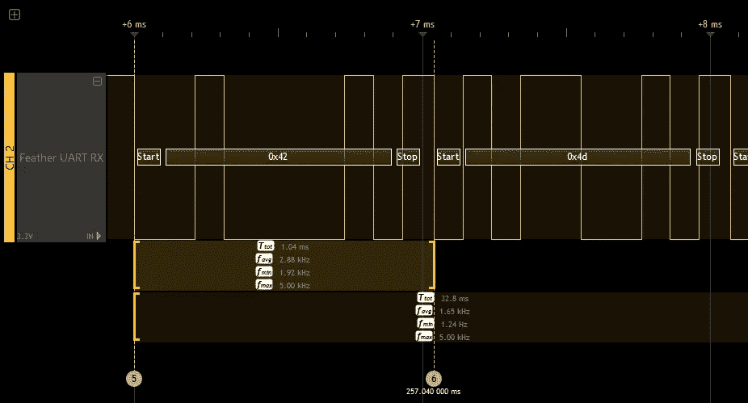

PMS5003 串行传输的前两个字节。

本文着眼于在 Plantower PMS5003 颗粒物传感器库中发现的一些缺陷。该设备使用简单的串行接口以低速向另一设备发送数据。这个库的设计和实现听起来微不足道，但是产生一个带有[协议](https://en.wikipedia.org/wiki/Communication_protocol)解析缺陷的库却非常容易。

Pimoroni Enviro+ FeatherWing 板有一个用于 PMS5003 的连接器。示例代码包括一个绘图程序，该程序可以绘制不同速率下颗粒数据随时间变化的图形。当以最短的一秒间隔执行时，组合绘图仪程序通常在一两分钟后因`ChecksumMismatchError`异常而终止。逻辑分析仪确认 PMS5003 发送的数据没有*损坏*。这个 bug 和其他一些 bug 一起被调查，这些 bug 是通过阅读其他用户遇到的问题而推断出来的。在考虑不同类型的故障和开发[单元测试](https://en.wikipedia.org/wiki/Unit_testing)时，发现了更多潜在的错误。

这项工作起源于撰写文章 [Instructables:将 Pimoroni Enviro+ FeatherWing 与 Adafruit Feather NRF 52840 Express](https://www.instructables.com/Using-the-Pimoroni-Enviro-FeatherWing-With-the-Ada/)一起使用并修复 [pimoroni_pms5003](https://github.com/pimoroni/pms5003-python) 库中的错误。这个库是用 CircuitPython 编写的，它是 MicroPython 的一个分支，是 Python 3 用于微控制器的一个版本。单元测试是用 Python 3 编写的，可以由 CPython 执行。

本文展示了四个新的单元测试，以及在执行*修订*代码期间串行 [FIFO](https://en.wikipedia.org/wiki/FIFO_(computing_and_electronics)) 缓冲区的动画可视化。这些是用一个小 Python 程序创建的，用来在单元测试中对串行对象进行测试。它使用 [Graphviz](https://graphviz.org/) 来帮助创建动画帧。

Graphviz 可能更经常被用于绘制静态数据流，但它也是一个强大的工具，可以帮助快速开发数据流的动态可视化。在这种情况下，状态是从正在执行的单元测试中提取的，但是可以处理其他来源来提取一段时间内的状态，例如，详细的日志文件。

披露:我偶尔为 Adafruit 写[的文章。](https://learn.adafruit.com/users/kevinjwalters)

# Plantower PMS5003 颗粒物质传感器

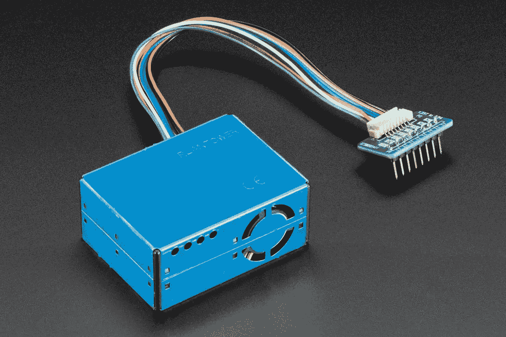

Plantower PMS5003 颗粒物质传感器，带试验板适配器。版权所有 Adafruit。

[PMS5003](http://plantower.com/en/content/?108.html) 是一款价格适中的小型传感器，基于[衍射分析](https://en.wikipedia.org/wiki/Laser_diffraction_analysis)来测量空气中的[颗粒物](https://en.wikipedia.org/wiki/Particulates)。它通常被对环境监测和空气污染感兴趣的爱好者使用。它提供 2.5 微米(PM2.5)和 10 微米(PM10)粒子的未校准测量，并且是用于 [PurpleAir 物联网设备](https://www.purpleair.com/)内部的传感器。

它有一个 9600 [波特](https://en.wikipedia.org/wiki/Baud)[“TTL”串行接口](https://electronics.stackexchange.com/questions/274287/what-is-the-difference-between-rs-232-and-ttl-uart)向另一个设备传输数据。串行接口只有`TX`(发送)和`RX`(接收)引脚，没有用于[硬件流量控制](https://en.wikipedia.org/wiki/Flow_control_(data)#Hardware_flow_control)的额外引脚。这种类型的串行接口本质上是异步的。字节以流行的 [lsb](https://en.wikipedia.org/wiki/Bit_numbering#Least_significant_bit) -first [8n1](https://en.wikipedia.org/wiki/8-N-1) 格式编码。

# PMS5003 协议

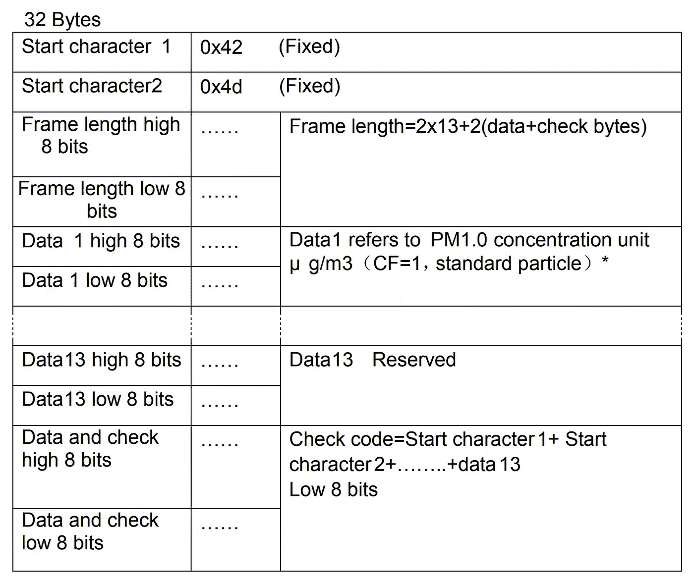

PMS5003 数据手册中的 Plantower 数据帧定义。中间部分省略。

PMS5003 通过串行接口发送有关微粒的数据，这些数据编码在数据帧中，如[数据表](https://www.aqmd.gov/docs/default-source/aq-spec/resources-page/plantower-pms5003-manual_v2-3.pdf)所述，并在上面显示，为简洁起见，省略了一些字段。这种人类可读的表格形式对于描述数据及其含义非常有用，但是某种类型的[接口定义语言(IDL)](https://en.wikipedia.org/wiki/Interface_description_language) 是描述数据的*格式*的更精确的方式。

前两个字符形成一个标题，以识别数据帧的开始。这使得即使读取在数据帧的中途开始或者它与微小的线路噪声混合，也能够找到数据帧。“校验码”是基本的[校验和](https://en.wikipedia.org/wiki/Checksum)，用于验证[有效载荷](https://en.wikipedia.org/wiki/Payload_(computing))是否正确。数据帧的这两个部分对于解析和验证传输的完整性非常有用。数据帧大小被引用为 32 字节，这也是有用的。一个悬而未决的问题是，这种特定的帧大小是否是规范的一个固定部分，即数据帧是否可能在未来的固件修订版或修订产品中扩展。

# 数据率

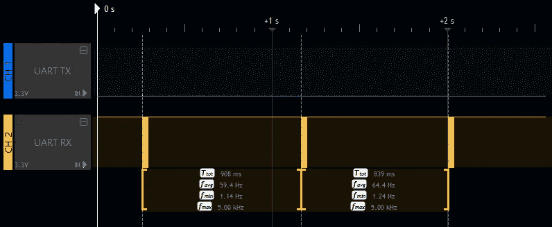

逻辑分析仪显示 PMS5003 数据帧间隔为 908.5 毫秒和 838.8 毫秒。

根据随机测试，很容易假设设备每秒发出一次数据帧*。做出这种假设的库和程序很常见。*

一个逻辑分析仪，如这里与 ScanaStudio 软件一起使用的 Ikalogic SQ25 ,显示情况并非如此。每个数据帧的传输会引起许多低/高转换，从而导致轨迹上出现黄色“块”。通电后不久，PMS5003 将每隔 908.5 毫秒或 838.8 毫秒发送一次数据帧。这听起来非常接近一秒钟，但以一天中更快的速度，这将导致相对于预期量产生几乎半小时的*额外数据*。如果一个程序(或库)假设数据每秒发送一次，这就有问题了。一个典型的简单程序如下所示。

```
pms5003 = PMS5003()
while True:
    data = pms5003.read()
    print(data.data.pm_ug_per_m3(2.5))
    time.sleep(1)
```

这个代码可能是为了每秒钟读取传感器。`read()` 方法和`print()`命令的执行时间将确保它运行的频率稍低。即使只有一个`time.sleep(1)`的`while`循环也不会精确地每秒运行一次，因为循环的开销很小，并且解释器中有后台任务。像 C 这样简单的编译语言会更接近，但这仍然会受到[中断](https://en.wikipedia.org/wiki/Interrupt)的影响。[处理器时钟](https://en.wikipedia.org/wiki/Clock_rate)的[精度和漂移](https://en.wikipedia.org/wiki/Clock_drift)也会有影响。

逻辑分析仪向我们展示了将`read()`速率([数据消费者](https://en.wikipedia.org/wiki/Queueing_theory))与 PMS5003 发送速率(数据生产者)相匹配的任务具有挑战性。经验分析也不能保证给出 PMS5003 行为的完整描述。数据手册有助于提供更多细节。

> 数字输出有两种选择:无源和有源。上电后默认模式有效。在这种模式下，传感器会自动向主机发送串行数据。

更详细地描述了“活动模式”。

> 活动模式分为两个子模式:稳定模式和快速模式。如果浓度变化很小，传感器会以 2.3 秒的实际间隔运行在稳定模式。如果变化很大，传感器会以 200-800 毫秒的间隔自动切换到快速模式，浓度越高，间隔越短。

以主动模式从该传感器读取流数据的程序或库必须以某种方式处理这种自适应/可变速率。如果其消耗数据的速率低于生产率，则数据将被缓冲，并最终在缓冲器填满时*被丢弃*。这些类型的缓冲区通常具有固定的最大大小，并且不会随着需求而动态增长[。对于读取数据不太频繁(即每分钟一次)的程序来说，这显然会发生得非常快。](https://en.wikipedia.org/wiki/Dynamic_array)

有问题的串行通信的一个常见策略是“让一切变得更大”。这里一个简单的方法是在 Feather board 上用 CircuitPython 做一个快速测试，大大增加接收缓冲区的大小。一个非常大的缓冲区很可能*出现*来消除前面提到的，快速测试运行的神秘`ChecksumMismatchError`异常。然而，这将导致一个新的微妙问题—数据将不再是最新的，因为随着从缓冲区中不断增长的陈旧数据帧堆中读取数据，数据将逐渐落后。

# 阅读标题

解析头时没有发现错误，但是很容易无意中产生错误。帧头是两个字节，为什么不读取两个字节，然后验证它们呢？

该测试在数据帧之间注入了 5 个流氓字节的零，说明了为什么一次读取/解析一个字节是至关重要的。

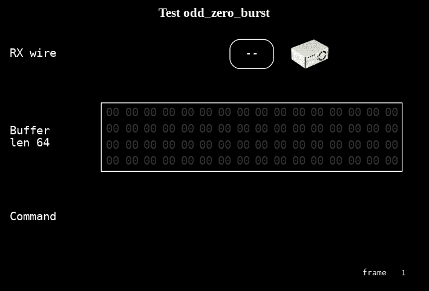

检查双字节头解析正确性的单元测试。

一个诱人的实现可能是读取两个字节*然后检查它们是否匹配`424d`头。这有时会起作用，但是如果在头之前读取奇数个字节，那么它会失败，因为尽管它出现在数据中，但是`??42`和`4d??`都不匹配`424d`。另一个好的测试是解析`42`，然后解析一个好的数据帧。*

这个测试相对简单，很容易理解它的执行和目的。可视化有助于强调接收缓冲区的严格大小。

这个 bug 确实存在于打算在 Raspberry Pi 上与 Python 一起使用的伙伴库中，参见[GitHub:pimoroni/PMS 5003-Python:Read SOF byte-by-byte to allow resync # 5](https://github.com/pimoroni/pms5003-python/pull/5)。

# 读取长度字段

长度字段出现在指示数据帧开始的两个字节之后。该值似乎可以立即用作确定还需要读取多少字节的值。

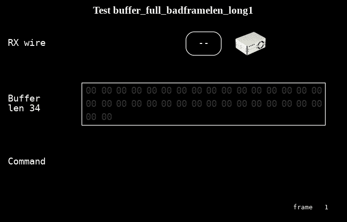

单元测试检查一个大的、假的长度字段是否被正确处理。

该测试显示了信任长度字段未被[线路噪声](https://en.wikipedia.org/wiki/Noise_(electronics))破坏并且是真实的一个问题。在这种情况下，固定的缓冲区大小有助于导致数据帧的截断，并且后续的数据帧与该片段相结合，从而导致缓冲区中的垃圾数据帧。

这个测试特意选择了 34 的缓冲长度，以便容易地重现这个错误，但是即使*的缓冲长度是数据帧长度*的倍数，也可能发生这种情况。下面的异常来自对原始示例代码的测试，该代码被增强以捕捉任何校验和异常。数字 16974 很特别，可能很熟悉——它是帧字节(`424e`)的开始，被意外地解析为(big endian)长度字段！

```
checksum error
checksum error
Traceback (most recent call last):
  File "code.py", line 254, in <module>
  File "code.py", line 252, in <module>
  File "lib/pimoroni_pms5003/__init__.py", line 155, in read
MemoryError: memory allocation failed, allocating 16974 bytes
```

这个异常发生在 CircuitPython 中，它在 [UART](https://circuitpython.readthedocs.io/en/latest/shared-bindings/busio/#busio.UART) 对象上的默认接收缓冲区大小为 64 字节，正好是数据帧大小的*两倍*。CircuitPython 运行的处理器和主板内存有限，而`MemoryError`异常可能是由于大型程序和某种程度的[内存碎片](https://en.wikipedia.org/wiki/Fragmentation_(computing))的混合而发生的。如果库尝试读取 16974 字节，它可能会尝试读取 530 个数据帧，以最低的数据帧速率，这将需要 20 多分钟才能完成。

这里的一个改进是对长度字段进行全面检查，并查找规范之外的值。修订后的代码提出了一个新的例外，`FrameLengthError`，针对长度更长(或更短！)大于预期值。如果数据帧大小在将来发生变化，保持一定灵活性的实现是有用的。一般来说，数据字段随着时间的推移而变化是很常见的，通常会变大。

有人可能会问，如果接收缓冲区大小为 64，而数据帧大小为 32，这种坏数据帧是如何出现的。看起来缓冲区最多只能容纳 2 个数据帧，不包括部分截断的数据帧。这将在下一节中探讨。

# 串行缓冲器

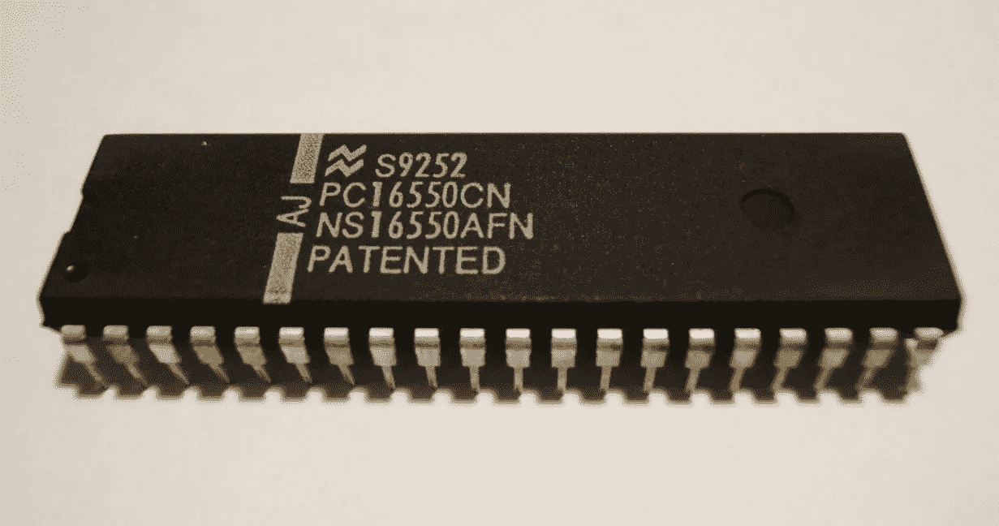

16550 afn UART——来自 IBM PC/AT 的 16450 的增强版本。照片由 hmvh，维基百科。

在异步协议中，数据可以在任何时候发送，接收方需要将其存储在某个地方。主处理器通常从[通用异步收发器(UART)](https://en.wikipedia.org/wiki/Universal_asynchronous_receiver-transmitter) 获得一些帮助。IBM PC 系列最初为此使用 8250 和 16450 芯片，它们可以缓冲一个字节。上面显示的 16550AFN 有一个 16 字节的缓冲区，减少了主处理器错过表示新数据的中断的机会。如果[中断没有及时得到服务](https://en.wikipedia.org/wiki/Interrupt_latency)，那么数据将会丢失，因为后续字节会覆盖 UART 中的数据。微控制器倾向于集成 UARTs，Adafruit Feather nRF52840 Express 板上使用的[Nordic Semiconductor NRF 52840](https://www.nordicsemi.com/Products/Low-power-short-range-wireless/nRF52840)有一个带 6 字节缓冲区的[。](https://infocenter.nordicsemi.com/index.jsp?topic=%2Fstruct_nrf52%2Fstruct%2Fnrf52840.html&cp=3_0)

硬件缓冲区由操作系统或 CircuitPython 解释器中的额外缓冲区补充。如前所述，接收缓冲区默认大小为 64 字节。由于这是数据帧大小的倍数，这可能会降低`ChecksumMismatchError`异常的频率，但手动测试将显示它们仍然会不可预测地发生。硬件缓冲区的大小也有影响，这取决于 CircuitPython 解释器如何配置和读取它。

在 [8n1](https://en.wikipedia.org/wiki/8-N-1) 发送的 32 字节数据帧相当于 320 位。在 9600 波特的速率下，这需要 33.3 毫秒，这意味着在传输期间有很大机会从缓冲器*中读取数据。如果程序在 PMS5003 发送数据后立即读取数据，那么应该没有问题。如果它以较低的*速率*读取，那么这肯定会最终导致问题，并且这些问题看起来会随机发生。*

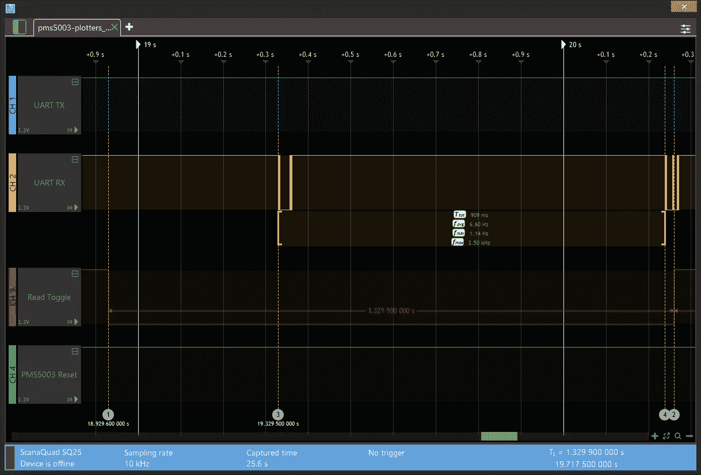

逻辑分析仪显示程序读取数据帧的速率低于 PMS5003 发送速率。程序的第二次读取在第二个数据帧传输期间开始。

上例显示了由`Red Toggle`(红色)线的下降沿和上升沿指示的两次库读取。为了延长捕获时间，该轨迹以相当低的采样速率(10kHz)捕获。这种低采样率阻止了数据中字节的解码，但是仍然可以清楚地看到每个数据帧传输的总长度。

第一次读取(标记 1)发生在流式数据帧传输之前。第二次读取(标记 2)发生在传输期间的*。这里的产生(传输)速率为 1.10Hz，消耗速率为 0.752Hz，这显然会导致默认的 CircuitPython UART 接收缓冲区在几秒钟后就满了。第二次读取可以很容易地释放*一些*缓冲空间，但是*并不是整个*数据帧的价值。这可以导致第二数据帧的*部分*结束部分在缓冲器中结束。*

这个问题的本质是发送和接收数据的非同步[并发](https://en.wikipedia.org/wiki/Concurrency_(computer_science))。这是这种交流形式的本质，因此程序或库需要处理这种情况。这对于用传统的单元测试来说是一个具有挑战性的领域，因为它们往往具有顺序性。即使真正的并发是可以实现的，在单元测试中使用它也是不明智的，因为行为是不太可能精确预测的。这可能导致测试偶尔神秘地失败。

从理论上讲，在传输过程中开始的库读取也可能发生在库第一次从传感器读取时。如果重置传感器，这种可能性几乎为零，因为库可以清除接收缓冲区，然后等待传感器初始化并开始发送数据。

# 数据帧的部分读取

这个测试显示了三个数据帧，总共 96 字节，试图挤进一个 80 字节的缓冲区。

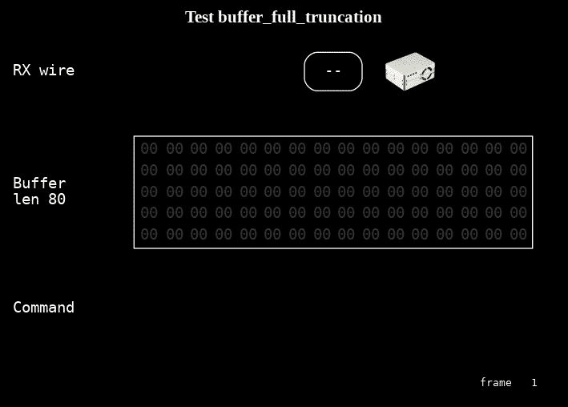

单元测试检查截断的部分数据帧是否得到正确处理。

这是测试代码是否被截断以及剩余数据是否出现的简单方法。在这种情况下，库应该超时，这就是单元测试以`SerialTimeoutError`异常的形式寻找的。耐心等待永恒的图书馆听起来是破碎的！

# 重试次数

该库可以将错误传递回程序，但也可以提供简单的重试机制来跳过任何错误。该功能已添加到库中，下面的测试显示了它如何跳过损坏的数据帧。

执行的动画没有显示太多，已经被省略了。这个测试的关键部分是第二个`read()`成功，没有异常，并返回预期的数据。对`data_available()`的最后一次调用是一个很好的补充，可以验证什么都没有留下。

一些单元测试需要检查是否在预期的地方生成了异常——这些异常将`retries=0`传递给构造函数以禁用该特性。

# 读取数据字段

测试或代码检查没有发现任何错误，但是典型的问题是:

*   精确的消息结构，定义仅在数据表中；
*   关心[字节序](https://en.wikipedia.org/wiki/Endianness)，这是一个常见的问题来源；
*   为每个字段获取正确的单位。

# 以被动模式请求数据

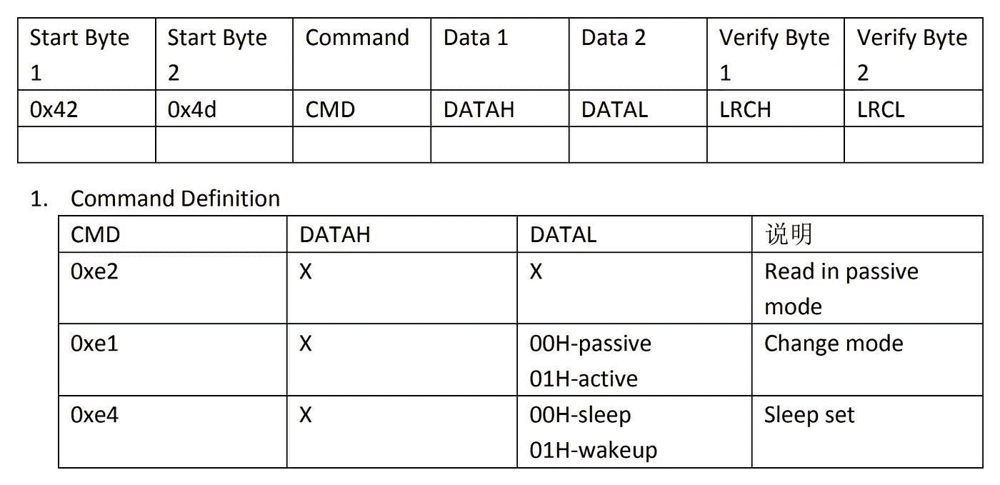

PMS5003 数据手册中的 Plantower 命令定义。

PMS5003 的默认模式是在“活动”模式下连续传输数据流。可以向 PMS5003 发送命令帧，将其切换到“被动”模式，在这种模式下，必须发送读取命令来请求数据帧。这可以在下面的逻辑分析器跟踪中看到。

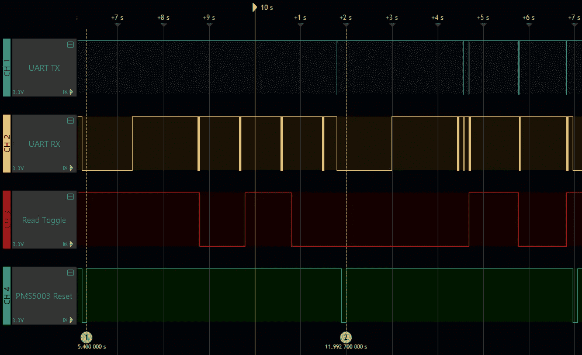

逻辑分析仪显示主动模式下 PMS5003 的三个读数，然后是被动模式下的三个读数。

复位(绿色)线在 5.4 秒(标记 1)时短暂地变为低电平，以复位器件。在大约 7.3 秒时，PMS5003 升起`RX`(黄色)线，在 8.7 秒时，PMS5003 以主动模式发送第一个数据帧。程序切换输出值(红线)来显示三个`read()`语句何时出现。`RX`线上的数据帧显然与前三次读取不同步。

复位线在 12.0 秒时发出脉冲(标记 2)以再次复位设备。在 14.4 秒时，第一个数据帧被发送，指示健康的 PMS5003，库代码在 14.6 秒时发送一个命令，改变到被动模式，可在`TX`(蓝色)线上观察到。现在，每个`read()`语句都会发送一个读命令，并立即发送回一个数据帧作为响应。这极大地简化了库代码中响应的缓冲和正确解析。

当切换到被动模式的命令得到响应时，仍然需要一些注意，但是具有不适当时序的数据帧可能在此之前潜入，混淆简单的实现。即使在发送开关模式命令之前，串行接收缓冲器已被清空，这种情况也会发生。

Adafruit 为 PMS5003 提供了自己的 CircuitPython 库，该库有一个待定的 [PR](https://en.wikipedia.org/wiki/Distributed_version_control#Pull_requests) 到[添加对被动模式](https://github.com/adafruit/Adafruit_CircuitPython_PM25/pull/13)的支持。这是 Pimoroni 库的增强[的基础。默认模式是主动的，以避免改变现有程序的行为，但被动模式可能是大多数程序的更好选择。](https://github.com/pimoroni/pms5003-circuitpython/issues/5)

# 结论

*   正确、可靠地解析串行协议可能比看起来更难，尤其是对于可变速率的数据流。
*   逻辑分析仪是捕捉 TTL 风格串行通信的有用工具。这不仅允许检查行为和精确定时，而且允许解码数据。
*   测试以观察行为是有用的，但也必须参考数据手册等参考信息。任何差异或遗漏都应与制造商讨论。
*   调查存在的问题和对有问题的行为的讨论是有用的研究，有助于寻找 bug、开发单元测试和指导手工测试。
*   在修复 bug 或添加特性时，需要认真考虑库接口的变化。这包括添加以前没有出现的异常。

# 资源

*   [说明:将 Pimoroni Enviro+ FeatherWing 与 Adafruit Feather NRF52840 Express 一起使用](https://www.instructables.com/Using-the-Pimoroni-Enviro-FeatherWing-With-the-Ada/)
*   GitHub PR:[pimoroni/PMS 5003-circuit python:增加了对串行读取、重试和请求数据的新被动模式的关注#8](https://github.com/pimoroni/pms5003-circuitpython/pull/8)
*   GitHub PR:[pimoroni/enviro plus-feather wing:改进了屏幕绘图仪的内存使用，修复了一些错误，并增强了#24](https://github.com/pimoroni/EnviroPlus-FeatherWing/pull/24)
*   GitHub PR:[adafruit/ada fruit _ circuit python _ PM25:UART 修复和特性#13](https://github.com/adafruit/Adafruit_CircuitPython_PM25/pull/13) — Erik Hess 为 ada fruit 的等效库实现被动模式。
*   [单元测试可视化器](https://github.com/kevinjwalters/pms5003-circuitpython-test-visualisation)，运行 pms5003-circuitpython 单元测试的代码，使用仪器观察串行缓冲区的行为，并使用 Graphviz 创建一系列帧，用于创建本文中的动画。 [ImageMagick](https://imagemagick.org/) 可用于将 png 输出合并成动画 gif。
*   [Ikalogic SQ25](https://ikalogic.com/sq-logic-analyzer-pattern-generator/) ，4 通道逻辑分析仪，用于本文的调试、测试和截图。
*   [Pimoroni Enviro+feather wing](https://shop.pimoroni.com/products/enviro-plus-featherwing)
*   [Adafruit Feather NRF 52840 Express](https://www.adafruit.com/product/4062)，Enviro+ FeatherWing 推荐使用的羽毛板之一。
*   [Plantower PMS5003 颗粒物传感器](http://plantower.com/en/content/?108.html)