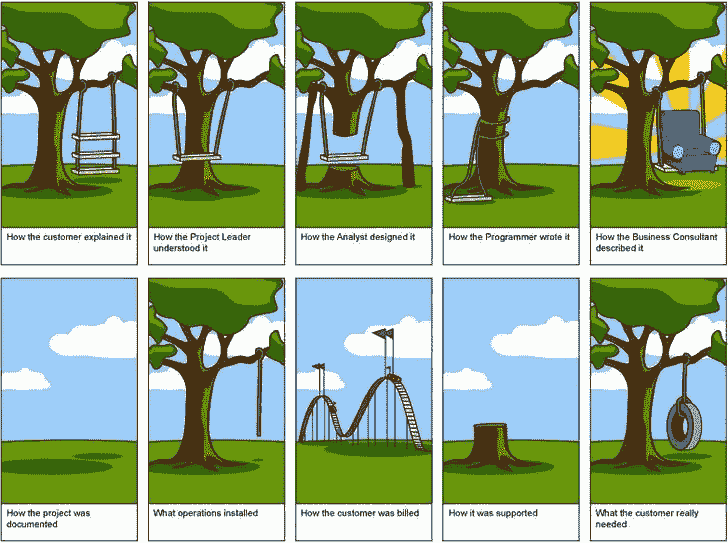
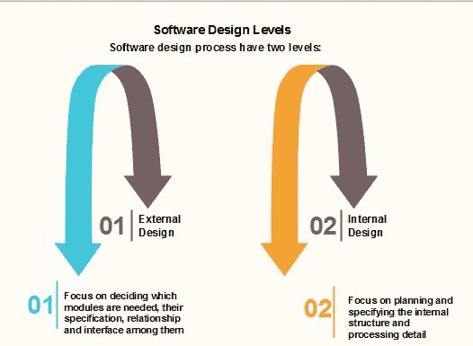
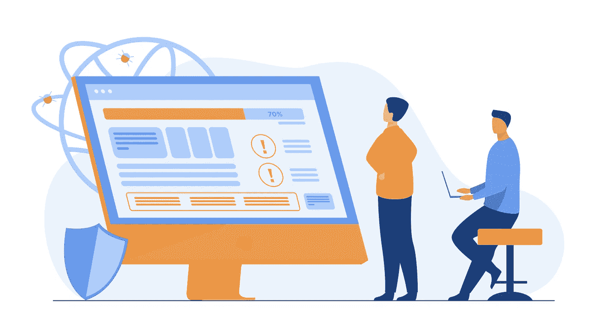
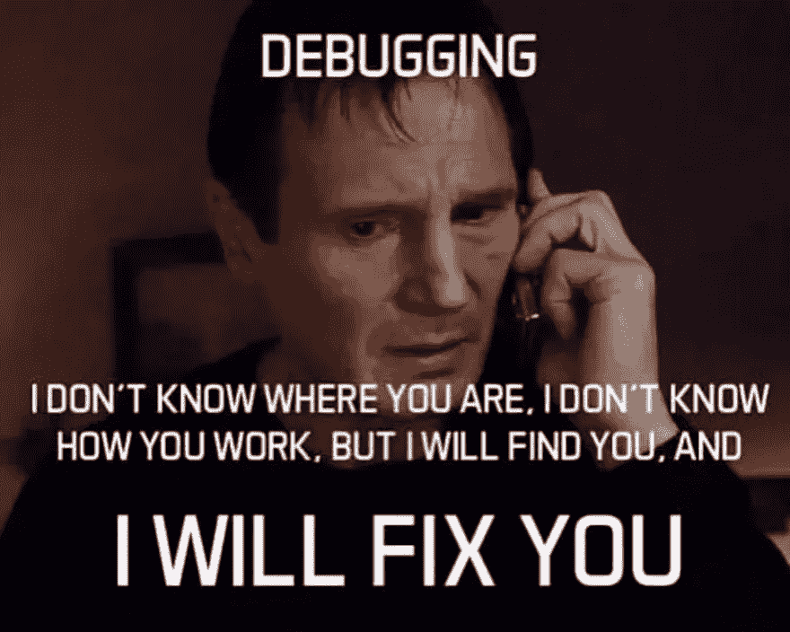

# 软件开发生命周期

> 原文：<https://medium.com/nerd-for-tech/software-development-life-cycle-cde7f069d5f3?source=collection_archive---------2----------------------->

在这篇文章中，我们将深入探究成功软件的制作过程。我们将讨论利益相关者和产品本身为了成为一个成功的商业模型而必须经历的各个阶段。

礼貌:Pressfoto

## 对软件开发标准的需求

建立软件开发标准的必要性是什么？遵循特定的标准或方法来开发出*有利可图、有用、可靠且可扩展的*软件，同时确保客户满意，这一点非常重要。不同的组织、商业人士、软件开发者、作者和计算机科学家提出并标准化了各种模型。

让我们探索一个**典型软件开发过程**中涉及的各个**阶段**。

涉及 6 个阶段:

1.  需求阶段
2.  分析阶段
3.  设计阶段
4.  发展阶段
5.  测试阶段
6.  部署和维护阶段

## 收集要求

这是 SDLC 中最重要的阶段。在这个阶段，参与项目的技术和业务团队从客户那里收集关于需求的完整信息。不要对需求做任何假设，这一点很重要。练习积极倾听，记录每一个启发活动。

它包括以下各种**活动**:

**1。需求获取**

开发人员和利益相关者会面；后者被询问关于他们对软件产品的需求。

**2。需求分析**

需求被识别，与涉众的冲突被解决。使用了各种书面和图形工具，如用户故事和 UML。

**3。需求规格**

需求被记录在一个正式的工件中，称为需求规范(RS ),只有在验证之后才被正式批准。例如，软件需求规范(SRS)。

**4。需求验证**

这个过程包括检查文档化的需求和模型是否一致，是否满足涉众的需求。只有最终草案通过了这一验证过程，RS 才成为正式的。

**5。需求管理**

它包括管理与收集的需求相关的所有活动，监督系统的开发，并适应不断变化的需求。

需求工程对软件产品的成功至关重要。

## 分析

此阶段与前一阶段的需求分析相关。它包括对需求和提议模型的批判性分析和*彻底研究。进行**可行性研究**以从分析中得出结论。从技术和商业两方面分析项目的可行性。讨论在给定**技术**和**成本** **约束**的情况下，是否有可能实现提议的软件。*

礼貌:Pressfoto

## 设计

在设计阶段，基于收集的需求和从可行性研究得出的结论，设计团队开始创建**设计模型**。这些模型被设计成适合帮助程序员进行开发和实现。同样，最重要的是，业务规则是由组织的业务部门定义的。就与软件开发相关的设计而言，完成的主要活动是 *UI 布局设计、要使用的语言和框架、数据库设计和拟议系统的架构设计*。

礼貌:故事

软件设计过程有两个层次，如下所示。

礼貌:Javatpoint

**软件设计的目标**

1.  正确性
2.  完全
3.  效率
4.  灵活性
5.  一致性
6.  可维护性

## 发展

在开发阶段，开发团队将设计团队创建的模型作为输入，实际实施所提议的软件。编码时，遵循一套软件开发原则和最佳实践是**开发团队**的责任。让他们的代码尽可能的干净和无 bug 是很重要的，这样 QA 团队就不用绞尽脑汁去找出大量的 bug。

礼貌:Pressfoto

## 测试

软件测试是*根据各种参数评估软件的工作情况，并在开发团队编写的代码*中发现 bug 和错误的过程。软件测试人员的工作是**根据各种**测试用例**验证**软件，并确保实现的功能符合需求规格。

礼貌:ph.vector

有各种类型的软件测试。

1.  单元测试
2.  集成测试
3.  回归测试
4.  阿尔法测试
5.  Beta 测试
6.  系统试验
7.  压力测试
8.  性能试验

在生产前进行所有这些类型的测试是非常重要的。

> 我们将在后面的文章中探索上述每种测试类型所涉及的完整过程。

礼貌:Dev.to

在记录了错误并最终确定了验证报告之后，它们将被发送回开发团队来修复这些问题。开发和测试阶段是反复进行的，直到产品完美无缺。

## 部署和维护

无 bug 软件的最终版本被交给**运营团队**，他们负责软件的筹备和生产。运营团队负责*创建和设置部署软件所需的服务器要求和其他硬件相关要求*。然后，该软件被推出供公众或客户使用。

运营团队通过执行各种活动来完成软件交付工作，例如*基础设施(操作系统和其他硬件)管理、桌面打包、数据库服务器设置*等。

礼貌:Vectorjuice

软件部署成功后，维护软件至关重要。**维护**包括监控服务器负载、活跃用户数量等活动，以及*从用户那里获得反馈和错误报告*。

希望你喜欢阅读这篇文章！

如果您有任何疑问，请在下面的**评论**部分发帖。在 [LinkedIn](https://www.linkedin.com/in/vaidhyanathansm/) 上与我联系。此外，如果你想看看我开发的惊人的应用程序集，别忘了查看谷歌 Play 商店。

更多了解我[这里](https://vaidhyanathansm.tech/)。

话虽如此，感谢您阅读我的文章和*快乐编码！*