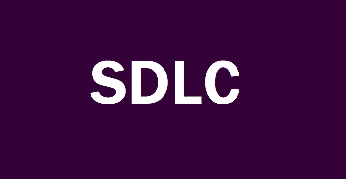
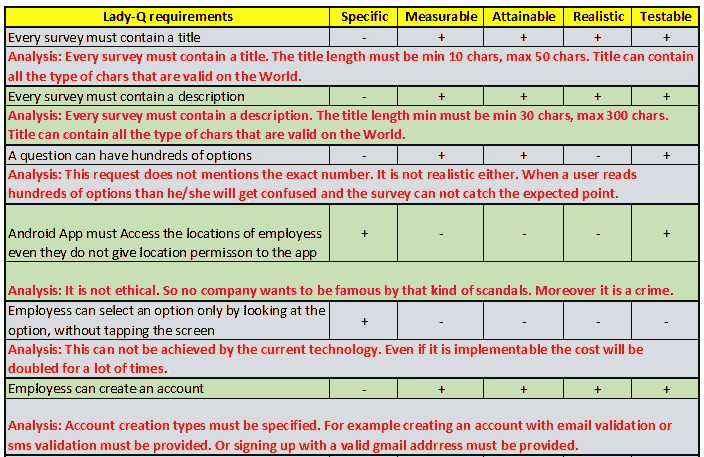
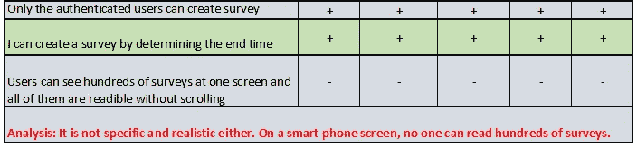
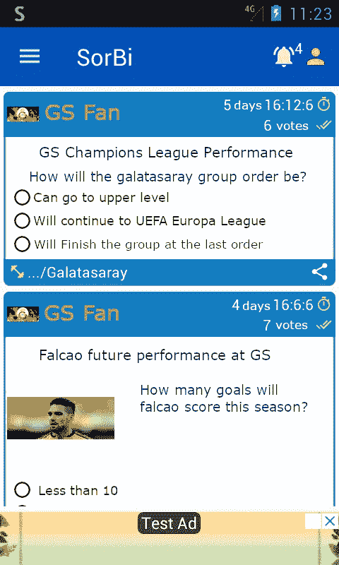

# 软件开发生命周期(SDLC)/[测试文章系列第 1 部分中的软件开发工程师]

> 原文：<https://medium.com/nerd-for-tech/software-development-lifecycle-sdlc-software-developer-in-test-article-series-part-1-ef381cc896d6?source=collection_archive---------6----------------------->

警告:由于我的英语不好，文章可能会有语法错误。

**好消息:**无论如何，你会了解我们话题的几乎一切。

这是我的“如何成为一名测试中的软件开发工程师”系列文章的第一篇。所有这些文章都是以问答的形式写的。正如我从我的一些菲律宾朋友那里了解到的，这个方法是苏格拉底为了更好地解释事物而发明的。因此，我希望技术和非技术的家伙将受益于这些文章。

由于我是一个超过 11 年的软件开发人员，我将提供一些真实的和工作的例子样本代码。这些代码样本来自移动应用程序、桌面应用程序、web 应用程序、web 服务以及各种数据库过程。

为了更好地说明问题，*Q 女士*和*索比*在我的文章中作为例子被大量使用。

***女士 Q:*** 一位女商人，也是索比 app 的客户。她付钱给一家软件开发公司开发索比应用程序。

***SorBi:*** 一款用于创建和分享民调的 android 应用。在本系列文章中，以 SorBi 为例。这款应用在 [**Google Play**](https://play.google.com/store/apps/details?id=com.lespania.sorbi) 上可用，支持英语和土耳其语。

让我们开始享受学习 SDLC 令人兴奋的东西吧！

> **问题**:那么什么是测试中的软件开发者呢？

**答**:测试中的软件开发人员(SDET)执行自动化测试来发现应用程序/服务的缺陷。所以 SDET 是开发团队的一员。你可以将它们命名为质量保证(QA)，自动化软件测试等。

> 问:创建一个应用程序的真实例子是什么？

**答**:一位女士，名叫 Lady-Q，她想为自己的业务开发一个 web 应用程序和一个 android 应用程序。Lady-Q 是一位女商人。她有一个想法要实现。她去了一家供应商(咨询公司)。她向一位**业务分析师** (BA)或**业务团队**成员讲述她的想法。业务团队做一些**分析**。与 Lady-Q **达成一致后，SDLC** 开始。

> **问:**Lady-Q 的**想法**是什么？

**答:** Lady-Q 想要一个专用于她的业务的调查/问卷应用程序。

> **问:**业务团队执行的这些**分析**是什么？

**答:**业务团队执行**可行性研究**:项目是否有实际需求，产品是否适销对路，投资回报如何，成功的可能性。

> **问:**巴是谁？巴是做什么的？

**答:** BA 是供应商的雇员，在构建 Lady-Q 应用程序时拥有该应用程序。执行需求工程。BA 是**开发团队**(开发团队)和客户(Lady-Q)之间的桥梁/翻译。[注意:在 Scrum 方法论中，我们将 BA 重新命名为“产品所有者”。稍后再讨论。] BA 创建一个**软件需求规格说明书**文档，根据客户写下所有需求。

> **问:**什么是 SDLC？

**答:** SDLC 代表软件开发生命周期。SDLC 是开发应用程序的过程。SDLC 有 6 个阶段:(1)需求收集，(2)设计系统，(3)编码，(4)测试，(5)生产，(6)维护/支持。

> **问:**需求的来源有哪些？

**答:** Lady-Q(作为客户端)，合作伙伴，最终用户，领域专家，行业分析师，类似 app 的逆向工程。

> 问:收集需求时有什么重要的事情吗？

**答:**当然有。需求必须符合**智能**标准。就是它:**(1)********【现实】**可测试。********

> ********问:**Lady-Q 的要求是什么，这些是否符合 SMART 的标准？******

****答:我们来分析一下需求****

****************

****我们必须澄清“选项计数”的界限。既然是调查，每个问题必须至少有 2 个选项，但上限是多少呢？客户必须澄清这一点，BA 也必须将这一点包括在 SRS 中。****

> ******问:**增强需求的正确行动是什么？****

******答:**这些要求必须更新以满足 SMART 标准。这就是为什么“**测试活动从测试需求**开始”。但是在那个阶段，测试人员是客户、利益相关者和业务团队。SDETs 在这一阶段没有任何责任。测试文档，我的意思是对文档进行审查并改正错误，明确内容是一种**静态测试** ( **验证过程**)。****

> ******问:**接下来是什么？****

******答:**业务团队将 SRS 文档交给设计师。设计师创建**软件设计规范(SDS)** 文档，形成 app 的蓝图。设计师决定产品的基础设施，并确保开发环境的完整性。****

> ****问:每一步都越来越精彩。下一步是什么？****

****A: 这就足够做文件了。最终，软件开发人员开始基于 SDS 文档进行编码。这是 SDLC 的第三阶段。****

> ****问:开发人员会测试他们的代码吗？****

****T21:是的。但是范围有限。他们主要负责以无 bug 的风格编码。这主要取决于开发人员的经验。开发阶段的测试是一种**动态测试(验证过程)**。测试是 SDLC 的第四阶段，由 SDETs 执行。那也是一种动态测试。****

> ******问:**惊艳！这些很酷的家伙是谁，他们是做什么的？****

****A: 它们是开发者登陆荒岛时得到的三样东西之一。他们被训练来执行应用程序的自动化测试和手动测试。****

> ******问:**有时候你说产品，有时候你说应用。我越来越糊涂了。你在说什么？****

******答:**产品是软件的最终**版本**，目前正在开发中。该软件可以是 web 应用程序/站点、桌面应用程序、移动应用程序、跨平台应用程序或服务，以便为客户端执行一些任务。****

> ****如果 a 是 Lady-Q，我想立刻看到那份申请。****

****答:这就是为什么我们要实施**敏捷方法**和最有效的 it 框架 **SCRUM** 。现在，我将给出一个来自 Lady-Q 的 android 应用程序的截图。****

# ****就是它了！索比语****

********

****索比 Android 应用程序的主屏幕。****

****我的天啊。好期待下一篇文章:)****

****它现在准备好了。享受:[敏捷方法和 Scrum 框架【软件开发人员测试系列文章第二部分】](https://kicchi.medium.com/agile-methodology-and-scrum-framework-software-developer-in-test-article-series-part-2-af5f2dd3e6ac)****