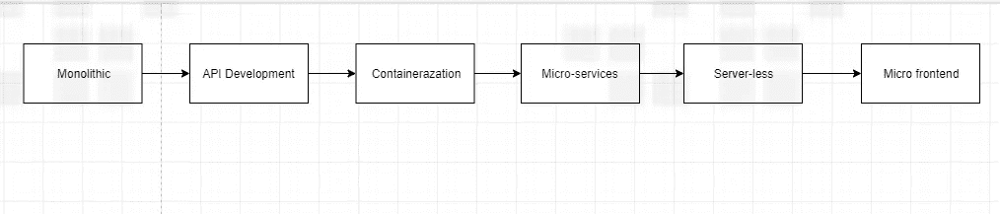
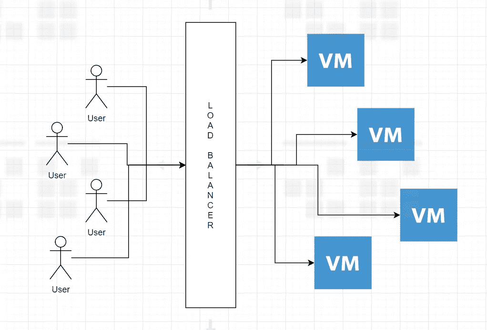
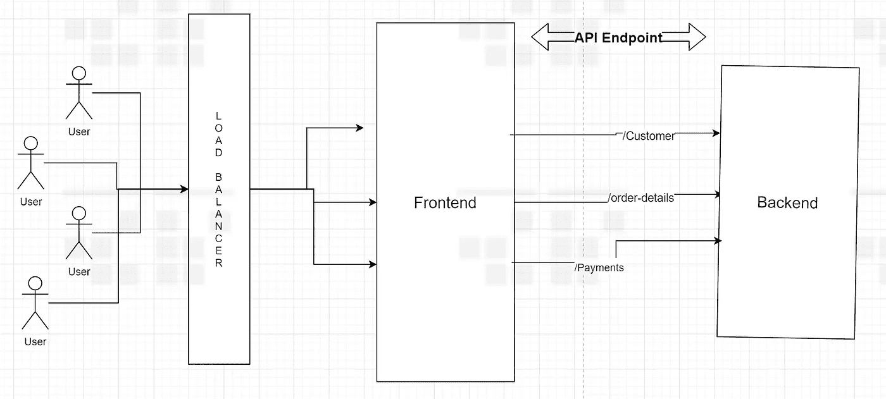
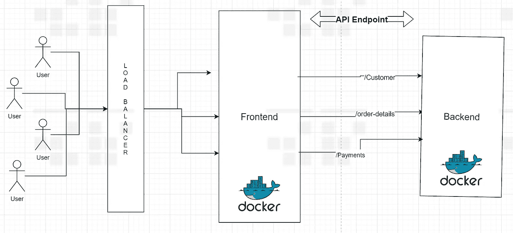
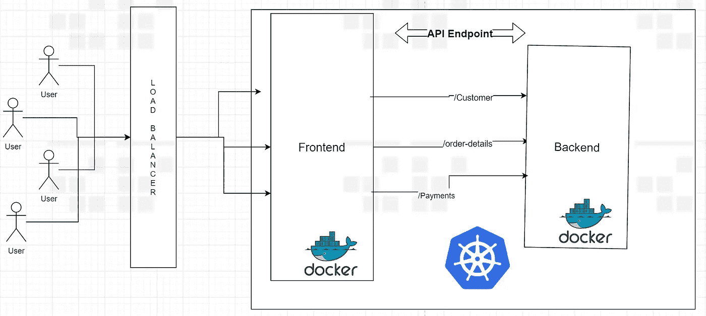
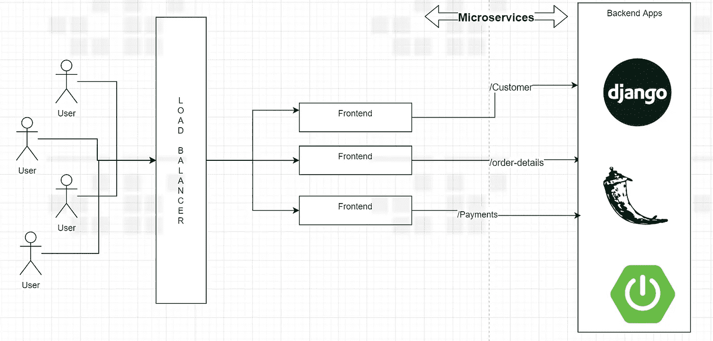
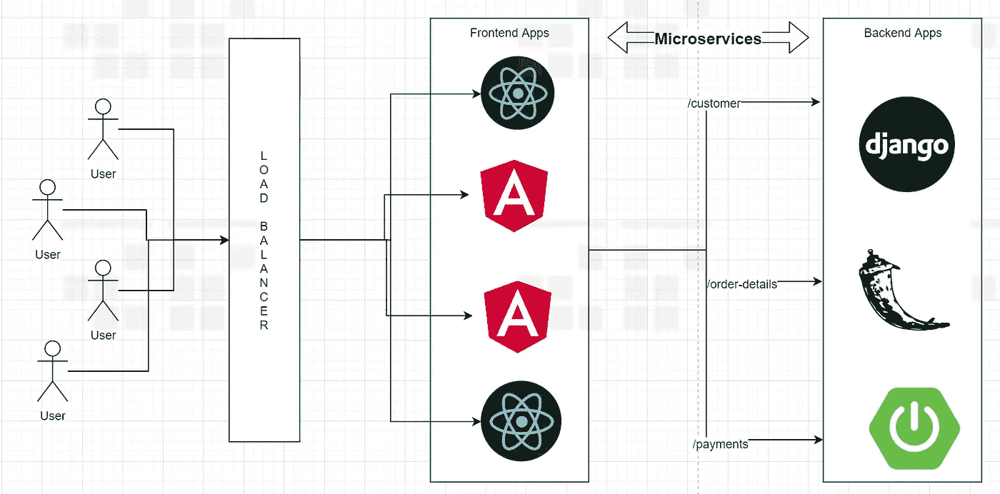

# 软件开发:单片到微服务+微前端

> 原文：<https://medium.com/nerd-for-tech/software-development-monolithic-to-microservice-micro-frontend-d63d1ebdd675?source=collection_archive---------3----------------------->

单片到微服务+微前端

读者们好，我从 2015 年开始做全栈开发者，现在是云解决方案架构师。在我转型的这些年里，在参加了数百次面试后，评估了许多基于产品和服务的组织的 JDs，初创企业，跨国公司，外包，自由职业者等等。这篇文章是关于软件开发的市场需求是如何发展的。

# 紧密耦合的应用

带有负载平衡器的虚拟机

这是我开始职业生涯时的发展方式。我们曾经创建了许多 Ec2 机器，一个用于应用程序，另一个用于数据库，另一个用于数据库复制，还有一些用于批处理。流程是::开发→测试→ SSH 进入服务器→在维护页面下启用站点→停止服务器→停止 CRON 作业→ git pull →启动服务器→我们就完成了。我们没有像现在一样使用所有的云服务，如 Route 53、Secret manager、SNS、SQS、RDS 等。这被称为紧耦合应用程序。前端和后端都在一个 MVC 框架中。

> 生活简单又容易。但是这种快乐并没有持续很久。

# 基于组件和 API 的开发:

前端和后端

## Angular，React，Django，Flask，Spring …

为了更快地开发，我们将一个应用程序分成两个独立的部分。Angular 和 React 进入画面，开始了基于组件/状态的前端开发。一个页面被分成许多组件，每个组件都有自己的变量和功能，它们可以被导入到其他组件中(可重用性)。就像我们开始在前端开发中遵循 OOPs，它变得越来越复杂，有 SASS，LESS，Material design，和许多第三方插件。

在后端并行的新框架(Spring boot，Django，Flask 等。)异军突起卖*快速 API 开发*特性。现在没有提交表单时被触发的*控制器*。前端将对端点进行 Ajax 调用，并异步获取数据。所以后端开发变成了 API 开发。延迟加载、单页应用软件趋势等功能

因此，我们现在已经成功地将我们的应用程序分为两部分，分别称为前端和 API 开发。

> 现在，我们在开发方面有了更多灵活性，许多开发人员可以并行工作，在更短的时间内实现更多。

# 集装箱化:码头工人

码头化

但是新的问题出现了。很多人有很多发展方式。开发人员说这个按钮对我来说是有效的，而测试人员说不是。不同的环境下 UI 是不一样的。主要是因为我们使用的开发环境不同。有人用 windows，有人用 Linux。有些人有 1.0 版本依赖文件，而另一些人有 1.2 版本。因此，所有的代码构建都不同步，很难简化。

因此，Docker 出现了这样一种情况，开发人员将应用程序与开发机器的所有依赖项包装在一起，并创建一个映像/容器。运行容器的人对他来说是一个黑盒。他只需要知道如何运行它。因此，应用程序体验在 SDLC 的所有阶段(开发→阶段→ UAT →生产)都是一样的。

# 容器编排:Kubernetes

库伯内廷化

所以多克是个救星。但是当你有许多容器并且它们相互通信时，它们需要根据负载进行伸缩，需要非常小心地保守秘密，一个容器需要在另一个容器之前部署，等等。像这样，当我们自己操作码头集装箱并试图自己管理的时候，会有很多困难。

于是 Kubernetes 出现了。这是一个容器编排工具。因此，过去我们自己手动管理容器，现在我们请 Kubernetes 为我们做这件事。使用舵图生活会变得更好，因为我们不必自己管理容器间的相互依赖和秘密。

# 让我们现在云化…

云在某种程度上改变了整个游戏。无论你做了什么，到目前为止，云带来了替代方案，甚至更好的解决方案。无论是开发、部署、记录、维护等等。像 AWS、Azure 和 Google 这样的服务提供商开始以非常低的价格提供托管服务。比如说…

对于 Kubernetes，我们需要自己管理主节点并对其进行适当的指导。因此，云服务提供商为我们创建了托管 Kubernetes 服务。现在我们只需要处理工人节点。使用云基础设施，我们可以配置部署清单 YAML 或舵图，并提及我们需要的计算能力类型。如果你不想决定计算能力，你可以像 AWS Fargate 和 EKS 一样不使用服务器。

# 微服务架构

微观服务

API 开发进展顺利，但是市场仍然需要越来越多的 API。因此，企业开始将应用程序视为一组功能，而技术方面开始将它们称为微服务。

一个功能应该独立于另一个功能，如果一个开发人员接触到一个功能，我们不应该测试其他功能，其他功能也不应该受到影响。例如，登录流程不应影响支付工作流程。

组织需要处理的另一个问题是，假设有一个 Java 应用程序，组织需要租用更多的 Java 资源来增强该应用程序。但是当 API 分解成微服务时，它们就变得独立于语言了。微服务 A 可以用 Java，微服务 B 可以用 Python。只要他们为端点提供正确的 JSON 数据，没人会在意。因此开发和维护更加灵活。

为了解决这些业务和技术需求，API 开发变成了微服务。

# 无服务器

> Docker 和 Kubernetes 是一个很好的合作伙伴。但是这需要一个学习过程。即使你使用的是托管的 Kubernetes 服务，我们也需要了解 K8 的底层架构，否则你就不能对你的产品非常有信心。

假设您想要构建微服务，您有一些简单的需求，比如执行凝乳操作、对第三方进行 REST 调用、读取和处理本质上不需要有状态的文件。您可以开始以无服务器的方式进行开发。可能的选项有 AWS Lambda /Azure 函数/ Google Cloud 函数。你有一段代码，你可以运行它。但最棒的是你不用考虑缩放它。它是自动缩放的，可以处理像电子商务网站中的闪购这样的高峰。

> 但不利的一面是，如果你的开发人员不太熟悉云和分布式架构，那么维护许多微服务以及所有配置将是一个巨大的挑战。在这种情况下，为了使生活简单，你可以选择 Docker 和 Kubernetes。

# 微前端开发

具有微服务的微前端

在 API 成为微服务之后，前端变得嫉妒，想要被微开发，在那里 Angular 和 React 可以彼此共存。

所以现在我们有了带有微服务架构的微前端。我认为这是你现在能拥有的最有可能破碎的建筑。如果你有前端和后端的专业资源，你可以选择这个架构。要求全栈开发人员以这种方式开发会有点困难，因为他们会跳过应用程序的两边。

# 结论…

> 现在组织要么采用 Kubernetes，要么采用无服务器开发模式。Kubernetes 背负着被谷歌打造的名声，拥有先发优势。这个平台更加稳定，我们有许多托管的 Kubernetes 服务提供商，如 OpenShift、EKS、AKS、GKE 等。但是，无服务器也做得很好，因为它的自动扩展和没有基础设施的要求。

我提到的所有新技术，我觉得就像是摩擦。用物理学术语来说:**摩擦力是一个必要的敌人**也就是说，没有摩擦力，我们不能在地板上行走，但同时它也会让我们慢下来。同样，没有这种高端技术，我们无法实现市场上快速变化的需求，但同时，如果我们不能正确理解这一点，我们的生活就会变得困难。所以请在评论中告诉我你的想法。

快乐发展…