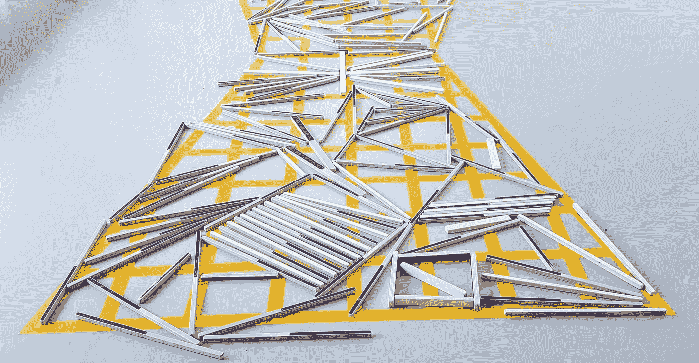

# 软件重构是一种生存需要

> 原文：<https://medium.com/nerd-for-tech/software-refactoring-is-a-survival-need-e043da843018?source=collection_archive---------9----------------------->

当一个项目开始时，没有人真正知道它会是什么

你大汗淋漓地醒来。现在是午夜。发生了什么事？

你在做梦。准确地说，是夜游。你的项目，你的孩子，你过去几个月的生活，完全崩溃了。开发人员退出，您的优秀功能无法交付，您的客户不满意。

发生了什么事？你错过了什么？

我告诉你吧。你错过了死亡的痛苦重构。

# 一点软件理论

当一个项目开始时，没有人真正知道它会是什么。作为开发人员，这是我们工作的一部分，在我们进行、改造、重新安排、学习和改进的过程中学习。

因此，合乎逻辑的是，一个软件项目，任何项目，都要经历 3 个不可避免的阶段:

1.  快速启动版本
2.  死亡的痛苦重构
3.  成熟

第一，你想要的是能尽快有用的极简主义的东西，这样你才不会在发布前被淹没。项目经理压力太大。开发商昨天必须合并。QA 人员想知道为什么他们甚至在这里睡觉时哭，因为你需要在你有机会测试之前交付。

债务不断累积，直到项目达到这个关键的临界点。

在这个阶段，任何软件都面临一个决定:重构，或者死亡。

做东西的时候，大部分工作是看不见的。制作工具，整理碎片…

# 如何及时发现它

如果幸运的话，您已经在生产中运行了。

为了实现这一点，你已经积累了太多的技术债务，以至于开发人员的大部分时间都花在了变通办法和补丁上。

寻找线索:

*   你的团队对 bug 修复的任何新特性都加倍了他们的估计
*   再也没有人**相信他们合并的东西了。一条线就可能破坏整个系统。当你说“测试覆盖”的时候，每个人都看着窗外吹着口哨**
*   新来的人被告知永远不要碰代码的这个中心部分，也不要碰那个，也许也不要碰这个。**入职**很难。
*   人们开始放弃，因为从事这项工作太痛苦了

# 如何生存下去

首先，团队会知道。他们会抱怨，会告诉你。

如果你不想听或者他们都已经离开了，这里有一些关于先从哪里还债的建议:

*   **测试覆盖**。确保有效的方法继续有效。添加单元测试、集成测试、端到端套件，并巧妙运用。测试是一门手艺，有些人非常擅长。请永远不要认为测试只是简单的常识，任何有头脑的人都可以做；还有更多。
*   **简约**。你真的喜欢这个没人用过的花哨功能:要么把它去掉，要么让它有用。你喜欢用 45 种方式做一件事。只保留最好的。
*   带回**一致性**。债务的技术利益通常包括一些不一致。我们尝试一种方式，尝试另一种方式，改进第一种方式，合并两种方式，经过 6 或 7 次尝试后，我们有了自己喜欢的东西。但是我们也有 7 个不同的版本。
*   **文档**。当你在写文档的时候，你会发现上面的想法中缺少了什么。如果你不能用一句话来描述一件事情是做什么的，那么这件事情就需要返工:去掉，拆分，简化，…

你最终会成功的

# 如何完全避免

你正在开始一个新项目，想避开这个困难的阶段？投资。

大多数项目负担不起这样的奢侈。做干净的东西需要时间和金钱，而你一开始就没有。

也就是说，请记住，痛苦的重构会降临到你身上，不管你是否想要，通常是在最不实际的时候。为它腾出空间，做好准备，给你的团队持续改进的空间。倾听他们的想法和抱怨。

# 结论

制作软件意味着尝试并改进它们，然后再回来做得更好。重构并没有给客户带来直接的价值——它给团队带来理智，给产品带来质量，带来稳定性和*然后是*更快的开发和更容易的维护。

继续睡觉，但醒来时不要忘记:这是你行动的最后机会。