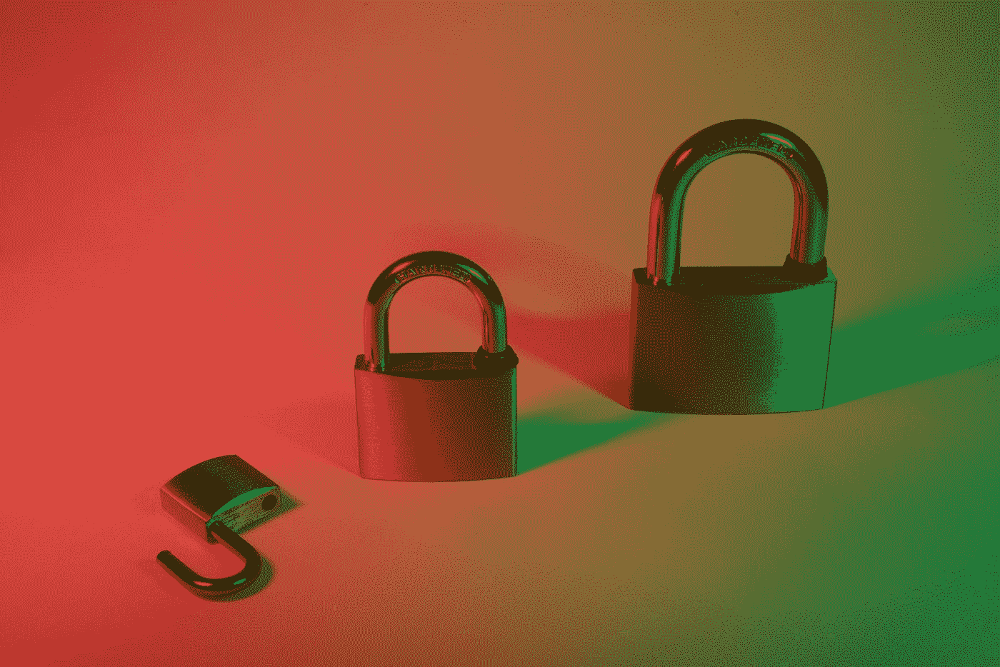

# 软件安全指南:也许不性感，但超级重要

> 原文：<https://medium.com/nerd-for-tech/software-security-guides-maybe-not-sexy-but-super-significant-272559faf51?source=collection_archive---------24----------------------->

照片由[飞:D](https://unsplash.com/@flyd2069?utm_source=medium&utm_medium=referral) 在 [Unsplash](https://unsplash.com?utm_source=medium&utm_medium=referral)

如果你从未听说过 BSIMM 或 OWASP SAMM，你需要读一读这篇文章，哪怕只是为了找出它们到底代表什么。

但更重要的是，因为它们可以帮助你保持你的软件安全。这是你真正需要做的事情。真的。

听起来可能很无聊和深奥，但软件安全与锁门、确保钱包不会放错地方，以及对于企业来说，确保只有员工才能进入你的大楼并保护你的知识产权安全一样重要，现在甚至更重要。

如今，您的物理和数字安全都依赖于它。所有这些明显的胡言乱语——数十亿行看似随机的数字、符号和字母串——是你手机和电脑上的应用程序、道路上的交通信号、汽车上的安全组件、智能电器的功能、水的纯度、电网的弹性等等的运行原因。

正如多年来人们所说的那样，一切都是计算机。每台电脑都依赖软件。但是，如果该软件存在漏洞——可能被黑客利用的错误或缺陷，你的财务、身份和个人安全就可能面临风险。

这就是为什么专家关于如何保证软件安全的建议几乎具有生存的重要性。对于个人来说，该建议的一个支柱现在应该很熟悉了:当软件更新可以修补你所使用的产品中的漏洞时，就安装它们。快点。

对于组织来说，就比较复杂了。当然，并不是所有的公司都开发软件，但是现在已经成为一种陈词滥调，如果你在做生意，你就是一家软件公司。你需要一个 IT(信息技术)部门。如果你没有足够大的规模来拥有一个，你需要雇佣一个合格的供应商来提供这些服务。

**这里有免费帮助**

幸运的是，还有免费的、全面的帮助，告诉你如何让你的公司使用和/或构建的软件更加安全。

BSIMM 和 SAMM 是这种建议的两个最佳提供者。

于 2008 年推出的 [BSIMM(在成熟度模型中构建安全性)](https://www.bsimm.com/?cmp=pr-sig&utm_medium=referral)是 Synopsys Software Integrity Group 关于软件安全计划(SSI)发展的年度报告的主题。其作者经常称之为“逃离实验室的科学实验”，旨在为组织提供一个免费工具，一旦通过与自己行业中的其他人进行比较创建了 SSI，他们就可以使用它来测量自己的 SSI。

BSIMM 没有规定一套做事的方法。它主要是一个“现在正在发生什么”的指南，或者是一个“描述性”的模型。这份最新报告基于对 130 家参与公司的观察，主要分布在 9 个垂直行业和多个地区。

[SAMM(软件保证成熟度模型)](https://owaspsamm.org/about/)，开放 Web 应用安全项目(OWASP)的一个项目，始于 2009 年，是一个“规定性”模型，但并不坚持所有组织都达到某个成熟度级别。

相反，正如它的网站所说，它提供了“一种方法来了解您的组织在软件保障的旅程中处于什么位置，并了解向下一个成熟度级别移动的建议。您(组织)确定最适合您的组织及其需求的每个安全实践的目标成熟度级别。”

该项目的目标是“帮助组织分析其当前的软件安全实践，在定义的迭代中构建安全程序，展示安全实践的逐步改进，并定义和度量与安全相关的活动。”

**一个明显的需求——阅读标题**

但是无论你倾向于描述性的还是规定性的(或者两者都有)，对软件安全性更高成熟度的需求是显而易见的，而且不是以一种好的方式。

这里只是过去一周左右关于软件安全缺陷导致的黑客攻击和破坏的一些例子。

*   在 Pwn2Own 2021 黑客大赛的第一天，参赛者成功利用了微软 Windows 10 操作系统、Exchange 邮件服务器和团队通信平台中此前未知的漏洞。幸运的是，这些是白帽(道德)黑客。没有人受伤，黑客赢得了 44 万美元。
*   VMware 宣布了其数据中心安全产品 Carbon Black Cloud Workload 中的一个[“严重”漏洞](https://www.vmware.com/security/advisories/VMSA-2021-0005.html)，该漏洞可被利用来绕过身份验证并控制易受攻击的系统。在通用漏洞评分系统中，该漏洞被评为 9.1 级(最高分为 10 级)，并影响 1.0.1 之前的所有产品版本。VMware 发布了一个补丁，但是当然用户必须安装它。
*   本月初，约有 5.33 亿脸书用户的个人信息在网上公布，原因是该公司表示已在 2019 年修复了一个漏洞，允许“抓取”此类数据。正如博主[科利·多克托罗所说](https://www.eff.org/deeplinks/2021/04/553000000-reasons-not-let-facebook-make-decisions-about-your-privacy)，包括[的电话号码、全名、地址、电子邮件地址和履历信息](https://www.businessinsider.com/stolen-data-of-533-million-facebook-users-leaked-online-2021-4) — [的数据集在网上免费发布](https://twitter.com/UnderTheBreach/status/1378314424239460352?ref_src=twsrc%5Etfw)。他写道:“超过 5 亿名现在和以前的脸书用户现在面临各种欺诈的高风险。”
*   汽车排放测试公司 Applus Technologies 在 3 月 30 日遭到了一次[恶意软件攻击](https://www.bleepingcomputer.com/news/security/malware-attack-is-preventing-car-inspections-in-eight-us-states/)，该攻击阻止了包括康涅狄格州、佐治亚州、爱达荷州、伊利诺伊州、马萨诸塞州、犹他州和威斯康星州在内的八个州的车辆检查。截至上周，该公司已向客户发布了一个补丁，但表示

还有更多——更多——但是你明白了。这足以促使个人和组织进行一些认真的反思和采取行动。大多数人不需要被说服去为他们的家和财产花费时间和金钱在物理安全上。这同样重要。是的，更好的软件安全需要时间和金钱，但它不仅能节省金钱，还会带来巨大的麻烦。

BSIMM 和 SAMM 提供的建议都是免费的。两者都一直使用知识共享署名——相似分享许可。

警告:遵循这些项目的指导并不能保证你永远不会被突破。没有什么能让任何人或组织刀枪不入。就像不能保证锁和其他保护你的企业的物理安全措施不能被一个民族国家熟练的情报人员穿透一样。

但这将使你成为恶意黑客更难攻击的目标。大多数网络罪犯都在寻找容易下手的目标。

**建议，而非命令**

那么这些模型是如何工作的呢？提出建议，然后让每个组织决定如何处理。

它们之间有一些结构上的差异。BSIMM 一直被描述为 SSIs 的“路线图”。它没有告诉组织做什么或如何做。相反，它以 121 种方式向他们展示行业中其他人在做什么或不做什么，并让他们选择最适合自己的成熟“路线”。

自该项目于 2008 年开始以来，BSIMM 已经进行了 500 多次评估，虽然个人结果是匿名的，但参与者根据他们的行业进行了分组。

最新的 BSIMM 在软件安全框架(SSF)中呈现数据，从四个“领域”开始——治理、智能、SSDL(软件安全开发生命周期)接触点、部署——这是 SSI 中的关键关注领域。

在这些领域中有 12 个“实践”——每个领域下有三个。例如，治理包括战略和度量、法规遵从性和策略，以及培训。

最后，BSIMM 评估人员在参与组织中观察到的 121 项 SSI“活动”被归入 12 项实践中。

SAMM 模型被组织成五个“核心业务功能”，或者“与软件开发的具体细节相关的活动”的类别它们是:治理、设计、实现、验证和操作。

在每项职能中，有三项安全措施，总共 15 项。例如，治理包括战略和度量标准、策略和法规遵从性，以及教育和指导。

最后，在每一个实践中，都有三个成熟度级别作为目标。

底线是这两种模型都有独特的优势，并且可以以组织选择的任何方式使用。可以使用其中一个或另一个，或者两个都用。

毕竟，他们都是免费的。在这种情况下，那句老话“一分钱一分货”就不适用了。你得到的远远超过你付出的。