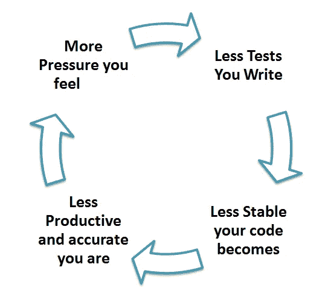

# 软件测试

> 原文：<https://medium.com/nerd-for-tech/software-testing-74d197498082?source=collection_archive---------5----------------------->

在上一篇文章中，我们讨论了软件开发标准的需求以及软件开发生命周期中涉及的各种过程。在这篇文章中，我们将深入探讨软件测试。如果你还没有看过前面的文章，那么看看它，然后回到这里。

 [## 软件开发生命周期

### 在这篇文章中，我们将深入探究成功软件的制作过程。我们会…

medium.com](/nerd-for-tech/software-development-life-cycle-cde7f069d5f3) 

## 什么是软件测试？

软件测试是*根据各种参数评估软件工作的过程，并在开发团队编写的代码*中发现 bug 和错误。软件测试人员的工作是**根据各种**测试用例**验证**软件，并确保实现的功能符合需求规格。

礼貌:ph.vector

有各种类型的软件测试:

1.  单元测试
2.  集成测试
3.  回归测试
4.  阿尔法测试
5.  Beta 测试
6.  系统试验
7.  压力测试
8.  性能试验

## 单元测试

这种类型的测试关注于软件的最小单元，并且测试单个单元或一组相关的单元。单元测试通常是为了验证单元的工作而执行的自动化测试。确保组件或装置符合设计和规范，并按预期运行。一个单元可以是一个完整的模块、一个函数或一个过程。

**为什么要进行单元测试？**

1.  单元测试有助于在开发周期的早期修复错误并节省成本。
2.  它有助于开发人员理解代码库，并使他们能够快速做出更改
3.  好的单元测试可以作为项目文档。

一些流行的单元测试工具有 JUnit、NUnit、JMockit、EMMA、PHPUnit

礼貌:guru99.com

## 集成测试

在集成测试中，将单元测试组件组合起来，根据设计构建程序结构，并将集成模块作为一个整体进行测试。集成测试有四种类型:

1.  自上而下

**自上而下** - **自下而上**集成**测试**是一种集成**测试**技术，用于模拟尚未集成的下层模块的行为。

2.自下而上

**底层** - **上层测试**是**集成测试**的一种方法，其中最底层的组件先**测试**，然后用来方便更高层组件的**测试**。

3.夹层测试

**夹层测试**是自下而上方法和自上而下方法的结合

4.大爆炸测试

**大爆炸集成测试**是一种将所有软件组件一次组合成一个复杂系统的方法。不同模块的这种统一性然后作为一个整体被**测试**。

一些流行的集成测试工具有 DBUnit、JMockit1 等。

## 回归测试

每次向现有系统添加新模块时，都需要测试系统，以确保即使在添加新模块后，系统仍能正常工作。

> **例如:**在一个学校管理系统中，假设教师模块已经存在，一个名为“学生”的新模块被添加到系统中。现在，对系统进行整体测试以确保在引入新模块后系统不会出现故障是绝对必要的。

## 阿尔法测试

这是一种验证测试。这是一种*验收测试*，在产品发布给客户之前完成。这通常由 QA 团队完成。

换句话说，软件测试是在组织内部完成的。

礼貌:pch.vector

## Beta 测试

beta 测试由软件的最终用户在一个或多个客户站点进行。该版本面向有限数量的用户发布，用于在实时环境中进行测试。

## 系统试验

这个软件经过测试，可以在不同的操作系统上正常工作。它包含在黑盒测试技术中。在这里，我们只关注所需的输入和输出，而不关注内部工作。

这包括软件的功能性和非功能性测试。

## 压力测试

在这种类型的测试中，测试软件对不利输入的反应。通常，软件会针对需要最大内存或导致过多磁盘需求的测试用例进行测试。

## 性能试验

它旨在测试软件在集成系统环境中的运行时性能。它用于测试程序的速度和有效性。它也称为负载测试。在这种情况下，系统的性能由其处理负载的能力来衡量。

希望你喜欢阅读这篇文章！

如果您有任何疑问，请在下面的**评论**部分发帖。在 [LinkedIn](https://www.linkedin.com/in/vaidhyanathansm/) 上与我联系。此外，如果你想看看我开发的惊人的应用程序集，别忘了查看谷歌 Play 商店。

了解我更多[在这里](https://vaidhyanathansm.tech/)。

话虽如此，感谢您阅读我的文章和*快乐编码！*