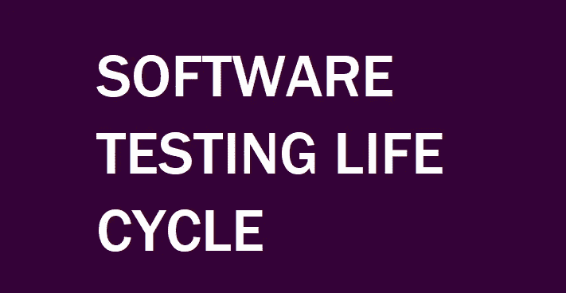
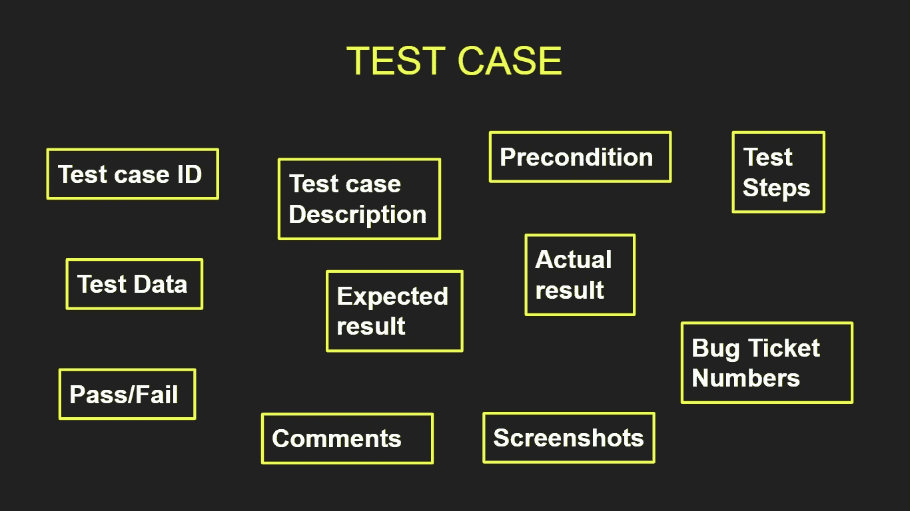
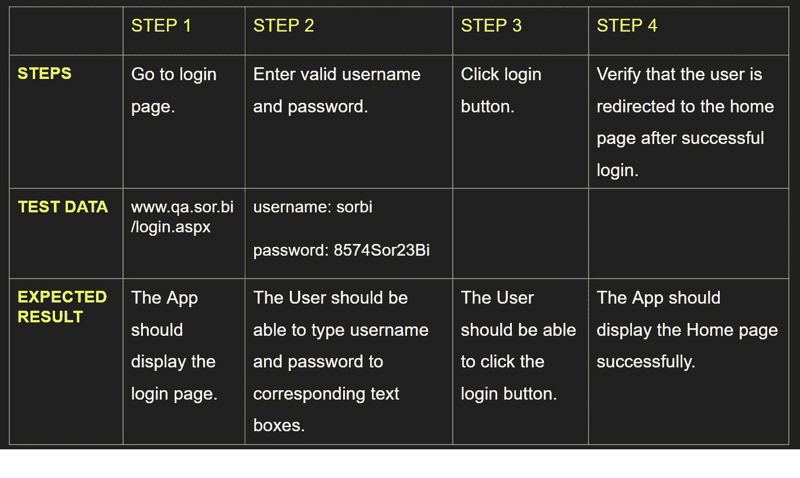
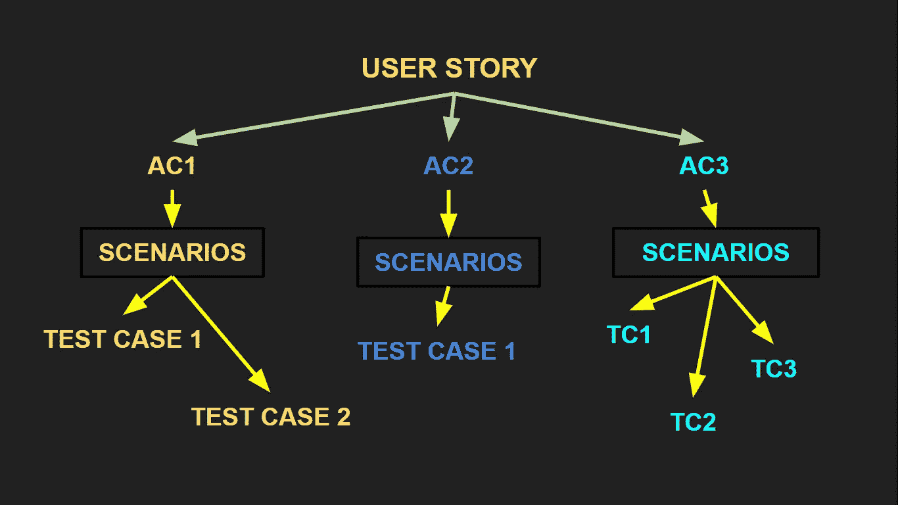
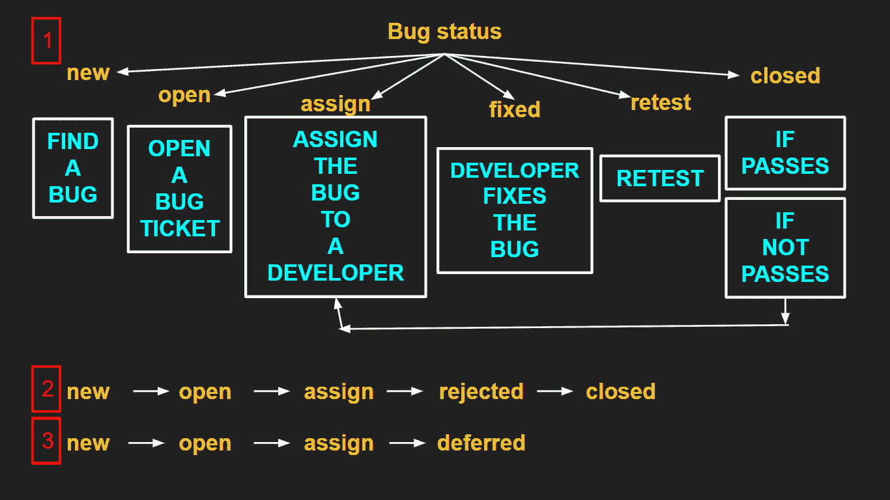

# 软件测试生命周期[测试文章系列第 7 部分中的软件开发工程师]

> 原文：<https://medium.com/nerd-for-tech/software-testing-life-cycle-software-development-engineer-in-test-article-series-part-7-38bce15ec602?source=collection_archive---------6----------------------->

这是我的“如何成为一名测试中的软件开发工程师”文章系列的第七篇文章。所有这些文章都是以问答的形式写的。正如我从我的一些菲律宾朋友那里了解到的，这个方法是苏格拉底为了更好地解释事物而发明的。因此，我希望技术和非技术的家伙将受益于这些文章。

这里 可以找到之前的文章 [**。强烈建议在这篇之前先看前面的文章。**](https://kicchi.medium.com/)

由于我已经做了 11 年多的软件开发人员，我将提供一些真实的和可行的示例代码。这些代码样本源自移动应用程序、桌面应用程序、web 应用程序、web 服务以及各种数据库过程。

为了更好地解释事情，LadyQ 和 SorBi 在我的文章中被大量用作样本。

***女士 Q:*** 索布应用程序的女商人和客户。她付钱给一家软件开发公司开发索比应用程序。

***SorBi:*** 一款用于创建和分享民调的 android 应用。在本系列文章中，以 SorBi 为例。这款应用在 [**Google Play**](https://play.google.com/store/apps/details?id=com.lespania.sorbi) 上可用，支持英语和土耳其语。

让我们享受学习软件测试生命周期令人兴奋的东西吧！

> **问题:**我想成为 Test (SDET)的软件开发工程师。在我们之前的课程中，您讨论了测试类型。但是，我不知道如何确保满足软件质量目标。如何进行这些测试？

**回答:**确保软件质量是一项**协作**的任务，包括所有团队成员。首先，理解客户的需求是第一步，也是最重要的一步。产品负责人(PO)对此负责。然后，将需求转换成符合投资标准的用户故事也是产品负责人的职责。设计一个好的、健壮的、可伸缩的系统是软件架构师的责任，等等…

> **问:**那么，为什么说“软件测试保证了产品的质量”？

**答:**因为，所以。特别是静态测试，正如我们在前面的会议中强调的那样，从 SDLC 的开始就开始了。这里的关键是:测试阶段是 SDLC 的第四步，但它严格依赖于第一步**，即需求收集。因为用户故事是从那些需求中产生的。并且进行**测试以确保用户故事完成**。**

**但是，必须有更多的东西来检查用户故事是否按预期完成。因此，PO 创建了与每个用户故事相关的**验收标准** (AC)。被分配到一个用户故事的软件开发人员进行编码，以满足那个标准。被分配到同一个用户故事中的软件测试人员，基于相同的验收标准，创建场景并执行测试。所以，如你所见，这个 **AC 对于开发者和测试者来说都是一个参考**。AC 也是 Done 定义的一个参考，这对于在每个 sprint 结束时接受或拒绝 sprint 非常重要。**

> ****问:**嗯，据我所知，有很多测试步骤。我们能像我们在软件开发(SDLC)中一般过程一样识别软件测试的特定过程吗？**

****答:**当然，在测试过程中所执行的特定动作的顺序被称为软件测试生命周期(STLC)。STLC 确保测试过程以系统和有计划的方式执行。**

**我们可以在瀑布和敏捷方法中执行 STLC。但是很明显，在敏捷中，STLC 不仅仅是一个单独的步骤，而是贯穿整个 SDLC 过程的一个连续循环。**

> ****问:**如果是 SDLC 这样的循环，软件测试生命周期(STLC)的步骤是什么？**

**正如所强调的，SDLC 的第一步，需求收集，是最重要的一步。同样，我们可以说**需求分析***(****STLC 的 1/6*** *步骤)*是 STLC 的第一步，也是最重要的一步。**

> **我想，我很容易就能知道客户需要什么。什么都要问客户，我的意思是做正确的事情，这是件大事吗？**

**这是开发人员或测试人员可能有的最危险的想法。要了解客户的需求，你必须充分了解他/她的期望。你期望什么并不重要。它可能与客户的期望完全不同。**

**因为我们基于客户的需求开发应用程序，所以了解他/她的需求至关重要。因此，简单地说，阅读用户故事和他们的接受标准，确保你在需求分析阶段完全理解它们。**

**STLC 中的所有级别都有**进入**和**退出**标准。在需求分析步骤中，进入标准是软件需求规格说明文档。QA 团队分析该文档以及验收标准。**

**需求跟踪矩阵(RTM)是这个阶段的退出标准之一。RTM 是一个显示需求/用户故事和测试用例之间匹配的文档。所以，从需求的角度来看，你可以很容易地找到匹配的测试用例，反之亦然。**

> ****问:**好的，好的。假设我们**确定了**客户的期望，下一步是什么？**

****答:**接下来，我们要**创建测试计划***(STLC 的****2/6****步骤)*。测试计划是一个文档，主要由 QA 领导准备。它包括测试时间表、测试工具、资源、要测试和不要测试的区域、指定的测试人员、要执行的测试类型等等。这个阶段的退出标准是测试计划文档。**

> **问:听起来有很多文书工作。该测试计划文档是何时创建的？**

**是的，看起来需要很多文书工作。在瀑布方法中，由于每一步都与前一步紧密相连，所以测试计划文档是在编码阶段之后为整个软件创建的。但是，在敏捷方法中，因为它是软件开发的迭代方法，所以为每个**发布**、**回归**或**冲刺**创建一个测试计划文档。此外，有时，测试计划会在团队成员中讨论，但不会形成文档。**

> **问:为什么把所有事情都写下来这么重要？**

**答:事实上，那并不是一切。此外，大多数软件公司对每种类型的测试计划都有模板。这没什么大不了的。重要的是，文档主要是关于**定义边界**。在 STLC 的第三步我们**创建测试用例**(STLC 的 ***3/6*** *步骤)。这也是一个文档。他们可以写在一个 Excel 文件，或保存在一个问题跟踪软件，如吉拉。***

**测试用例的创建是基于用户故事的接受标准来执行的。验收标准同样主要与定义边界和**行为**有关。在创建**测试用例** (TC)之前，测试人员必须考虑基于 AC 的可能的**场景**。让我们检查一个从用户故事到场景的示例流程:**

****

**从用户故事中创建场景**

**如图所示，测试人员考虑了第一个验收标准，并创建了**负面**和**正面**场景。这些场景将被转换成测试用例。每个测试用例都有一些信息。**

****

**测试用例细节**

**让我们基于我们的示例场景创建一个测试用例:**

****测试用例 ID:** 由吉拉等 bug 追踪软件自动给出。**

****测试用例描述:**验证用户可以使用有效的用户名和密码登录。**

****前提条件:**测试环境要准备好(如 QA 环境或 Staging 环境)。测试数据应该准备好(有效的用户名和密码应该由开发人员或数据库管理员提供)。**

****步骤、测试数据**和**预期结果**如下所示:**

****

**示例测试用例步骤、测试数据和预期结果**

****实际结果:**我们执行每一步后的结果。**

****通过/失败:**基于实际结果和预期结果匹配的测试条件。**

****注释:**供测试人员编写注释的可选区域。**

****截图:**每一步的证据，显示测试人员在执行每一步后有什么。比如截图、数据库查询结果、屏幕录像、日志文件等。可以保存在测试周期结束文件中以支持测试执行的完成。**

****bug 票号:**如果有 Bug，测试人员开一个 Bug 票。这个 bug 与当前的测试用例有关。**

****

**用户故事和测试用例之间的关系**

**将测试用例与它们的用户故事联系起来是至关重要的。它们必须可以从用户故事中到达，并且用户故事必须可以从测试用例中到达。**

**测试用例创建阶段的退出标准是测试用例、测试数据以及自动化脚本(如果适用的话)。**

> ****问:**有道理。在哪里执行那些测试用例？**

****答:**从 SDLC 中我们知道，软件开发有四种环境:**【1】**开发环境。质量保证/测试环境。 **(3)** 生产前/登台环境。 **(4)** 生产环境。这些环境是硬件和软件的结合。**

**STLC 的第 4 步是**环境设置** ( ***4/6*** )。每个环境都有不同的测试类型。**

*   **单元和集成测试在开发环境中执行。环境。**
*   **手动测试、功能测试、冒烟测试和后端测试在 QA 环境中执行。**
*   **回归测试和 UAT 测试在生产前(试运行)环境中执行。**

**测试人员进行测试的环境必须准备好；配置操作系统和虚拟机，测试工具如 JUnit 和 TestNG，并部署数据库。测试团队在测试环境中执行**烟雾测试**。**

> **问:让我们来做测试。我们等了这么久，不是吗？**

**答:哦，是的。这是一个漫长的过程，直到执行测试。**测试执行**(***5/6****STLC*的步骤)由手工测试人员和自动化测试人员共同执行。在执行测试后，测试人员会得到测试结果。那些叫做实际结果。记住，预期的结果已经写在测试用例中了。现在，比较实际结果和预期结果很重要。如果匹配，测试仪可以将测试状态定义为**通过**，否则测试仪必须执行额外的动作。**

> ****问:**如果测试不能通过，那么就说明失败了。还有呢？**

**那并不总是正确的。测试可能会因为糟糕的编码或代码不一致而失败。此外，它还可能因为**错误数据**、测试时使用的测试器而失败，或者，如果是自动化测试，测试器的代码可能会导致错误。因此，很明显，在定义一个 bug 之前，测试人员必须在所有方面履行他/她的职责。测试人员检查他/她的代码和过程。然后，相同的误差必须用不同的数据再现至少三次。只有在该测试人员可以将测试状态定义为**失败**之后，他/她才能创建**故障单**。该 Bug 标签必须与相关的测试用例以及相关的用户故事相联系。当从问题跟踪产品中选择一个用户故事时，人们必须看到相关的测试用例以及相关的 bug 标签。这对于跟踪问题非常重要。**

> **问:我们如何定义一个 bug？**

****答:**在一个 app 中发现的任何不匹配的功能都被称为 **Bug** 或**缺陷**。这就是为什么我们有验收标准。正如前面所强调的，它是开发人员和测试人员的参考。**

> ****问:**如何创建 bug 单，为什么，直接通知开发者就行了？**

****答:**创建 bug 单或者报告 bug 对于 STLC 来说是一个非常重要的过程。事实上，有一个过程叫做 Bug 生命周期。**

> ****问:**哦，我的…周期，周期，周期…**

****答:**不必惊慌。这是一个简单的过程。首先，我必须谈谈错误报告。**

**当检测到一个缺陷时，这就是测试人员的检测。但是，在某些情况下，开发人员不同意测试人员的意见。他们可以说这不是缺陷等等。所以最后的决定权属于产品负责人。这就是为什么要创建 bug 票证。**

**此外，有时，开发人员没有时间修复 bug，bug 修复可以推迟到下一个 sprint。所以必须有一个 bug 标签来跟踪并确保它被修复。**

**它也是软件开发过程的一个很好的文档。如果项目中有新的开发人员或测试人员，他们可以在像吉拉这样的工具中查看过去的行为，并理解过程。**

**一旦一个缺陷被记录下来，它应该被**映射**到相关的测试用例以及需求跟踪矩阵中相应的需求。因此，这些文档在该阶段被**更新**。更新的测试用例、RTM 和 bug 报告是测试执行阶段的退出标准。**

> ****问:**现在，有道理了。创建 bug 标签很重要。请简单谈谈 Bug 生命周期。从现在开始我不想学任何自行车。**

****答:** **Bug 生命周期**是处理缺陷的系统化过程。这个周期中的错误流由错误状态表示。这些是在 bug 生命周期的不同阶段中可能出现的 Bug 状态:**

****

**Bug 生命周期**

**场景 1 以**关闭**bug 标签或者**根据重新测试活动的结果重新分配**开发人员而结束。**

**在场景 2 中，由于重复的 bug 问题或者不承认它是有效的 bug，被指派的开发人员拒绝了 bug 单。然后，bug 状态变为**关闭**。**

**在场景 3 中，bug 的修复被推迟到下一个 sprint，所以 bug 状态是 **deferred** 。**

**在测试执行阶段结束时，测试用例用执行结果进行更新。缺陷应该被关闭或推迟。**

> **问:很好。STLC 完成了吗？**

****A:** 还有一步:**测试周期结束** ( ***6/6*** )。在 STLC **结束时，生成测试报告**。这些报告应包括花费的时间、发现的错误占阳性测试结果的百分比、发现和修复的错误总数。**测试度量**是基于那些参数准备的。**定义了 Bug 状态**。如果涉及到测试部门，测试用例、测试结果和度量将被评估，以提高未来测试的生产力。测试报告、测试度量是那个阶段的退出标准。**

> ****问:**有没有可能有一个%100 无 bug 的软件？**

****答:**一个 bug 在被检测出来之前是未知的。你无法知道是否有未知的缺陷。但是，相信我，即使你认为你已经找到了最后一个错误，也总会有至少一个缺陷**。并且对该错误的修复可能会产生新的未知缺陷。再想想那个问题。****

> ******问:**t24】🥺****

****别担心。我们是**臭虫巡逻队**。💪👾💪****

****只要我们能找到 bug，我们都欢迎。他们是我们找工作的主要原因。和他们好好相处。😀****