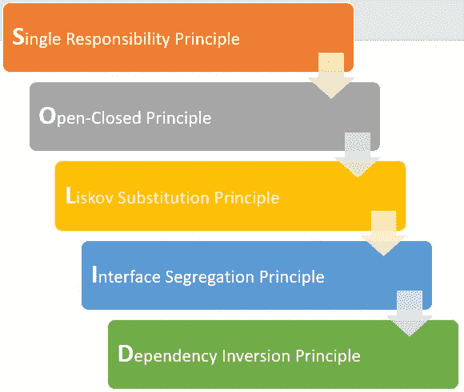

# Java 中的坚实原理

> 原文：<https://medium.com/nerd-for-tech/solid-principles-in-java-5cf926e44247?source=collection_archive---------2----------------------->

坚实的原则基本上构成了构建面向对象、松散耦合、健壮、可维护和易于理解的应用程序的基本准则。面试中最常被问到的问题之一，让我们来看看每个问题:

***单一责任*** :一个类应该有且只有一个责任。我们应该只为一个目的编写、更改或维护一个类，这给了我们更干净、健壮的代码和更少的测试用例的优势，因为我们知道哪个功能包含在哪个类中，以及在发生更改时哪个类将被修改。对于 ex:
`public class Vehicle{
public void printDetails() {}
public double calculate() {}
public void addtoDB() {}
}`

上面的类有三个独立的职责:打印、计算和添加到数据库。通过应用 SRP，我们可以将上面的类分成三个具有独立职责的类。

*:一个类应该对扩展开放，但对修改关闭，这基本上意味着我们不希望我们现有的代码被修改，导致潜在的问题或错误。其他开发人员在一些功能变化的情况下应该能够扩展我们的类和覆盖一些方法。对于 ex:
更好的方法是让子类根据它们的类型重写 Value 方法。*

****利斯科夫替换*** :派生类必须可替换基类。简单地说，如果类 A 扩展了类 B，我们应该能够用 A 替换 B，而不会破坏我们程序的行为。根据 OOPS 概念，继承是一个好的实践，但是 Liskov 原则要求在使用继承时要仔细考虑。只有当我们的超类在所有情况下都可以用子类替换时，我们才应该使用继承。
For ex:经典的方矩形问题。
`public class Rectangle {
private double height;
private double width;
public void setHeight(double h) { height = h; }
public void setWidht(double w) { width = w; }
//getters and calculateArea method
}
public class Square extends Rectangle {
public void setHeight(double h) {
super.setHeight(h);
super.setWidth(w);
}
public void setWidth(double h) {
super.setHeight(h);
super.setWidth(w);
}
}` 由于其明确的基类 Rectangle 显然不能被 square 子类替换，因为 Square 具有高度和宽度相等的约束，所以用 Square 类替换 Rectangle 类会中断 LSP。*

**:不应该要求任何人在他们的类中实现他们不会使用的方法。较大的接口应该分成较小的接口。这确保了实现类只需要关心对它们有用的方法。这给了我们只使用所需功能的灵活性。对于 ex:
`public interface Vehicle {
public void drive();
public void stop();
public void openDoors();
}
public class Bike implements Vehicle {
// Can be implemented
public void drive() {...}
public void stop() {...}
// Can not be implemented
public void openDoors() {...}
}` 对于一个自行车类来说，实现 openDoors 方法没有意义。这应该通过将车辆接口分解成多个具有可能功能的更小的接口来解决，这样就不会有类被迫实现不需要的方法。**

*****依赖倒置*** :一个类应该依赖抽象(接口和抽象类)而不是具体化(类)。上面的代码适用于一种引擎，但是如果有两种引擎，比如柴油和汽油，那就意味着要修改我们的类，这不是个好主意。
这可以通过增加一个抽象层来解决，所以 car 现在不是直接依赖于 Engine 而是依赖于 EngineInterface。PetrolEngine 或 DieselEngine 类实现了这个接口，我们可以将它们中的任何一个连接到 Car 类:**

**希望这篇文章给出了坚实的原则好主意。快乐学习:)
。
。
引用: [educative.io](https://www.educative.io/edpresso/what-are-the-solid-principles-in-java?aid=5082902844932096&utm_source=google&utm_medium=cpc&utm_campaign=edpresso-dynamic&utm_term=&utm_campaign=Dynamic+-+Edpresso&utm_source=adwords&utm_medium=ppc&hsa_acc=5451446008&hsa_cam=8092184362&hsa_grp=86276435689&hsa_ad=397226000870&hsa_src=g&hsa_tgt=aud-470210443636:dsa-837376625453&hsa_kw=&hsa_mt=b&hsa_net=adwords&hsa_ver=3&gclid=Cj0KCQjwxJqHBhC4ARIsAChq4asdhLfFjckL-xdC-l0Lfitrm9aJ9gezJtP6D1YRPFT4jrqUtb9gQm0aAjWQEALw_wcB) ， [howToDoInJava](https://howtodoinjava.com/best-practices/solid-principles/)**