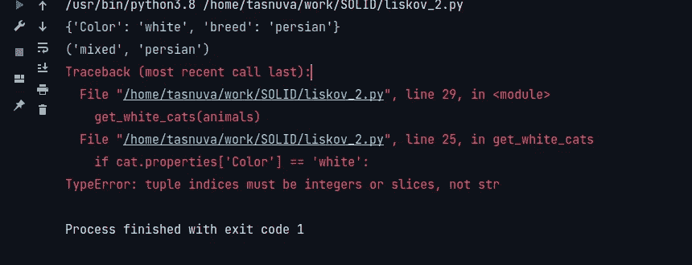
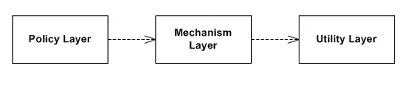
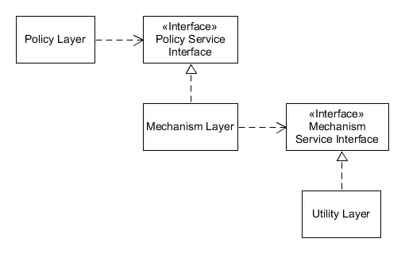

# 蟒蛇皮

> 原文：<https://medium.com/nerd-for-tech/solid-principles-python-f09915698d85?source=collection_archive---------0----------------------->

> "如果建筑者像程序员写程序那样建造房屋，那么第一只啄木鸟就会毁灭文明"。(杰拉尔德·温伯格)

## 在建筑商那里，建筑应该是坚固的，纯粹的坚固；) .

# **S O L I D**

在软件工程中，我们为高效的应用程序编写高效的算法。一旦算法到位，最重要和最关键的事情将是确保应用程序是按照最佳设计和架构实践来设计的。 **SOLID** 据说是最好的设计实践之一。

术语**固体**描述了由 ***鲍勃大叔发明的用于更好编码风格的***设计原则的**集合！** *哦你知道* ***鲍勃叔叔*** *是谁吗？嗯，他不是别人，正是* **罗伯特·c·马丁**，你是对的，**干净代码之父。**

> "如果两者都冻结了，在水面上行走和根据规范开发软件是容易的. "爱德华·v·贝拉德

资料来源:unsplash。功劳归于@templecerulean

当你遵循坚实的基础时，你实际上是在编写更简单、更容易理解、可维护和可扩展的代码，这将为你的团队节省大量时间。特别是当一群人在一个有几十万行代码的更大的代码库上一起工作时，坚实的基础就成了必须。让我们马上进入主题。

缩写 **SOLID** 实际上涵盖了 5 个重要原则:

*   单一责任原则
*   开闭原则(OCP)
*   利斯科夫替代原理(LSP)
*   接口隔离原则(ISP)
*   依赖性倒置原则

让我们从单一责任原则开始

# **单一责任原则**

单一职责原则或 SRP 声明每个类或功能应该处理单一任务。这意味着如果您定义了一个类来加载数据，您就不应该使用同一个类来更新您的数据库。每个职能都有一个单一的责任，因此也有一个单一的变革理由。因此，如果你的类或函数加载数据，修改数据，并绘制数据，那么在返回结果之前，一切都要马上停止。罗伯特·c·马丁对此的解释是:

> “一个类应该只有一个改变的理由”。

所以，仅仅因为你可以在你的类或函数中添加任何你想要的东西并不意味着你应该这样做。

我们来举个`PhoneBook`的例子。我们的`PhoneBook`只包含`person`的`name`和`number`。它的主要职责是管理联系号码。因此，我们的类的功能将是`adding new contact`、`deleting existing contact`、`change a contact number` 和`search a number by name`。所以我们的`PhoneBook`类可能是这样的:

现在，假设我们有另一个将`contacts`的所有数据保存到`database`的需求，所以我们添加了另一个将联系人保存到`db`的函数，我们还想将数据保存到`csv file`。让我们也添加存储数据到`csv`文件的功能。

等等！我们是否违反了单一责任的原则？是的，我们是！

在给`db`和`csv`增加存储数据的额外功能时，我们实际上打破了单一责任的原则。因为，通过增加这些功能，我们给我们的类增加了额外的责任，除了它的主要责任。将来，如果需要对保存到`db`的数据进行任何更改，也可以更改我们的类别电话簿。因此，除了它的主要职责之外，这个类很容易改变。

> 单一责任原则只是要求我们不要给一个类增加额外的责任，这样我们就不必修改一个类，除非它的主要责任发生了变化。

让我们解决违规问题。我们需要做的就是定义单独的类来处理`database`存储和保存到`csv`。我们将把联系对象传递给那些类。

# 开闭原则:

**开闭原则**也叫迈耶的开闭原则，是由 Berterd Meyer 于 1988 年在其著作 [*面向对象软件构造*](https://en.wikipedia.org/wiki/Object-Oriented_Software_Construction) *中首次概念化的。鲍勃大叔*提到这是“面向对象设计最重要的原则”。开闭原则规定:

> *软件实体(类、模块、功能等。)应为扩展打开，但为修改关闭*"

也就是说，这样的实体可以允许其行为被扩展，而无需修改其源代码。

*   如果一个模块仍然可以扩展，那么这个模块就被认为是开放的。例如，应该可以向它包含的数据结构添加字段，或者向它执行的功能集添加新元素。
*   如果一个模块可供其他模块使用，那么这个模块就是关闭的。这假设模块已经被赋予了一个定义良好的、稳定的描述(信息隐藏意义上的接口)。

这个原则确保了一个类被定义为做它应该做的事情。

如果我们想要添加任何进一步的特性，我们可以通过创建新的实体来扩展现有类的特性，并向其自身添加更多的特性。从而防止对已建立的低级类进行频繁而琐碎的更改。

假设我们有一个针对 m 的申请，我们系统的一个特性是根据服装类型应用折扣。很好，所以在下面的例子中我们有一个类`CalculateDiscount`，它有一个*属性*来保存`*cloths*`的类型。它有一个基于衣服类型计算折扣并返回折扣金额的功能。

这种设计明显违反了开闭原则，因为在以下情况下需要修改:

1.  折扣列表中将包括新的服装类型
2.  任何服装变更的折扣金额。

为了避免这种违反，我们可以做的是用抽象方法`apply_discount`创建一个类。让我们看看这个例子:

在这里，我们有带单个`abstract`方法`apply_discount`的类`CalculateDiscount`，我们有扩展`CalculateDiscount`的单个服装的单个类，所以每个子类需要自己实现`apply_discount`，这避免了修改基类的约束。如果需要，我们可以添加新产品并更改折扣金额，而无需更改基本类别。

# 利斯科夫替代原理

利斯科夫替代原理或 [**LSP**](http://c2.com/cgi/wiki?LiskovSubstitutionPrinciple) 指出:

> “程序中的对象应该可以用其子类型的实例来替换，而不会改变程序的正确性”

**利斯科夫替代原理** ( **LSP** )是一种子类型关系的特殊定义，称为(**强** ) [**行为子类型**](https://en.wikipedia.org/wiki/Behavioral_subtyping) ，最初是由 [Barbara Liskov](https://en.wikipedia.org/wiki/Barbara_Liskov) 在 1988 年提出的。该原则指出:

> 如果 S 是 T 的子类型，那么类型为 T 的[对象可以用类型为 S 的对象替换*(即，类型为 T 的对象可以用类型为 S 的任何对象*替换*，而不改变程序的任何期望属性(正确性、执行的任务等)。)*](https://en.wikipedia.org/wiki/Datatype)

让我们有一个基类`Animal`来表示动物的类型。`Cat`类继承自`Animal`。类似地，`Cat`类也可以被其他类继承。

假设我们必须找出所有白色的猫。让我们定义一个`function`，让所有的`cats`都是白色，然后运行程序:

> **注**:由于没有添加*动物属性的标准规范。你可以将它实现为一个字典，你的团队成员可以将它用作元组，因此它可以实现为多种方式*

输出将如下所示:

在这里，我们可以看到，在遍历动物列表时，我们违反了 liskov 替换原则，因为我们不能用子类型`*Cat*` 的对象替换超类型`*Animal’s*` 对象，这是为了获得白色`cats`而编写的函数。

更好的方法可能是在超类`*Animal*` 中引入`setter`和`getter`方法，使用它们我们可以设置和获取`*Animal's*` 属性，而不会将实现留给个人。

因此，我们可以使用如下所示的`getter`和`setter`遵循利斯科夫替代原理:

# 界面分离原理

[界面分离原理](https://en.wikipedia.org/wiki/Interface_segregation_principle#:~:text=In%20the%20field%20of%20software,methods%20it%20does%20not%20use.&text=ISP%20is%20intended%20to%20keep,refactor%2C%20change%2C%20and%20redeploy.)指出，

> “不应该强迫任何客户依赖它不使用的方法”。

罗伯特·C·马丁在为施乐公司做咨询时介绍了 ***界面分离原理*** 。这个原则建议使用更小的接口，称为“*角色接口* s”。ISP 将较大的接口分成较小的角色接口。所以客户将依赖于与他们相关的方法。

> [**注**](https://www.linkedin.com/pulse/solid-design-principles-python-examples-hiral-amodia/) :这个例子来源于[Hiral Amodia 发布的这个](https://www.linkedin.com/pulse/solid-design-principles-python-examples-hiral-amodia/)博客

假设我们正在为不同的通信设备设计一个应用程序。通信设备最常见特征是:a)打电话，b)。发送短信和 c)。浏览互联网。因此，让我们创建一个名为`CommunicationDevice`的接口，并为每个特性添加各自的`abstract`方法，这样任何实现类都需要实现这些方法。

到目前为止一切顺利。但是现在假设我们想要实现一个传统的固定电话，它也是一个`communication`设备，所以我们使用相同的`CommunicationDevice`接口创建了一个新的类`LandlinePhone`。这正是我们面临的问题，因为我们创建了一个大的`CommunicationDevice`接口。在类`LandlinePhone`中，我们实现了`make_calls()` 方法，但是由于我们也继承了抽象方法`send_sms()`和`browse_internet()` ，我们必须在`LandlinePhone`类中提供这两个抽象方法的实现，即使
不适用于这个类`LandlinePhone`。我们可以在实现中抛出一个异常或者只写 pass，但是我们仍然需要提供一个实现。

让我们通过隔离接口来解决冲突。我们将为每个方法创建较小的角色接口，而不是创建一个大的接口。各个类将只使用相关的接口。

# 从属倒置原则

**依赖倒置原则**是[松耦合](https://en.wikipedia.org/wiki/Coupling_(computer_programming))软件[模块](https://en.wikipedia.org/wiki/Modular_programming)的一种具体形式。该原则指出:

1.  高层模块不应该依赖低层模块。两者都应该依赖于抽象(例如接口)。
2.  抽象不应该依赖于细节。细节(具体的实现)应该依赖于抽象。

当我们的应用程序主要由模块组成时，我们需要遵循依赖注入。我们所有的模块应该是松散耦合和独立的。

传统图层模式(来源维基百科)

依赖倒置模式(来源维基百科)

有趣的是，如果我们的代码遵循开闭原则和 Liskov 替换原则，它也符合依赖反转原则。因为

1.  遵循开放-封闭原则，我们创建了接口来提供不同的高级实现
2.  Liskov 替换确保我们可以用高级类对象替换低级类对象，而不会对应用程序造成任何负面影响。

让我们假设我们有一个班级玩家和一个班级俱乐部会员，它拥有不同学生在不同俱乐部的会员资格。现在，我们定义了一个高级类 MembershipReportOfBarcelona，它将包含巴塞罗那俱乐部的所有球员及其净资产。

如你所见，我们直接从高级类`MembershipReportOfBarcelona`访问`ClubMembership`类的成员。通过这样做，我们违反了依赖倒置的原则。

怎么会？假设我们将来需要将`members`的实现从`list`修改为`dict`或`tuple`或任何其他数据类型。在这种情况下，我们的高级类`MembershipReportOfBarcelona`将会中断，因为它依赖于低级类`ClubMembership`的
实现。这太荒谬了！

让我们尽快解决这个根本性的问题:

坚持*依赖倒置原则*的首要任务是确保我们的任何高级类都不依赖于任何低级类的实现。

因此，像*开闭*原理一样，我们用一个抽象方法`find_players_of_club`创建了一个新的接口`FindClubMembership`，它将查找**一个俱乐部的所有球员。任何继承这个`FindClubMembership`类的`class`都必须自己实现这个抽象的`method`。**

在我们的例子中，我们的`ClubMembership`类扩展了接口，所以我们在这里实现了查找部分，方法将`yield`得到结果。在我们的`MembershipReportOfBarcelona`类中完成的流程现在由`ClubMembership`类的
负责。我们通过接口`FindClubMembership`做到了。通过这样做，我们已经从低级类`ClubMembership`中消除了高级类`MembershipReportOfBarcelona`的依赖性，并且
将依赖性转移到了我们的接口`FindClubMembership`。因此，低级类实现的任何变化都不会再影响我们的高级类。

开始编写**扎实的**代码。你的队友会一直感激你。

**参考文献:**

1.  [https://en.wikipedia.org/wiki/SOLID](https://en.wikipedia.org/wiki/SOLID)
2.  [https://www . LinkedIn . com/pulse/solid-design-principles-python-examples-hiral-amodia/](https://www.linkedin.com/pulse/solid-design-principles-python-examples-hiral-amodia/)
3.  [https://towards data science . com/5-principles-to-write-solid-code-examples-in-python-9062272 e6bdc](https://towardsdatascience.com/5-principles-to-write-solid-code-examples-in-python-9062272e6bdc)