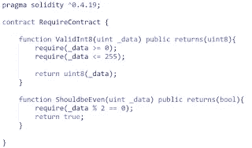
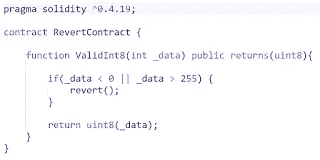

# 可靠性异常和错误处理

> 原文：<https://medium.com/nerd-for-tech/solidity-exception-and-error-handling-d1ebfae85552?source=collection_archive---------2----------------------->

# 介绍

写合同是稳健的根本目的。然而，编写契约需要可靠的错误和异常处理。错误和异常是编程中的规范，而可靠性为管理这两者提供了充足的基础设施。编写具有适当的错误和异常管理的健壮契约是最佳实践之一。事件是坚固性的另一个重要组成部分。我们知道一个调用契约中的函数的调用者；然而，我们还没有讨论任何一种机制，通过这种机制，契约可以通知它的调用者关于它的状态和其他方面的变化。这通常是有活动的地方。事件是事件驱动程序的一个邻域，它支持程序内的更改，并主动通知调用者这些更改。打电话的人可以随意使用或忽略这些信息。最后，异常和事件都在很大程度上使用了 EVM 提供的日志记录功能。

# 错误处理

在撰写合同时，经常会无意中引入错误，因此撰写健壮的合同可能是一种很好的实践，并将被遵循。在编程世界中，错误是生活中的现实，编写无错误的契约可能是一项需要的技能。错误可能发生在设计时或运行时。Solidity 被编译成字节码，编译时会在设计时对任何语法错误进行设计级检查。然而，运行时错误更难捕捉，通常发生在执行契约时。检查契约中可能的运行时错误是很重要的，但是更重要的是写下防御性的、健壮的契约来监视设计时和运行时错误。运行时错误的例子有气体用尽错误、被零除错误、数据类型溢出错误、数组索引外错误等等。在 Solidity 的 4.10 版本之前，只有一个 throw 语句可用于错误处理。开发人员必须写下多个 if…else 语句来查看值，并在出错时抛出。throw 语句消耗所有提供的气体，并返回到第一个状态。对于建筑师和开发者来说，这通常不是一个完美的情况，因为未使用的气体应该返回给呼叫者。从 4.10 版本开始，Solidity 引入了新的错误处理结构，因此抛出
被废弃了。这些是断言、要求和回复语句。值得注意的是没有尝试..捕捉语句或构造来捕捉错误和异常。

# 所需语句

单词 requires 表示约束。声明 require 语句意味着声明运行该函数的先决条件；换句话说，这意味着在执行后续代码行之前声明应该满足的约束。指定的语句在单个参数中接受:一篇新闻稿，其计算结果为真或假布尔值。如果语句的求值结果为假，则会引发异常并停止执行。未使用的气体被返回给呼叫者，因此状态被反转到第一个。指定的语句导致 revert 操作码，该操作码负责恢复状态并返回未使用的 gas。下面的代码说明了指定语句的使用:

让我们看一下前面截图中描述的后续函数:
1。ValidInt8:这个函数使用了一些必需的语句。在构造中，新闻稿检查大于或等于零的值。如果该语句为真，则执行转到后续语句。如果这个语句是假的，就会抛出一个异常并停止执行。随后的 requires 语句检查该值是否小于 255 或者是否足以达到 255。如果参数大于 255，则该语句的计算结果为 false 并引发异常。
2。shouldbeven:[这个函数具有相同的性质。这个函数需要检查传入的参数是奇数还是偶数。](https://www.technologiesinindustry4.com/)如果自变量是偶数，则执行传递到随后的语句；否则，将引发异常。指定的语句应该用于验证传入函数的所有参数和值。这表明，如果命名了另一个契约中的另一个函数或同一契约中的另一个函数，甚至应该使用指定的函数来检查传入的值。指定的函数应该习惯于在使用变量之前检查变量的当前状态。如果 require 抛出一个异常，这应该意味着传递给函数的值不是函数所期望的，调用者应该在将值发送给契约之前修改它。

# 断言语句

assert 语句的语法与 specified 语句相似。如果它接受了一个新闻稿，那么应该评估一个真实或虚假的价值。在这种情况下，执行要么前进到后续语句，要么抛出异常。未使用的气体不会返回给调用者，而是被 assert 消耗掉。状态反转到第一种。assert 函数会导致无效的操作码，这可能会导致状态反转并消耗所有 gas。前面显示的函数已经扩展，增加了主要变量。但是，请记住，添加两个变量可能会导致溢出异常。这通常使用 assert 语句来验证；如果返回 true，则返回值，否则抛出异常。
下面的屏幕截图展示了 assert 函数的使用:

require 应该用于来自表面的值，assert 应该用于在执行之前验证函数和契约的当前状态和条件。[考虑断言处理我们无法预测的运行时异常。](https://www.technologiesinindustry4.com/)一旦你认为一个当前状态已经变得不一致，不应该继续执行，就应该使用 assert 语句。

# revert 语句

revert 语句非常类似于指定的函数。但是，它不评估任何语句，也不依赖于任何状态或语句。点击 revert 语句意味着抛出一个异常，伴随着未使用气体的返回，并恢复到其原始状态。在下面的示例中，当使用 if 条件检查传入值时，将引发异常；如果 if 条件评估结果为假，则执行 revert 函数。这会导致异常和执行停止，如下面的屏幕截图所示:

更多详情请访问:[https://www . technologiesinindustry 4 . com/2021/05/solidity-exception-and-error-handling . html](https://www.technologiesinindustry4.com/2021/05/solidity-exception-and-error-handling.html)