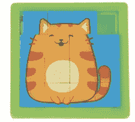
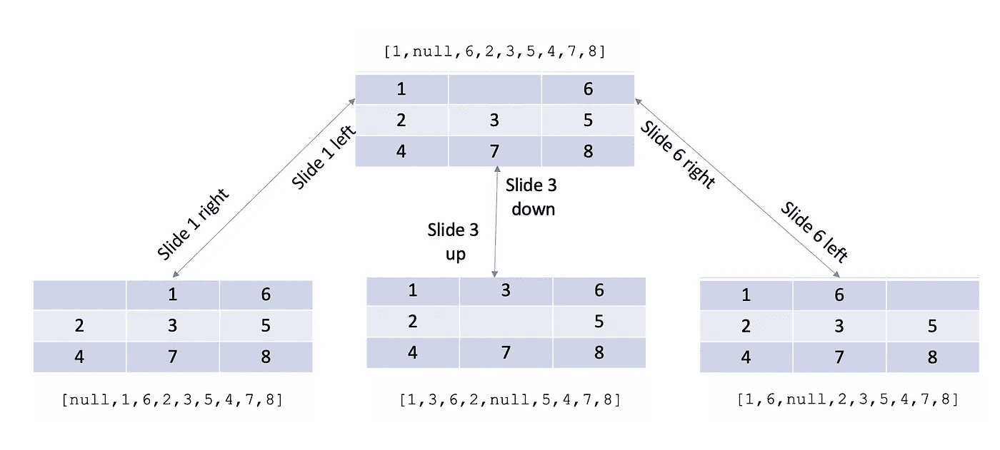
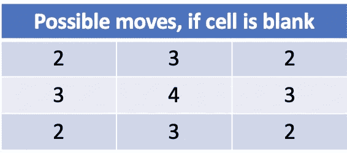

# 解决 8 个难题:构建图形

> 原文：<https://medium.com/nerd-for-tech/solving-8-puzzle-with-search-e17c71000780?source=collection_archive---------7----------------------->

我开始了我的人工智能之旅，似乎对搜索的研究是这个领域的首要条件。最初的成年问题看起来是一个简单的难题，八个难题。当我还是个孩子的时候，我就接触到了这个难题，40 年后当我回来的时候，我又想起了它。



8-拼图猫形象

我的第一个谜题和左边的猫谜题没有太大的不同。我的玩具不是由 15 个移动的棋子组成的 4x4，而是由 8 个移动的棋子组成的 3x3(哦，它是一列沿着轨道移动的火车)。这个游戏允许你将一个棋子滑动到空白的位置，当你通过再现图像解决问题时游戏结束。原来有更多的变体，其中每个瓷砖都是一个 a 数字，解决方案是将这些数字按顺序排列。不管瓷砖上是否有图像或显示它们的数值，数值是通过计算解决这个问题的正确方法(至少在我的 AI 旅程中的这一点上)。

第一个决定是如何代表董事会。我想保持简单，所以我决定我的棋盘应该用一个 1 x 9 的`array`来表示，每个元素都是从集合`{ 1,2,3,4,5,6,7,8, null }`中选择的(没有替换)。有 9 个选择 9 个排列= 362，880 的棋盘，最好用一个图形来表示。



代表四种板状态和六种转换的图形部分

棋盘通过将瓷砖滑入空位来改变状态。通过利用一个数组来表示棋盘状态，您需要首先确定空的(`null`)点在哪里。

一旦确定了空单元格，您就可以通过一些计算来确定另一个单元格是否可以滑入该位置:1、取空单元格的索引与其他所有单元格的索引之间的差；2.相距一个单位的单元格可以向左或向右滑动，相距三个单位的单元格可以向上或向下滑动；3.你需要意识到从不同的行滑动一个单元，那不是合法的移动。该代码看起来像:

```
// boardPermutation is an array of all possible premutations
boardPermutations.map(permutation => {
    const emptyIndex = permutation.findIndex(x => x == null)
    const allowLeft = emptyIndex % 3 != 2
    const allowRight = emptyIndex % 3 != 0 const moves = permutation.map((state, index) => {
        const delta = emptyIndex - index
        return {index, delta} }).filter(node => {
        return    node.delta == 1 && allowRight 
               || node.delta == -1 && allowLeft 
               || *Math*.abs(node.delta) == 3 }).map(node => {
        let label = ""
        if (node.delta == 1 && allowRight) {
            label = "RIGHT"
        } else if(node.delta == -1 && allowLeft) {
            label = "LEFT"
        } else if(node.delta == 3) {
            label = "DOWN"
        } else if(node.delta == -3) {
            label = "UP"
        }

        const nextPermutation = permutation.slice(0)
        const temp = nextPermutation[emptyIndex]
        nextPermutation[emptyIndex] = nextPermutation[node.index]
        nextPermutation[node.index] = temp return nextPermutation
    })
})
```

为了理解我们将需要添加多少条边，如果任何给定的单元格为空，设想可能的移动次数是有用的:



可能的移动，如果每个单元格都是空白的

在所有可能的棋盘状态中，平均有 2.66 步棋。当乘以 362，880 个棋盘状态时，等于 967，680 个可能的移动。这些移动中的每一个(如棋盘状态/转换图形所示)都成为我们图形中的一条边。

在定义图表时，我希望可读性高于效率，并喜欢它的流动方式(psuedo):

```
const graph = Graph()
graph.addNode( Node("a") )
graph.addNode( Node("b") )
graph.from("a").to("b").withEdge("a-to-b", *Edge.UNIDIRECTIOAL*)
```

在 8 Puzzle 中，节点既有 id 又有值，我们用这两个组件实例化了`Node("1,,6,2,3,5,4,7,8", [1,null,6,2,3,5,4,7,8])`；边具有与之相关的成本(1 个单位),并且也是用该值构建的。

为了生成完整的图形，我们需要生成棋盘的所有 362，880 种排列。此函数从堆栈(*https://stack overflow . com/questions/27177026/derive-every-possible-combination-of-elements-in-array):*

```
function *makePermutations*(length, data) {
    const current = new *Array*(length)
        , used = new *Array*(length)
        , seen = {}, result = [];

    function *permute*(pos) {
        if (pos == length) {                   if (!seen[current]) {seen[current] = true;       result.push(current.slice());
            }
            return;
        }
        for (var i = 0; i < data.length; ++i) {
            if (!used[i]) {used[i] = true;current[pos] = data[i];
                *permute*(pos+1);
                used[i] = false;                }
        }
    }
    *permute*(0);
    return result;
}
```

并且能够通过以下方式创建所有可能的棋盘排列:

```
const boardPermutations = *makePermutations*(9, [1,2,3,4,5,6,7,8,null])
```

我选择编写一个脚本来构建图表，并独立地将它保存到一个文件中，这样我就可以将它“要求”到内存中。我认为每次我想运行模型时，这将比动态生成节省时间。事实证明，相对于搜索时间来说，加载是微不足道的——但我还是要提供这样的好处:

```
const fs = require('fs')
const {*makePermutations*} = require("../../../utility/array-permutations")

*// make all combinations of where the elements can be* const boardPermutations = *makePermutations*(9, [1,2,3,4,5,6,7,8,null])
const answer = [null,1,2,3,4,5,6,7,8]

const builder = fs.createWriteStream('./eight-puzzle-graph.js')
builder.write(`const {Graph, Edge, Node} = require("../../../abstract-data-types/graph.js")\n`)
builder.write(`const graph = Graph()\n`)

*// add each permutation of the board to the graph* boardPermutations.map(permutation => {
    builder.write(
       `graph.addNode(Node("${permutation.join(",")}",
       [${permutation}], ${h(permutation, answer)}))\n`)
})

*// identify and add edges* boardPermutations.map(permutation => {
    const emptyIndex = permutation.findIndex(x => x == null)
    const allowLeft = emptyIndex % 3 != 2
    const allowRight = emptyIndex % 3 != 0
    const moves = permutation.map((state, index) => {
        const delta = emptyIndex - index
        return {index, delta} }).filter(node => {
        **return** node.delta == 1 && allowRight 
               || node.delta == -1 && allowLeft 
               || ***Math***.abs(node.delta) == 3 }).map((node) => {
        let label = ""
        if (node.delta == 1 && allowRight) {
            label = "RIGHT"
        } else if(node.delta == -1 && allowLeft) {
            label = "LEFT"
        } else if(node.delta == 3) {
            label = "DOWN"
        } else if(node.delta == -3) {
            label = "UP"
        }

        label += `(${permutation[node.index]})`

        const nextPermutation = permutation.slice(0)
        const temp = nextPermutation[emptyIndex]
        nextPermutation[emptyIndex] = nextPermutation[node.index]
        nextPermutation[node.index] = temp

       builder.write(
          `graph.from("${permutation.join(",")}").
            to("${nextPermutation.join(",")}").
            withEdge(Edge("${label}", 1, Edge.UNIDIRECTIOAL))\n`)
    })
})

builder.write(`module.exports = graph\n`)
builder.end()
```

在我的下一篇[文章](https://akaphenom.medium.com/solving-8-puzzle-exploring-search-options-2e446e29d21)中，我将介绍我的搜索实现。

*   「工作实例」:[https://github . com/TB 01923/艾玛-js/blob/main/search/eight-puzzle/eight-puzzle-graph-generator . js](https://github.com/tb01923/aima-js/blob/main/search/eight-puzzle/eight-puzzle-graph-generator.js)

# 关于我

[](https://www.linkedin.com/in/tb02118/) [## Todd Brown——副总裁&创新和敏捷工程高级总监——Liberty…

### Todd 在软件行业有 20 多年的经验，专注于架构、安全和…

www.linkedin.com](https://www.linkedin.com/in/tb02118/)