# 利用机器学习解决延期交货预测问题

> 原文：<https://medium.com/nerd-for-tech/solving-back-order-prediction-problem-using-machine-learning-7172ec50d789?source=collection_archive---------4----------------------->

还记得上一次你去超市买你最喜欢的薯片，但是由于没有货，你不得不空手而归。这是库存管理/供应链中非常常见的问题。我们将努力想出解决这个问题的办法。

*缺货商品*

*目录:*

1.  *简介*
2.  *业务问题和挑战*
3.  *将问题映射成机器学习任务*
4.  *数据来源&动机*
5.  *数据概述*
6.  *探索性数据分析*
7.  *特征工程*
8.  *第一次切割模型*
9.  *自定义分类器*
10.  *使用 MLExtend 的 StackingCVClassifier*
11.  *最终管线*
12.  *演示*
13.  *未来工作*
14.  *和我联系*
15.  *参考文献*

# ***1。*简介**

当产品不容易获得，客户可能没有耐心等待，这导致销售损失和客户满意度低。当客户为未来库存下订单并等待时，称为延期交货。延期交货对生意有利也有弊。所以需求和供给之间必须有某种平衡。

机器学习是从这种权衡中获得最大收益的途径。预测分析可以帮助区分可能有延期交货趋势的项目，通过提供所需的可操作的见解来帮助组织。生产计划可以调整，以减少产品交付延迟，从而提高客户满意度。

# **2*。*商业问题**

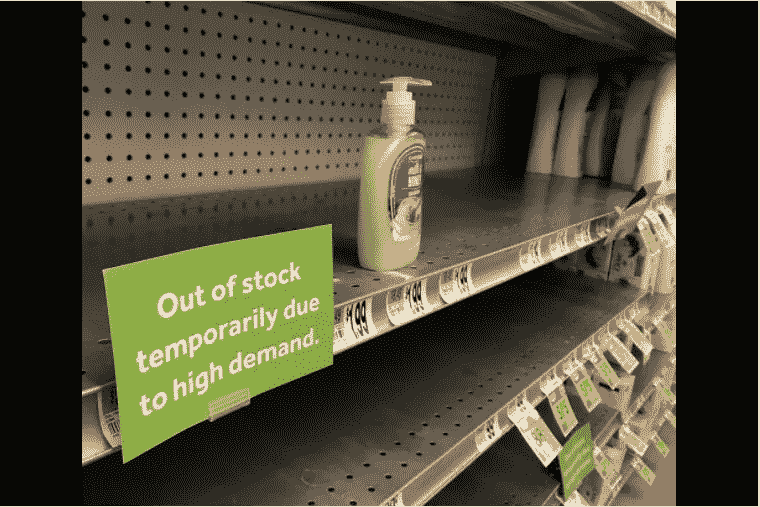

上周，弗雷明汉坦普尔街的 Stop 商店洗手液货架几乎空无一物。【每日新闻与缺德当地工作人员摄影/Art Illman】

简而言之，我们需要建立一个系统来识别可能短缺的物品。该项目可以与任何行业有关，如零售，超市或任何商店出售的项目。这将为公司/管理层理解和应对其运营中的变化提供重要的见解。考虑到不同的控制机制，这也将有助于决定何时订购以及订购多少等。

# ***3。将问题映射成机器学习任务***

这里研究机器学习分类器，以便为这种不平衡类别问题提出一种预测模型，其中与没有缺货(负类别)的项目相比，缺货(正类别)的项目的相对频率很少。在这个特定的任务中，采用了特定的度量标准，例如接收机工作特性和精度召回曲线下的面积、采样技术和集成学习。

# ***4。数据来源&动机***

1.  [*研究论文*](https://www.researchgate.net/publication/319553365_Predicting_Material_Backorders_in_Inventory_Management_using_Machine_Learning)

作者比较了不同的学习模型和处理不平衡数据的技术。这结合了采样、集合等技术。本文还讨论了评价的标准，它们的制定和解释。主要的主题，如上采样/下采样，SMOTE，逻辑回归，GBDT，决策树用代码解释。

2. [*Kaggle 竞争/*](https://www.kaggle.com/tiredgeek/predict-bo-trial) [*备选数据源*](https://github.com/rodrigosantis1/backorder_prediction/blob/master/dataset.rar)

该数据是 kaggle 竞赛的一部分，目前不可用，因此我们使用 GitHub repo 保存该数据的副本。

3.[重击](https://machinelearningmastery.com/smote-oversampling-for-imbalanc ed-classification/)

作者非常清楚地描述了不平衡学习库中的上采样和下采样方法。由于所有的方法遵循不同的功能来生成/删除数据点，因此依赖于数据，我的最终模型可能会受到影响。我可以尝试不同的方法，并将分析模型性能。

4.特征工程思想

 [## 从这里开始:一个温和的介绍

### 使用 Kaggle 笔记本探索和运行机器学习代码|使用来自家庭信用违约风险的数据

www.kaggle.com](https://www.kaggle.com/willkoehrsen/start-here-a-gentle-introduction#Feature-Engineering)  [## 手动特征工程简介

### 使用 Kaggle 笔记本探索和运行机器学习代码|使用来自家庭信用违约风险的数据

www.kaggle.com](https://www.kaggle.com/willkoehrsen/introduction-to-manual-feature-engineering)  [## P2 手动特征工程简介

### 使用 Kaggle 笔记本探索和运行机器学习代码|使用来自家庭信用违约风险的数据

www.kaggle.com](https://www.kaggle.com/willkoehrsen/introduction-to-manual-feature-engineering-p2) 

**注意:这里我们有不同的特征工程技术和其他建模技术，但是已经展示了哪一种效果最好**

# ***5。*数据概述**

1.  *SKU——产品的随机 ID*
2.  *national_inv —该零件的当前库存水平*
3.  *交付周期—产品的运输时间(如果有)*
4.  *在途数量——从源头在途的产品数量*
5.  *预测 _ 3 _ 月—预测未来 3 个月的销售额*
6.  *预测 _ 6 _ 月—预测未来 6 个月的销售额*
7.  *预测 _ 9 _ 月—预测未来 9 个月的销售额*
8.  *销售 _ 1 _ 月—前 1 个月时间段的销售数量*
9.  *销售 _ 3 _ 月—前 3 个月时间段的销售数量*
10.  *销售 _ 6 _ 月—前 6 个月时间段的销售数量*
11.  *销售 _ 9 _ 月—前 9 个月时间段的销售数量*
12.  *min_bank —股票的最小推荐量*
13.  *潜在问题—已识别零件的来源问题*
14.  *零件 _ 过期 _ 到期—来源过期零件*
15.  *perf_6_month_avg —前 6 个月期间的源性能*
16.  *perf_12_month_avg —前 12 个月期间的源性能*
17.  *local_bo_qty —库存订单逾期金额*
18.  *deck_risk —零件风险标志*
19.  *oe_constraint —零件风险标志*
20.  *ppap_risk —零件风险标志*
21.  *停止 _ 自动 _ 购买—零件风险标志*
22.  *rev_stop —零件风险标志*
23.  *延期交货-产品实际上延期交货。这是目标值*

# ***6。探索性数据分析***

EDA 是一种彻底的检查，旨在揭示数据集的底层结构，它对公司非常重要，因为它揭示了不容易显现的趋势、模式和关系。

我们不能仅仅通过搜集大量的数据来得出可靠的结论——相反，我们必须通过分析的镜头仔细地、有条不紊地看待它。

对这些关键信息的“感觉”可以帮助你发现错误，揭穿假设，并理解不同关键变量之间的关系。这种认识可能最终导致选择合适的预测模型。

***6.1 数据一览***

*数据集一览*

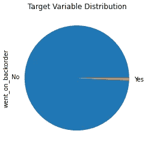

*分布为‘got _ on _ disorder’*

*从数据中获得高层次的理解*

*   高度的类别不平衡:大部分样品没有去延期交货(99.83%)的时间，而实际延期交货发生(0.17%)的时间。
*   提前期具有 NA 值
*   最后一行包含所有 NA 值
*   perf_6_month_avg、perf_12_month_avg 属性缺少数据 as -99。

***6.2 数据预处理***

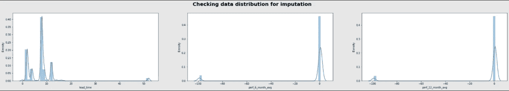

*观察结果*

*   对于大多数产品来说，交付周期接近 8 小时(大约。中位数)。我们将使用这个值来计算 NAN 值。
*   此外，在大多数情况下，过去 6 个月和 12 个月的业绩为 0。我们将使用这个值来输入-99

***6.3 插补***

插补代码

***6.4 欠采样***

由于数据不平衡，很难从 EDA 中得出任何结论。因此执行随机欠采样以产生平衡的数据，从而使 EDA 更加有用

***6.5 分析欠采样数据***

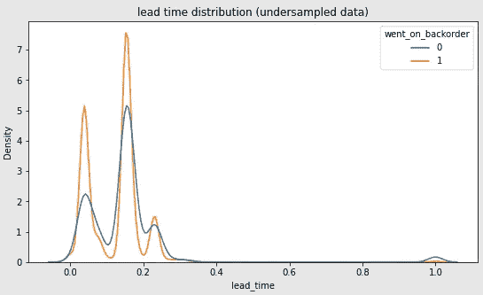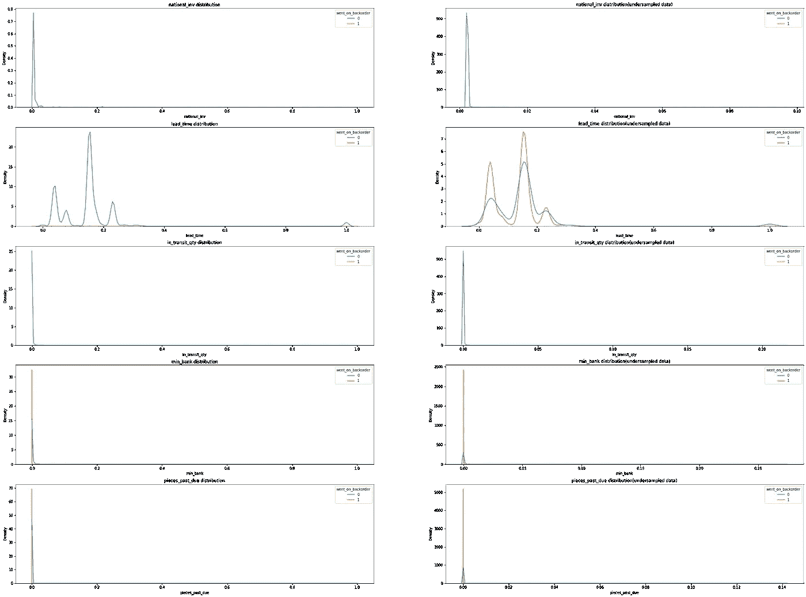

*观察结果*

*   很难对实际数据做出任何评论
*   两个类别的数据分布基本相同
*   提前期为 1–3 时，产品延期交货的可能性更大
*   两个类别的 national_inv、in_transit_qty、min_bank、pieces_past_due 都高度累积在 0 左右
*   对于 national_inv，min_bank 为 0 的情况，产品延期交货的概率更大。意味着如果一个项目属于不良库存系统，或者如果该项目的库存较少，那么该项目将缺货。这是直接有意义的

***6.6 过往业绩数据分布***

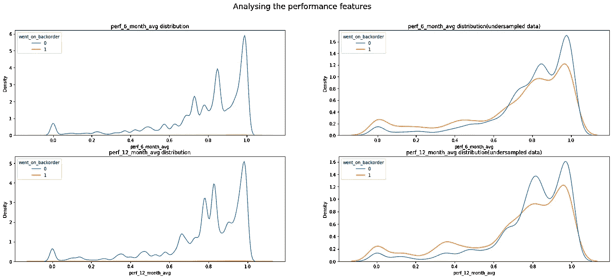

*观察结果*

*   在这种情况下，两个类别的数据分布不同，这将有助于分类
*   例如，如果我们的 perf _ 6 _ month _ avg/perf _ 12 _ month _ avg 大于 0.7，换句话说，这些物料具有良好的性能历史记录，可以注意到，这些物料不短缺的可能性更大

***6.7 中转数量&其他销售措施***

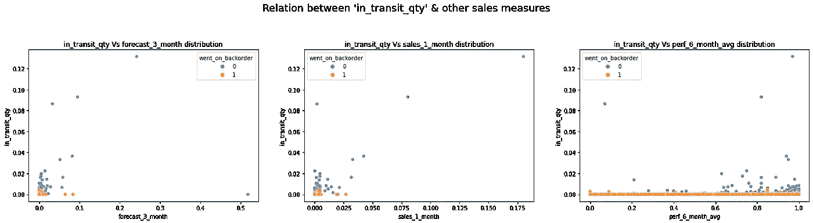

*观察结果*

*   当带入/转移到商店的商品数量减少时，这些商品更有可能出现短缺，这在现实生活中确实发生过。

***6.8 分析分类特征***

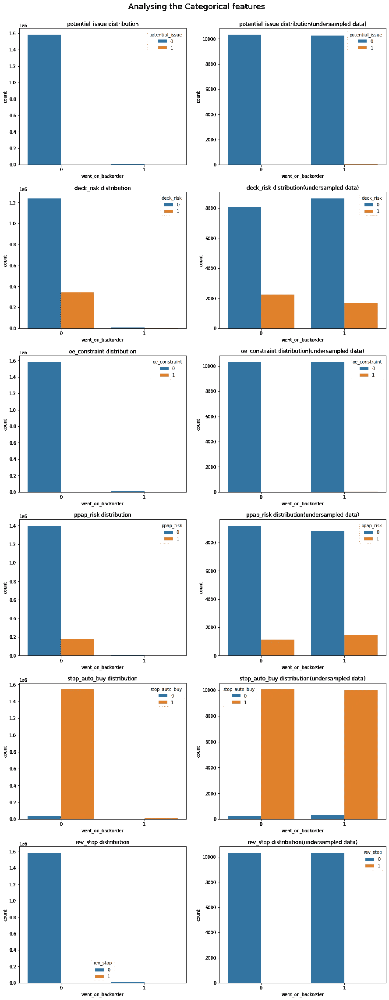

*观察结果*

*   像 rev_stop、oe _ constrain、潜在问题这样的功能不会为分类增加任何价值
*   延期交货几乎不依赖于停止自动购买
*   deck_risk 对分类有相反的影响
*   ppap_risk 对分类的影响很小

# **7。特征工程**

*   我们应用了一个简单的模型来检查新转换的特征有多好(仅连续变量)。
*   我们对每个特征分别使用逻辑回归模型

转换特征比较

*观察结果*

*   这并不是说转换对任何一种特性都有好处
*   根据现有的数据分布，转换可能会导致较差的分类能力

我们将把上述转换应用于我们的数据&只考虑那些与实际特征相比增加了更多分类能力的特征转换

我们将尝试创造更多的新功能。我们不会选择所有功能。当精度≤0.75 时，我们将过滤掉这些特征

使用 LR 创建精度大于 75 的变换的多项式相加要素

***让我们将变换后的特征*** 可视化

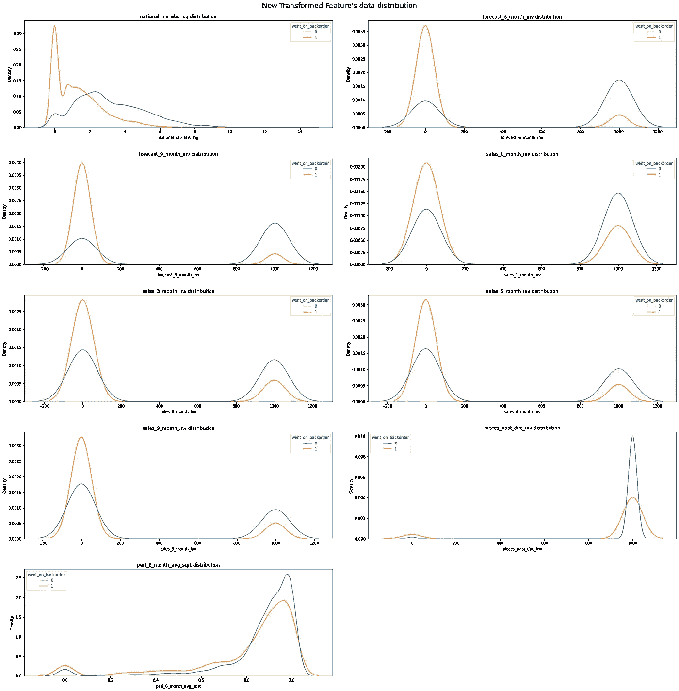

变换要素的数据分布

*观察结果*

*   销售和预测功能之前出现了偏差&我们无法做出任何结论
*   变换后，我们可以看到密度分布的明显分离，这将有助于分类

# **8。第一次切割模型**

在这里，我们提出了第一个切割模型，它是基于我们首先想到的这个问题。

1.  将在预处理过程中首先移除异常值。
2.  将执行一些上/下采样，并将执行 EDA 来检查对正负类的影响。
3.  之后，我们将使用这些数据来训练一个基础模型(比如逻辑回归)。
4.  之后，我们将添加一些新功能&然后将适合其他模型，并将与基本模型进行比较。
5.  将进行超参数调整，以提高 AUC 超过实际研究论文 AUC。
6.  在这里，我们从逻辑回归(一个简单的模型)开始，然后我们去寻找其他模型，如决策树，随机森林，最后我们尝试了像 GBDT 的集合模型。
7.  下面显示了使用调整后的 hyper 参数进行的详细比较。

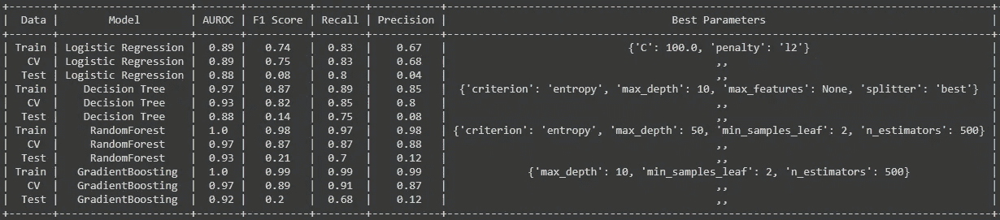

具有新功能的模型比较

# **9。自定义分类器**

在构建第一切割模型之后，我们继续构建定制集成分类器，如下所示:

*   将全部数据分成训练和测试(80-20)
*   现在，在 80%的火车集合中，将火车集合分割成 D1 和 D2。(50–50).
*   从这个 d1，我们做了替换采样，以创建 D1，d2，d3…dk(k 个样本)。
*   现在，我们创建了“k”个模型，并用这 k 个样本中的每一个来训练这些模型。
*   现在我们将 D2 集传递给这 k 个模型中的每一个；现在，我们将从这些模型中得到对 D2 的 k 个预测。
*   现在，我们使用这 k 个预测，创建一个新的数据集，对于 D2，我们已经知道它对应的目标值，所以现在我们用这 k 个预测训练一个元模型。
*   现在，对于模型评估，我们可以使用我们保留的 20%的数据作为测试集。我们将测试集传递给每个基础模型，我们将得到“k”个预测。现在我们用这 k 个预测创建一个新的数据集，并将其传递给元模型，我们将得到最终的预测。使用这个最终预测和测试集的目标，我们可以计算模型的性能得分。
*   注意:我们也包括行抽样和列抽样。
*   我们需要使用模型组合作为基础模型。我们可以在任何阶段使用我们能想到的任何分类模型，它可以是基础模型或元模型。因此，我们尝试多种组合，并做出相应的选择。
*   这里，基本模型的数量(k)也是一个超参数。所以，k 也需要调整。

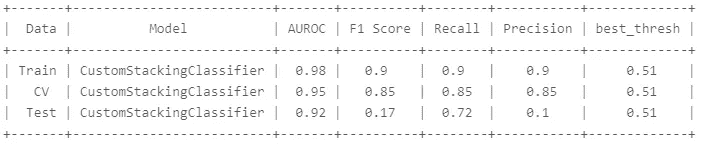

自定义分类器结果

*观察结果*

*   自定义堆叠分类器产生了类似的结果，就像我们之前构建的集成模型一样。

# **10。使用 MLExtend 的 StackingCVClassifier**

 [## 堆叠分类器

### 一个用于堆叠的集成学习元分类器，使用交叉验证来准备第二层的输入…

rasbt.github.io](http://rasbt.github.io/mlxtend/user_guide/classifier/StackingCVClassifier/) 

堆叠是一种集成学习技术，通过元分类器来组合多个分类模型。`StackingCVClassifier`使用交叉验证扩展了标准堆叠算法(实现为`[StackingClassifier](http://rasbt.github.io/mlxtend/user_guide/classifier/StackingClassifier/)`),为二级分类器准备输入数据。

**10.1 MLExtend 的 StackingCVClassifier，分类器为 KNN、RF、GNB，元分类器为 DT**

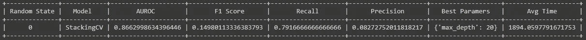

**10.2 MLExtend 的 StackingCVClassifier，分类器为 KNN、RF、GNB、LightGBM，元分类器为 DT**

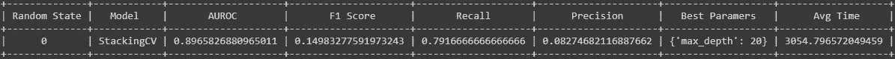

**10.3 MLExtend 的 StackingCVClassifier，带有分类器 KNN、RF、GNB、LightGBM、AdaBoost 和元分类器作为 DT**

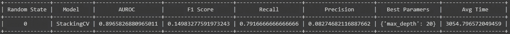

**10.4 尝试 AdaBoost**

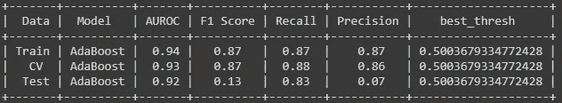

# 11.最终管道

我们发现随机森林在测试数据上给出了最大 AUC 0.93。因此，我们将该模型保存为最终模型。我们用两个函数创建了最终的管道。

*功能-1*

*   它包括从数据预处理到最终预测的整个过程。
*   它将原始数据作为输入。
*   它返回输入的预测。这里的输入可以是一个点或一组点。

def final_fun_1(X):

*   我们使用通过实验发现的最佳模型，并且
    返回对 X(原始数据)做出的预测

*功能-2*

*   它包括从数据预处理到最终预测的整个过程。
*   它接受原始数据和目标值作为输入。
*   它返回我们正在判断模型的度量值。

def final_fun_2(X，Y):

*   我们将使用您通过实验发现的最佳模型
    返回根据 X(原始数据)和 Y(目标变量)计算的 final_metric

# 12.演示

在我们为模型创建了最终管道之后，我们还在 AWS 中使用 flask 创建了一个 web 应用程序，用户必须在其中传递原始数据&它将返回该测试数据的 AUC 和预测。

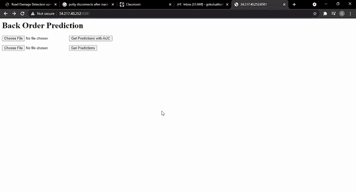

用于演示的已部署应用程序

# 13.未来的工作

*   需要与业务专家讨论，以提出更有效的功能。
*   我们可以尝试更复杂的集合模型
*   由于深度学习模型往往工作得更好，我们可以微调现有架构的超级参数，或者可以提出不同的深度学习架构。

# 14.与我联系

以上代码可以在我的 [**GitHub**](https://github.com/gokulhaldar/Back_Order_Prediction) 上找到。如有任何疑问、改进，您可以通过 [**LinkedIn**](https://www.linkedin.com/in/gokul-sakha-haldar/) 联系我。

# 15.参考

 [## 应用课程

### 我们知道转行是多么具有挑战性。我们的应用人工智能/机器学习课程被设计为整体学习…

www.appliedaicourse.com](https://www.appliedaicourse.com/)  [## 机器学习:缺货问题和库存优化的解决方案

### 对于任何企业来说，最糟糕的情况是当客户准备购买你的产品时，产品库存被清空…

www.datasciencecentral.com](https://www.datasciencecentral.com/profiles/blogs/machine-learning-a-solution-to-backorder-problem-and-inventory)  [## 探索性数据分析:什么和为什么

### 探索性数据分析，简称 EDA，是对当前和历史调查中的现有数据进行详尽的分析…

www.datadecisionsgroup.com](https://www.datadecisionsgroup.com/blog/bid/176827/a-closer-look-at-exploratory-data-analysis-what-and-why)  [## Mercari 价格建议挑战

### 目录:

medium.com](/@rajatyadav158/mercari-price-suggestion-challenge-db7f04ad1a84)  [## 取少数连续变量的对数变换背后的原因是什么？

### 你应该看看对数正态分布。人们可能会使用日志，因为他们认为它压缩了…

datascience.stackexchange.com](https://datascience.stackexchange.com/questions/40089/what-is-the-reason-behind-taking-log-transformation-of-few-continuous-variables) 

## 最后的话

感谢阅读。欢迎在评论区分享你的反馈。