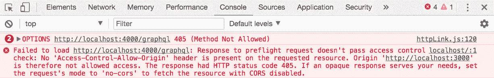
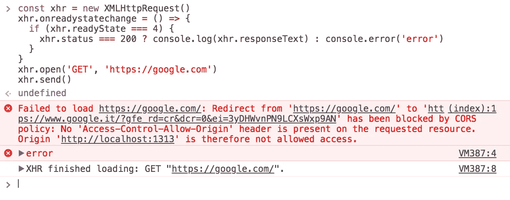

# 解决与将 Node.js + PostgreSQL API 部署到 Heroku 相关的 CORS 错误

> 原文：<https://medium.com/nerd-for-tech/solving-cors-errors-associated-with-deploying-a-node-js-postgresql-api-to-heroku-1afd94964676?source=collection_archive---------0----------------------->

## **第 1 部分:部署 REST API**

来源:谷歌图片

你是否曾经构建了一个 API，在所有的艰苦工作之后，你将它部署到 Heroku，尝试从前端使用它，然后得到一个 CORS 错误？而且排查了几天甚至几周，还是没有进展？你来对地方了，谢谢你的来访。

[跨来源资源共享](https://developer.mozilla.org/en-US/docs/Web/HTTP/CORS) ( [CORS](https://developer.mozilla.org/en-US/docs/Glossary/CORS) )错误可以说是开发人员在工作中必须处理的许多恼人的故障排除难题之一，尤其是在部署时。有时，此问题不是由于没有在服务器上配置 CORS 造成的。其他问题，如未正确设置标题或不正确的数据库配置也可能是原因。

在将 REST 和 GraphQL APIs 部署到 Heroku 时，我遇到过几次这个问题，在第一部分中，我将详细介绍将 REST API 无压力地部署到 Heroku 需要做的事情！第二部分，我将在下一个系列中讨论，将集中在部署 GraphQL API 上。

所以我假设你知道 git、Node.js、Express、Postgres、Heroku，并且也知道什么是 REST API，因为我在这里不会教这些。我也将使用更多的 ES6，我希望你也能接受。

在本指南中，我们将介绍以下步骤:

*   正确设置我们的 API
*   设置 Postgres 数据库配置
*   在我们的服务器上配置 CORS
*   设置. env 文件
*   在 Heroku 上创建和部署我们的应用
*   在 Heroku 上设置我们的环境变量
*   预配 Postgres 数据库和创建表

我们将使用的依赖项:

*   表达
*   heroku-cli 全球安装
*   dotenv 或 dotenv-safe
*   节点 pg
*   克-奥二氏分级量表

**正确设置我们的 API**

当编写 REST API 时，一定要确保返回您的响应。这是为了确保您的路由器在出错时正确退出。这是一个微妙的方法，因为它将防止您的应用程序出现诸如[ERR_HTTP_HEADERS_SET]之类的节点错误，这些错误可能会在您的服务器中引入一个 bug，从而导致您的应用程序在 Heroku 上崩溃。例如，这样写的节点响应:

可以转换成这样:

相信我；这样会给你省很多压力！

**设置 Postgres 数据库配置**

由于我们使用节点 pg，我们的 Postgres 数据库配置需要如下所示:

为了让我们的应用程序在 Heroku 上正常运行，我们需要在 Postgres 数据库上配置 SSL。这是因为 Heroku 非常重视安全性，并努力确保我们数据的安全。但不幸的是，他们的文档中从未提及这一点。如果你的应用有 SSL 证书，将其设置为 true，否则将 SSL 设置为 rejectUnauthorized: false。如果不在您的数据库或 Heroku 环境中配置 SSL，将会导致 Heroku 上出现“致命:没有 pg_hba.conf 条目”错误。注意，如果您使用 dotenv-safe，请确保您设置了一个. env.example 文件，其中包含关于如何设置。环境文件。你可以在这里阅读更多关于 dotenv-safe [的内容。](https://www.npmjs.com/package/dotenv-safe)

**在我们的服务器上配置 CORS**

CORS 可以通过几种不同的方式进行配置。在这个系列中，我将向我们展示两种不同的方法。第一种方法是写一堆代码:

这告诉我们的应用程序，让访问每个网址和请求方法试图访问它。我们可以将*符号更改为我们希望授予访问权限的特定 URL。另一种方法是使用一个叫做 cors 的方便的节点包。我们只需要这样做:

就是这样！这将执行与上述代码相同的功能。我们也可以这样指定 URL:

**设置一个. env 文件**

答。env 文件是一个简单的配置文本文件，用于定义一些不想公开的变量。这个文件需要一个解析器才能工作。解析器逐个读取变量定义，并将它们解析到环境中。我们的。env 文件设置如下所示:

注意我们的。需要将 env 文件添加到. gitignore 中。这将使它远离公众。

**创建我们的应用并将其部署到 Heroku**

首先，我们需要在 package.json 文件中指定节点引擎和节点包管理器:

这将在部署期间添加我们的 buildpack，即 heroku/nodejs。

向我们的根目录添加一个 Procfile，并将值设置为“web: src/server.js”。在本例中，我们的服务器文件是 server.js，它位于 src 文件夹中。

我们需要通过命令行界面登录 Heroku:

按照说明登录。

接下来，我们需要创建和部署我们的应用程序。这可以通过以下命令实现:

第 5 行用于当我们从另一个分支而不是主分支推送时。第 6 行将启动我们的服务器，如果它以前没有运行的话。

**在 Heroku 上设置我们的环境变量**

在 Heroku 上，我们需要设置环境变量来匹配。本地目录中的 env 文件。我们可以通过两种方式设置 Heroku 环境变量——通过 Heroku GUI 或其 CLI。

从 GUI 中:

*   转到 Heroku 仪表盘，点击我们刚刚创建的应用程序
*   点击导航选项中的“设置”
*   找到配置变量并点击“显示配置变量”。

输入包含在。env 文件，DATABASE_URL 除外。在我们提供数据库后，将为我们添加 DATABASE_URL。我们还需要通过添加 PGSSLMODE 为 SSL 设置一个环境变量，并将值设置为 require。

从 CLI 中:

中的整个环境变量分别执行此操作。env 文件，DATABASE_URL 除外。

**提供 Postgres 数据库并创建表格**

提供数据库意味着在 Heroku 上建立我们的数据库。Heroku 有不同的 Postgres 数据库计划，但在本指南中，我们将使用免费的 Heroku Postgres 数据库。

要设置数据库，我们将使用:

这告诉 Heroku 添加一个 Postgres 数据库到你的应用程序，并使用免费的爱好开发计划。

最后，我们需要创建我们的表。为此，我们必须导航到包含定义表的文件的文件夹，并运行以下命令:

这将为我们创建所有的表。

维奥拉。我们完了。

现在，键入命令

在浏览器上打开你的应用。复制 URL，粘贴到 Postman 上，并尝试向不同的路线发送请求。

感谢您阅读我的帖子，我将感谢您的反馈。

我将发布关于如何部署 GraphQL API 的第 2 部分。敬请关注。