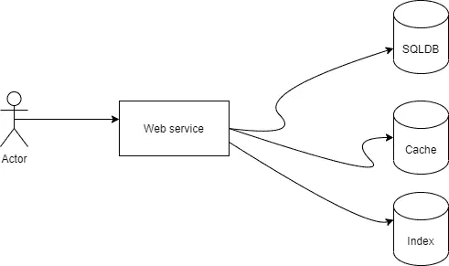

# 解决数据集成问题

> 原文：<https://medium.com/nerd-for-tech/solving-data-integration-problem-8ba8c193edc9?source=collection_archive---------2----------------------->

在分布式系统中，可能会涉及多个不同的数据存储，因此假设我们有一堆不同的数据存储缓存、SQLDB 和索引，并且我们需要在彼此之间同步数据。

实际上，当你在处理分布式系统时，你应该抛弃旧的思维模式和解决方案。你必须停止思考 ACID，因为分布式系统中涉及的许多行为不仅仅是一个方面，例如网络、节点和时间，你可以在我以前的文章中阅读对它们的解释，因为我们在这篇文章中并不关注这个主题

 [## 分布式系统模型

### 在分布式系统世界中，没有什么是 100 %可靠的，所以我们总是考虑故障，所以在设计分布式系统时…

medium.com](/nerd-for-tech/distributed-system-models-966ff15fe84d) 

那么现在我们如何解决这个问题。有些人可能会考虑使用同步操作对多个数据存储进行双重写入，如下图所示，但请停止这样做。

我们需要停止这种想法，因为它可能会导致数据不一致，潜在的竞争条件和部分故障，因为如果您在竞争条件下将两个不同的值写入不同的数据存储区，则可能会发生这种情况。数据变得不一致，您必须手动解决这个问题，这是一项非常困难的任务，因为您必须搜索数据不匹配并解决它。

那么如何才能解决这个问题，避免竞态条件和数据不一致呢？假设您有一个日志，并且您的 web 应用程序不执行双重写入，而是仅在该日志中追加数据，并且所有不同的数据存储都有自己的使用者，该使用者将按顺序读取日志，如下图所示

每个消费者一次一个地获取日志中的数据，并将记录写入自己的数据存储。通过以相同的顺序应用写操作，日志保证了消费者都以相同的顺序看到记录，所以现在我们解决了竞争条件问题。

我们仍然有一个部分失败的问题，如果其中一个消费者失败或停机怎么办？这个问题也通过日志解决，因为每个消费者都跟踪日志位置，如果消费者一回来就停机，它将从最后处理的位置恢复消费，并赶上发生的一切，如果它离线一段时间，也不会丢失任何更新事件。其他消费者不受影响。

现在我们解决了部分失败和竞争条件问题，但是如果我们有一些数据约束或事务呢？

正如我们所解释的，消费者异步更新他们的数据存储，因此他们最终是一致的，我们不能保证数据满足约束，例如，如果我们有一个约束，即某些字段应该是唯一的，如用户名。

当演员试图注册时，您会想到什么来检查用户名是否已被占用？不要再这样想了，因为如果两个参与者同时写同一个用户名，可能会出现竞争情况。这个问题可以在传统的数据存储和单片软件中简单地解决，方法是在字段中添加唯一的约束，并在 ACID 之后的原子事务中执行操作。但是我们不能在分布式系统中这样做，所以我们如何解决这个问题。

我们可以分两步来解决这个问题首先，当 actor 试图注册时，你只需向一个流发送一个事件，假设这个流的名称是“userName stream ”,这个事件还不能保证唯一性，它只是将它按顺序排列。考虑一下，如果您使用分区日志，您必须确保每个数据都应该有序地存储在同一个分区上，这样所有相同的用户名都应该放在同一个分区上

 [## 理解数据库设计中的数据分区(第 1 部分)

### 在本文中，我将解释分布式计算中称为分区的术语，因此我将解释以下内容…

medium.com](/nerd-for-tech/understanding-data-partitioning-in-database-design-part-1-8d6313831f55) 

然后，您可以拥有一个流处理器，它按顺序使用该流并检查数据库的唯一性，将用户名写入数据库，并写入用户成功注册或用户已经采取的结果，这种验证在单线程中一次只能处理一个事件，但您可以通过使用许多分区来提高可扩展性和性能，因为所有相同的数据都将放在同一个分区中，所以不会发生冲突，并且您可以扩展到数百万个事件，不会出现并发问题。最后，请求者可以使用注册结果并等待结果。