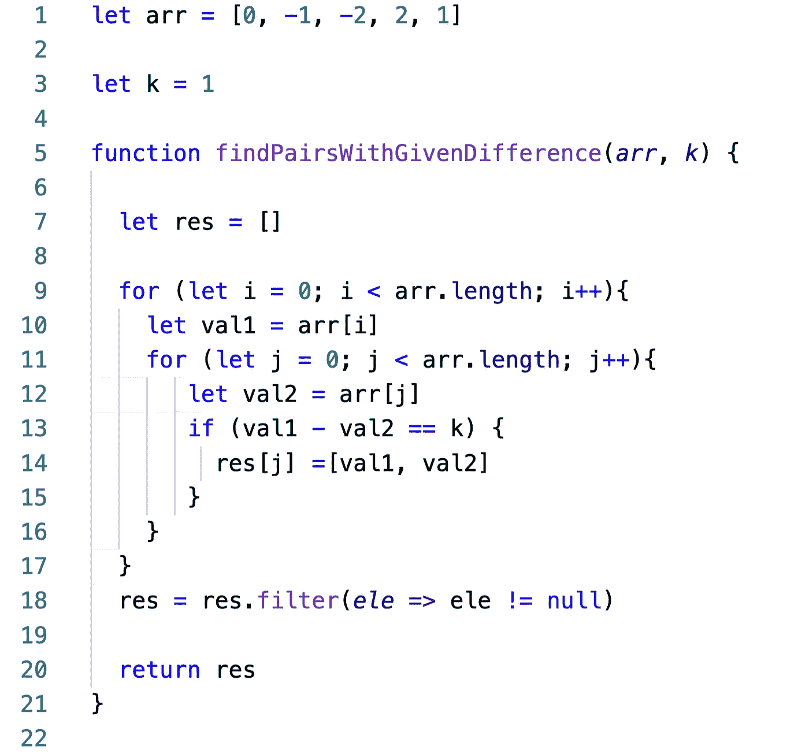
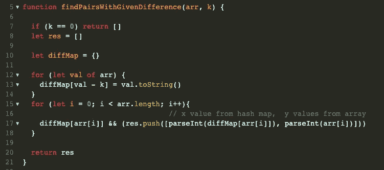

# 求解:findPairsWithGivenDiff

> 原文：<https://medium.com/nerd-for-tech/solving-findpairswithgivendiff-ee8dd3d747b?source=collection_archive---------8----------------------->

在本文中，我将分解 Javascript 中的 findPairsWithGivenDiff 问题。我将遍历我的过程，用两种方法解决问题，以比较他们的 BigO。

我们开始吧！

# 方向:

## 给定一个不同整数的数组`arr`和一个非负整数`k`，写一个函数`findPairsWithGivenDifference`，返回一个包含`arr`中所有对`[x,y]`的数组，这样`x - y = k`。如果不存在这样的对，则返回一个空数组。

## **注意:**输出数组中对的顺序应该保持原数组中`y`元素的顺序。"

让我们用自己的话来分析和重述这个问题。

输入是一组不同的整数和一个非负整数。

我们想知道有多少对提供了给定的非负整数‘k’的差。使得(x-y) = k

如果存在这样的数组对，输出应该是数组的数组。每个子数组包含[x，y]值。如果不存在对，则返回一个空数组。

子数组的放置应该遵循[x，y]子数组中“y”值的索引。

## 从天真的方法开始。

让我们来看看如何解决这个问题。

如果我们使用嵌套循环来遍历数组中的每个整数，并将其从自身中减去，那么我们可以使用一个简单的 If 语句来查看这两个值是否通过了(x-y) = k 的条件。一旦我们找到了正确的对，我们就可以将它们添加到结果数组中。为了符合索引条件，因为我们是在一个循环中，所以我们可以使用迭代值(也称为索引)将这些对放置在正确的序列中，然后在填充后过滤掉空值。

现在让我们看看 bigO。

简单的解决方案有一个 O(n)的 bigO，因为我们有一个嵌套循环在同一个数组上迭代。过滤器是另一个迭代，但是随着输入大小的缩放，我们可以相对忽略它的影响。而我们为结果创建的数组的 bigO 为 O(n ),用于插入、搜索和删除空值。

所以这是可行的——如果你想出了这个很棒的解决方案。

但是我们怎样才能更加努力呢？好些了吗？更快？更强？

嗯，我们首先要去掉的是嵌套循环…让我们看看在嵌套循环中我们实际上在做什么。如果我们要遍历这个循环，我们实际上在做什么呢？

我们在寻找一个能产生“k”差的数字。

另一种方法是什么？

…

…

我们都知道

## 如果→ (x-y) = k

## 那么→ (x-k) = y

因此，与其用嵌套循环来计算哪些值会产生“k ”,不如我们从地图中查找我们需要的值？

因为我们知道(x-k)将提供匹配的“y ”,所以我们可以仅用“x”和“k”来计算“x”和“y”。因此，通过一个循环，我们可以创建一个散列映射，将所有可能的“y”值与其对应的“x”值进行映射。所以我们有一个映射，它产生{y: x}的键值对。

一旦映射被填充，我们可以再次遍历数组，并简单地查找当前值是否存在于映射中。如果是，那么我们知道在数组中有一个匹配的 x。即，因为当前迭代中的值存在于映射中，如果变成我们的‘y’，并且因为我们在填充映射时用‘x’值计算了我们的‘y’，所以我们知道两者都存在于给定的数组中。

让我们看看代码:

一些注意事项:

因为我们从第 15 行开始遍历数组一次，所以我们可以简单地将对推入数组，不再需要用过滤器消除任何空值。

因为我们映射了所有的值，所以键被转换为字符串，所以我们需要确保我们推入结果数组的值实际上是整数。我们可以使用 parseInt 将字符串表示转换为整数。

我们对' y '值和' x '值都使用 parseInt，因为在第 13 行，我们实际上是将值设置为一个字符串的键。这对于“y”值等于零的边缘情况很重要。

在第 17 行我们有一个短路评估，如果 diffMap[arr[i]]返回零，它将评估为假，而不是实际上被推入结果数组。通过在填充地图时将其转换为字符串，我们避免了这种情况。

BigO

通过利用哈希映射，我们已经将最坏情况下的时间复杂度提高到 O(n*log(n))，将一般情况下的时间复杂度提高到 O(n)。虽然空间复杂度保持为 O(n ),因为输出本身的大小是 O(n ),并且因为我们制作的地图将只保存 n 个元素，所以它不会增加空间复杂度。

希望这对你的下一个算法有所帮助！